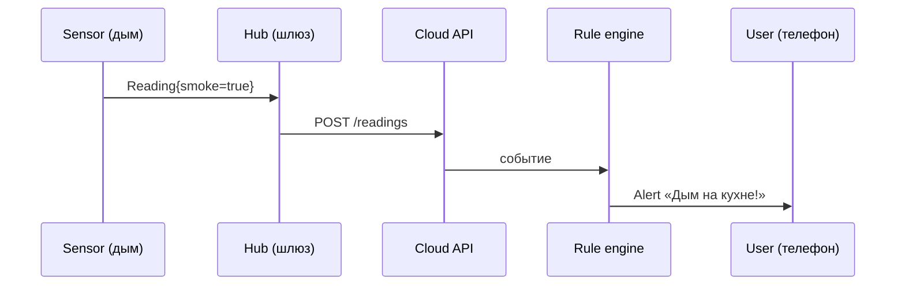
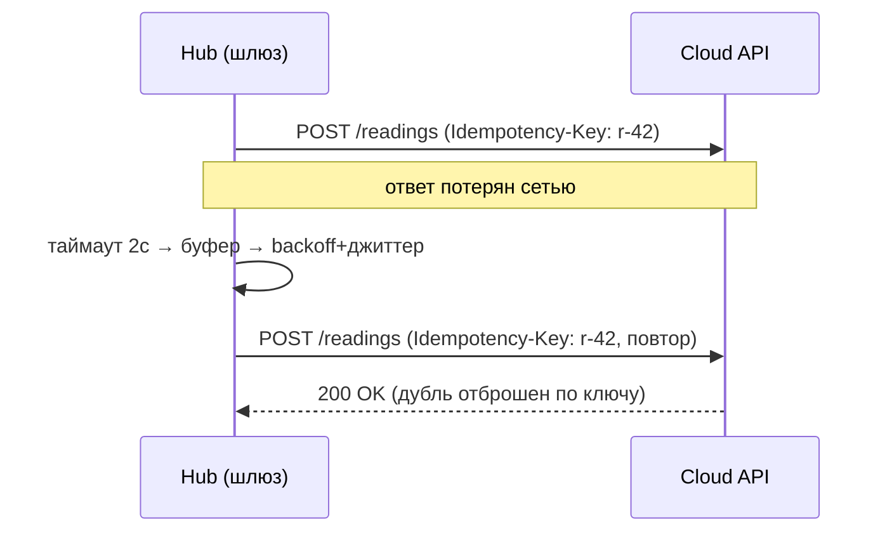

# Лекция 01. Введение в распределенные системы

> **Дисциплина:** Распределённые системы и облачные технологии (РСиОТ)
> **Занятие:** лекция 1 из 28 · **Время:** 1 пара (80 мин)
> **Зачем это:** всё, чем вы пользуетесь ежедневно — мессенджеры, игры,
> банки, «умный дом», — распределённые системы. Эта пара объясняет, почему
> они ломаются не так, как обычные программы, и что с этим делает инженер.
> Конспект 2025 года сохранён в `archive_2025/`; сравнение — в
> `docs/Сравнение_со_старым_курсом.md`.

---

## Крючок: день, когда замолчал «умный дом»

> 🖥 **Слайд 2.** Крючок: сбой AWS 20.10.2025

Ночь на 20 октября 2025 года. В регионе AWS us-east-1 два экземпляра
автоматики, управляющей DNS-записями сервиса DynamoDB, срабатывают
одновременно. Устаревший план перезаписывает новый, автоматика очистки
удаляет запись — и региональный эндпоинт DynamoDB получает **пустую
DNS-запись**. Дальше — каскад: подсистема аренды серверов EC2 теряет связь
с DynamoDB, аренды истекают по всему парку, а при восстановлении тысячи
серверов ломятся переустанавливать аренды одновременно и добивают систему
повторно (congestive collapse). Полное восстановление — около 15 часов.

Масштаб: свыше 6,5 млн жалоб на Downdetector, более 1000 сервисов легли —
Snapchat, Fortnite (400+ млн зарегистрированных игроков), Roblox, Reddit,
Venmo, Coinbase. **Alexa и Ring замолчали: «умный дом» по всему миру перестал отвечать
хозяевам.** Оценка страховых потерь — до 581 млн долларов.

Вопрос залу: **виновато железо, программисты DynamoDB — или сама природа
распределённых систем?**

Держите ответ до конца пары. Спойлер: ни одна машина не сгорела — отказала
*координация* между узлами, а катастрофу усилил неуправляемый шторм
повторных запросов. Обе темы — сегодняшние.

*(Источник кейса: `sources/Веб-находки_Лекция_01.md` — разборы инцидента от
The Register и ThousandEyes; дата доступа 09.08.2026.)*

---

## Квиз-разминка (по пререквизитам)

> 🖥 **Слайд 3.** Разминка

Ответьте не подглядывая; ответы — в конце лекции.

1. Что делает DNS и почему без него «всё лежит», даже если серверы живы?
2. Чем TCP отличается от UDP по гарантиям доставки?
3. Запрос вернул ошибку 500 — и запрос, на который ответ *не пришёл вовсе*.
   В чём принципиальная разница для клиента?
4. Чем процесс отличается от потока?

Если уверенно ответили на 3–4 вопроса — пререквизиты в порядке. Если нет —
освежите конспект по сетям и ОС на этой неделе: мы будем опираться на это
каждую пару.

---

## Результаты обучения

> 🖥 **Слайд 4.** Чему научимся

После этой пары вы сможете:

1. Объяснить, что такое распределённая система и почему частичный отказ —
   её нормальное состояние, а не ЧП.
2. Назвать 8 fallacies of distributed computing и опознать их в реальном
   инциденте.
3. Различать модели отказов: crash-stop, crash-recovery, потери сообщений,
   разделение сети, византийские.
4. Читать метрики SLI/SLO/SLA и хвостовые задержки p95/p99.
5. Применять «аптечку надёжности»: таймаут, ретрай с backoff и джиттером,
   идемпотентность, circuit breaker.

## Пререквизиты

- Сети: IP, TCP/UDP, DNS, HTTP — на уровне «понимаю, что происходит».
- ОС: процессы, потоки, порты.
- Git и GitHub: fork, commit, Pull Request — лабы сдаются через PR.

---

## Картина мира: одна машина против сотни

> 🖥 **Слайд 5.** Дорожная карта пары

На одной машине вызов функции либо выполнился, либо упал — и вы сразу
видите, что именно произошло. Как только между вызывающим и вызываемым
появляется сеть, рождается третье состояние: **«неизвестно»**. Это
центральная идея всей дисциплины, и сегодня мы посмотрим ей в глаза.

Аналогия на весь семестр — **IoT-платформа «СмартДом»**: датчики (`Sensor`)
в квартирах шлют показания (`Reading`) через домашний шлюз (`Hub`) в облако,
правила (`Rule`) рождают тревоги (`Alert`) для жильцов. Wi-Fi моргает,
датчики сыпятся, а жилец ждёт уведомление «дым на кухне» за секунды — все
проблемы сегодняшней пары живут в одном примере. Словарь сущностей
«СмартДома» будет с нами в лекциях и лабах всего курса.

Маршрут пары: что такое РС → зачем распределять → состояние «неизвестно» →
восемь заблуждений → модели отказов → метрики → аптечка надёжности →
компромиссы. По дороге — два квиза, одно голосование и один живой сеанс.

---

## Основные понятия

**Определения** (пополним глоссарий в конце):

- **Распределённая система (РС)** — набор независимых узлов (процессов,
  серверов), которые взаимодействуют по сети ради общей задачи и при этом
  могут отказывать порознь. Контрпример: два потока одного процесса — не
  РС: у них общая память и общий отказ.
- **Узел** — единица отказа: процесс, контейнер, сервер.
- **Частичный отказ** — часть узлов или связей отказала, остальные
  работают. Главный источник сложности РС.
- **Идемпотентность** — повтор операции не меняет результат сверх первого
  применения. «Установить температуру 22°» — идемпотентно; «увеличить
  на 2°» — нет.
- **Постмортем** — публичный разбор инцидента: хронология, причины, уроки.

---

## Ядро пары

### 1. Что такое распределённая система

> 🖥 **Слайд 6.** Что такое РС

Классическое полушутливое определение Лесли Лэмпорта: «Распределённая
система — это система, в которой отказ компьютера, о существовании которого
вы даже не подозревали, делает ваш собственный компьютер непригодным к
работе». В каждой шутке — постановка задачи: в РС ваша программа зависит от
машин, которыми вы не управляете, через сеть, которая вам не подчиняется.

Признаки распределённой системы:

- **независимые узлы** — у каждого своя память, свои часы, свой отказ;
- **взаимодействие только сообщениями** — общей памяти нет, всё знание о
  соседе приходит по сети и может устареть в момент прибытия;
- **общая задача** — снаружи система выглядит единым сервисом.

Примеры вокруг: поиск Google, мессенджеры, банковские платежи, облака
(AWS, Azure, GCP), и наш «СмартДом»: датчик, шлюз и облачный API — уже три
узла, а значит — уже все проблемы этой дисциплины.

### 2. Зачем вообще распределять

> 🖥 **Слайд 7.** Зачем распределять

Никто не распределяет систему от хорошей жизни — каждый узел и каждый
сетевой вызов добавляют способов сломаться. Распределяют, когда упираются
в одну из четырёх стен:

1. **Нагрузка.** Один сервер обслужит квартал «СмартДома», но не страну.
   Горизонтальное масштабирование — добавляем узлы, а не наращиваем один.
2. **Данные.** Показания миллиона датчиков за год не влезают на один диск —
   данные режутся на части (шардирование) и разъезжаются по узлам.
3. **География.** Жилец в Бресте не хочет ждать, пока его выключатель
   поговорит с сервером в Сингапуре: свет должен включаться быстрее, чем
   моргает глаз. Данные и вычисления едут ближе к пользователю (CDN,
   регионы, edge).
4. **Отказоустойчивость.** Тревога «протечка» обязана дойти, даже если один
   из серверов умер. Единственная копия чего угодно — единая точка отказа
   (SPOF).

Пятая, честная причина — **экономика**: облако сдаёт ресурсы в аренду по
требованию, и парк из дешёвых машин почти всегда выгоднее одного
супер-сервера. Обратная сторона: за каждую стену платим сложностью — и
дальше вся дисциплина про то, чем именно.

### 3. Третье состояние: «неизвестно»

> 🖥 **Слайд 8.** Запрос без ответа

Hub «СмартДома» отправил в облако показание и не получил ответ за две
секунды. Что произошло? Ровно один из четырёх сценариев:

1. запрос потерялся по дороге — облако его не видело;
2. облако упало до обработки — показание не принято;
3. облако **приняло и обработало**, но ответ потерялся;
4. всё работает, просто медленно — ответ ещё едет.

Снаружи эти четыре ситуации **неразличимы**. В сценарии 3 повтор запроса
без защиты создаст дубль; в сценарии 2 отказ от повтора потеряет тревогу.
Однопоточная интуиция «либо выполнилось, либо нет» здесь не работает —
и это не экзотика, а будни: частичный отказ в большой системе происходит
*всегда где-то*. Инженерия РС — это искусство давать пользователю результат,
честно живя в состоянии «неизвестно».

### 4. Восемь заблуждений распределённых вычислений

> 🖥 **Слайд 9.** Восемь заблуждений

Список, который в 1990-х собрали Питер Дойч и коллеги из Sun Microsystems, —
восемь допущений, которые новичок делает молча, потому что на одной машине
они верны:

| # | Заблуждение | Чем мстит |
| --- | --- | --- |
| 1 | Сеть надёжна | потери пакетов, обрывы, «неизвестно» |
| 2 | Задержка равна нулю | межрегиональные вызовы за сотни мс, хвосты p99 |
| 3 | Полоса бесконечна | лимиты провайдера, деградация при пиках |
| 4 | Сеть безопасна | перехват, подмена, DDoS |
| 5 | Топология неизменна | узлы приходят и уходят, маршруты меняются |
| 6 | Администратор один | десятки команд и автоматик с разными планами |
| 7 | Передача бесплатна | счёт за межрегиональный трафик |
| 8 | Сеть однородна | разные ОС, версии, MTU, прокси |

Сверьте с крючком: в инциденте AWS сработали минимум № 1 (пустая
DNS-запись — и «живые» серверы недостижимы), № 5 (аренды истекли, парк
«поплыл») и № 6 (две автоматики, конкурирующие за одну запись). Каждое
заблуждение из таблицы — это чей-то реальный постмортем.

#### Peer-instruction-вопрос № 1

> 🖥 **Слайды 10–14.** Голосование PI-1 → четыре разбора

Голосуем, обсуждаем с соседом 90 секунд, голосуем снова.

> Hub «СмартДома» отправил в облако показание «дым на кухне». Ответ не
> пришёл за 2 секунды. Что должен сделать Hub?
>
> A. Повторять запрос немедленно и без пауз, пока не придёт ответ — тревога же!
> B. Повторить с нарастающей случайной паузой, снабдив запрос ключом, по
> которому облако отбросит дубль.
> C. Не повторять: раз ответа нет — облако упало, попытки бессмысленны.
> D. Просто увеличить таймаут до 60 секунд — ответ точно успеет прийти.

Разбор — в конце лекции. Подсказка: один вариант устроил бы вторую волну
инцидента AWS, один путает «нет ответа» с «сервис мёртв», один жертвует
самым дорогим — временем доставки тревоги.

### 5. Модели отказов: от честной смерти до вранья

> 🖥 **Слайд 15 — пауза 60 секунд, затем слайд 16.** Модели отказов

Чтобы проектировать защиту, надо договориться, *как именно* умеют отказывать
узлы. По нарастанию коварства:

- **Crash-stop** — узел умер и не вернётся. Самая честная модель: датчик
  утонул в аквариуме.
- **Crash-recovery** — узел умер и вернулся, но без памяти о том, что было
  в полёте. Hub перезагрузился: что из буфера он уже отправил?
- **Потери и дубли сообщений** — сеть теряет, дублирует и переставляет
  сообщения. Нужны подтверждения и дедупликация.
- **Разделение сети (partition)** — обе половины живы, но друг друга не
  видят, и каждая может считать мёртвой другую. Квартира потеряла интернет:
  Hub жив, облако живо, связи нет.
- **Византийские отказы** — узел врёт: шлёт разным соседям разное,
  случайно (битая память) или злонамеренно. Дорогая защита — нужна в
  блокчейнах и авионике; внутри своего кластера обычно принимают модель
  «узлы честные, но смертные».

Правило инженера: **защищаемся от той модели, которую заявили**. Система,
спроектированная под crash-stop, при разделении сети может получить два
«главных» узла одновременно (split-brain) — эту историю мы досмотрим в
лекциях про репликацию и консенсус.

### 6. Метрики: как измерить «работает»

> 🖥 **Слайд 17.** SLI/SLO/SLA и p99

«Система работает» — не инженерное утверждение. Инженерное — это:

- **SLI** (Service Level Indicator) — что меряем: долю успешных запросов,
  задержку доставки тревоги.
- **SLO** (Service Level Objective) — какую цель держим: «99,9 % тревог
  доставлены быстрее 5 секунд за месяц».
- **SLA** (Service Level Agreement) — что обещали клиенту деньгами:
  не выполнили SLO из договора — платим неустойку.

Доступность считают в «девятках»: 99,9 % — это ~43 минуты простоя в месяц,
99,99 % — ~4 минуты. Каждая следующая девятка дорожает нелинейно.

Задержку меряют **перцентилями**, а не средним: p50 — медиана, p95 и p99 —
хвосты. Среднее врёт: при среднем 100 мс p99 может быть 2 секунды — и это
10 000 недовольных на миллион запросов в день. Пользовательский опыт живёт
в хвостах, тем более что одна страница делает десятки внутренних вызовов и
чей-то p99 цепляет почти каждого.

Ещё две величины из эксплуатационного словаря: **MTTR** — среднее время
восстановления после сбоя (его минимизируют наравне с частотой сбоев) и
**закон Литтла** $L = \lambda W$: среднее число запросов в системе равно
интенсивности потока, умноженной на время обработки. Датчики «СмартДома»
шлют $\lambda = 200$ показаний/с при обработке $W = 0{,}05$ с — в системе
одновременно $L = 10$ запросов; вырастет $W$ при том же потоке — очередь
растянется пропорционально. Одна формула — и уже можно прикидывать размеры
очередей и пулов.

### 7. Живой сеанс и аптечка надёжности первого дня

> 🖥 **Слайды 18–19.** Живой сеанс → аптечка надёжности

Глубокая отказоустойчивость — лекция 9, но несколько инструментов нужны с
первого дня, иначе не написать даже честный «hello, world» по сети. Вместо
списка — вырастим их из жизни.

#### Живой сеанс: путь одной тревоги в «СмартДоме»

Строим вместе, на глазах, по шагам (7–10 минут; ход мысли важнее
результата). Вопрос модели: **что происходит между «датчик увидел дым» и
«жилец получил уведомление» — и где это ломается?**

Шаг 1 — счастливый путь, ничего не ломается:

Шаг 2 — включаем реальность: Wi-Fi моргнул, ответ облака до Hub не дошёл.
Hub в состоянии «неизвестно» (раздел 3 — вот он, в бою). Добавляем
**таймаут** — теперь Hub хотя бы не виснет вечно.

Шаг 3 — Hub повторяет запрос. Но если облако первый запрос всё-таки
приняло — жилец получит две тревоги? Нет: добавляем **ключ идемпотентности**
и буфер в Hub:

Заметьте, чего в модели **нет**: ни базы данных, ни Kubernetes, ни выбора
языка. Вопрос был про путь и отказы — модель отвечает ровно на него.

#### Аптечка: четыре инструмента

Теперь назовём по именам то, что построили, — плюс один новый инструмент:

- **Таймаут** — не ждать вечно; выбирается по хвосту p99 зависимости, а не
  «на глазок».
- **Ретрай с backoff и джиттером** — повторять с нарастающей паузой и
  случайным сдвигом, чтобы тысячи клиентов не били в такт (retry storm —
  вторая волна инцидента AWS).
- **Идемпотентность** — ключ запроса, по которому сервер отбрасывает дубли:
  повтор становится безопасным.
- **Circuit breaker** — новый, в сеансе его не было: после серии отказов
  перестать дёргать больной сервис и дать ему отдышаться, периодически
  пробуя снова.

Три из четырёх родились на ваших глазах из одного моргания Wi-Fi.

### 8. Компромиссы: трейлер следующих серий

> 🖥 **Слайд 20.** CAP как трейлер

Если реплики данных лежат на нескольких узлах, а сеть между ними рвётся
(а она рвётся — заблуждение № 1), в момент разрыва придётся выбирать:
отвечать, рискуя отдать устаревшее (**доступность**), или молчать, пока не
восстановится согласие (**согласованность**). Это интуиция **CAP-теоремы**;
её уточнение **PACELC** добавляет: даже без разрывов платишь задержкой за
каждую каплю согласованности. Банковский перевод и лента соцсети выбирают
разные стороны — почему и как, разберём в лекции 5, вооружившись моделями
консистентности. Пока достаточно запомнить: **координация стоит времени,
а сеть рвётся — выбирать придётся всегда.**

---

## Типичные ошибки (запомните до того, как совершите)

> 🖥 **Слайд 21.** Типичные ошибки

1. **«Ретрай безвреден — просто повтори».** Без идемпотентности повтор
   дублирует операции, без backoff и джиттера — устраивает retry storm.
   Вторую волну инцидента AWS создали одновременные повторные подключения.
2. **«Если ответа нет — сервис упал».** «Нет ответа» — это «неизвестно»,
   а не «мёртв»: четыре неразличимых сценария из раздела 3.
3. **«Надёжность покупается железом».** В инциденте AWS не сгорела ни одна
   машина — отказала логика координации автоматик.
4. **«Среднее время ответа хорошее — значит всё хорошо».** Пользователь
   живёт в p99: «редкий» 1 % — это 10 000 медленных ответов на миллион
   запросов.

---

## Квиз-закрепление (по этой паре)

> 🖥 **Слайд 22.** Закрепление

Ответьте не подглядывая; ответы — в конце лекции.

1. Назовите три fallacies, которые сработали в инциденте AWS 20.10.2025.
2. Чем частичный отказ отличается от полного и почему он сложнее для
   проектировщика?
3. Среднее время ответа 100 мс, p99 = 2 с. Что это значит для пользователей
   и почему среднее врёт?
4. Какие два свойства обязательны у безопасного ретрая?

---

## Вопросы для самопроверки

1. Что такое распределённая система? Приведите пример системы, которая
   выглядит распределённой, но ею не является.
2. Почему частичные отказы — норма, а не исключение?
3. Назовите четыре причины распределять систему. Какая из них главная для
   «СмартДома» и почему?
4. Перечислите 8 fallacies. Какие три, по-вашему, встречаются чаще всего?
5. Ответ на запрос не пришёл. Перечислите четыре возможных сценария и
   объясните, почему они неразличимы снаружи.
6. Что такое идемпотентность и как сделать идемпотентным приём показаний
   датчика?
7. Чем crash-recovery сложнее crash-stop для проектировщика?
8. Что такое split-brain и при какой модели отказов он возникает?
9. Что такое SLI, SLO и SLA? Придумайте SLO для доставки тревоги «дым».
10. Зачем ретраю backoff и джиттер? Что будет без каждого из них?
11. Посчитайте по закону Литтла: λ = 200 запросов/с, W = 0,05 с — сколько
    запросов в системе одновременно? А если W вырастет до 0,5 с?
12. Что делает circuit breaker и чем он отличается от таймаута?

---

## Мост к лабораторной № 1

> 🖥 **Слайд 23.** Мост к лабе

Лабораторная № 1 — контейнеризация (`tasks/task_01`): вы упакуете
веб-сервис «СмартДома» в Docker-образ и запустите его локально. Из этой
пары понадобятся: понимание, **зачем** упаковывать (один и тот же образ
работает на ноутбуке, в CI и в облаке — лекарство от заблуждения № 8
«среда однородна») и привычка думать про отказ: контейнер могут убить и
перезапустить в любой момент — переживёт ли это ваш сервис? Повторный
запуск — та же идемпотентность, только на уровне процесса.

**Задание на 1 предложение** (письменно, в конспект): закончите фразу
«Понимание частичных отказов пригодится лично мне, потому что…» —
конкретно, про свои планы и проекты. На следующей паре спрошу троих
добровольцев.

---

## Глоссарий

> 🖥 **Слайд 24 (финал).** Вопросы + литература

| Термин | Определение |
| --- | --- |
| Распределённая система | Независимые узлы, взаимодействующие по сети ради общей задачи |
| Частичный отказ | Отказ части узлов/связей при работающих остальных |
| Fallacies | 8 классических ложных допущений о сети (Дойч и др., Sun) |
| Split-brain | Два «главных» узла одновременно после разделения сети |
| Идемпотентность | Повтор операции не меняет результат сверх первого применения |
| Backoff + джиттер | Нарастающая пауза между ретраями + случайный сдвиг против штормов |
| Circuit breaker | Автоматическое отключение вызовов к сбоящему компоненту |
| SLI / SLO / SLA | Показатель качества / его цель / договорные обязательства |
| p95 / p99 | Хвостовые перцентили задержки — реальный опыт пользователя |
| MTTR | Среднее время восстановления после сбоя |
| Постмортем | Публичный разбор инцидента: хронология, причины, уроки |
| «СмартДом» | Сквозной пример курса: Device, Sensor, Reading, Hub, Rule, Alert |

## Список литературы

1. Основная литература
   - [1] Клеппман М. — «Высоконагруженные приложения» (Designing
     Data-Intensive Applications). O'Reilly / Питер. Глава 1.
   - [2] Beyer B. и др. — «Site Reliability Engineering». O'Reilly. Глава 1.
2. Интернет-ресурсы
   - [3] Постмортем-разборы сбоя AWS 20.10.2025 и материалы по fallacies —
     подборка с URL в `sources/Веб-находки_Лекция_01.md` (дата обращения:
     09.08.2026).

---

## Ответы

### Ответы: квиз-разминка

1. DNS переводит имена в адреса; без записи об эндпоинте клиенты не могут
   даже *найти* живые серверы — что и произошло с DynamoDB 20.10.2025.
2. TCP гарантирует доставку и порядок (подтверждения, ретрансмиссии), UDP —
   «выстрелил и забыл»: быстрее, но без гарантий.
3. 500 — сервер получил запрос и сообщил об ошибке: состояние известно.
   Отсутствие ответа — неизвестно даже, дошёл ли запрос; возможно, операция
   выполнена. Стратегии обработки — разные.
4. Процесс — изолированная память и ресурсы; потоки живут внутри процесса
   и делят его память. Отказ процесса убивает все его потоки — поэтому
   изоляция процессов и машин лежит в основе отказоустойчивости.

### Ответы: peer instruction № 1

Правильный ответ — **B**: повтор с экспоненциальной задержкой и джиттером +
ключ идемпотентности. Повторять нужно (тревога критична), но безопасно.

- A — retry storm: тысячи Hub'ов без пауз добьют перегруженное облако — в
  инциденте AWS congestive collapse устроили именно одновременные повторы.
- C — бинарное мышление «жив/мёртв»: «нет ответа за 2 с» — это
  «неизвестно», а не «облако упало». Одна потеря пакета — и тревога о дыме
  не доставлена вовсе.
- D — таймаут не лечит потерю: если ответ потерян сетью, его не будет и
  через 60 секунд, а тревога опоздает на минуту. Таймаут выбирают по p99,
  а не «с запасом на всё».

### Ответы: квиз-закрепление

1. Минимум: «сеть надёжна» (пустая DNS-запись), «топология неизменна»
   (истёкшие аренды, парк «поплыл»), «администратор один» (две автоматики,
   конкурирующие за одну запись). Засчитывается и «задержка равна нулю» —
   восстановительный шторм.
2. Полный отказ виден и прост: всё лежит. Частичный — часть узлов работает,
   часть нет, и наблюдатель не всегда отличает «медленно» от «мёртво»;
   система обязана давать результат в этой неопределённости.
3. 1 % запросов медленнее 2 с: при миллионе запросов в день — 10 000 плохих
   ответов. Среднее маскирует хвост; пользовательский опыт определяет p99.
4. Идемпотентность (повтор не дублирует эффект) и backoff с джиттером
   (повторы не синхронизируются в шторм).
