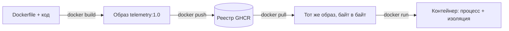
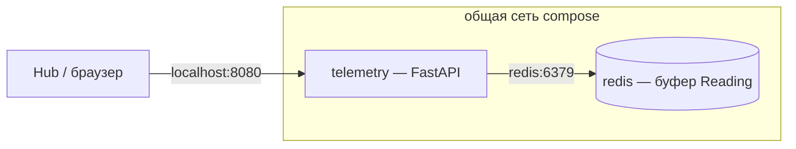

# Лекция 02. Контейнеры: Docker, OCI, образы, compose

> **Дисциплина:** Распределённые системы и облачные технологии (РСиОТ)
> **Занятие:** лекция 2 из 28 · **Время:** 1 пара (80 мин)
> **Зачем это:** прошлая пара закончилась выводом «один и тот же образ
> работает на ноутбуке, в CI и в облаке». Сегодня разбираемся, что такое
> этот «образ», как он устроен внутри и как упаковать в него сервис
> «СмартДома» — ровно то, что вы сделаете руками в лабораторной № 1.
> Конспект 2025 года сохранён в `archive_2025/`.

---

## Крючок: сканер безопасности, который сам оказался трояном

> 🖥 **Слайд 2.** Крючок: компрометация Trivy, март 2026

Март 2026 года. Trivy — один из самых популярных сканеров уязвимостей для
контейнеров: миллионы загрузок, стоит в CI-конвейерах по всему миру, его
задача — *ловить* вредоносный код в чужих образах. 19 марта злоумышленники
из группы TeamPCP компрометируют его собственный конвейер поставки:
выпускают вредоносный релиз v0.69.4, а 22 марта заливают на Docker Hub
заражённые образы и **перезаписывают тег `latest` официального
репозитория**. Ещё два тега — `0.69.5` и `0.69.6` — вообще не имели
релизов на GitHub: их придумал атакующий, и выглядели они «свежее» всех.

Внутри образов сидел инфостилер: обходил полсотни путей файловой системы
и собирал SSH-ключи, токены AWS/GCP/Azure, kubeconfig, конфиги Docker,
state-файлы Terraform — всё, чем живёт DevOps-инженер, — шифровал и
отправлял на домен `scan.aquasecurtiy.org`. Присмотритесь к написанию:
это тайпсквоттинг, подделка под домен вендора. Три дня каждый, кто честно
делал `docker pull trivy:latest`, получал не сканер, а вора.

Вопрос залу: **как вообще возможно, что «тот же самый» образ по тому же
имени сегодня и вчера — это разные байты? И чем тогда тег отличается от
версии?**

Держите вопрос до середины пары — мы разберём анатомию образа, и ответ
станет очевидным. А заодно станет ясно, почему в проде образы фиксируют
не тегом, а дайджестом.

*(Источник кейса: `sources/Веб-находки_Лекция_02.md` — официальные разборы
Docker, Aqua Security и GitHub Advisory; дата доступа 09.08.2026.)*

---

## Квиз-извлечение (по лекции 01)

> 🖥 **Слайд 3.** Квиз-извлечение

Ответьте не подглядывая в конспект; ответы — в конце лекции.

1. Hub отправил показание в облако и не получил ответ. Назовите четыре
   возможных сценария. Почему это состояние называется «неизвестно»?
2. Какие два свойства делают повтор запроса безопасным?
3. «99,9 % тревог доставлены быстрее 5 секунд за месяц» — что здесь SLI,
   а что SLO? Чем от них отличается SLA?
4. Среднее время ответа 80 мс, p99 = 3 с. Почему инженеры смотрят на p99,
   а не на среднее?

Если три-четыре ответа дались легко — фундамент прошлой пары на месте.
Он понадобится сегодня же: контейнеры — это наш ответ на одно из восьми
заблуждений.

---

## Результаты обучения

> 🖥 **Слайд 4.** Чему научимся

После этой пары вы сможете:

1. Объяснить, чем контейнер отличается от виртуальной машины и почему
   «лёгкая виртуалка» — вредная ментальная модель.
2. Рассказать, из чего сделан контейнер: namespaces, cgroups, слои
   файловой системы.
3. Написать корректный Dockerfile для сервиса «СмартДома»: кэш слоёв,
   non-root, HEALTHCHECK.
4. Запускать контейнеры осознанно: порты, переменные окружения, тома,
   сети — и знать, где живут (и где умирают) данные.
5. Отличать тег от дайджеста и объяснить на кейсе Trivy, почему это
   вопрос безопасности.
6. Поднимать связку сервисов одной командой через Docker Compose.

## Пререквизиты

- Лекция 01: частичные отказы, fallacies, идемпотентность.
- Командная строка: PowerShell на Windows; базовые команды Linux (`ls`,
  `ps`, `cat`) — внутри контейнеров живёт Linux.
- Установленный Docker Desktop с бэкендом WSL2 (понадобится в лабе 1).

---

## Картина мира: морской контейнер, а не пластиковый

> 🖥 **Слайд 5.** Дорожная карта пары

До 1956 года погрузка судна занимала недели: мешки, бочки, ящики — всё
грузилось вручную и по-разному. Потом Малком Маклин придумал стальной
ящик стандартного размера — и портам стало **всё равно, что внутри**:
один кран, одни крепления, одни грузовики для любого товара. Стоимость
погрузки упала в десятки раз.

Docker сделал то же самое с софтом. Контейнер — стандартная «коробка»
для приложения со всеми его зависимостями: питоном нужной версии,
библиотеками, конфигами. Серверу, CI-конвейеру и облаку всё равно, что
внутри — Python, Node или Go: интерфейс одинаковый. Помните заблуждение
№ 8 из прошлой пары — «сеть однородна»? Среда выполнения тоже не
однородна: на вашем ноутбуке Python 3.12, на сервере 3.9, у соседа
вообще Anaconda. Контейнер делает среду **переносимой**: одна и та же
коробка едет куда угодно.

Но у метафоры есть предел, и сегодня мы его найдём: морской контейнер —
вещь, а Docker-контейнер — **процесс**. Он не «стоит на складе», а
живёт и умирает — и всё, что он записал внутрь себя, умирает вместе
с ним.

Маршрут пары: зачем упаковывать → чем контейнер не виртуалка → что у
него внутри → анатомия образа и путь до реестра → пишем Dockerfile
вживую → запускаем осознанно → худеем и защищаемся → собираем систему
компоузом. По дороге — два квиза, одно голосование и один живой сеанс.

---

## Основные понятия

**Определения** (пополним глоссарий в конце):

- **Образ (image)** — неизменяемый шаблон: файловая система слоями +
  метаданные (какую команду запускать, какие порты документированы).
  Из одного образа можно запустить сколько угодно контейнеров.
- **Контейнер (container)** — запущенный экземпляр образа: обычный
  процесс хоста, которому ядро выдало изолированную «картину мира».
- **Реестр (registry)** — хранилище образов с версиями: Docker Hub,
  GitHub Container Registry (GHCR) и другие. Аналогия: git-репозиторий,
  только для образов.
- **Dockerfile** — сценарий сборки образа: текстовый файл с инструкциями,
  лежит рядом с кодом и версионируется вместе с ним.
- **OCI (Open Container Initiative)** — открытый стандарт на формат
  образа и запуск контейнера. Благодаря ему образ, собранный Docker,
  запускается в podman, containerd и Kubernetes — упаковка стандартнее
  инструмента.

---

## Ядро пары

### 1. Зачем упаковывать: болезнь «у меня работает»

> 🖥 **Слайд 6.** Зачем упаковывать

Разработчик пишет сервис телеметрии «СмартДома»: принимает показания
(`Reading`) от шлюзов (`Hub`), складывает в хранилище. На его ноутбуке —
Python 3.12, свежий FastAPI, переменная `REDIS_HOST` прописана в
профиле. Он отдаёт код на сервер — и сервис падает: там Python 3.9,
системный OpenSSL другой версии, переменной нет. Классический диалог
«у меня работает» — «а у нас нет» съедал у индустрии годы.

Способы лечения по нарастающей:

- **Инструкция по установке.** Документ устаревает быстрее, чем
  дочитывается; каждый шаг выполняет человек — с человеческой точностью.
- **Виртуальная машина с готовой средой.** Работает, но весит гигабайты,
  стартует минуты и тащит целую операционную систему ради одного
  сервиса.
- **Контейнер.** Мегабайты вместо гигабайт, старт за секунды, и главное —
  **образ собирается один раз и байт в байт одинаков** на ноутбуке,
  в CI и в облаке.

Обратите внимание на сдвиг мышления: мы перестаём «настраивать серверы»
и начинаем **собирать артефакты**. Сервер больше не место, которое
бережно готовят руками, — это безликая площадка, куда приезжает
самодостаточная коробка. Для распределённых систем это фундамент: узлы
приходят и уходят (лекция 01, модель crash-recovery), и единственный
способ выжить — уметь мгновенно разворачивать сервис где угодно.

### 2. Контейнер — не лёгкая виртуалка

> 🖥 **Слайд 7.** Контейнер ≠ VM

**Определения:**

- **Виртуальная машина (VM)** — программная эмуляция целого компьютера:
  виртуальные CPU, диск, сеть, и внутри — собственная **гостевая ОС**
  со своим ядром.
- **Гипервизор** — прослойка, которая делит физическое железо между
  виртуальными машинами и изолирует их друг от друга.
- **Ядро (kernel)** — сердце ОС: управляет процессами, памятью,
  файловыми системами, сетью. Всё, что «умеет» Linux, умеет его ядро.

Первое, что делает новичок, — называет контейнер «лёгкой виртуалкой».
Docker даже писал официальный пост «Containers are not VMs», настолько
это заблуждение живуче. Разница принципиальная:

| | Виртуальная машина | Контейнер |
| --- | --- | --- |
| Что виртуализируем | железо (весь компьютер) | ОС (картину мира процесса) |
| Ядро | своё в каждой VM | **одно, общее с хостом** |
| Размер | гигабайты | мегабайты |
| Старт | минуты | доли секунды |
| Изоляция | сильная (граница — гипервизор) | слабее (граница — ядро) |

Контейнер — это **обычный процесс хоста**, которому ядро Linux выдало
искажённую картину мира: он «видит» только свои процессы, свою файловую
систему, свой сетевой интерфейс. Никакой гостевой ОС внутри нет — в
образе `python:3.12-slim` лежат файлы и библиотеки Debian, но ядро
процесс использует хостовое. Отсюда оба главных следствия:

- **лёгкость**: не надо грузить ОС — старт контейнера это старт процесса;
- **ограничение**: ядро не сменишь; Linux-контейнеры требуют Linux-ядра.

Кстати, поэтому Docker Desktop на ваших Windows-машинах втихую запускает
**виртуальную машину с Linux** (WSL2) и уже в ней — контейнеры. Ирония
судьбы: чтобы пользоваться «не-виртуалками», Windows заводит виртуалку.
Это не косяк, а честная физика: Linux-процессу нужно Linux-ядро.

А безопасность? Общее ядро — общая поверхность атаки, поэтому банки
и облака для чужого кода добавляют VM-границу (Kata, Firecracker).
Но «контейнеры небезопасны» — тоже миф: правильно настроенный контейнер
(об этом в разделе 7) — вполне серьёзная изоляция для своего кода.

### 3. Что внутри: namespaces, cgroups и слои

> 🖥 **Слайды 8–9.** Три кита контейнера → слои образа

**Определения:**

- **Namespaces** — механизм ядра Linux: изолирует *видимость* — какие
  процессы, файловые системы, сетевые интерфейсы «видит» процесс.
- **Cgroups (control groups)** — механизм ядра: ограничивает
  *потребление* — сколько CPU, памяти, процессов можно израсходовать.
- **Слой (layer)** — неизменяемый «срез» файловой системы образа;
  образ — стопка слоёв, наложенных друг на друга.

Магия контейнера собирается из трёх механизмов ядра, каждый из которых
существовал до Docker, — Docker лишь сделал их удобными.

**Namespaces — «что я вижу».** Ядро умеет выдать процессу отдельное
пространство имён процессов (внутри контейнера ваш сервис — PID 1,
других процессов «нет»), отдельный сетевой стек (свой IP, свои порты),
отдельное дерево файловой системы, свой hostname. Процесс искренне
считает себя единственным жильцом машины.

**Cgroups — «сколько мне можно».** Группе процессов назначается бюджет:
`memory=256m`, `cpus=0.5`. Превысил память — ядро убьёт процесс
(OOM-kill), и это правильно: на одном хосте «СмартДома» крутятся
телеметрия, обработчик правил и нотификатор — утечка памяти в одном
не должна утащить всех (вспомните частичные отказы: изоляция — способ
превратить полный отказ узла в частичный отказ одного сервиса).

**Слои — «из чего я сделан».** Образ — это стопка read-only слоёв:
базовый Debian → установленный Python → ваши зависимости → ваш код.
Каждая инструкция Dockerfile добавляет слой. Слои **адресуются хэшем
содержимого** и переиспользуются: десять образов на базе
`python:3.12-slim` хранят базовые слои в одном экземпляре. При запуске
контейнера поверх стопки кладётся один тонкий **записываемый слой** —
все файлы, которые контейнер создаёт во время работы, попадают туда.

Запомните до голосования: записываемый слой принадлежит *контейнеру*,
а не образу. Что с ним происходит, когда контейнер пересоздают, —
обсудим через несколько минут, и это будет самый важный факт пары.

### 4. Образ, тег, дайджест: путь артефакта и урок Trivy

> 🖥 **Слайд 10.** Путь образа и анатомия имени

**Определения:**

- **Тег (tag)** — человекочитаемая метка на образе: `telemetry:1.0`,
  `python:3.12-slim`, `nginx:latest`. **Изменяемая**: метку можно снять
  и повесить на другой образ.
- **Дайджест (digest)** — криптографический хэш содержимого образа:
  `sha256:4f2a…`. **Неизменяемый**: другое содержимое — другой хэш.

Проследим путь артефакта — он станет каркасом и лабы, и всего курса:



Сборка детерминирована Dockerfile'ом, реестр хранит версии, любой узел
мира вытягивает **байт в байт** тот же артефакт. Здесь и живёт обещание
«работает одинаково везде».

Полное имя образа читается так:
`ghcr.io/bstu/telemetry:1.0` = реестр / владелец / имя : тег.
Если реестр не указан — подставляется Docker Hub; если тег не указан —
подставляется `latest`. И вот тут пора вернуться к крючку.

**`latest` — это не «самая свежая версия». Это просто тег по умолчанию,
изменяемая метка.** В марте 2026 атакующие перезаписали `latest` (и три
версионных тега!) официального образа Trivy — и три дня `docker pull`
по привычному имени приносил малварь. Тег — как бумажный ярлык на
коробке: переклеить может любой, у кого есть доступ к складу. Дайджест —
как отпечаток содержимого: подделать нельзя, потому что он *вычисляется*
из байтов образа. Поэтому в проде и CI образы фиксируют дайджестом:

```powershell
docker pull python@sha256:1a2b3c...   # придёт ровно то, что зафиксировано
```

Стандарт, который делает всё это возможным, называется **OCI**: формат
образа, протокол реестра и интерфейс запуска описаны открыто, поэтому
образ не привязан к Docker — тот же артефакт запустят containerd внутри
Kubernetes (лекция 18) или podman. Docker — популярный инструмент,
OCI-образ — стандартная упаковка.

#### Peer-instruction-вопрос № 1

> 🖥 **Слайды 11–15.** Голосование PI-1 → четыре разбора

Голосуем, обсуждаем с соседом 90 секунд, голосуем снова.

> Сервис телеметрии пишет показания в файл `/data/readings.db` **внутри
> контейнера**. Ночью контейнер упал; оркестратор удалил его и запустил
> новый из того же образа `telemetry:1.0`. Что утром с данными?
>
> A. Данные на месте: образ не менялся, а данные — часть образа.
> B. Данные потеряны: они жили в записываемом слое контейнера, который
> умер вместе с ним. Нужен был том (volume).
> C. Данные на месте: Docker автоматически сохраняет изменения
> контейнера обратно в образ при остановке.
> D. Данные на месте: контейнер — это же процесс, а файлы физически
> лежат на диске хоста и никуда не деваются.

Разбор — в конце лекции. Подсказка: два варианта путают образ с
контейнером, один — почти правда, но с фатальной дырой.

### 5. Живой сеанс: Dockerfile для телеметрии «СмартДома»

> 🖥 **Слайд 16 — пауза 60 секунд, затем слайд 17.** Живой сеанс

Пишем вместе, на глазах, в три подхода — с ошибками и исправлениями,
потому что именно так Dockerfile пишется в жизни. Упаковываем сервис
приёма телеметрии: `Hub` шлёт показания `Reading` по HTTP.

Исходники сервиса — двадцать строк на FastAPI (веб-фреймворк Python;
для нас это просто HTTP-сервис с двумя маршрутами, подробно про
взаимодействие сервисов — лекция 3):

```python
# app.py — приём телеметрии «СмартДома»
from fastapi import FastAPI
from pydantic import BaseModel

app = FastAPI(title="SmartHome Telemetry")
readings: list[dict] = []        # демо-хранилище в памяти (пока!)

class Reading(BaseModel):
    device_id: str               # какой Device прислал
    sensor: str                  # канал: temp, smoke, leak
    value: float

@app.post("/readings")
def add_reading(r: Reading):
    readings.append(r.model_dump())
    return {"accepted": True, "total": len(readings)}

@app.get("/health")
def health():
    return {"status": "ok"}
```

```text
# requirements.txt
fastapi==0.116.1
uvicorn==0.35.0
```

**Подход № 1 — наивный.** Пишем «в лоб»: взять питон, закинуть всё,
поставить зависимости, запустить.

```dockerfile
FROM python:3.12-slim
WORKDIR /app
COPY . .
RUN pip install --no-cache-dir -r requirements.txt
CMD ["uvicorn", "app:app", "--host", "0.0.0.0", "--port", "8080"]
```

Работает! Но поправьте одну букву в `app.py` и пересоберите: `pip
install` выполняется заново, все две минуты. Почему? Кэш слоёв работает
так: если слой изменился — **он и все слои после него** собираются
заново. `COPY . .` тащит и код, и `requirements.txt` одним слоем — любая
правка кода инвалидирует установку зависимостей.

**Подход № 2 — дружим с кэшем.** Редко меняющееся — раньше, часто
меняющееся — позже:

```dockerfile
FROM python:3.12-slim
WORKDIR /app
COPY requirements.txt .
RUN pip install --no-cache-dir -r requirements.txt
COPY app.py .
CMD ["uvicorn", "app:app", "--host", "0.0.0.0", "--port", "8080"]
```

Теперь правка кода пересобирает только слой `COPY app.py .` — секунда
вместо двух минут. Одно перемещение строки — и цикл разработки ускорился
на два порядка. Это не микрооптимизация: в CI такая сборка гоняется на
каждый коммит.

**Подход № 3 — по-взрослому.** Два вопроса от зала будущему проду.
Первый: от чьего имени работает процесс? По умолчанию — root; если
в FastAPI найдут дыру, атакующий получит root в контейнере — а это
плохой плацдарм (детали — в разделе 7). Второй: как оркестратор поймёт,
что сервис *жив*, а не просто процесс существует? Вспомните лекцию 01:
«процесс запущен» и «сервис отвечает» — разные утверждения.

```dockerfile
FROM python:3.12-slim
WORKDIR /app
COPY requirements.txt .
RUN pip install --no-cache-dir -r requirements.txt
COPY app.py .
RUN useradd -r -u 10001 appuser
USER 10001
EXPOSE 8080
HEALTHCHECK --interval=30s --timeout=3s \
  CMD ["python", "-c", "import urllib.request; urllib.request.urlopen('http://127.0.0.1:8080/health')"]
CMD ["uvicorn", "app:app", "--host", "0.0.0.0", "--port", "8080"]
```

Заметьте: для проверки здоровья мы зовём питоновский `urllib`, а не
`curl` — в slim-образе `curl` просто нет, и ставить его ради healthcheck
значит раздувать образ. `EXPOSE` — только документация: «сервис слушает
8080»; наружу порт откроет флаг `-p` при запуске.

**Пояснение к примеру.** Три подхода — три урока: порядок инструкций
управляет кэшем; non-root — дешёвая страховка; HEALTHCHECK — способ
сказать оркестратору правду о себе. Ровно эти три пункта будут в
критериях лабы 1.

**Проверка:**

```powershell
docker build -t telemetry:1.0 .
docker run --rm -d -p 8080:8080 --name telemetry telemetry:1.0
Invoke-RestMethod http://localhost:8080/health          # {"status":"ok"}
Invoke-RestMethod -Method Post -Uri http://localhost:8080/readings `
  -ContentType "application/json" `
  -Body '{"device_id":"kitchen-1","sensor":"temp","value":23.5}'
docker ps                                               # STATUS: ... (healthy)
```

**Типичные ошибки:**

- `COPY . .` до установки зависимостей — убитый кэш (подход № 1);
- забыть `--host 0.0.0.0` — сервис слушает только localhost *внутри*
  контейнера, и проброшенный порт отвечает пустотой;
- `EXPOSE` без `-p` — порт «задокументирован», но снаружи закрыт;
- секреты (пароль БД, токены) в `ENV` внутри Dockerfile — они навсегда
  остаются в слоях образа, `docker history` покажет их любому.

### 6. Запуск: порты, переменные, данные, сеть

> 🖥 **Слайд 18.** Осознанный docker run

**Определения:**

- **Проброс порта** (`-p 8080:8080`) — связать порт хоста с портом
  контейнера: слева хост, справа контейнер.
- **Том (volume)** — управляемое Docker'ом хранилище, живущее *дольше*
  контейнера.
- **Bind-mount** — папка хоста, примонтированная внутрь контейнера.

Четыре решения, которые вы принимаете при каждом запуске:

**Порты.** У контейнера свой сетевой namespace — его порт 8080 не виден
с хоста, пока вы не построили мост: `-p 8080:8080`. Если 8080 на хосте
занят — `-p 9090:8080`, и сервис доступен на `localhost:9090`.

**Конфигурация.** Один образ едет через окружения: dev, CI, прод.
Настройки в образ не зашивают — их передают переменными окружения:

```powershell
docker run -d -p 8080:8080 -e REDIS_HOST=redis -e LOG_LEVEL=debug telemetry:1.0
```

**Данные.** Ответ на PI-вопрос: записываемый слой умирает с контейнером.
Всё, что должно пережить перезапуск, — наружу, в том:

```powershell
docker volume create readings-data
docker run -d -p 8080:8080 -v readings-data:/data telemetry:1.0
```

Для разработки удобнее bind-mount — правки видны сразу:

```powershell
docker run -d -p 8080:8080 -v "${PWD}\app.py:/app/app.py" telemetry:1.0
```

Правило простое: **прод — тома, разработка — bind-mount, внутрь
контейнера — ничего ценного.** Это тот же принцип, что в лекции 01:
узел (контейнер) смертен, состояние должно жить отдельно от него.

**Сеть.** Контейнеры в одной пользовательской сети находят друг друга
**по имени** — встроенный DNS Docker резолвит имя контейнера в его IP:

```powershell
docker network create smarthome
docker run -d --name redis --network smarthome redis:7-alpine
docker run -d --name telemetry --network smarthome -p 8080:8080 -e REDIS_HOST=redis telemetry:1.0
```

Сервис телеметрии обращается к `redis:6379` — не к IP, который меняется
при каждом перезапуске. Windows-нюанс: если контейнеру нужно достучаться
до сервиса на *хосте* (например, БД в WSL), используйте имя
`host.docker.internal`.

**Пояснение к примеру.** `--name` даёт контейнеру DNS-имя; `--network`
помещает его в общую сеть с Redis; `-e REDIS_HOST=redis` сообщает
приложению это имя. Три флага — и два сервиса «СмартДома» общаются.

**Проверка:** `docker exec -it telemetry python -c
"import socket; print(socket.gethostbyname('redis'))"` — напечатает IP
контейнера Redis.

**Типичные ошибки:**

- хранить состояние в контейнере и удивляться после пересоздания;
- ходить между контейнерами по IP (меняется) вместо имени;
- в дефолтной сети `bridge` DNS-резолв по имени не работает — создавайте
  пользовательскую сеть;
- пути Windows в bind-mount без кавычек — PowerShell режет их по пробелу.

### 7. Диета и гигиена: multi-stage, non-root, дайджест, скан

> 🖥 **Слайды 19–20.** Диета образа → гигиена поставки

**Определения:**

- **Multi-stage build** — сборка в несколько этапов в одном Dockerfile:
  «цех» со всеми инструментами и «витрина», куда попадает только
  готовый артефакт.
- **SBOM (Software Bill of Materials)** — «состав продукта»: список всех
  пакетов и версий внутри образа.

Каждый мегабайт образа — это время доставки на каждый узел и потенциальные
уязвимости в пакетах, которые вам даже не нужны. Диета начинается с базы:
`python:3.12` весит ~1 ГБ, `python:3.12-slim` — ~120 МБ. Продолжается
multi-stage: инструменты сборки не должны ехать в прод. Вот витрина для
Node-сервиса нотификаций «СмартДома» (шлёт `Alert` жильцам):

```dockerfile
FROM node:22-alpine AS build
WORKDIR /app
COPY package*.json ./
RUN npm ci --omit=dev
COPY . .

FROM node:22-alpine
WORKDIR /app
COPY --from=build /app /app
USER node
CMD ["node", "notifier.js"]
```

Первый этап ставит зависимости со всем шумом (кэши npm, дев-тулзы),
второй забирает **только результат**. В пределе прод-образ — это
distroless: ни шелла, ни пакетного менеджера, только рантайм и ваш код;
атакующему, попавшему внутрь, буквально нечем работать.

Гигиена поставки — прямые выводы из крючка:

- **Фиксируйте версии.** `requirements.txt` с точными версиями,
  lock-файлы, а в критичных местах — дайджест базового образа
  (`FROM python:3.12-slim@sha256:…`). Тег переклеивается, хэш — нет.
- **Сканируйте образы.** Тот же Trivy (да, инструмент хороший — потому
  его и атаковали: компрометация сканера даёт доступ к тысячам CI)
  находит известные CVE в пакетах образа: `trivy image telemetry:1.0`.
- **Не бегайте под root.** `USER` в Dockerfile плюс, по вкусу,
  `--read-only` и `--cap-drop ALL` при запуске: сервису телеметрии не
  нужны права на запись в свою ФС и способности администратора сети.
- **Ограничивайте ресурсы.** `--memory 256m --cpus 0.5` — cgroups
  превращают утечку памяти из катастрофы хоста в перезапуск одного
  контейнера.

Всё это — минимальный джентльменский набор; глубокая тема supply chain
(подписи, SLSA) ждёт в лекции 25.

### 8. Compose: «СмартДом» поднимается одной командой

> 🖥 **Слайд 21.** Compose: система как файл

**Определения:**

- **Docker Compose** — инструмент описания и запуска *набора*
  контейнеров одним YAML-файлом; с Compose v2 — подкоманда
  `docker compose` (старый `docker-compose` через дефис — v1, мёртв).
- **Сервис (service)** — именованный компонент в компоузе; из сервиса
  создаются контейнеры.

Телеметрия + Redis — это уже система: два контейнера, сеть, переменные.
Поднимать её тремя командами `docker run` с десятком флагов — путь к
ошибке (и к невоспроизводимости: команды живут в истории шелла, а не в
git). Compose описывает систему декларативно, файл `compose.yaml`:

```yaml
services:
  telemetry:
    build: .
    ports:
      - "8080:8080"
    environment:
      - REDIS_HOST=redis
    depends_on:
      - redis
  redis:
    image: redis:7-alpine
    volumes:
      - readings-data:/data

volumes:
  readings-data:
```



Одна команда — и вся система в воздухе:

```powershell
docker compose up --build -d
docker compose ps        # оба сервиса, статусы
docker compose logs -f   # объединённые логи
docker compose down      # остановить (добавьте -v, чтобы снести и тома)
```

Compose сам создаёт общую сеть — сервисы видят друг друга по именам из
YAML. Файл лежит в репозитории: новый разработчик поднимает окружение
одной командой, а не по устной традиции.

**Пояснение к примеру.** `build: .` — телеметрия собирается из нашего
Dockerfile; `image:` — Redis берётся готовым из реестра; `depends_on`
задаёт **порядок старта**, но не готовность: Redis может стартовать
первым и ещё не отвечать — ваше приложение обязано уметь ретраи
(лекция 01, аптечка!).

**Проверка:** `docker compose up -d`, затем
`Invoke-RestMethod http://localhost:8080/health`; остановите Redis
(`docker compose stop redis`) — телеметрия должна пережить это без
падения (частичный отказ!).

**Типичные ошибки:**

- полагаться на `depends_on` как на «Redis готов» — это только порядок
  запуска;
- писать поле `version:` в `compose.yaml` — устарело, Compose v2 его
  игнорирует и ворчит;
- `docker compose down -v` на машине с ценными данными — флаг `-v`
  удаляет тома;
- забыть, что `docker compose` и `docker-compose` — разные поколения
  инструмента.

Compose — мини-оркестратор для одной машины. Когда машин станет много и
понадобятся самовосстановление и масштабирование — придёт Kubernetes
(лекция 18), но словарь у него тот же: образы, контейнеры, декларации.

---

## Типичные ошибки (запомните до того, как совершите)

> 🖥 **Слайд 22.** Типичные ошибки

1. **«Контейнер — это лёгкая виртуалка».** Нет: это процесс с изоляцией.
   Из ложной модели вырастают ложные ожидания — «внутри своя ОС», «ядро
   можно обновить», «изоляция как у VM».
2. **«Данные полежат в контейнере».** Записываемый слой умирает с
   контейнером. Состояние — только в томах или внешних хранилищах.
3. **«Возьмём latest — он самый свежий».** Тег — изменяемая метка; кейс
   Trivy показал, что под `latest` может оказаться что угодно. Версии —
   явные, в проде — дайджесты.
4. **«COPY . . в начале — какая разница».** Разница — в минутах на
   каждую пересборку: порядок инструкций управляет кэшем слоёв.
5. **«Секрет в ENV Dockerfile — кто увидит?»** Любой, у кого есть образ:
   `docker history` раскрывает слои. Секреты — через переменные при
   запуске или менеджеры секретов.

---

## Квиз-закрепление (по этой паре)

> 🖥 **Слайд 23.** Закрепление

Ответьте не подглядывая; ответы — в конце лекции.

1. Одним предложением: чем контейнер принципиально отличается от
   виртуальной машины?
2. Контейнер пересоздали из образа. Что стало с файлами, которые сервис
   писал в `/data` без тома? Как правильно?
3. Чем тег отличается от дайджеста и что из них перезаписали атакующие
   в кейсе Trivy?
4. Почему `COPY requirements.txt` + `RUN pip install` ставят *до*
   `COPY app.py`, а не после?

---

## Вопросы для самопроверки

1. Что виртуализирует VM, а что — контейнер? Где в каждой схеме ядро?
2. Почему Docker Desktop на Windows запускает виртуальную машину, если
   контейнеры «не виртуалки»?
3. Что изолируют namespaces, а что ограничивают cgroups? Приведите по
   примеру для сервиса телеметрии.
4. Из чего состоит образ? Почему десять образов на одной базе не
   занимают десятикратное место?
5. Куда попадают файлы, которые контейнер создаёт во время работы, и
   что с ними происходит при пересоздании?
6. Разложите имя `ghcr.io/bstu/telemetry:1.0` на части. Что подставится,
   если написать просто `telemetry`?
7. Почему фиксация образа дайджестом безопаснее фиксации тегом?
   Ответьте через кейс Trivy.
8. Что делает `EXPOSE` и почему без `-p` порт снаружи недоступен?
9. Чем volume отличается от bind-mount и когда что уместно?
10. Как два контейнера в одной пользовательской сети находят друг друга?
    Почему не по IP?
11. Зачем multi-stage build, если можно «просто удалить лишнее» командой
    в конце Dockerfile? (Подсказка: слои неизменяемы.)
12. Что даёт запуск под non-root пользователем и как его включить?
13. Почему `depends_on` в Compose не гарантирует готовность зависимости
    и что с этим делать? (Подсказка: лекция 01, аптечка.)
14. Назовите три решения из этой пары, которые напрямую защищают от
    частичных отказов.

---

## Мост к лабораторной № 1

> 🖥 **Слайд 24.** Мост к лабе

Лабораторная № 1 (`tasks/task_01`) — это сегодняшняя пара руками: вы
контейнеризируете веб-сервис «СмартДома» и доведёте его до приличного
состояния. Понадобится всё ядро: Dockerfile с правильным порядком слоёв
(раздел 5), non-root и HEALTHCHECK (разделы 5, 7), проброс портов и
переменные (раздел 6), и Compose для связки с зависимостью (раздел 8).
Сдача — fork, ветка, Pull Request и два ревью одногруппников: заодно
почувствуете, как выглядит чужой Dockerfile и почему ревью находит то,
что автор уже не видит.

**Задание на 1 предложение** (письменно, в конспект): закончите фразу
«Умение упаковать сервис в контейнер пригодится лично мне, потому
что…» — конкретно, про свои проекты и планы. На следующей паре спрошу
троих добровольцев.

---

## Глоссарий

> 🖥 **Слайд 25 (финал).** Вопросы + литература

| Термин | Определение |
| --- | --- |
| Контейнер | Процесс хоста с изолированной картиной мира (namespaces) и бюджетом ресурсов (cgroups) |
| Образ (image) | Неизменяемый шаблон: стопка слоёв ФС + метаданные запуска |
| Слой (layer) | Read-only срез файловой системы; адресуется хэшем, переиспользуется |
| Записываемый слой | Верхний слой контейнера; умирает вместе с ним |
| Тег | Изменяемая человекочитаемая метка образа (`:1.0`, `:latest`) |
| Дайджест | Неизменяемый хэш содержимого образа (`sha256:…`) |
| Реестр | Хранилище образов: Docker Hub, GHCR |
| OCI | Открытый стандарт формата образа и запуска контейнера |
| Namespaces | Механизм ядра Linux: изоляция видимости (процессы, сеть, ФС) |
| Cgroups | Механизм ядра Linux: лимиты ресурсов (CPU, память, PID) |
| Multi-stage build | Сборка этапами: инструменты в «цехе», в прод — только артефакт |
| Volume | Управляемое хранилище, переживающее контейнер |
| Bind-mount | Папка хоста, примонтированная в контейнер |
| HEALTHCHECK | Встроенная в образ проверка «сервис жив», а не «процесс есть» |
| Compose | Декларативное описание и запуск набора контейнеров (`compose.yaml`) |
| SBOM | Перечень пакетов и версий внутри образа («состав продукта») |

## Список литературы

1. Основная литература
   - [1] Poulton N. — «Docker Deep Dive». 2025 edition. Главы 4–8.
   - [2] Клеппман М. — «Высоконагруженные приложения». Питер. Глава 1
     (контекст: зачем распределённым системам воспроизводимые артефакты).
2. Дополнительная литература
   - [3] OWASP — Docker Security Cheat Sheet.
   - [4] NIST SP 800-190 — Application Container Security Guide.
3. Интернет-ресурсы
   - [5] Docker Docs — [https://docs.docker.com](https://docs.docker.com)
     (разделы Get started, Build, Compose; Docker Engine 29, Compose v5).
   - [6] OCI — [https://opencontainers.org](https://opencontainers.org).
   - [7] Разборы компрометации Trivy (март 2026) — подборка с URL в
     `sources/Веб-находки_Лекция_02.md` (дата обращения: 09.08.2026).

---

## Ответы

### Ответы: квиз-извлечение

1. Запрос потерялся; облако упало до обработки; облако обработало, но
   ответ потерялся; всё работает, но медленно. Снаружи сценарии
   неразличимы — поэтому состояние честно называется «неизвестно»,
   а не «отказ».
2. Идемпотентность (повтор не дублирует эффект — ключ запроса) и
   backoff с джиттером (повторы не сбиваются в retry storm).
3. SLI — измеряемый показатель: доля тревог, доставленных быстрее
   5 секунд. SLO — целевое значение: 99,9 % за месяц. SLA — то же
   обещание, но в договоре с неустойкой.
4. Пользовательский опыт живёт в хвосте распределения: p99 = 3 с
   означает, что каждый сотый запрос ждёт 3 секунды, — при десятках
   внутренних вызовов на страницу хвост цепляет почти каждого
   пользователя. Среднее это маскирует.

### Ответы: peer instruction № 1

Правильный ответ — **B**: файл `/data/readings.db` жил в записываемом
слое контейнера; оркестратор удалил контейнер — слой уничтожен вместе
с ним. Новый контейнер начал с чистого листа из образа. Данные, которые
должны переживать контейнер, монтируются наружу: `-v readings-data:/data`.

- A — путает образ и контейнер: образ неизменяем и создаётся при
  `docker build`; данные времени выполнения в него не попадают никогда.
- C — такого механизма нет: «автосохранения» изменений в образ Docker
  не делает (ручной `docker commit` существует, но это антипаттерн —
  артефакт перестаёт быть воспроизводимым из Dockerfile).
- D — почти правда, потому и коварна: слой физически лежит на диске
  хоста, но принадлежит *конкретному контейнеру*; при его удалении
  Docker сносит слой. Новый контейнер получает свой, пустой. Файлы
  «на диске хоста» переживают контейнер только если это том или
  bind-mount.

### Ответы: квиз-закрепление

1. Контейнер — процесс, делящий ядро с хостом (виртуализация на уровне
   ОС); VM эмулирует компьютер целиком с собственной гостевой ОС.
2. Файлы исчезли вместе с записываемым слоем. Правильно: том
   (`docker volume create` + `-v имя:/data`) или внешнее хранилище.
3. Тег — изменяемая метка, дайджест — хэш содержимого. В кейсе Trivy
   перезаписали теги, включая `latest`; дайджесты вредоносных образов,
   разумеется, отличались от легитимных.
4. Чтобы правки кода не инвалидировали слой установки зависимостей:
   кэш слоёв пересобирает изменённый слой и всё после него, поэтому
   стабильное ставим раньше, изменчивое — позже.
