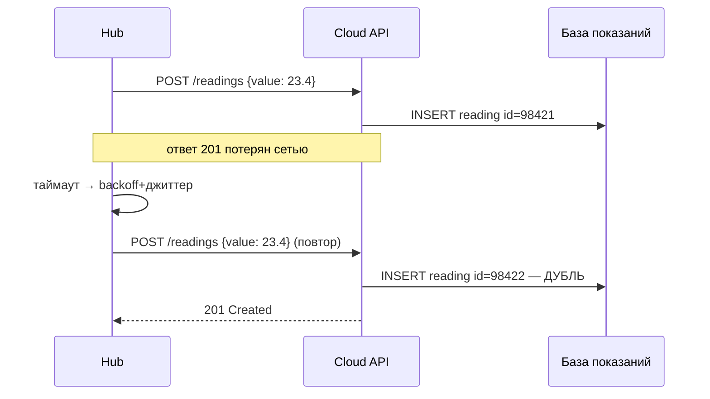
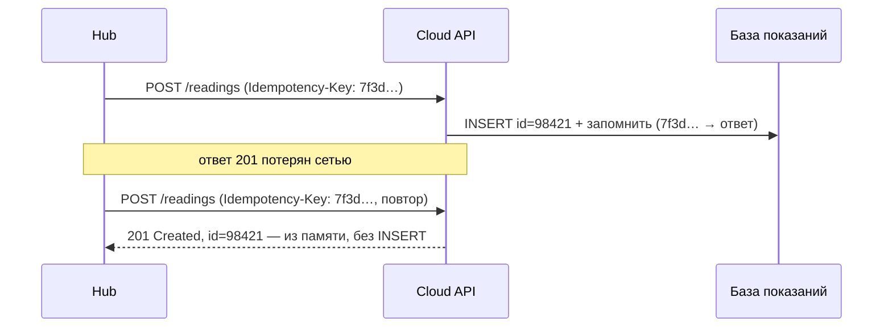

# Лекция 03. Взаимодействие в распределённых системах: REST/gRPC, сериализация, идемпотентность, ретраи

> **Дисциплина:** Распределённые системы и облачные технологии (РСиОТ)
> **Занятие:** лекция 3 из 28 · **Время:** 1 пара (80 мин)
> **Зачем это:** в лекции 01 мы узнали, что сеть ненадёжна, в лекции 02 —
> упаковали сервис в контейнер. Сегодня — про сам разговор между узлами:
> как Hub «СмартДома» говорит с облаком, на каком языке, что делать, когда
> ответа нет, и как повторить запрос, не устроив ни дублей, ни шторма.

---

## Крючок: как Google уронил сам себя — дважды за один день

> 🖥 **Слайд 2.** Крючок: сбой Google Cloud 12.06.2025

12 июня 2025 года, 10:49 по тихоокеанскому времени. В Service Control —
систему Google Cloud, которая проверяет квоты **каждого** API-вызова, —
через автоматическую репликацию приезжает политика с пустыми полями.
Код проверки квот, выкаченный двумя неделями раньше без feature-флага и
без обработки ошибок, ловит null pointer — и бинарники Service Control
уходят в бесконечный перезапуск **во всех регионах планеты одновременно**.
Google Cloud отвечает 503: лежат Gmail, BigQuery, Cloud Storage, Vertex AI —
больше 80 продуктов, а через них Spotify, Discord и половина интернета.

Причину инженеры нашли за 10 минут, «красную кнопку» нажали за 40. Казалось
бы, конец истории. Но дальше началась **вторая авария, устроенная лечением
первой**: в гигантском регионе us-central1 задачи Service Control стали
подниматься все разом и хором ломиться в одну региональную базу Spanner за
метаданными. В официальном разборе Google признал чёрным по белому:
у Service Control **не было рандомизированного экспоненциального backoff**.
«Эффект стада» задавил инфраструктуру: против 40 минут на сам фикс
восстановление us-central1 растянулось на 2 часа 40 минут — перезапуски
пришлось душить вручную.

Вопрос залу: **если даже Google наступает на ретраи без backoff — что
именно так трудно в «просто повторить запрос»?**

К концу пары вы будете знать про повторы больше, чем тот код Service
Control.

*(Источник кейса: `sources/Веб-находки_Лекция_03.md` — официальный incident
report Google и разборы ThousandEyes/ByteByteGo; дата доступа 09.08.2026.)*

---

## Квиз-извлечение (по лекции 02)

> 🖥 **Слайд 3.** Вспоминаем контейнеры

Ответьте не подглядывая; ответы — в конце лекции.

1. Одним предложением: чем контейнер отличается от виртуальной машины?
2. В инциденте Trivy атакующие перезаписали тег `latest`. Почему это
   вообще возможно — и что они не смогли бы подделать?
3. Почему `COPY requirements.txt` ставят в Dockerfile раньше `COPY app.py`?
4. `depends_on` в compose гарантирует, что Redis уже *готов* принимать
   соединения к моменту старта телеметрии?

Вопрос 4 — мостик к сегодняшней паре: там, где compose не гарантирует
готовность, приложение обязано уметь ждать и повторять. Как именно —
сегодня и разберём.

---

## Результаты обучения

> 🖥 **Слайд 4.** Чему научимся

После этой пары вы сможете:

1. Объяснить, почему вызов по сети принципиально отличается от локального
   вызова функции и почему таймаут — это не ответ «нет».
2. Выбирать между синхронным (запрос-ответ) и асинхронным (сообщения)
   взаимодействием.
3. Спроектировать REST-эндпоинт приёма телеметрии и объяснить семантику
   HTTP-методов и кодов ответов.
4. Объяснить, когда вместо REST берут gRPC + Protobuf и как эволюционируют
   схемы данных без остановки парка устройств.
5. Настроить безопасные повторы: таймаут → ретрай с экспоненциальным
   backoff и джиттером → ключ идемпотентности.

## Пререквизиты

- Лекция 01: частичные отказы, четыре сценария «нет ответа», аптечка
  надёжности (таймаут, ретрай, идемпотентность — сегодня раскрываем).
- Лекция 02: контейнеры; сервис телеметрии с `POST /readings` из живого
  сеанса — сегодня заглянем внутрь этого запроса.
- HTTP на уровне «метод, путь, код ответа»; JSON на уровне «видел и писал».

---

## Картина мира: разговор двух незнакомцев через плохую связь

> 🖥 **Слайд 5.** Дорожная карта пары

На одной машине вызов функции — это прыжок по адресу в памяти: наносекунды,
никакой неопределённости. В «СмартДоме» Hub вызывает облако **через город и
через чужие сети**: запрос сериализуется в байты, едет по Wi-Fi, оптике и
чьим-то маршрутизаторам, а ответ проделывает тот же путь обратно. На каждом
сантиметре этого пути живут все восемь заблуждений из лекции 01.

Аналогия пары: сетевое взаимодействие — разговор двух незнакомцев по
плохой телефонной связи. Нужно договориться о **языке** (формат данных),
о **манере разговора** (ждать ответа или оставить сообщение), о том,
**сколько ждать** (таймаут), и о том, **как переспрашивать**, чтобы
собеседник не выполнил просьбу дважды (идемпотентность).

Маршрут: чем сетевой вызов хуже локального → синхронно или асинхронно →
REST на «СмартДоме» → gRPC и Protobuf → эволюция схем → таймауты и
дедлайны → ретраи без шторма → ключ идемпотентности → трейлер про очереди.
По дороге — голосование, живой сеанс и одна пауза.

---

## Основные понятия

**Определения** (пополним глоссарий в конце):

- **RPC (Remote Procedure Call)** — вызов процедуры на другом узле,
  оформленный так, будто это обычная функция. Иллюзия удобная — и опасная.
- **Сериализация** — превращение объекта в байты для передачи по сети или
  записи на диск; обратный процесс — десериализация.
- **Схема** — формальное описание структуры данных: какие поля, каких
  типов, какие обязательны.
- **Таймаут** — предельное время ожидания ответа; **дедлайн** — момент
  времени, после которого результат никому не нужен.
- **Ключ идемпотентности** — уникальная метка запроса, по которой сервер
  распознаёт повтор и не выполняет операцию второй раз.

---

## Ядро пары

### 1. Вызов по сети — не вызов функции

> 🖥 **Слайд 6.** Сетевой вызов ≠ локальный

В 1990-х индустрия дважды пыталась спрятать сеть за интерфейсом обычной
функции — CORBA, DCOM: «пишите как всегда, остальное сделает магия». Обе
магии умерли, и причина сформулирована ещё в 1994 году в классической
заметке «A Note on Distributed Computing»: **сетевой вызов нельзя сделать
неотличимым от локального**, потому что у него другая физика.

Локальный вызов: наносекунды, либо выполнился, либо упало всё вместе —
вызывающий и вызываемый живут и умирают в одном процессе. Сетевой вызов:

- **в тысячи раз медленнее**, и задержка непредсказуема (fallacy № 2);
- **отказывает частично**: ваш код жив, а ответа нет;
- имеет **третий исход**. Локальный вызов знает два: результат или
  исключение. Сетевой добавляет «**неизвестно**» — те самые четыре
  неразличимых сценария из лекции 01.

Отсюда главный тезис пары, повесьте над рабочим столом: **таймаут — это не
ответ «нет». Это отсутствие ответа.** После `TimeoutError` показание
телеметрии может быть уже в базе облака, а может не быть — и никакой
локальной интуицией это не выяснить. Всё, что мы строим дальше — коды
ответов, ретраи, ключи идемпотентности, — это способы честно жить с
третьим исходом, а не делать вид, что его нет.

### 2. Синхронно или асинхронно: звонок или сообщение

> 🖥 **Слайд 7.** Два стиля взаимодействия

**Определения:**

- **Синхронное взаимодействие (запрос-ответ)** — вызывающий отправил запрос
  и ждёт ответа, не продолжая работу; результат нужен прямо сейчас.
- **Асинхронное взаимодействие (сообщения)** — отправитель кладёт сообщение
  посреднику (очереди) и продолжает работу; получатель обработает, когда
  сможет.

Бытовая аналогия: синхронный вызов — телефонный звонок (оба на линии
одновременно, занят — перезванивай), асинхронный — сообщение в мессенджере
(отправил и живёшь дальше, собеседник ответит, когда проснётся).

На «СмартДоме» видно, где что уместно:

- Жилец открыл приложение и хочет видеть текущую температуру — **синхронно**:
  `GET /devices/7/readings/latest`, ответ нужен на экран сейчас.
- Датчики шлют 200 показаний в секунду, облако считает статистику —
  **асинхронно по природе**: никто не стоит над душой у каждого показания,
  Hub буферизует при обрыве и досылает потом (лекция 01).
- Тревога `Alert` жильцу — асинхронная доставка с гарантиями: телефон может
  быть вне сети, уведомление обязано дожить до его возвращения.

Синхронный стиль проще в отладке — вся цепочка видна в одном запросе, — но
**связывает судьбы**: если облако медленно, Hub тоже медленно; отказ едет
по цепочке вызовов, как по проводам. Асинхронный стиль развязывает
отправителя и получателя во времени, но приносит свои боли: где гарантия
доставки, в каком порядке придут сообщения, как отлаживать то, что
происходит «когда-нибудь». Сегодня мы разбираем синхронный мир — он нужен
в лабах прямо сейчас; очереди и брокеры получат свою пару (лекция 12).

### 3. REST: облако «СмартДома» как набор ресурсов

> 🖥 **Слайд 8.** Анатомия POST /readings

**Определения:**

- **REST** — стиль проектирования HTTP-API: система представлена
  **ресурсами** (существительные в URL), над которыми выполняются
  стандартные **методы** HTTP (глаголы), а данные ездят в **представлениях**
  (у нас — JSON).
- **Ресурс** — сущность с адресом: `/devices/7`, `/devices/7/readings`,
  `/homes/3/alerts`.

REST победил в публичных API не красотой, а тем, что работает поверх
обычного HTTP: любой язык, любой прокси, любой браузер и `curl` понимают
его без подготовки. Вот что на самом деле отправляет Hub, когда сервис из
лабы 1 принимает показание:

```http
POST /readings HTTP/1.1
Host: api.smarthome.example
Content-Type: application/json

{
  "device_id": 7,
  "sensor": "temp_kitchen",
  "value": 23.4,
  "ts": "2026-08-09T14:32:11Z"
}
```

Ответ облака:

```http
HTTP/1.1 201 Created
Location: /readings/98421
Content-Type: application/json

{ "id": 98421, "status": "accepted" }
```

**Пояснение к примеру.** Метод `POST` на коллекцию `/readings` означает
«создай новый ресурс в коллекции»; `201 Created` подтверждает создание, а
заголовок `Location` сообщает адрес новорождённого ресурса. Тело — JSON:
человекочитаемый, без схемы, самоописывающийся.

**Проверка.** Запустите контейнер телеметрии из лекции 02 и выполните в
PowerShell:

```powershell
Invoke-RestMethod -Method Post -Uri http://localhost:8080/readings -ContentType "application/json" -Body '{"device_id":7,"sensor":"temp_kitchen","value":23.4,"ts":"2026-08-09T14:32:11Z"}'
```

Ожидаемо: JSON-ответ со статусом и `id`. Типичные ошибки:

1. Глагол в URL: `POST /createReading` — метод уже глагол, URL — существительное.
2. `GET` с телом запроса — тело у `GET` игнорируется большинством серверов.
3. Забытый `Content-Type: application/json` — сервер прочитает тело как текст
   и вернёт 415 или 422.
4. Всё через `POST /api` с полем `"action"` внутри — это не REST, а туннель,
   в котором не работают ни кэши, ни семантика повторов (важно через минуту).

> 🖥 **Слайд 9.** Методы и коды: контракт повторов

Теперь — то, ради чего REST в этой лекции. Методы HTTP отличаются не
орфографией, а **обещаниями**:

| Метод | Смысл | Идемпотентен? |
| --- | --- | --- |
| `GET /devices/7` | прочитать, не меняя | да (и безопасен) |
| `PUT /devices/7/config` | заменить состояние целиком на присланное | **да** |
| `DELETE /readings/98421` | удалить ресурс | **да** |
| `POST /readings` | создать новый ресурс в коллекции | **нет** |
| `PATCH /devices/7` | изменить частично | в общем случае нет |

Идемпотентность здесь — прямиком из лекции 01: повтор не меняет результат
сверх первого применения. `PUT config {"target": 22}` можно повторить хоть
пять раз — температура останется 22. А каждый повтор `POST /readings`
создаёт **новое** показание: сервер не обязан догадываться, что это дубль.
Стандарт HTTP прямо объявляет `GET/PUT/DELETE` идемпотентными — это
**контракт**, на который опираются прокси и клиентские библиотеки,
автоматически повторяя такие запросы. Обещание работает, только если ваш
обработчик его выполняет: напишете `PUT`, который дописывает строку в
журнал при каждом вызове, — сломаете контракт, и чужие ретраи размножат
ваши данные.

Коды ответов — вторая половина контракта, они говорят клиенту, **что
делать дальше**:

- `2xx` — успех; `201 Created` — создано, `202 Accepted` — принято, но
  обработается позже (привет, асинхронность).
- `4xx` — **виноват клиент**: `400` кривой JSON, `404` нет такого ресурса,
  `422` не прошла валидация. Повторять тот же запрос бессмысленно — он
  снова упадёт; чинить надо запрос. Исключение — `429 Too Many Requests`:
  «притормози и приходи позже» (часто с заголовком `Retry-After`).
- `5xx` — **виноват сервер**: `500` внутренняя ошибка, `503` перегружен.
  Повтор *может* помочь — позже, с паузой.

Запомните асимметрию: `4xx` — чини запрос, `5xx` — повторяй с умом. Она
скоро станет кодом.

#### Peer-instruction-вопрос

> 🖥 **Слайды 10–14.** Голосование PI → четыре разбора

Голосуем, обсуждаем с соседом 90 секунд, голосуем снова.

> Wi-Fi моргнул, ответ на запрос не пришёл. Какой из запросов Hub может
> повторить **как есть**, без ключа идемпотентности и без риска?
>
> A. `POST /readings` — отправить показание температуры.
> B. `PUT /devices/7/config` с телом `{"target": 22}` — установить целевую
> температуру.
> C. `POST /commands` с телом `{"action": "increase", "delta": 2}` —
> поднять температуру на 2 градуса.
> D. Любой из них: сервер увидит, что запрос уже был, и вернёт ошибку на
> дубль.

Разбор — в конце лекции. Подсказка: один вариант надеется на телепатию
сервера, один создаёт ресурс при каждом повторе, а один прибавляет по два
градуса за каждое моргание Wi-Fi.

> 🖥 **Слайд 15 — пауза 60 секунд, затем слайд 16.** Дальше — gRPC

### 4. gRPC и Protobuf: когда JSON становится дорогим

**Определения:**

- **gRPC** — фреймворк RPC от Google: интерфейс сервиса описывается в
  файле `.proto`, из него генерируются клиент и сервер для любого языка;
  транспорт — HTTP/2, кодирование — Protobuf.
- **Protobuf (Protocol Buffers)** — бинарный формат сериализации со строгой
  схемой: каждое поле имеет тип и **номер**, на проводе ездят номера и
  значения, а не имена.

REST+JSON прекрасен снаружи, но посчитаем изнутри. Квартал «СмартДома» —
тысяча датчиков, 200 показаний в секунду, круглосуточно. В JSON каждое
показание тащит имена всех полей текстом: `"device_id"`, `"sensor"`,
`"value"`, `"ts"` — на каждом из миллионов сообщений в день. Плюс парсинг
текста на каждой стороне. Когда обе стороны — ваши сервисы, а не чужой
браузер, это чистый налог.

gRPC решает вопрос радикально: договор о структуре выносится в схему,
известную обеим сторонам заранее:

```proto
syntax = "proto3";

service Telemetry {
  rpc SendReading(Reading) returns (Ack);
  rpc StreamReadings(stream Reading) returns (Ack);
}

message Reading {
  int64 device_id = 1;
  string sensor = 2;
  double value = 3;
  int64 ts_unix_ms = 4;
}

message Ack {
  int64 id = 1;
}
```

**Пояснение к примеру.** `service` описывает вызовы, `message` — структуры.
Числа `= 1`, `= 2` — не значения по умолчанию, а **номера полей**: именно
они, а не имена, идут в байты на проводе — поэтому сообщение компактно, а
имя поля можно переименовать в коде безболезненно. `stream` во второй
процедуре — потоковый вызов: Hub держит одно соединение и льёт показания
подряд, без накладных расходов «запрос-ответ» на каждое (gRPC умеет и
поток от сервера, и двунаправленный). Из этого файла `protoc` сгенерирует
готовые классы и клиентские заглушки для Python, Go, Java — Hub на C++ и
облако на Python получают договор из одного источника.

**Проверка.** Установка и генерация для Python:

```powershell
pip install grpcio grpcio-tools
python -m grpc_tools.protoc -I. --python_out=. --grpc_python_out=. telemetry.proto
```

Ожидаемо: появились файлы `telemetry_pb2.py` и `telemetry_pb2_grpc.py`.
Типичные ошибки:

1. Переиспользовать номер удалённого поля — старые данные «наденут» чужой
   номер; удалённые номера помечают `reserved`.
2. Поменять тип поля при том же номере (`int64` → `string`) — тихая порча
   данных при чтении старых сообщений.
3. Ждать от gRPC «надёжности из коробки» — бинарный формат не отменяет
   таймауты, ретраи и идемпотентность: сеть та же.

> 🖥 **Слайд 17.** Когда REST, когда gRPC

Выбор в одну таблицу: **наружу — REST, внутрь — gRPC** (как правило, не
догма).

- **REST+JSON**: публичный API, браузеры и мобильные клиенты, отладка
  глазами и `curl`, интеграции с кем угодно. Цена — многословность и
  договор «на словах» (в OpenAPI, если дисциплинированно).
- **gRPC+Protobuf**: внутренние вызовы сервис-сервис, высокая частота,
  потоки телеметрии, строгий контракт из генератора, дедлайны и статусы
  из коробки. Цена — бинарная нечитаемость без инструментов и слабая
  дружба с браузером (нужен grpc-web-прокси).

Транспортная деталь на 2026 год: gRPC живёт поверх **HTTP/2**
(мультиплексирование многих вызовов в одном соединении); поддержка HTTP/3
в gRPC пока экспериментальная, при том что в вебе HTTP/3 уже несёт около
трети трафика. Для нас важно одно: и REST, и gRPC — это **синхронный
запрос-ответ поверх той же ненадёжной сети**, и всё, что дальше про
таймауты и повторы, относится к обоим одинаково.

### 5. Сериализация и эволюция схем: парк не обновляется одновременно

> 🖥 **Слайд 18.** Эволюция схемы без остановки парка

Формат данных кажется мелочью, пока система из одного репозитория. Но у
«СмартДома» тысячи Hub'ов **в чужих квартирах**: прошивка доедет до кого-то
завтра, до кого-то — через год, а до кого-то никогда. Значит, в один
момент времени по сети ходят **разные версии одних и тех же данных**, и
обе стороны обязаны это переживать. Два свойства:

- **Обратная совместимость**: новый код читает старые данные (облако
  обновилось — старые Hub'ы шлют по-прежнему).
- **Прямая совместимость**: старый код читает новые данные (Hub обновился
  раньше облака — и облако не подавилось).

Правила эволюции, одинаковые по духу для JSON и Protobuf:

1. **Добавлять — можно**: новое поле делаем необязательным, со значением
   по умолчанию; старый читатель его просто не заметит. В Protobuf —
   новое поле = новый номер; в proto3 все поля и так необязательны.
2. **Удалять — осторожно**: убрали поле `battery` — а старый Hub его всё
   ещё шлёт, и это нормально; в Protobuf номер хоронится через `reserved`,
   чтобы никто его не переиспользовал.
3. **Менять смысл или тип — нельзя никогда**: поле `value` было в
   Цельсиях, стало в Кельвинах — это не эволюция, это диверсия: ни один
   парсер не упадёт, но каждое старое показание молча «закипит». Нужна
   новая версия поля или API (`/v2/readings`).

JSON проверяет эти правила «на честном слове» (валидация — на вас,
инструменты вроде JSON Schema — по желанию), Protobuf — компилятором и
номерами полей. Кстати, сам Protobuf — живой пример эволюции: линейка
синтаксисов proto2/proto3 сейчас сменяется механизмом **editions** — и
старые `.proto`-файлы продолжают работать. Правило курса: **схема — это
API во времени**; договор не только с чужим кодом, но и со вчерашним
своим.

### 6. Таймауты и дедлайны: сколько ждать и когда результат уже не нужен

> 🖥 **Слайд 19.** Таймаут — по p99; дедлайн — сквозной

Запрос без таймаута — это обещание ждать вечно. Зависшее соединение
занимает место в пуле (наборе переиспользуемых соединений клиента, он
всегда конечен); при нагрузке пул кончается, и сервис, у которого
всё работало, умирает от чужой медлительности. Поэтому таймаут обязателен
на **каждом** сетевом вызове — но какой?

- «На глазок 60 секунд» — вспомните PI-вопрос лекции 01: тревога о дыме
  опоздает на минуту, а пул всё равно забьётся.
- Правильно — **по хвосту задержки зависимости**: берём её p99 (лекция 01)
  и добавляем запас; типично — сотни миллисекунд, а не минуты.

Теперь цепочка: жилец открыл приложение → облачный API → сервис истории →
база. У приложения терпение — 2 секунды. Если API уже потратил 1,9 с, то
давать базе таймаут 5 с бессмысленно: ответ придёт туда, где его никто не
ждёт. Отсюда понятие **дедлайна**: не «сколько ждать на этом шаге», а
«к какому моменту результат ещё нужен» — и этот момент **едет по цепочке
вместе с запросом** (deadline propagation). Каждый следующий сервис
получает не свежие 2 секунды, а **остаток бюджета**. В gRPC дедлайн —
поле вызова из коробки (клиент задаёт, статус `DEADLINE_EXCEEDED` приходит
всей цепочке); в REST его передают заголовком вручную.

И держим в голове тезис из раздела 1: таймаут **не отвечает** на вопрос
«выполнилось ли». Он лишь ограничивает ожидание. Что делать после
таймаута — следующие два раздела.

### 7. Ретраи: повторить, не устроив шторм

> 🖥 **Слайд 20.** Backoff + джиттер против стада

Ответа нет (таймаут) или пришёл `503`. Повторить — правильно: большинство
сетевых сбоев мимолётны, моргнул Wi-Fi — и всё снова работает. Неправильно
повторить — **сразу же и всем парком**, как Service Control из крючка.

Три правила безопасного повтора:

**Правило 1: повторяй только то, что имеет смысл повторять.** Таймаут,
`503`, `429` (подождав `Retry-After`), обрыв соединения — да. `400` и
`422` — нет: кривой JSON не станет ровнее от повторения. И — уже знаем из
PI — повторять неидемпотентный запрос без защиты нельзя вовсе.

**Правило 2: экспоненциальный backoff.** Пауза удваивается с каждой
попыткой: 1 с → 2 с → 4 с → 8 с, до потолка (например, 60 с) и с лимитом
попыток. Смысл: если сервису плохо, частые повторы делают ему хуже; редкие
дают отдышаться.

**Правило 3: джиттер.** Backoff без случайности — это синхронный маршевый
шаг: тысяча Hub'ов, потерявших облако в одну секунду обрыва, повторят
**в одну и ту же** секунду, потом снова хором через две, через четыре —
волны атаки по расписанию. Это и есть **retry storm** — антипаттерн № 1
нашего курса и вторая половина инцидента Google. Лекарство — рандомизация:
вместо ровной паузы `d` спим случайное время из `[0, d]` (full jitter) —
волна размазывается в шум.

```python
import random, time

def send_with_retries(request, base=1.0, cap=60.0, attempts=5):
    for attempt in range(attempts):
        try:
            return send(request, timeout=2.0)       # таймаут — по p99
        except RetryableError:                      # 503/429/таймаут/обрыв
            delay = min(cap, base * 2 ** attempt)   # 1, 2, 4, 8, 16...
            time.sleep(random.uniform(0, delay))    # full jitter
    raise GiveUp("бюджет попыток исчерпан")         # дальше — буфер Hub
```

**Пояснение к примеру.** `2 ** attempt` даёт экспоненту, `min(cap, ...)` —
потолок, `random.uniform(0, delay)` — тот самый джиттер: каждый Hub спит
своё случайное время. Исчерпали попытки — не зацикливаемся, а отдаём
проблему наверх: Hub кладёт показание в буфер и попробует позже
(crash-recovery из лекции 01 нам уже знаком).

**Проверка.** Мысленный эксперимент, который стоит прогнать и кодом:
1000 клиентов, все получили обрыв в секунду 0. Без джиттера в секунду 1 —
1000 запросов разом, в секунду 3 — снова 1000. С full jitter первые
повторы размажутся равномерно по секунде — пик в десятки раз ниже.
Типичные ошибки:

1. Ретрай без джиттера — синхронные волны (см. выше).
2. Ретрай `4xx` — бессмысленная долбёжка заведомо кривым запросом.
3. Ретраи на **каждом** уровне цепочки: клиент ×3, API-шлюз ×3, сервис ×3 —
   на базу приходит до 27 запросов вместо одного (retry amplification).
   Правило: повторяет один слой, обычно ближний к пользователю.
4. Бесконечные ретраи без потолка попыток — очередь повторов переживает
   саму проблему и бьёт по сервису после восстановления.

### 8. Идемпотентность: ключ, который делает повтор безопасным

> 🖥 **Слайд 21.** Живой сеанс: повтор без дубля

Осталась последняя дыра. Ретраить мы умеем красиво — но `POST /readings`
неидемпотентен: если облако **успело** записать показание, а потерялся
только ответ, наш вежливый повтор с джиттером всё равно создаст дубль.
В лекции 01 мы назвали лекарство — ключ идемпотентности. Сегодня
посмотрим, как он устроен изнутри — на живом сеансе.

Сразу зафиксируем важную истину, из-за которой всё это нужно: **доставить
сообщение «ровно один раз» сеть не может в принципе** (exactly-once
delivery недостижима: подтверждение о доставке само может потеряться).
Достижимо другое: доставлять «**хотя бы раз**» (at-least-once — ретраи) и
**обрабатывать ровно один раз** (exactly-once processing — дедупликация на
сервере). Ключ идемпотентности — это и есть механизм дедупликации.

#### Живой сеанс: трассировка повтора — строим вместе

Строим на глазах, по шагам (7–10 минут). Вопрос модели: **что видит каждая
сторона, когда Hub повторяет отправку показания после обрыва, — и в какой
момент рождается дубль?**

Шаг 1 — воспроизводим беду. Обрыв после обработки, ретрай без защиты:



Облако не виновато: два одинаковых JSON — это, может быть, честные два
показания по 23,4 градуса подряд. Отличить повтор от совпадения **по телу
запроса нельзя** — нужна явная метка попытки.

Шаг 2 — Hub генерирует ключ. Перед **первой** попыткой Hub создаёт
уникальный ключ (UUID) и прикладывает его к запросу — и к каждому повтору
**тот же самый**:

```http
POST /readings HTTP/1.1
Idempotency-Key: 7f3d9a12-4c…
Content-Type: application/json

{ "device_id": 7, "sensor": "temp_kitchen", "value": 23.4, "ts": "…" }
```

Почему ключ делает клиент, а не сервер? Если бы ключ выдавал сервер,
он приехал бы… в ответе. А ответ — это ровно то, что у нас теряется:
клиент остался бы слеп. Ключ, рождённый до первой попытки, переживает
любой обрыв — так устроены платёжные API (Stripe и другие), где цена
дубля — двойное списание денег.

Шаг 3 — сервер запоминает ответ. Обработчик сначала пытается
**зарегистрировать ключ атомарно**, и только потом работает:

```python
@app.post("/readings")
def create_reading(reading: Reading, idempotency_key: str = Header(...)):
    cached = idem_store.get(idempotency_key)
    if cached is not None:                  # ключ уже видели
        return cached                       # отдать сохранённый ответ
    response = save_reading(reading)        # INSERT + формирование ответа
    idem_store.put(idempotency_key, response, ttl_hours=24)
    return response
```



**Пояснение к примеру.** Сервер хранит пары «ключ → готовый ответ» с
временем жизни (сутки — типично: дольше, чем любой разумный ретрай).
Повтор получает **тот же ответ**, что получила бы первая попытка, — для
Hub повтор неотличим от небывшего обрыва. Обратите внимание: идемпотентным
стал именно **эффект** (одна запись в базе), а не текст ответа.

**Проверка.** Два вопроса залу, добиваем модель:

1. Два повтора пришли **одновременно** (Hub поторопился)? Проверка и
   запись ключа обязаны быть атомарными — в реальной реализации это
   `INSERT ... ON CONFLICT DO NOTHING` в ту же транзакцию, что и запись
   показания, а не `if` из псевдокода: между `get` и `put` наивной версии
   пролезает гонка.
2. Что если сервер упал **между** INSERT показания и сохранением ключа?
   Тогда ключ и запись должны жить в одной транзакции — иначе дыра.
   Правило: ключ — часть той же атомарной операции, что и эффект.

Типичные ошибки:

1. Новый ключ на каждый повтор — дедупликация мертва, дубли вернулись.
2. Ключ на клиенте есть, а сервер его игнорирует — театр безопасности;
   контракт двусторонний.
3. Хранить ключи вечно — таблица ключей переросла таблицу показаний;
   TTL обязателен.

Соберём аптечку пары в одну строку — это и есть канон безопасного вызова:
**таймаут (по p99) → ретрай (только 5xx/таймаут, backoff + джиттер,
потолок попыток) → ключ идемпотентности (на неидемпотентных операциях)**.
Ровно в таком порядке эти три инструмента вы встретите в любом
production-клиенте — от AWS SDK до платёжных библиотек.

### 9. Трейлер: когда запрос-ответ сдаётся

> 🖥 **Слайд 22.** Трейлер: очереди (лекция 12)

Наш канон хорош, пока получатель отсутствует секунды. А если облако лежит
час? Держать тысячи Hub'ов в цикле ретраев — греть планету. Для «доставь
обязательно, но не обязательно сейчас» существует третий участник —
**очередь сообщений**: отправитель кладёт сообщение брокеру и свободен,
получатель разбирает, когда жив. Буфер Hub'а из лекции 01 — это, по сути,
личная очередь на краю системы; Kafka и RabbitMQ — та же идея, выросшая в
инфраструктуру. Заметьте: дедупликация не исчезает и там — брокер тоже
доставляет «хотя бы раз», и ключи идемпотентности переезжают в сообщения.
Подробности — в лекции 12; пока просто запомните: **если ответ не нужен
сейчас — возможно, не нужен и запрос-ответ**.

---

## Типичные ошибки (запомните до того, как совершите)

> 🖥 **Слайд 23.** Типичные ошибки

1. **«Повторю сразу — что тут думать»** — ретрай без backoff и джиттера:
   парк клиентов бьёт волнами в такт, retry storm добивает сервис
   (Google, 12.06.2025 — 2 ч 40 мин восстановления против 40 минут фикса).
2. **«Ретраю, значит надёжно»** — ретрай неидемпотентного `POST` без ключа:
   каждое моргание Wi-Fi рождает дубль показания или двойное списание.
3. **«Ошибка пришла — эффекта не было»** — `500` мог прийти и *после*
   записи в базу; знает правду только ключ идемпотентности.
4. **«Таймаут побольше — надёжность повыше»** — 60 секунд ожидания не
   лечат потерянный ответ, зато вешают пул соединений; таймаут — по p99,
   дедлайн — сквозной по цепочке.
5. **«Поменяем тип поля, никто не заметит»** — старые Hub'ы будут слать
   старый формат ещё годы; эволюция схемы — только добавлением
   необязательных полей, номера — не переиспользовать.

---

## Квиз-закрепление (по этой паре)

> 🖥 **Слайд 24.** Закрепление

Ответьте не подглядывая; ответы — в конце лекции.

1. Чем сетевой вызов принципиально отличается от локального? Назовите
   «третий исход» и почему таймаут — не ответ «нет».
2. Какие методы HTTP идемпотентны по стандарту? Почему повтор
   `PUT config {"target": 22}` безопасен, а `POST /readings` — нет?
3. У вас уже есть экспоненциальный backoff. Зачем ещё джиттер?
4. Сеть не умеет exactly-once delivery. За счёт чего тогда достижима
   exactly-once *processing*?

---

## Вопросы для самопроверки

1. Почему попытки сделать сетевой вызов неотличимым от локального (CORBA,
   DCOM) провалились? Назовите три отличия, которые нельзя спрятать.
2. Приведите по одному сценарию «СмартДома» для синхронного и асинхронного
   взаимодействия и обоснуйте выбор.
3. Что означает `201 Created` и зачем в ответе заголовок `Location`?
4. Клиент получил `422` и повторяет запрос каждые 2 секунды. Что не так?
5. Почему `429` — особый случай среди `4xx` с точки зрения ретраев?
6. Что ездит по проводу в Protobuf вместо имён полей и что это даёт?
7. Чем опасно переиспользование номера удалённого поля в `.proto`? Как
   защищаются?
8. Сформулируйте разницу между обратной и прямой совместимостью схемы.
   Почему «СмартДому» нужны обе?
9. Что такое deadline propagation и чем дедлайн отличается от таймаута?
10. Запишите формулу задержки для экспоненциального backoff с full jitter
    и объясните каждый компонент.
11. Что такое retry amplification и на каком слое цепочки следует
    повторять?
12. Почему ключ идемпотентности генерирует клиент, а не сервер?
13. Что должен сохранить сервер вместе с ключом идемпотентности и почему
    «просто пропустить дубль» недостаточно?
14. Почему проверка и запись ключа идемпотентности должны быть атомарными
    и жить в одной транзакции с эффектом операции?
15. В каких случаях вместо ретраев уместнее очередь сообщений?

---

## Мост: к лекции 04 и к лабам

> 🖥 **Слайд 25.** Мост

**Вперёд по курсу.** Мы научили Hub повторять отправку — и создали новую
проблему: показания приезжают в облако **не по порядку** (повтор через
8 секунд обгоняется свежим показанием) и с **дублями меток времени**. А
часы самого Hub'а, кстати, врут. Кто первее: показание с `ts` от Hub или
от датчика? Можно ли верить времени чужого устройства? Это лекция 04 —
«Время и порядок событий»: физические и логические часы.

**К лабам.** В лабе 1 (`tasks/task_01`) вы уже контейнеризируете сервис с
`POST /readings` — теперь вы знаете, что означает этот эндпоинт и каким
будет его честный production-вариант: таймауты у клиента, `429/503` под
нагрузкой, ключ идемпотентности. В лабе 4 (наблюдаемость) мы увидим ретраи
и хвосты p99 на графиках. А `depends_on` из квиза — то самое место, где
ваш compose-стек ждёт готовности Redis ретраями с backoff.

**Задание на 1 предложение** (письменно, в конспект): закончите фразу
«Умение делать безопасные повторы пригодится лично мне, потому что…» —
конкретно, про свой код и свои проекты. На следующей паре спрошу троих
добровольцев.

---

## Глоссарий

> 🖥 **Слайд 26 (финал).** Вопросы + литература

| Термин | Определение |
| --- | --- |
| RPC | Вызов процедуры на другом узле под видом обычной функции |
| REST | Стиль HTTP-API: ресурсы-существительные + стандартные методы HTTP |
| Ресурс | Сущность с адресом (URL): `/devices/7/readings` |
| gRPC | RPC-фреймворк: схема `.proto`, кодогенерация, HTTP/2, Protobuf |
| Protobuf | Бинарная сериализация со схемой; на проводе — номера полей |
| Сериализация | Превращение объекта в байты и обратно |
| Обратная/прямая совместимость | Новый код читает старое / старый код читает новое |
| Таймаут | Предел ожидания ответа на одном вызове; выбирается по p99 |
| Дедлайн | Момент, после которого результат не нужен; едет по всей цепочке |
| Экспоненциальный backoff | Пауза между ретраями, удваивающаяся с каждой попыткой |
| Джиттер | Случайная составляющая паузы — размазывает повторы парка во времени |
| Retry storm | Синхронные волны повторов, добивающие сервис (антипаттерн № 1) |
| Retry amplification | Умножение повторов при ретраях на каждом слое цепочки |
| Ключ идемпотентности | Клиентская метка запроса; сервер по ней дедуплицирует повторы |
| At-least-once / exactly-once processing | Доставка «хотя бы раз» + дедупликация = обработка «ровно раз» |

## Список литературы

1. Основная литература
   - [1] Клеппман М. — «Высоконагруженные приложения» (Designing
     Data-Intensive Applications). O'Reilly / Питер. Глава 4 (кодирование
     и эволюция схем), глава 8 (проблемы распределённых систем).
   - [2] Nygard M. — «Release It!», 2-е издание. Pragmatic Bookshelf.
     Главы о стабильности: таймауты, ретраи, circuit breaker.
2. Дополнительная литература
   - [3] Beyer B. и др. — «Site Reliability Engineering». O'Reilly.
     Глава 22 (Addressing Cascading Failures).
3. Интернет-ресурсы
   - [4] Официальный incident report Google Cloud 12.06.2025, документация
     Stripe по идемпотентности, статус gRPC/HTTP3 — подборка с URL в
     `sources/Веб-находки_Лекция_03.md` (дата обращения: 09.08.2026).

---

## Ответы

### Ответы: квиз-извлечение (лекция 02)

1. Контейнер — процесс хоста с изоляцией (namespaces + cgroups), ядро
   общее; VM эмулирует весь компьютер со своей гостевой ОС.
2. Тег — изменяемая метка, её можно переклеить на другие байты (что и
   сделали атакующие с `latest`). Digest `sha256:…` — хэш содержимого:
   другие байты дают другой хэш, его подделать нельзя.
3. Кэш слоёв: зависимости меняются редко, код — часто. Если зависимости
   стоят раньше, правка кода пересобирает только слой кода за секунды.
4. Нет: `depends_on` — только порядок **старта**, не готовность. Redis
   может ещё не отвечать — приложение обязано ждать и повторять
   (сегодняшняя пара — ровно про то, как повторять правильно).

### Ответы: peer instruction

Правильный ответ — **B**: `PUT config {"target": 22}` идемпотентен по
самой семантике «заменить состояние на присланное» — сколько ни повторяй,
целевая температура равна 22. Именно поэтому стандарт HTTP объявляет `PUT`
идемпотентным, и такие запросы можно повторять без ключа.

- A — `POST /readings` создаёт **новый** ресурс при каждом вызове: если
  первый запрос дошёл, а ответ потерялся, повтор рождает дубль показания.
  Сервер не отличит повтор от честного второго показания с тем же
  значением.
- C — худший вариант: операция неидемпотентна по **смыслу** («+2 градуса»),
  каждый повтор прибавляет ещё два. Три моргания Wi-Fi — и в квартире
  +6° к желаемому. Такие операции переформулируют абсолютным значением
  (вариант B) или защищают ключом.
- D — вера в телепатию сервера: без ключа идемпотентности серверу **не по
  чему** распознать дубль — тело запроса может честно совпадать у двух
  разных событий. Дедупликация — явный контракт, а не встроенное свойство
  HTTP.

### Ответы: квиз-закрепление

1. Сетевой вызов в тысячи раз медленнее, отказывает частично и имеет
   третий исход — «неизвестно»: ответ не пришёл, но операция могла
   выполниться. Таймаут лишь ограничивает ожидание — он не сообщает,
   выполнилась ли операция, поэтому это не ответ «нет».
2. По стандарту идемпотентны `GET`, `PUT`, `DELETE` (и `HEAD`/`OPTIONS`).
   `PUT` заменяет состояние на присланное — повтор ничего не меняет;
   `POST` создаёт новый ресурс в коллекции — каждый повтор создаёт ещё
   один.
3. Backoff разрежает повторы **одного** клиента, но весь парк, потерявший
   сервис одновременно, повторяет синхронными волнами. Джиттер добавляет
   каждому случайный сдвиг — волна размазывается в равномерный шум.
4. Дедупликацией на получателе: клиент доставляет «хотя бы раз» (ретраи
   с тем же ключом идемпотентности), сервер по ключу распознаёт повторы
   и применяет эффект ровно один раз, отдавая сохранённый ответ.
