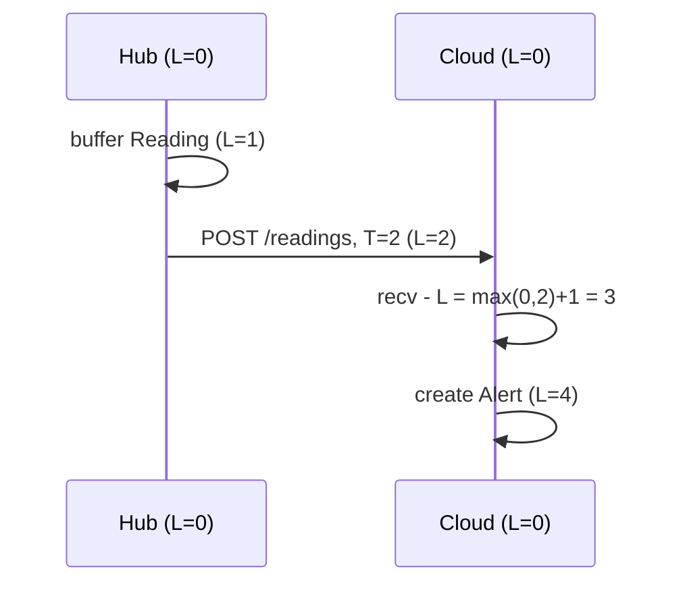
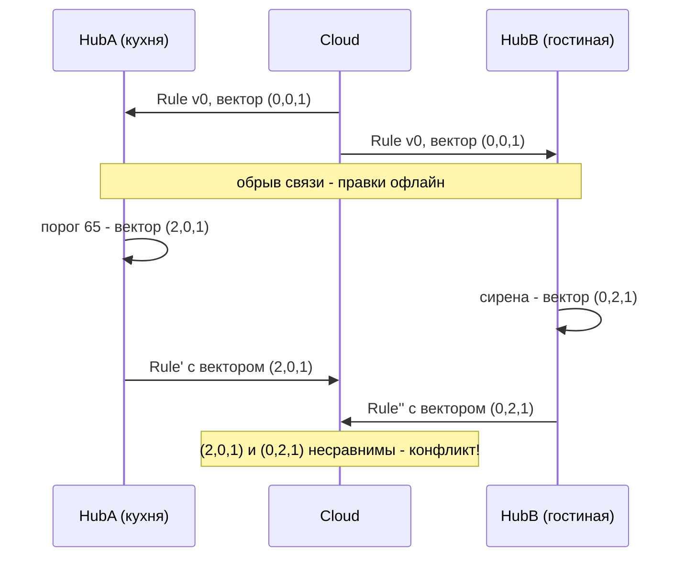

# Лекция 04. Время и порядок событий: физические и логические часы

> **Дисциплина:** Распределённые системы и облачные технологии (РСиОТ)
> **Занятие:** лекция 4 из 28 · **Время:** 1 пара (80 мин)
> **Зачем это:** в лекции 03 мы научились безопасно повторять запросы — и
> тем самым сломали порядок: повтор приезжает позже свежих данных, буфер
> Hub догоняет облако пачкой «старых» показаний, а часы каждого устройства
> врут по-своему. Сегодня разбираемся, почему в распределённой системе нет
> общего «сейчас» и чем инженеры заменяют время, когда нужен порядок.

---

## Крючок: секунда, которой не было в коде

> 🖥 **Слайд 2.** Крючок: leap second 2017 и Cloudflare

Полночь UTC, 1 января 2017 года. Пока мир открывает шампанское, земные
хронометристы добавляют к мировому времени **високосную секунду** (leap
second) — Земля вращается неровно, и атомные часы время от времени
приходится «притормаживать» под астрономию. И в эту самую секунду
DNS-серверы Cloudflare — компании, через которую ходит заметная часть
интернета, — начинают падать с паникой.

Виновник — одна строка в их DNS-сервере RRDNS, написанном на Go. Код
вычислял вес апстрим-серверов из разницы двух моментов времени и был
уверен: разница времён не бывает отрицательной — «время не идёт назад».
Но функция `time.Now()` тогда не гарантировала монотонность: во время
leap second разница ушла в минус, отрицательный вес — и panic. На пике
пострадали ~0,2 % DNS-запросов; фикс — **один символ**, раскатили через
90 минут. После этого инцидента в Go 1.9 в `time.Time` встроили
монотонную компоненту — язык поменяли из-за одной секунды.

Вопрос залу: **если даже «время идёт вперёд» — не аксиома, чему в часах
вообще можно верить?**

Держите ответ до конца пары. Спойлер: почти ничему — и сегодня мы
научимся жить и без этой веры.

*(Источник кейса: `sources/Веб-находки_Лекция_04.md` — постмортем
Cloudflare и материалы об отмене leap seconds; дата доступа 10.08.2026.)*

---

## Квиз-извлечение (по лекции 03)

> 🖥 **Слайд 3.** Вспоминаем взаимодействие

Ответьте не подглядывая; ответы — в конце лекции.

1. Таймаут истёк, ответа нет. Что мы знаем о судьбе запроса на сервере?
2. Экспоненциальный backoff уже есть. Зачем к нему ещё и джиттер?
3. Ключ идемпотентности: кто его генерирует и в какой момент?
4. Почему exactly-once **delivery** невозможна, а exactly-once
   **processing** — достижима? За счёт чего?

Если уверенно ответили на 3–4 — прошлая пара усвоена. Эти инструменты
сегодня понадобятся: именно повторы и буферизация ломают порядок событий.

---

## Результаты обучения

> 🖥 **Слайд 4.** Чему научимся

После этой пары вы сможете:

1. Объяснить, почему в распределённой системе нет общего «сейчас» и что
   такое дрейф и рассинхрон (clock skew) физических часов.
2. Выбирать правильный вид часов: time-of-day для меток «когда это было»,
   монотонные — для таймаутов и интервалов.
3. Показать на примере, как «последняя запись побеждает» (LWW) со
   сбитыми часами молча теряет данные.
4. Определять причинный порядок через happens-before и метки Лампорта.
5. Трассировать векторные часы и обнаруживать конкурентные изменения.
6. Объяснить на пальцах, как гибридные подходы (HLC, TrueTime) женят
   физическое время с логическим.

## Пререквизиты

- Лекция 01: частичные отказы, состояние «неизвестно», идемпотентность.
- Лекция 03: таймауты, ретраи с backoff и джиттером, ключ идемпотентности.
- Школьная математика: сравнение чисел и векторов покомпонентно.

---

## Картина мира: сто наручных часов и ни одного верного

> 🖥 **Слайд 5.** Дорожная карта пары

На одной машине время — это одна цифра из одного источника: спросил ядро —
получил ответ, и все части программы видят одно и то же «сейчас». В
распределённой системе у **каждого** узла свои часы: у датчика — дешёвый
кварц, у Hub — кварц получше, у сервера в облаке — синхронизация по сети.
Все они идут с разной скоростью, все врут по-разному, и вопрос «который
час?» имеет столько ответов, сколько узлов в системе.

Аналогия пары: жильцы одной квартиры, у каждого свои наручные часы, и все
показывают разное. Пока они просто живут — неважно. Но попробуйте
восстановить по их показаниям, **кто первым** пришёл на кухню, — и
начнётся спор, который не решить, глядя на циферблаты. Придётся смотреть
не на часы, а на **причинность**: «я пришёл, когда чайник уже кипел —
значит, после того, кто его включил».

Маршрут пары ровно такой же: сначала честно посмотрим, насколько врут
физические часы и как их синхронизируют → научимся не стрелять себе в ногу
(монотонные часы, LWW) → заменим время причинностью (happens-before, часы
Лампорта, векторные часы) → соберём гибриды (HLC, TrueTime) → применим всё
к «СмартДому». По дороге — голосование, один живой сеанс и два квиза.

---

## Основные понятия

**Определения** (пополним глоссарий в конце):

- **Дрейф (drift)** — постепенный уход часов от истинного темпа: кварцевый
  генератор спешит или отстаёт, обычно на десятки миллионных долей
  (секунды в день — уже плохой кварц).
- **Рассинхрон (clock skew)** — разница показаний двух часов в один и тот
  же физический момент.
- **Time-of-day часы** (настенные) — показывают «календарное» время; их
  можно перевести, в том числе назад.
- **Монотонные часы** — счётчик, который только растёт; показывает не
  «который час», а «сколько прошло»; переводу не поддаётся.
- **Конкурентные события** — события, между которыми нет причинной связи:
  ни одно не могло повлиять на другое.

---

## Ядро пары

### 1. Почему в РС нет общего «сейчас»

> 🖥 **Слайд 6.** Два часа врут по-разному

Начнём с физики. Часы компьютера — кварцевый кристалл, который дрожит
примерно 32 768 раз в секунду. «Примерно» — ключевое слово: темп зависит
от температуры, возраста кристалла и заводского разброса. Типичный дрейф —
десятки ppm (миллионных долей): 20 ppm — это почти **2 секунды в сутки**.
Дешёвый датчик «СмартДома», лежащий то на солнце, то у морозильника,
дрейфует ещё веселее.

Теперь добавим сеть. Даже если бы существовали идеальные эталонные часы,
узнать их показания можно только сообщением — а сообщение идёт
непредсказуемое время (лекция 01, заблуждение «задержка равна нулю»).
Пока ответ «сейчас 14:00:00.000» ехал к вам 30 миллисекунд — он уже
устарел, и вы не знаете, на сколько именно: вперёд его поправить можно
только гадая по половине RTT.

Отсюда два следствия, на которых стоит вся сегодняшняя пара:

- **Одновременность ненаблюдаема.** Вопрос «что происходило на двух узлах
  в один и тот же момент» в общем случае не имеет проверяемого ответа.
- **Сравнивать метки времени с разных узлов — гадание.** Разница может
  означать реальный порядок, а может — рассинхрон часов.

Контрпример, чтобы не перегнуть палку: внутри **одного** узла сравнение
показаний одних и тех же часов осмысленно. Проблемы начинаются на границе
между узлами — как всегда в этой дисциплине.

### 2. Синхронизация: NTP, PTP и время как сервис

> 🖥 **Слайды 7–8.** Лестница синхронизации → время умеет прыгать

С дрейфом борются синхронизацией — и тут есть целая лестница точности.

**NTP (Network Time Protocol)** — рабочая лошадка интернета. Клиент
обменивается с сервером парой сообщений, оценивает смещение своих часов с
поправкой на измеренный RTT и плавно подгоняет темп. Точность — единицы
миллисекунд в хорошей сети, десятки — в плохой. В Linux-мире стандарт
де-факто — демон chrony, который заметно лучше классического ntpd ведёт
себя в виртуалках и контейнерах (виртуальным машинам «замораживают» время
при миграциях — часы прыгают).

**PTP (Precision Time Protocol, IEEE 1588)** — для локальных сетей с
аппаратной поддержкой: метки времени проставляет сетевая карта, минуя
операционную систему. Точность — микросекунды и лучше. Так живут биржи
(регуляторы прямо требуют микросекундные метки сделок), телеком и ЦОД.

**Время как сервис облака.** Amazon Time Sync Service с 2023 года раздаёт
EC2-инстансам время **микросекундной точности** — GPS-приёмники плюс PTP
плюс аппаратные часы на серверах (в июне 2026 покрытие расширили ещё на
26 типов инстансов). А открытая библиотека ClockBound отдаёт приложению не
момент, а **интервал**: «истинное время сейчас где-то между E и L». Это
идея TrueTime из Google Spanner, о которой поговорим в конце пары:
честность вместо ложной точности.

И одна засада, о которой напоминает крючок: синхронизация не только
подкручивает темп, она умеет **ступенчато переводить** часы — в том числе
назад. NTP-step при большом расхождении, leap second, ручной перевод,
миграция виртуалки. Кстати, судьба leap seconds решена: в 2022 году
конференция мер и весов постановила прекратить их вставку **к 2035 году**
(лоббировали Meta, Amazon и Google — им надоело чинить интернет раз в
несколько лет). До тех пор крупные облака «размазывают» лишнюю секунду
(leap smearing): часы в окне смеринга идут чуть медленнее — но это значит,
что публичные NTP-серверы Google и Amazon в этот день **намеренно врут**
относительно UTC. Ещё один гвоздь в гроб идеи «метка времени — истина».

#### Пояснение к примеру

Проверьте состояние синхронизации на любой Linux-машине (в том числе
внутри контейнера с установленным chrony):

```bash
chronyc tracking
```

**Проверка:** в выводе смотрите `System time` (текущая оценка расхождения
с эталоном — обычно доли миллисекунды) и `Frequency` (насколько ваш кварц
врёт по темпу, в ppm). На Windows-хосте то же самое покажет
`w32tm /query /status` в PowerShell:

```powershell
w32tm /query /status
```

Типичные ошибки:

- Считать, что «NTP настроен» = «часы верны»: сразу после старта или после
  паузы VM оценка может гулять на секунды.
- Синхронизировать контейнеры «отдельно от хоста» — часы контейнера это
  часы ядра хоста; chrony внутри контейнера обычно не нужен и не имеет прав.
- Мерить skew между серверами по ping и «на глаз»: без NTP-статистики вы
  не знаете ни смещения, ни его знака.

### 3. Два вида часов: «который час» против «сколько прошло»

> 🖥 **Слайд 9.** Time-of-day против монотонных

Из-за скачков системного времени операционные системы дают **двое часов**,
и путать их — классическая ошибка, стоившая Cloudflare новогодней ночи.

- **Time-of-day** (настенные): `System.currentTimeMillis()`,
  `time.time()`, `Get-Date`. Показывают календарное время, синхронизируются
  NTP, **могут прыгнуть назад**. Годятся для меток «когда это случилось» —
  в логах, в `Reading.ts`.
- **Монотонные**: `time.monotonic()` в Python, `clock_gettime(CLOCK_MONOTONIC)`,
  `time.Now()` в Go начиная с 1.9 (та самая починка после leap second).
  Начало отсчёта произвольное — сравнивать между машинами бессмысленно,
  зато разница двух показаний **всегда честная**.

Правило простое, как ремень безопасности: **всё, что меряет длительность —
таймауты, backoff-паузы из лекции 03, метрики задержек, TTL кэша, — обязано
жить на монотонных часах.** Таймаут на time-of-day часах при NTP-step назад
может не истечь никогда; при скачке вперёд — истечь мгновенно и устроить
ложный шторм ретраев.

Мини-пример на «СмартДоме» — измеряем задержку отправки показания:

```python
import time

t0 = time.monotonic()          # НЕ time.time()!
response = send_reading(reading)   # POST /readings с ретраями
elapsed = time.monotonic() - t0
metrics.observe("reading_send_seconds", elapsed)
```

#### Пояснение к примеру (монотонные часы)

`time.monotonic()` не связан с календарём: если посреди отправки NTP
переведёт системное время на 2 секунды назад, `elapsed` всё равно выйдет
правильным. С `time.time()` мы бы записали в метрики отрицательную
задержку — и графана нарисовала бы «путешествие во времени».

**Проверка:** запустите в REPL `time.monotonic(); time.monotonic()` — второе
число больше первого всегда, что бы ни делали с системными часами.

Типичные ошибки:

- Таймаут «до дедлайна `time.time() + 5`» — ломается скачком часов.
- Логировать монотонное время в `Reading.ts` — метки несравнимы между
  узлами и бессмысленны после перезагрузки.
- Сравнивать монотонные показания двух разных машин.

### 4. Соблазн LWW: «последняя запись побеждает» — но какая из них последняя?

> 🖥 **Слайд 10.** LWW теряет данные молча

Теперь главный капкан. Пусть облако «СмартДома» хранит настройку
`target_temp` и разрешает конфликты по принципу **LWW — last write wins**:
у каждой записи метка времени, побеждает большая. Просто, быстро, без
координации — так по умолчанию работает, например, Cassandra.

Но «последняя» здесь означает не «последняя в реальности», а «с самой
большой меткой». Если часы писателя отстают, его свежая запись получает
метку **из прошлого** — и молча проигрывает записи, сделанной раньше.
Никакой ошибки, никакого предупреждения: LWW сравнивает числа, а не
восстанавливает историю. В Cassandra запись с меткой 1000 спокойно
перезапишется «более новой» с меткой 999 — знаменитый разбор aphyr «The
trouble with timestamps» построен ровно на этом.

Задержитесь на секунду на масштабе беды: конфликтующие записи обычно
прилетают в окне миллисекунд, а skew между узлами без хорошей
синхронизации — десятки миллисекунд и больше. То есть в зоне конфликта
LWW ошибается не «изредка», а **регулярно**. И это не баг Cassandra — это
цена дизайна: LWW честно покупает простоту, расплачиваясь потерянными
записями при сбитых часах.

#### Peer-instruction-вопрос

> 🖥 **Слайды 11–15.** Голосование PI → четыре разбора

Голосуем, обсуждаем с соседом 90 секунд, голосуем снова.

> Жилец ставит с телефона `target_temp = 22` (часы телефона точны,
> метка 14:00:00). Через пять секунд он подходит к настенной панели и
> ставит `25` — но часы панели отстают на 2 минуты, метка 13:58:05.
> Облако разрешает конфликты LWW по метке устройства. Какая температура
> останется в системе?
>
> A. 25 — панель нажали позже, LWW сохранит последнее реальное действие.
> B. 22 — метка панели «из прошлого», её запись молча проиграет.
> C. 25 — облако увидит, что метка панели меньше уже сохранённой, поймёт,
> что часы сбиты, и подставит своё время.
> D. Обе версии сохранятся: облако обнаружит конфликт и спросит жильца.
>
> Бонус-вопрос на подумать: что **увидит жилец**, стоя у панели?

Разбор — в конце лекции. Подсказка: один вариант верит, что метка отражает
реальный порядок; один — что сервер телепат; один путает LWW с системами,
которые умеют обнаруживать конфликты (до них мы дойдём через полчаса).

---

> 🖥 **Слайд 16.** Пауза (60 секунд, граница блоков)

Выдыхаем. Дальше — вторая половина пары: перестаём чинить часы и меняем
сам вопрос.

---

### 5. Happens-before: порядок без часов

> 🖥 **Слайд 17.** Причинность вместо циферблата

Первая половина пары закончилась выводом «физическим часам нельзя доверить
порядок». Лесли Лэмпорт в статье 1978 года — одной из самых цитируемых в
информатике — предложил ход, который сделал его классиком: **выбросить
время из вопроса**. Не «что случилось раньше по часам», а «что могло
повлиять на что». Это отношение назвали **happens-before** и обозначают
стрелкой: A → B.

Правил всего три:

1. Если A и B — события **одного процесса** и A случилось до B в его
   программе, то A → B.
2. Если A — **отправка** сообщения, а B — **получение** этого же
   сообщения, то A → B (получить нельзя раньше, чем отправили).
3. **Транзитивность:** если A → B и B → C, то A → C.

Всё, что не связано этими правилами ни в одну сторону, — **конкурентно**
(обозначают A ∥ B): ни одно событие не могло знать о другом, и никакого
«истинного» порядка между ними не существует — не «мы его не знаем», а его
**нет**. Любое упорядочение конкурентных событий — произвол.

Прочувствуйте, насколько это отношение честнее часов: happens-before
строится только из наблюдаемых фактов — порядка команд в программе и
фактов доставки сообщений. Ни одного циферблата. На «СмартДоме»: событие
«датчик увидел дым» → «Hub отправил Reading» → «облако создало Alert» —
цепочка причинности через сообщения. А вот «датчик кухни увидел дым» и
«датчик спальни намерил 19°» — конкурентны: между ними нет ни общего
процесса, ни сообщений, и спорить об их «настоящем порядке» бессмысленно.

Зачем это на практике: дальше мы построим две механики — часы Лампорта и
векторные часы, — которые **вычисляют** happens-before, и на нём держатся
трассировка запросов, обнаружение конфликтов реплик и согласованные
снапшоты (встретим в лекциях о репликации).

### 6. Часы Лампорта: счётчик, который путешествует с сообщениями

> 🖥 **Слайды 18–19.** Правила Лампорта → что метка не говорит

Happens-before — отношение; теперь нужен дешёвый способ его «оцифровать».
Часы Лампорта — это один целочисленный счётчик `L` на каждом процессе и
три правила:

1. Локальное событие: `L := L + 1`.
2. Отправка сообщения: `L := L + 1`, и метка `T = L` едет внутри сообщения.
3. Получение сообщения с меткой `T`: `L := max(L, T) + 1`.

Вся хитрость — в третьем правиле: счётчик получателя **перепрыгивает**
метку отправителя. Знание «у отправителя уже было T» приезжает вместе с
сообщением и подтягивает отстающего. Проследим на «СмартДоме»:



Гарантия часов Лампорта: **если A → B, то L(A) < L(B)**. Причинная цепочка
всегда идёт по возрастанию меток — поэтому по меткам можно отсортировать
лог событий со всех узлов так, что причины никогда не окажутся после
следствий. Нужен полный порядок без дырок (например, чтобы все реплики
применяли операции одинаково) — сортируют пары `(L, id_узла)`:
лексикографически, метка равна — решает идентификатор.

Теперь ложка дёгтя, и она важная: **обратное неверно**. Из L(A) < L(B) не
следует A → B: конкурентные события тоже получают какие-то метки, и одна
из них окажется меньше просто по стечению обстоятельств. Часы Лампорта —
односторонний детектор: они умеют **не нарушать** причинность, но не умеют
**отличать** причинную связь от конкурентности. Датчик кухни с меткой 7 и
датчик спальни с меткой 12 — вы не знаете, связаны они или просто жили
своей жизнью.

А для «СмартДома» вопрос «связаны или конкурентны» — центральный: две
правки одного Rule с разных устройств — это конфликт или последовательное
редактирование? Ответ даёт следующая конструкция.

### 7. Векторные часы: видим конкурентность

> 🖥 **Слайд 20.** Вектор — счётчик на каждого участника

Идея векторных часов: вместо одного счётчика каждый из N участников ведёт
**вектор из N счётчиков** — «сколько событий каждого из нас я видел».
Процесс `i` хранит вектор `V`, и правила почти те же:

1. Локальное событие: `V[i] := V[i] + 1` (своя компонента).
2. Отправка: как локальное событие, вектор целиком едет с сообщением.
3. Получение вектора `W`: `V[k] := max(V[k], W[k])` для всех `k`, затем
   `V[i] := V[i] + 1`.

Сравнение — покомпонентное, и вот ради него всё затевалось:

- `V ≤ W` (каждая компонента не больше) и `V ≠ W` → событие с `V`
  **причинно предшествует** событию с `W`.
- Ни `V ≤ W`, ни `W ≤ V` → события **конкурентны** — и это видно из самих
  меток, без дополнительной информации.

Векторные часы — двусторонний детектор: `V(A) < V(B)` **тогда и только
тогда**, когда A → B. Ровно то, чего не хватало Лампорту. Цена — размер:
метка растёт как O(N) по числу участников, и в системе на тысячи узлов
вектор в каждом сообщении становится дорогим (лечат разрежёнными
представлениями и гибридами, но это уже за рамками пары).

#### Живой сеанс: конкурентная правка Rule на глазах у группы

> 🖥 **Слайд 21.** Живой сеанс: трассировка векторов

Строим вместе, по шагам (7–10 минут; ход мысли важнее результата).
Участники: облако Cloud и два шлюза HubA (кухня) и HubB (гостиная) —
вектор из трёх компонент `(A, B, C)`. Сценарий: правило
`Rule: температура > 60 → Alert` синхронизировано на всех; квартира
теряет интернет; **оба** Hub'а локально правят правило; связь
возвращается. Вопрос модели: **как облако поймёт, что правки
конфликтуют, а не идут одна за другой?**

Шаг 1 — раздача правила (следим за каждой меткой):

- Cloud создаёт Rule: событие Cloud → `(0,0,1)`; рассылает обоим.
- HubA получает: `max((0,0,0),(0,0,1))`, плюс своё событие приёма →
  `(1,0,1)`.
- HubB получает: аналогично → `(0,1,1)`.

Шаг 2 — обрыв связи, локальные правки:

- HubA меняет порог 60 → 65: локальное событие → `(2,0,1)`.
- HubB меняет действие «push» → «push + сирена»: локальное событие →
  `(0,2,1)`.

Шаг 3 — связь вернулась, оба шлют свои версии Rule с векторами:



Шаг 4 — облако сравнивает `(2,0,1)` и `(0,2,1)` покомпонентно: в первой
компоненте больше вектор HubA, во второй — HubB. Ни один не «меньше или
равен» другому → **правки конкурентны**. Сравните с LWW из первой
половины пары: тот бы молча выбрал победителя по врущим часам и потерял
либо новый порог, либо сирену. Векторные часы конфликт **видят**.

Шаг 5 — а что с ним делать? Векторы отвечают только «конкурентно или
нет»; выбор — отдельное решение и отдельная честность дизайна:

- слить автоматически, если правки о разном (наш случай: порог + действие
  — сливаются в `Rule: порог 65, push + сирена`; после слияния вектор
  облака — `max` обоих плюс своё событие: `(2,2,2)`);
- спросить пользователя (так Git оставляет конфликт вам);
- структуры, сливающиеся всегда (CRDT — упомянем в лекции о репликации).

Заметьте, чего в сеансе **нет**: ни одной метки физического времени. Часы
всех трёх участников могли врать на минуты в любую сторону — результат не
изменился бы ни на бит.

### 8. Гибриды: HLC и TrueTime — женим физику с логикой

> 🖥 **Слайд 22.** Обзорно: HLC и TrueTime

Логические часы решают порядок, но у них нет ответа на бытовой вопрос «а
когда это было по-человечески?» — метка 42 в отчёт для жильца не годится.
Инженеры скрестили подходы; два представителя, оба — обзорно, без
подробностей.

**HLC (hybrid logical clock)** — метка из пары «физическое время +
логический счётчик»: выглядит как обычный timestamp (можно показать
человеку, можно сравнивать), но правило `max(...)+1` из часов Лампорта
гарантирует, что причинная цепочка никогда не пойдёт по убыванию меток,
даже если чьи-то физические часы отстали. Используются в CockroachDB,
MongoDB, YugabyteDB.

**TrueTime (Google Spanner)** — противоположная философия: не чинить
метки, а **честно признать погрешность**. API возвращает не момент, а
интервал `[earliest, latest]` — «истина где-то здесь». Хотите строгий
порядок транзакций по времени? Тогда после записи **подождите**, пока
`latest` вашей метки останется в прошлом (commit wait) — и никто уже не
получит метку меньше вашей. Google вложился в GPS-приёмники и атомные
часы в каждом ЦОД, чтобы интервал был миллисекундным и ожидание —
незаметным. Та же идея в AWS: Time Sync Service с микросекундной
точностью + библиотека ClockBound, отдающая интервал ошибки.

Мораль лестницы: **порядок из времени можно купить** — но валютой служит
либо ожидание (commit wait), либо железо (GPS/атомные часы), либо и то и
другое. Для «СмартДома» это оверкилл; а вот знать, что так бывает, нужно —
в лекции 05 Spanner вернётся как пример строгой консистентности.

### 9. Возвращаемся в «СмартДом»: буфер догнал — чьё время верить?

> 🖥 **Слайд 23.** Порядок Reading после обрыва

Соберём пару в практику. Квартира была офлайн 40 минут, Hub честно
буферизовал показания (лекция 01) и после восстановления связи отправил
пачку с ретраями и ключами идемпотентности (лекция 03). Облако получает
вперемешку: свежие Reading от других квартир и «догоняющие» сорокаминутной
давности. Вопросы порядка посыпались:

**Чьё время писать в Reading?** У события два времени, и оба нужны:

- **event time** — когда датчик измерил (метка Hub/датчика): по нему
  строится график истории температуры; врёт вместе с часами Hub'а, зато
  сохраняет форму процесса;
- **ingest time** — когда облако приняло (метка облака): монотонно растёт
  в рамках облака, честно для биллинга и отладки «когда мы это узнали»,
  но график по нему после обрыва — 40 минут тишины и вертикальная стена.

Правильный ответ инженера: **хранить оба и не путать их роли.** График —
по event time; «сколько данных пришло за час» — по ingest time; а
сравнивать event time двух разных квартир с точностью до секунд — уже
знакомое вам гадание.

**Дедупликация тревог.** Правило «> 60° → Alert» на догоняющей пачке
может сработать по показанию, по которому Alert уже создавался до обрыва
(Hub повторил неподтверждённую отправку). Дубль давится не сравнением
времени («похоже на недавнюю — наверное, та же»), а **ключом
идемпотентности** показания — детерминированно, как в лекции 03. Время —
плохой ключ дедупликации: два честных одинаковых показания в одну секунду
и одно повторенное — неразличимы по меткам.

**Порядок тревог жильцу.** «Дым на кухне» и «открыто окно в гостиной» от
разных Hub'ов: сортировать по event time — врать при skew; правильная
рамка — happens-before: если тревоги причинно не связаны, они конкурентны,
и приложение честно показывает их как независимые события, а не
выстраивает ложную хронологию с точностью до миллисекунд.

И финальный аккорд пары, свяжем с крючком: Cloudflare упал, потому что
код верил часам в мелочи — в том, что разница времён неотрицательна.
Проектируйте так, будто часы врут всегда: для длительностей — монотонные
часы, для порядка между узлами — причинность, для календаря — time-of-day
с честной оговоркой о погрешности.

---

## Типичные ошибки (запомните до того, как совершите)

> 🖥 **Слайд 24.** Типичные ошибки

1. **«Отсортирую события по timestamp — вот и порядок».** Между узлами
   метка отражает часы писателя, а не реальность: LWW при сбитых часах
   молча теряет свежие записи (PI-вопрос этой пары).
2. **«Таймаут посчитаю по системному времени».** NTP-step назад — и
   таймаут не истекает; вперёд — истекает мгновенно. Длительности — только
   монотонными часами.
3. **«L(A) < L(B) — значит A причина B».** Часы Лампорта гарантируют
   только прямое направление: A → B ⇒ L(A) < L(B). Обратный вывод —
   ошибка; конкурентность различают векторные часы.
4. **«Векторные часы скажут, какая версия правильная».** Они говорят
   «конкурентно» — а выбор победителя (слияние, вопрос пользователю,
   CRDT) остаётся решением дизайна.
5. **«Дедуплицирую по времени: одинаковая метка — значит дубль».** Два
   честных одинаковых показания и один повтор неразличимы по меткам;
   дубли давят ключом идемпотентности.

---

## Квиз-закрепление (по этой паре)

> 🖥 **Слайд 25.** Закрепление

Ответьте не подглядывая; ответы — в конце лекции.

1. Почему запись с **меньшей** меткой времени может быть на самом деле
   более поздней? Что из-за этого делает LWW?
2. Какими часами измерять паузу backoff между ретраями и почему не
   time-of-day?
3. Метки Лампорта двух событий: 7 и 12. Какие выводы сделать можно, а
   какие — нельзя?
4. Векторы двух правок Rule: `(2,0,1)` и `(0,2,1)`. Что это означает и
   какие у облака варианты действий?

---

## Вопросы для самопроверки

1. Что такое дрейф и что такое clock skew? Почему synchronization по NTP
   не сводит skew к нулю?
2. Чем PTP точнее NTP — за счёт чего именно?
3. Что такое leap second, почему её «размазывают» и что решили с ней
   делать к 2035 году?
4. В каких случаях системное время машины прыгает назад? Назовите три.
5. Сформулируйте три правила happens-before. Почему это отношение —
   частичный, а не полный порядок?
6. Что значит «события конкурентны»? Приведите пример конкурентных
   событий в «СмартДоме».
7. Запишите три правила часов Лампорта. Зачем в правиле приёма `max`?
8. Как из меток Лампорта получить полный порядок событий? Зачем в паре
   `(L, id_узла)` второй элемент?
9. Чем векторные часы отличаются от часов Лампорта по гарантиям и по
   цене?
10. Покажите на векторах длины 2, как выглядит причинная связь и как —
    конкурентность.
11. Почему LWW теряет данные при рассинхроне часов? При каком условии LWW
    — осознанно приемлемый выбор?
12. Что такое event time и ingest time? Для какой задачи каждое из них —
    правильный выбор?
13. Как устроена метка HLC и какую проблему она решает?
14. Что возвращает TrueTime вместо момента времени и зачем Spanner ждёт
    (commit wait) перед завершением транзакции?
15. Почему дедупликация тревог по меткам времени — плохая идея и что
    использовать вместо неё?

---

## Мост: к лекции 05 и назад к лабам

> 🖥 **Слайд 26.** Мост

**Вперёд.** Сегодня мы научились *обнаруживать* конфликт (векторы
несравнимы) — но не ответили, что системе *обещать пользователю*, пока
реплики расходятся и сливаются. Это тема лекции 05: консистентность,
CAP/PACELC и спектр моделей от строгой до итоговой. TrueTime вернётся там
как цена самой строгой гарантии.

**Назад к лабам.** В лабе 1 ваш сервис принимает `POST /readings` с полем
`ts` — теперь вы знаете, что это event time от Hub'а, что верить ему
между узлами нельзя и что ingest time стоит хранить рядом. В лабе 2
(взаимодействие) таймауты и backoff-паузы обязаны считаться по монотонным
часам — проверьте, каким API пользуется ваш HTTP-клиент. А в лабе 4
(очереди и стриминг) event time против processing time станет главной
головной болью — сегодняшний раздел 9 будет вашей шпаргалкой.

**Задание на 1 предложение** (письменно, в конспект): закончите фразу
«Различать физический и логический порядок событий пригодится лично мне,
потому что…» — конкретно, про свои проекты. На следующей паре спрошу
троих добровольцев.

---

## Глоссарий

> 🖥 **Слайд 27 (финал).** Вопросы + литература

| Термин | Определение |
| --- | --- |
| Дрейф (drift) | Постепенный уход темпа часов от истинного (ppm) |
| Clock skew | Разница показаний двух часов в один физический момент |
| NTP / PTP | Синхронизация времени: миллисекунды через интернет / микросекунды в LAN с аппаратной поддержкой |
| Leap second | Добавочная секунда UTC; «размазывается» облаками, отменяется к 2035 |
| Time-of-day часы | Календарное время; может прыгать, в т.ч. назад |
| Монотонные часы | Только растущий счётчик для измерения длительностей |
| LWW | Last write wins: побеждает большая метка — и молча теряет данные при skew |
| Happens-before (→) | Частичный порядок «могло повлиять»: программа, сообщения, транзитивность |
| Конкурентные события (∥) | Нет причинной связи ни в одну сторону; порядка между ними не существует |
| Часы Лампорта | Счётчик с правилом `max(L,T)+1`; A → B ⇒ L(A) < L(B), обратное неверно |
| Векторные часы | Вектор счётчиков по участникам; несравнимость векторов = конкурентность |
| HLC | Гибридная метка «физическое время + счётчик»; порядок Лампорта в человеческом формате |
| TrueTime | API Spanner: интервал [earliest, latest] вместо момента; commit wait |
| Event time / ingest time | Когда измерено датчиком / когда принято облаком |

## Список литературы

1. Основная литература
   - [1] Клеппман М. — «Высоконагруженные приложения» (Designing
     Data-Intensive Applications). O'Reilly / Питер. Глава 8 «Проблемы
     распределённых систем» (ненадёжные часы, порядок событий).
2. Дополнительная литература
   - [2] Lamport L. — «Time, Clocks, and the Ordering of Events in a
     Distributed System». Communications of the ACM, 1978.
3. Интернет-ресурсы
   - [3] Постмортем Cloudflare о leap second 2017, материалы об отмене
     leap seconds, Amazon Time Sync / ClockBound, разборы LWW — подборка
     с URL в `sources/Веб-находки_Лекция_04.md` (дата обращения:
     10.08.2026).

---

## Ответы

### Ответы: квиз-извлечение

1. Ничего: запрос мог не дойти, сервер мог упасть до/после обработки,
   ответ мог потеряться. Таймаут — не ответ «нет», а отсутствие ответа
   (состояние «неизвестно» из лекции 01).
2. Без джиттера тысячи клиентов, потерявших сервис одновременно,
   повторяют в одни и те же моменты — волны-штормы по расписанию
   экспоненты. Случайный сдвиг размазывает повторы во времени.
3. Клиент, **до первой попытки** — иначе при потере ответа ключ был бы
   потерян вместе с ним, и повтор нечем пометить.
4. Сеть может потерять или задублировать любое сообщение — гарантировать
   «доставлено ровно один раз» невозможно. Достижимо exactly-once
   processing: доставка «хотя бы раз» + дедупликация по ключу
   идемпотентности на приёмнике.

### Ответы: peer instruction

Правильный ответ — **B**: останется 22. LWW сравнивает метки: 14:00:00 у
телефона больше, чем 13:58:05 у панели, — запись панели «из прошлого»
молча проигрывает, хотя в реальности была последней. Бонус: жилец у
панели увидит на её экране 25 (локальное состояние), а система будет
греть до 22 — расхождение без единого сообщения об ошибке.

- A — заблуждение «метка = реальный порядок». LWW не знает, что панель
  нажали позже: он видит только числа, а числа сделаны врущими часами.
- C — вера в телепатию сервера. LWW — это одно сравнение чисел; замена
  метки устройства временем сервера — другой дизайн (ingest time) со
  своими минусами: порядок нажатий жильца он тоже не восстанавливает,
  а лишь фиксирует порядок доставки.
- D — так ведут себя системы с обнаружением конфликтов (векторные часы,
  до них дошли во второй половине пары). LWW конфликтов не видит в
  принципе — в этом весь его смысл и вся его цена.

### Ответы: квиз-закрепление

1. Метку ставят часы писателя, а они могут отставать: реальное «позже»
   получает метку «раньше». LWW выберет большую метку и молча отбросит
   более позднюю запись — потеря данных без ошибки.
2. Монотонными: пауза — это длительность. Time-of-day может прыгнуть
   (NTP-step, leap second, миграция VM) — пауза станет нулевой или
   бесконечной.
3. Можно: B (метка 12) **не** happens-before A (метка 7) — причинная
   связь в эту сторону исключена. Нельзя: утверждать, что A → B — события
   могут быть конкурентными; метки Лампорта конкурентность не различают.
4. Векторы несравнимы покомпонентно → правки конкурентны (сделаны
   независимо во время обрыва). Варианты: автоматическое слияние, если
   изменены разные поля; отдать конфликт человеку; хранить обе версии;
   CRDT. Молча выбрать одну по timestamp — потерять чужую правку.
