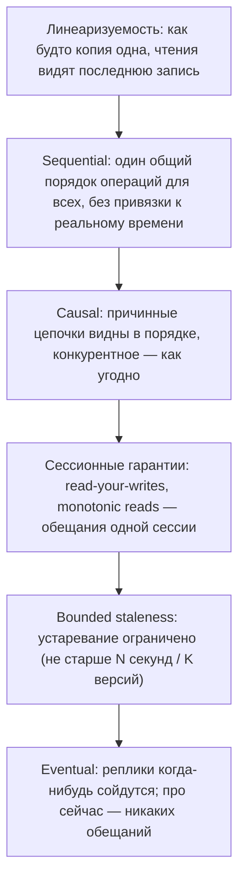
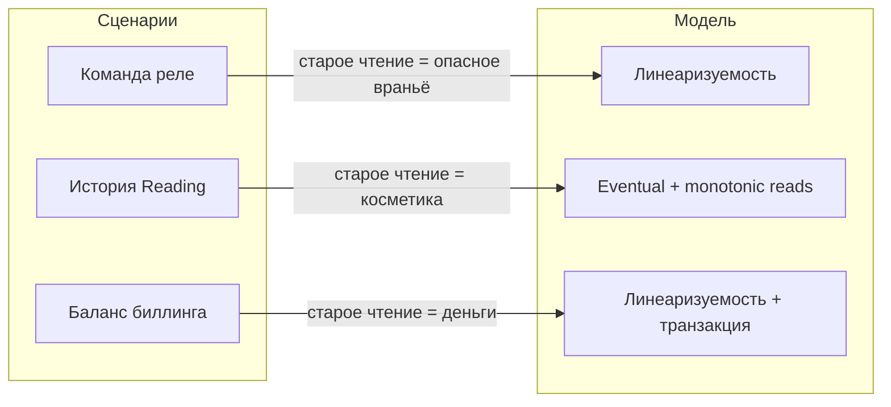

# Лекция 05. Консистентность: CAP, PACELC и спектр моделей

> **Дисциплина:** Распределённые системы и облачные технологии (РСиОТ)
> **Занятие:** лекция 5 из 28 · **Время:** 1 пара (80 мин)
> **Зачем это:** прошлая пара показала, что реплики расходятся и порядок
> событий — вещь непростая. Сегодня — главный вопрос: **что система обещает
> клиенту, пока реплики расходятся?** Ответ называется моделью
> консистентности, и выбирать её придётся вам — молча за вас её выберет
> архитектура. Старый конспект 2025 года сохранён в `archive_2025/`.

---

## Крючок: «страница настроек не сохраняет» — а она сохраняла

> 🖥 **Слайд 2.** Крючок: реплика отстала на 200 мс

Июнь 2026 года, обычный продуктовый баг-трекер. Тикет: **«страница
настроек не сохраняет изменения»**. Пользователь меняет значение, жмёт
«Сохранить», страница перезагружается — а на экране старое значение. Он
жмёт ещё раз. И ещё. Заводит тикет.

Инженеры лезут в базу — запись **на месте**. Сохранялось всё и всегда.
Расследование показывает: запись ушла на главный сервер БД (primary —
узел, принимающий все записи), а следующее за ней чтение — на
read-реплику (копию базы, обслуживающую только чтения), которая
отставала на каких-то **200 миллисекунд**. Реплика честно вернула состояние *до*
записи. Пользователь увидел старые данные, решил, что сохранение не
работает, — и его доверие к продукту уехало вместе с тикетом.

Самое неприятное: **ни один график не покраснел**. Задержки в норме, лаг
реплики ниже порога алертов, ошибок ноль. Система работала ровно так, как
её спроектировали. Просто никто в команде не задал вопрос: «а что значит
"достаточно свежие данные" для сценария *записал → сразу читаю*?»

Вопрос залу: **это баг? Если да — в каком месте: в базе, в коде, в
голове?**

Держите ответ до конца пары. Спойлер: у гарантии, которой здесь не
хватило, есть имя, ей посвящён целый раздел сегодня — и стоит она сильно
дешевле, чем «сделайте всё строго согласованным».

*(Источник кейса: `sources/Веб-находки_Лекция_05.md` — разбор инцидента с
read-репликой и предупреждение инженеров incident.io; дата доступа
10.08.2026.)*

---

## Квиз-извлечение (по лекции 04)

> 🖥 **Слайд 3.** Вспоминаем время и порядок

Ответьте не подглядывая; ответы — в конце лекции.

1. События A и B конкурентны (A ∥ B). Почему «отсортировать их по
   меткам времени» — не решение, а самообман?
2. Часы Лампорта дали L(A) = 7 и L(B) = 12. Что отсюда можно заключить
   о причинной связи A и B — и чего нельзя?
3. Векторные часы двух правок — (2,0,1) и (0,2,1). Что это означает и
   что системе с этим делать?
4. Почему LWW может молча потерять более позднюю (по реальным часам
   жильца) правку?

Если три-четыре ответа дались легко — прошлая пара усвоена, и сегодняшняя
ляжет на подготовленную почву: мы будем решать, **что обещать клиенту**,
когда реплики разошлись, а LWW-подобные фокусы нас не устраивают.

---

## Результаты обучения

> 🖥 **Слайд 4.** Чему научимся

После этой пары вы сможете:

1. Различать консистентность реплик и «C» из ACID — и объяснить, почему
   это разные вещи с одним именем.
2. Формулировать CAP-теорему честно: почему P — не выбор, а выбор
   C-vs-A существует только во время разрыва сети.
3. Объяснить, почему ярлыки «CP-система» и «AP-система» вредны
   (критика Клеппмана и уточнения самого Брюэра).
4. Применять PACELC: видеть компромисс «задержка против
   согласованности» даже в идеально работающей сети.
5. Ориентироваться в спектре моделей: линеаризуемость, sequential,
   causal, сессионные гарантии, bounded staleness, eventual.
6. Подбирать **самую слабую достаточную** модель под конкретный сценарий
   «СмартДома» — и говорить, чем платим за каждую ступень строгости.

## Пререквизиты

- Лекция 01: частичные отказы, разделение сети (partition), SLI/SLO, p99.
- Лекция 03: таймауты, ретраи, идемпотентность.
- Лекция 04: happens-before, конкурентность, LWW, векторные часы.

---

## Картина мира: меню обещаний

> 🖥 **Слайд 5.** Дорожная карта пары

Как только данные живут в нескольких копиях (а они живут: реплики — цена
отказоустойчивости из лекции 01), у системы появляется неприятная
обязанность — **отвечать на чтения, пока копии не совпадают**. Вопрос
«что вернуть клиенту?» — это не техническая мелочь, а контракт.

Аналогия пары — **меню обещаний**. Внизу меню дешёвые блюда: «вернём
что-нибудь, когда-нибудь сойдётся» (eventual). Наверху дорогие: «система
ведёт себя как один-единственный узел, любые чтения видят последнюю
запись» (линеаризуемость). Платим не деньгами, а **миллисекундами
задержки и минутами недоступности**. Инженерия консистентности — это
умение заказывать из меню не «самое дорогое на всякий случай», а ровно
то, что нужно сценарию: антипаттерн курса № 6 — координация там, где
хватило бы итоговой согласованности.

Вторая аналогия — на весь семестр: **групповой чат**. Сообщение в чате
видно вам мгновенно (read-your-writes), собеседникам — с задержкой,
порядок реплик у разных участников может отличаться, но ответ никогда не
приходит раньше вопроса (причинность). Чат — это спектр моделей у вас в
кармане.

Маршрут пары: два смысла слова «консистентность» → CAP честно → критика
CAP → PACELC → спектр моделей → сессионные гарантии на «СмартДоме» →
что они стоят → как выбирать. По дороге — квизы, одно голосование и один
живой сеанс.

---

## Основные понятия

**Определения** (пополним глоссарий в конце):

- **Реплика** — копия одних и тех же данных на другом узле. Зачем:
  отказоустойчивость, близость к пользователю, масштабирование чтений.
- **Модель консистентности** — контракт между хранилищем и клиентом:
  какие значения имеют право возвращать чтения при наличии реплик и
  конкурентных записей.
- **Линеаризуемость** — сильнейшая модель для одиночных операций:
  система ведёт себя так, будто копия одна, и каждая операция происходит
  атомарно в некоторый момент между её началом и концом.
- **Итоговая согласованность (eventual consistency)** — слабое обещание:
  если записи прекратятся, все реплики *когда-нибудь* сойдутся к одному
  значению. О том, что видит клиент «сейчас», — ни слова.
- **Разделение сети (partition)** — модель отказа из лекции 01: обе
  части системы живы, но не видят друг друга.

---

## Ядро пары

### 1. Слово «консистентность» продано дважды

> 🖥 **Слайд 6.** Два смысла C

Первая ловушка темы — терминологическая. Буква C встречается в двух
знаменитых аббревиатурах и означает **разные вещи**:

- **C из ACID** (базы данных, лекция 11) — *инварианты приложения*:
  «сумма проводок равна нулю», «внешний ключ указывает на существующую
  строку». Это свойство **транзакции**: она переводит базу из одного
  корректного состояния в другое. За соблюдение инвариантов отвечает в
  основном прикладной код.
- **C из CAP** (наша тема) — *согласованность реплик*: насколько копии
  одних и тех же данных на разных узлах ведут себя как одна копия. Это
  свойство **распределённого хранилища**, и приложение его не починит —
  только выберет.

Контрпример для самопроверки: база на **одном** узле без единой реплики
может быть сколь угодно ACID-консистентной — а консистентность реплик к
ней вообще неприменима, реплик нет. И наоборот: линеаризуемое KV-хранилище
радостно позволит вам нарушить бизнес-инвариант «баланс неотрицателен» —
инварианты не его забота.

Сегодня мы всюду говорим про второй смысл: **согласованность реплик**.

### 2. CAP честно: теорема об одном выборе в плохой день

> 🖥 **Слайд 7.** CAP без «выбери 2 из 3»

Популярный пересказ CAP звучит как меню: «Consistency, Availability,
Partition tolerance — выберите любые два». Этот пересказ **неверен**, и
разгребать его последствия придётся почти на каждом собеседовании.

Что утверждает теорема (Брюэр — гипотеза 2000; Гилберт и Линч —
доказательство 2002), если читать определения внимательно:

- **C** — линеаризуемость: реплики ведут себя как единственная копия;
- **A** — доступность: каждый запрос к любой неотказавшей реплике
  получает содержательный ответ (не ошибку «приходите позже»);
- **P** — устойчивость к разделению сети: система продолжает работать,
  когда сообщения между узлами теряются.

Ключевое: **P — не пункт меню**. Разрыв сети — не опция, которую вы
покупаете или нет, а свойство реальности (заблуждение № 1 из лекции 01:
«сеть надёжна»). Wi-Fi в квартире моргает, магистраль между регионами
режет экскаватор. Отказаться от P нельзя — можно только притвориться,
что сети не бывает, и получить систему, которая в первый же разрыв ведёт
себя непредсказуемо.

Поэтому честная формулировка такая: **пока сеть разорвана, система
вынуждена выбирать между C и A**. Реплика получила запрос на чтение, а
связи с остальными нет. Вариантов два:

- ответить тем, что есть локально, — рискуя отдать устаревшее
  (пожертвовали C, сохранили A);
- отказать или молчать, пока связь не вернётся, — сохранив
  согласованность ценой доступности (пожертвовали A, сохранили C).

Третьего не дано: ответить *и* свежо, *и* немедленно нельзя — свежесть
физически лежит по ту сторону разрыва. Вот и вся теорема. Заметьте, чего
в ней **нет**: ни слова про задержки, ни слова про отказ узлов (это
другая беда), ни слова про то, что происходит в системе в обычный день,
когда сеть цела. Теорема — про один вынужденный выбор в плохой день.

**Пояснение к примеру.** «СмартДом»: квартира потеряла интернет, у Hub
есть локальная копия правил (`Rule`). Жилец с телефона внутри квартиры
меняет порог тревоги. Принять правку локально и применить её (A — дом
продолжает работать, но облако и квартира разошлись)? Или отказать:
«нет связи с облаком, правка невозможна» (C — копии не разойдутся, но
дом «оглох» для настройки)? Hub принимает правку — и ровно поэтому в
лекции 04 нам понадобились векторные часы для обнаружения конфликтов.

**Проверка.** Задайте себе вопрос: «может ли моя система *отказаться* от
P?» Если ваш ответ «да» — вы проектируете систему для мира, где сеть не
рвётся, то есть для мира, которого нет.

**Типичные ошибки.**

1. «Мы выбрали C и A, партиции нас не касаются» — P не выбирают.
2. «CAP запрещает быструю и согласованную систему» — про скорость
   теорема молчит вообще (это к PACELC).
3. Путать разрыв сети с отказом узла: при отказе узла выбора C-vs-A
   может и не быть — остальные видят друг друга.

### 3. Критика CAP: почему ярлыки «CP» и «AP» вредны

> 🖥 **Слайд 8.** Ярлыки на всю БД — бессмыслица

Раз теорема — про узкий выбор в плохой день, то фраза «MongoDB — это
CP-система, а Cassandra — AP» звучит солидно, но несёт примерно ноль
информации. Мартин Клеппман в известном эссе «Please stop calling
databases CP or AP» (2015) предлагает вообще изъять эти ярлыки из
употребления. Аргументы стоит знать поимённо:

- **Определения CAP очень узкие.** C — именно линеаризуемость (не
  «какая-то согласованность»), A — именно «любая неотказавшая реплика
  отвечает». Теорема доказана для **одного регистра** — одной ячейки
  данных. Транзакции, несколько ключей, задержки — всё это за бортом.
- **Многие системы под эти определения — ни CP, ни AP.** Классическая
  БД с одним лидером (лидер — узел, принимающий все записи; его копии —
  фолловеры; устройство разберём в лекции 06) и асинхронной репликацией:
  фолловеры отстают от лидера, значит чтения с них не линеаризуемы —
  C нет. Клиент, отрезанный
  разрывом от лидера, не может писать — той самой CAP-доступности тоже
  нет. И это — самая распространённая конфигурация в индустрии!
- **Гарантии живут на уровне операций, а не системы.** Одна и та же БД
  даёт разные обещания разным запросам: чтение с лидера — одно, с
  реплики — другое, с флагом «строго» — третье. Вешать один ярлык на всю
  систему — как присваивать ресторану одну оценку сразу за кухню,
  парковку и туалет.

Сам Эрик Брюэр в юбилейной статье «CAP Twelve Years Later» (2012)
говорит почти то же: формула «2 из 3» всегда **вводила в заблуждение**,
выбор возникает только на время разрыва, он не бинарный (можно частично
жертвовать и тем и другим), гранулярность выбора — операция или
подсистема, а после разрыва наступает недооценённая фаза —
**восстановление**: слить разошедшиеся копии, компенсировать лишнее,
восстановить инварианты.

Что остаётся от CAP после критики? Полезная **интуиция**: реплики +
разрыв = выбор между свежестью и доступностью. Как инструмент
классификации баз — не годится. Для этого нужен более точный словарь, и
он у нас будет через два раздела: спектр моделей.

### 4. PACELC: компромисс существует и в хорошую погоду

> 🖥 **Слайд 9.** PACELC: else — latency vs consistency

У CAP есть слепое пятно размером с целую жизнь системы: **что
происходит, пока сеть цела** — то есть 99,9 % времени? Дэниел Абади в
2010-м закрыл его формулой PACELC:

> if **P** (разрыв): выбирай **A** или **C**;
> **E**lse (сеть цела): выбирай **L** (latency) или **C** (consistency).

Вторая половина — новость для тех, кто учил только CAP. Даже в идеальной
сети согласованность реплик **стоит задержки**. Почему — чистая физика:
чтобы запись была согласованной, её должно подтвердить несколько реплик
*до* ответа клиенту. Реплики стоят в разных стойках, зданиях, городах.
Свет между Брестом и Франкфуртом идёт ~5 мс в одну сторону, между
Европой и Сингапуром — под сотню. Ждём подтверждений — платим RTT до
самой медленной реплики в каждой записи. Не ждём (реплицируем
асинхронно) — быстры, но клиент может прочитать реплику, куда запись ещё
не доехала. Помните крючок? Никакого разрыва сети там **не было** — был
обычный день, обычные 200 мс лага. Это чистое E**L**: систему настроили
на скорость, заплатили согласованностью.

Словарь PACELC применяют к дефолтным профилям систем (помня оговорку
Клеппмана, что это профиль по умолчанию, а не приговор):

| Профиль | Смысл | Примеры (дефолт) |
| --- | --- | --- |
| **PA/EL** | при разрыве — доступность, в норме — скорость | Cassandra, DynamoDB, Riak |
| **PC/EC** | всегда согласованность, платим задержкой и доступностью | CockroachDB, Spanner, HBase |
| **PA/EC** | при разрыве доступность, в норме согласованность | MongoDB (историческая классификация Абади) |
| **PC/EL** | экзотика: строгость в разрыв, скорость в норме | Yahoo PNUTS |

**Пояснение к примеру.** «СмартДом» держит реплики истории показаний в
двух регионах — поближе к жильцам. Запись `Reading` подтверждать в обоих
регионах (плюс ~40 мс на каждое показание, зато реплики не расходятся)
или писать локально и досылать фоном (мгновенно, но графики в другом
регионе отстают на секунды)? Телеметрии — второе: PA/EL. А вот балансу
биллинга — первое. Одна система, разные операции, разные клетки PACELC:
словарь применяем к операциям, не к вывеске.

**Проверка.** Для любой системы, которую вы «знаете», попробуйте назвать
её клетку PACELC **и** операцию, для которой это верно. Если клетка
называется, а операция нет — вы запомнили маркетинг, а не поведение.

### 5. Спектр моделей: меню целиком

> 🖥 **Слайд 10.** Лестница моделей

CAP предлагал бинарный выбор, но настоящее меню — лестница. Вот она,
сверху (дорого и строго) вниз (дёшево и вольно); полная карта — у Jepsen
(jepsen.io/consistency), нам хватит шести ступеней:

Пройдём сверху вниз, задерживаясь там, где живут наши сценарии.

**Линеаризуемость** — «системы как будто нет»: одна копия, операции
атомарны, любое чтение, начатое после завершения записи, видит эту
запись. Это модель для **выключателя и реле**: жилец нажал «выключить» в
приложении, реле щёлкнуло — все панели дома обязаны показывать «выкл»,
никакая не имеет права утверждать «вкл», потому что лампа — вот она,
погасла, реальный мир уже всё «прочитал». Цена — координация: одна
точка последовательности (лидер) или кворумы, ожидание подтверждений,
недоступность при разрыве. Spanner из лекции 04 покупает линеаризуемость
на глобальном масштабе атомными часами и commit wait — теперь вы знаете,
*зачем*: это цена верхней ступени.

**Sequential** — все наблюдатели видят операции в **одном и том же
порядке**, но порядок не обязан совпадать с реальным временем: вся
система может дружно «отставать». Полезна как теоретическая ступень:
показывает, что именно в линеаризуемости стоит дороже всего — привязка
к настоящему времени.

**Causal** — знакомая по лекции 04: причинные цепочки (happens-before)
все видят в правильном порядке, конкурентные события — кто как.
В групповом чате ответ не приходит раньше вопроса, но два независимых
сообщения у вас и у соседа могут стоять в разном порядке — и никто не
страдает. Causal — сильнейшая модель, которую можно дать, **не жертвуя
доступностью при разрыве** — за это её любят исследователи и
современные geo-распределённые хранилища.

**Сессионные гарантии, bounded staleness, eventual** — три нижние
ступени настолько важны для практики, что им — отдельные разделы, прямо
сейчас.

### 6. Сессионные гарантии: обещания одному клиенту

> 🖥 **Слайд 11.** Read-your-writes и monotonic reads в «СмартДоме»

Смиритесь: глобальная строгость дорога. Но большинству сценариев она и
не нужна — нужно, чтобы **конкретному клиенту** мир казался разумным.
Так появляется семейство *сессионных гарантий*: обещаний в рамках одной
сессии (клиента, устройства, пользователя — границу сессии выбираете
вы, и это важное решение).

**Read-your-writes (RYW).** После собственной записи клиент видит её (или
более новую версию) во всех последующих чтениях. Чужие записи — как
повезёт, но **свои** — обязательно. Наш крючок — ровно нарушение RYW:
пользователь записал настройку в primary, прочитал со отставшей реплики,
увидел мир без своей записи — и сделал разумный вывод «не сохранилось».

«СмартДом»: жилец меняет порог правила (`Rule`) с телефона, тут же
берёт планшет — и видит старый порог. Формально всё честно: планшет
читал другую реплику. Но жилец-то один! Если сессию определить как
«пользователь», RYW чинит сценарий: чтение планшета обязано дождаться
(или маршрутизироваться туда, где есть) версия не старее последней
записи этого пользователя. Реализации: липкая сессия (читай оттуда же,
куда писал), токен версии (сервер вернул версию записи — клиент
предъявляет её при чтении, реплика ждёт, пока догонит), чтение с лидера
после недавней записи.

**Monotonic reads.** Время клиента не течёт вспять: увидев версию X, он
больше никогда не увидит версию старше X. Без этой гарантии график
истории показаний (`Reading`) на панели «мерцает»: обновили страницу —
последний час исчез (чтение попало на отставшую реплику), обновили ещё —
вернулся. Данные не потеряны, но выглядит как полтергейст. Реализация
дешёвая: клиент запоминает последнюю виденную версию и не принимает
старее; или просто липкая реплика на сессию.

**Monotonic writes** и **writes-follow-reads** — два младших брата:
записи одного клиента применяются в его порядке; запись, сделанная после
чтения, не обгонит прочитанное. Нужны реже, дороже в объяснении, чем в
реализации — знайте, что они есть (это четвёрка «session guarantees»
из статьи Terry et al., 1994).

**Пояснение к примеру.** Заметьте важное: сессионные гарантии **не
делают систему согласованной глобально**. Сосед жильца по-прежнему может
видеть старый порог правила ещё пару секунд — и это никого не волнует.
Мы купили осмысленность мира для одного клиента по цене токена версии —
вместо глобальной координации на каждую запись.

**Проверка.** Вернитесь к крючку и назовите: (а) нарушенную гарантию;
(б) самое дешёвое лекарство. Если ответили «RYW» и «токен версии или
чтение с primary первые N секунд после своей записи» — раздел усвоен.

#### Peer-instruction-вопрос

> 🖥 **Слайды 12–16.** Голосование PI → четыре разбора

Голосуем, обсуждаем с соседом 90 секунд, голосуем снова.

> Жилец сменил порог `Rule` с телефона — запись подтверждена облаком.
> Через секунду открыл планшет: там старый порог. Сети никто не рвал,
> все узлы живы. Что произошло?
>
> A. Баг репликации: подтверждённая запись обязана быть видна на всех
> репликах — надо чинить облако.
> B. Система работает как спроектирована: планшет прочитал отставшую
> реплику; не хватило гарантии read-your-writes.
> C. Это CAP в действии: произошёл разрыв сети, и система выбрала
> доступность вместо согласованности.
> D. Ничего страшного: eventual consistency гарантирует, что планшет
> увидит новый порог не позже чем через несколько секунд.

Разбор — в конце лекции. Подсказка: один вариант ищет виноватых там, где
их нет; один притягивает теорему за уши к здоровой сети; один
приписывает слабой модели обещание, которого она не давала.

### 7. Bounded staleness и eventual: честность нижних ступеней

> 🖥 **Слайд 17 — пауза, затем слайд 18.** Что на самом деле обещано внизу лестницы

**Bounded staleness** — компромисс инженера с совестью: читать можно с
любой реплики, но устаревание ограничено — «не старше 5 секунд» или «не
более K версий позади». График температуры за сутки, отстающий на
секунды, неотличим от идеального — а читается с ближайшей реплики без
всякой координации. Модель любят облачные БД (например, её предлагает
Azure Cosmos DB как именованный уровень), потому что она **измерима**:
SLO «staleness ≤ 5 с» можно мониторить, как p99.

**Eventual consistency** — дно лестницы, и важно понимать его честно.
Обещание такое: *если записи прекратятся*, реплики когда-нибудь сойдутся
к одному значению. Всё. Ни «скоро», ни «в течение секунд», ни «клиент
увидит что-то осмысленное по дороге». Пока записи продолжаются (а они
продолжаются), реплики могут расходиться постоянно. На практике
сходимость обычно занимает миллисекунды — но это **наблюдение о хорошей
погоде, а не гарантия**: под нагрузкой, при сбоях и догоняющих репликах
«обычно мгновенно» превращается в «минуты» без нарушения контракта.
Отсюда типовая ошибка варианта D из голосования: «eventual» читают как
«почти сразу», а это слово означает «когда-нибудь».

Почему же полмира работает на eventual? Потому что она **дёшева и
неубиваема**: пишем в ближайшую реплику, отвечаем мгновенно, фоновые
процессы (anti-entropy, read repair — подробности в лекции 06) растащат
изменения. Для телеметрии, кэшей, счётчиков лайков, ленты соцсети —
идеально. Для «нажал выключатель — свет погас» — нет.

### 8. Живой сеанс: подбираем модель трём сценариям «СмартДома»

> 🖥 **Слайд 19.** Живой сеанс: сценарий → вопросы → модель

Строим вместе, на глазах, по шагам (7–10 минут). Берём три сценария
«СмартДома» и прогоняем каждый через одни и те же три вопроса-фильтра:

1. **Что сломается, если чтение вернёт старое?** (деньги/безопасность —
   или косметика?)
2. **Кому должно быть не стыдно — всем клиентам или одному?**
3. **Сколько мы готовы платить задержкой на каждую операцию?**

**Сценарий 1: команда реле — «выключить обогреватель».** Если панель
покажет «выключен», а реле физически включено — это уже не косметика:
обогреватель, «которого нет», жарит квартиру. Состояние реле должно
иметь **один источник истины**, все чтения — видеть последнюю
подтверждённую команду: требуется **линеаризуемость** (по одному ключу —
состоянию устройства). Платим: команда идёт через лидера (само
устройство или его облачный двойник), при разрыве честно говорим
«состояние неизвестно» — помните лекцию 01: «неизвестно» лучше вранья.

**Сценарий 2: история показаний на графике.** Старое показание на
графике никого не убьёт — косметика. Но график, у которого при
обновлении страницы пропадает последний час, выглядит сломанным — стыдно
перед одним клиентом, который смотрит. Итог: **eventual + monotonic
reads** (и bounded staleness, если продукт хочет обещать «график отстаёт
не более чем на 30 с»). Платим: почти ничего — липкая реплика или
версия в сессии.

**Сценарий 3: баланс биллинга за подписку.** Списание — деньги: два
конкурентных списания с одного баланса или чтение «старого» баланса при
принятии решения о списании — прямой убыток и юридический риск.
Требуется **линеаризуемость чтений и записей баланса** (а для операции
«проверить и списать» — ещё и транзакционность, лекция 11). Платим:
кворумная запись, задержка, недоступность списаний при разрыве — и это
правильно: лучше «оплата временно недоступна», чем двойное списание.

Теперь сведём в артефакт сеанса:

Заметьте, чего в разборе **не было**: ни разу не прозвучало «возьмём
строгую модель на всякий случай». Каждый раз мы искали **самую слабую
модель, при которой сценарий корректен**, — и дважды из трёх строгость
не понадобилась. Это и есть профессиональный рефлекс; его отсутствие —
антипаттерн № 6 нашего курса.

### 9. Чем платим: ручки настоящих баз данных

> 🖥 **Слайд 20.** Ручки консистентности в реальных БД

Спектр моделей — не теория из учебника: это буквально **параметры в
API** современных хранилищ. Четыре примера (состояние на 10.08.2026,
детали — в `sources/Веб-находки_Лекция_05.md`):

- **DynamoDB**: каждый `GetItem` — с флагом. По умолчанию eventually
  consistent read; `ConsistentRead=true` — строго согласованное чтение
  вдвое дороже по оплачиваемым единицам чтения. Компромисс C-vs-L
  оцифрован в долларах — нагляднее не бывает.
- **Cassandra**: consistency level **на каждый запрос**: `ONE`,
  `QUORUM`, `ALL`, `LOCAL_QUORUM`… Дефолт — `ONE`: максимум скорости и
  доступности, минимум обещаний. Правило кворума R + W > N (реплик)
  даёт пересечение чтения с последней записью — подробно посчитаем в
  лекции 06.
- **MongoDB**: гарантия собирается из трёх ручек — `writeConcern`
  (скольких реплик ждёт запись: `w:1` или `w:"majority"`), `readConcern`
  (`local` / `majority` / `linearizable`) и `readPreference` (читать с
  primary или с secondary). Крутите одну — меняется и модель, и
  задержка.
- **CockroachDB**: противоположная философия — **ручек почти нет**:
  всегда serializable-транзакции поверх Raft-консенсуса. Никогда не
  отдаст устаревшее — и всегда платит координацией; в терминах PACELC —
  PC/EC. Выбирая такую БД, вы выбираете модель на входе, а не в каждом
  запросе.

**Пояснение к примеру.** Обратите внимание на разницу философий:
Cassandra и DynamoDB продают **слабый дефолт с платной строгостью**,
CockroachDB — **строгость без опций**. Ни одна не «лучше»: первая пара
заставляет думать при каждом запросе, вторая — думать один раз при
выборе базы (и смириться с задержкой там, где хватило бы eventual).

**Проверка.** Назовите, какой ручкой какой базы вы реализовали бы
сценарии живого сеанса: реле (Dynamo: `ConsistentRead=true`; Mongo:
`readConcern: linearizable`; Cassandra: `QUORUM`+`QUORUM`), график
(дефолты везде), баланс (CockroachDB как есть — или Mongo
`w:"majority"` + `readConcern: majority` + транзакция).

**Типичные ошибки.**

1. Прочитать «Cassandra — AP» и не знать, что `QUORUM` в ней даёт
   сильные гарантии на запрос.
2. Гонять всю телеметрию через `ConsistentRead=true` «для надёжности» —
   двойной счёт за то, что графику не нужно.
3. Считать, что `w:1` в MongoDB «достаточно, ведь запись же прошла» —
   прошла на один узел; умрёт узел до репликации — умрёт и запись.

---

## Типичные ошибки (сводка пары)

> 🖥 **Слайд 21.** Типичные ошибки

1. **«CAP: выбери 2 из 3».** P не выбирают — разрывы приходят сами.
   Выбор — C-vs-A, и только пока сеть разорвана.
2. **«Наша база — AP, так написано на сайте».** Ярлык на всю систему
   бессмыслен: гарантии живут на уровне операций (Клеппман).
3. **«Сеть цела — компромисса нет».** Есть: latency vs consistency в
   каждой записи (PACELC). Крючок случился в идеально здоровой сети.
4. **«Eventual = увидим почти сразу».** Eventual = «когда-нибудь, если
   записи прекратятся». «Обычно мгновенно» — погода, не контракт.
5. **«Возьмём строгую модель на всякий случай».** Строгость стоит
   миллисекунд на каждую операцию и доступности при разрыве. Ищите
   самую слабую достаточную модель (антипаттерн № 6).
6. **«C в CAP — это C в ACID».** Инварианты приложения против
   согласованности реплик: одна буква, разные вселенные.

---

## Квиз-закрепление (по этой паре)

> 🖥 **Слайд 22.** Закрепление

Ответьте не подглядывая; ответы — в конце лекции.

1. Почему «выбери 2 из 3» — неверный пересказ CAP? Сформулируйте теорему
   честно, одним предложением.
2. Что добавляет PACELC к CAP и почему это важно в сети без разрывов?
3. Жилец видит старый порог правила на втором устройстве сразу после
   правки с первого. Какая гарантия отсутствует и как её дёшево добавить?
4. Почему для команды реле нужна линеаризуемость, а для графика истории
   достаточно eventual + monotonic reads?

---

## Вопросы для самопроверки

1. Чем консистентность реплик отличается от C в ACID? Приведите пример
   системы, где есть первая и нарушается вторая.
2. Дайте строгие определения C, A и P из CAP. Почему при этих
   определениях многие системы — ни CP, ни AP?
3. Почему P нельзя «не выбрать»? Что будет с системой, спроектированной
   «без P», при реальном разрыве?
4. Перескажите два главных аргумента Клеппмана против ярлыков CP/AP.
5. Что такое PACELC? Приведите по одному примеру системы PA/EL и PC/EC
   и объясните, чем они платят.
6. Расставьте по убыванию строгости: eventual, линеаризуемость, causal,
   read-your-writes, sequential, bounded staleness.
7. Чем линеаризуемость отличается от sequential consistency? Какая из
   них требует привязки к реальному времени?
8. Почему causal consistency называют сильнейшей моделью, совместимой с
   доступностью при разрыве?
9. Назовите все четыре сессионные гарантии. Какие две встречаются в
   сценариях «СмартДома» из лекции?
10. Как реализовать read-your-writes без глобальной координации?
    Назовите два способа.
11. Что именно обещает eventual consistency — и чего не обещает?
12. Какими ручками Cassandra, DynamoDB и MongoDB двигают гарантии по
    спектру? Что вместо ручек у CockroachDB?
13. Сформулируйте три вопроса-фильтра живого сеанса и прогоните через
    них сценарий «список гостевых кодов домофона».
14. Почему «строже — значит лучше» — антипаттерн? Чем конкретно платят
    за лишнюю строгость?

---

## Мост к лекции 06

> 🖥 **Слайд 23.** Мост: как эти обещания сдержать

Сегодня мы выбирали **что обещать**. Осталась половина дела: **как
сдержать**. Все слова, которые мы сегодня аккуратно обходили, — лидер,
фолловер, кворум, R + W > N, асинхронная репликация, anti-entropy, read
repair — это механизмы, которыми обещания реализуются. Лекция 06 —
репликация: лидерная и мульти-лидерная, кворумные схемы, и почему
формула R + W > N — самый дешёвый билет к «читаю свою запись». Возьмите
с собой из сегодняшней пары спектр моделей: каждый механизм репликации
мы будем сразу привязывать к ступеньке, которую он способен обеспечить.

**Задание на 1 предложение** (письменно, в конспект): закончите фразу
«Умение выбирать модель консистентности пригодится лично мне, потому
что…» — конкретно, про свои проекты. На следующей паре спрошу троих
добровольцев.

---

## Глоссарий

> 🖥 **Слайд 24 (финал).** Вопросы + литература

| Термин | Определение |
| --- | --- |
| Модель консистентности | Контракт: какие значения могут возвращать чтения при репликах и конкурентных записях |
| Линеаризуемость | Система ведёт себя как одна копия; чтение после записи видит её; операции атомарны во времени |
| Sequential consistency | Единый порядок операций для всех наблюдателей, без привязки к реальному времени |
| Causal consistency | Причинные цепочки видны всем в порядке happens-before; конкурентное — в любом |
| Read-your-writes | Клиент всегда видит собственные записи (или новее) |
| Monotonic reads | Клиент никогда не видит состояние старше уже виденного |
| Bounded staleness | Устаревание чтений ограничено величиной (время/версии) |
| Eventual consistency | При остановке записей реплики когда-нибудь сойдутся; о «сейчас» — без обещаний |
| CAP | Во время разрыва сети — вынужденный выбор между линеаризуемостью и доступностью |
| PACELC | CAP + else: в целой сети — выбор между задержкой и согласованностью |
| Кворум (R, W, N) | Схема «W подтверждений записи, R опросов чтения из N реплик»; подробно — лекция 06 |
| Session guarantees | Четвёрка обещаний одной сессии: RYW, monotonic reads/writes, writes-follow-reads |

## Список литературы

1. Основная литература
   - [1] Клеппман М. — «Высоконагруженные приложения» (Designing
     Data-Intensive Applications). O'Reilly / Питер. Глава 9
     (согласованность и консенсус); глава 5 (лаг репликации и сессионные
     гарантии).
2. Дополнительная литература
   - [2] Kleppmann M. — «Please stop calling databases CP or AP», 2015.
   - [3] Brewer E. — «CAP Twelve Years Later: How the "Rules" Have
     Changed», IEEE Computer, 2012.
   - [4] Abadi D. — «Consistency Tradeoffs in Modern Distributed
     Database System Design» (PACELC), IEEE Computer, 2012.
3. Интернет-ресурсы
   - [5] Jepsen — карта моделей консистентности —
     [jepsen.io/consistency](https://jepsen.io/consistency) (дата
     обращения: 10.08.2026).
   - [6] Подборка источников крючка и настроек БД — URL в
     `sources/Веб-находки_Лекция_05.md` (дата обращения: 10.08.2026).

---

## Ответы

### Ответы: квиз-извлечение

1. Конкурентность означает, что причинного порядка между A и B **не
   существует** — любая сортировка по меткам выдумывает порядок, которого
   не было, а при рассинхроне часов метки ещё и врут (LWW-урок).
2. Можно заключить только «B не является причиной A». Вывести «A —
   причина B» нельзя: конкурентные события тоже получают какие-то метки,
   и 7 < 12 ничего не доказывает.
3. Векторы несравнимы покомпонентно — правки конкурентны: их делали, не
   видя друг друга. Системе решать конфликт: слить, спросить пользователя
   или применить CRDT; сами векторы победителя не называют.
4. LWW сравнивает метки, а метки ставят часы писателей. Отставшие часы
   дают свежей правке маленькую метку — и она проигрывает старой записи
   молча, без ошибок.

### Ответы: peer instruction

Правильный ответ — **B**: система работает ровно так, как
спроектирована — чтение с реплики опередило репликацию; не хватило
сессионной гарантии read-your-writes (сессия = пользователь, а не
устройство). Лекарства: токен версии, липкая маршрутизация чтений
пользователя после его записи, чтение с primary первые секунды после
своей записи.

- A — «баг репликации» ищет виноватых там, где их нет: асинхронная
  репликация **обещает** лаг. Подтверждение записи — обещание
  долговечности, а не мгновенной видимости на всех репликах. Чинить надо
  контракт чтения, а не «репликацию».
- C — CAP притянут за уши: разрыва сети не было, все узлы живы и
  связаны. Это территория **E**-половины PACELC (latency vs
  consistency), а не выбора при партиции. Диагноз «это CAP» на здоровой
  сети — верный признак, что теорему запомнили как заклинание.
- D — приписывает eventual consistency обещание, которого она не даёт:
  «когда-нибудь сойдётся» ≠ «через несколько секунд». Обычно планшет
  правда догонит быстро — но это наблюдение о хорошей погоде; гарантий
  срока в контракте нет, и «ничего страшного» решает продукт, а не
  модель.

### Ответы: квиз-закрепление

1. P — не предмет выбора: разрывы сети случаются независимо от нашего
   желания. Честно: «пока сеть разорвана, система вынуждена выбирать
   между линеаризуемостью и доступностью; в остальное время теорема
   молчит».
2. PACELC добавляет вторую половину — else: даже в целой сети каждая
   операция выбирает между задержкой (ждать подтверждений реплик) и
   согласованностью (не ждать — разойтись). Важно, потому что «целая
   сеть» — это почти вся жизнь системы, и крючок пары случился именно
   там.
3. Отсутствует read-your-writes для сессии «пользователь». Дёшево:
   токен версии последней записи, который предъявляется при чтении;
   либо маршрутизировать чтения пользователя на primary первые секунды
   после его записи.
4. Реле: устаревшее чтение — опасное враньё о физическом мире (реальный
   обогреватель жарит, интерфейс говорит «выключен»), нужен один
   источник истины — линеаризуемость. График: устаревшее чтение —
   косметика; страшно только «мерцание» назад во времени, которое
   лечится monotonic reads; глобальная строгость не окупает задержку.
