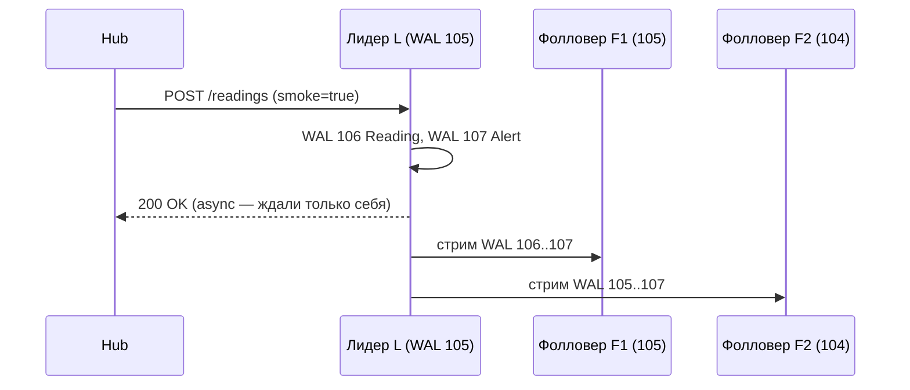
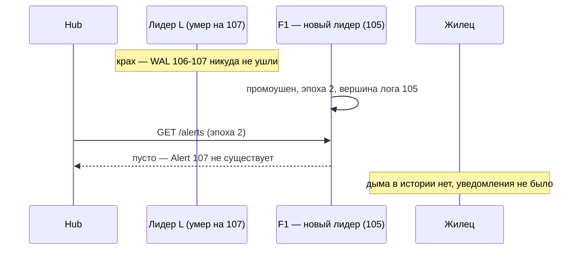

# Лекция 06. Репликация: лидерная, мульти-лидерная, кворумы

> **Дисциплина:** Распределённые системы и облачные технологии (РСиОТ)
> **Занятие:** лекция 6 из 28 · **Время:** 1 пара (80 мин)
> **Зачем это:** на прошлой паре мы выбирали, *что обещать* клиенту, пока
> реплики расходятся. Сегодня — механизмы, которыми эти обещания сдерживают:
> кто пишет, кто повторяет, что происходит, когда «главный» умирает, и как
> жить вообще без главного. Это глава про то, откуда берутся и доступность,
> и самые дорогие аварии.

---

## Крючок: 43 секунды, которые GitHub разгребал сутки

> 🖥 **Слайд 2.** Крючок: GitHub 21.10.2018

21 октября 2018 года, 22:52 UTC. В GitHub идёт плановая замена сбоящего
оптического оборудования. Связь между сетевым хабом восточного побережья США
и основным восточным дата-центром пропадает — на **43 секунды**.

Этого хватает. Автоматика фейловера (Orchestrator) решает, что восточный
дата-центр мёртв, и промоутит реплики MySQL на **западном** побережье в новые
primary. Но восточный primary не умирал — он был жив и до разрыва успел
принять записи, которые на запад доехать не успели. Теперь историй данных
две: восточная — с «хвостом», которого нет на западе, и западная — с новыми
записями, которых нет на востоке. Классический split brain по данным.

Вернуть всё как было нельзя: пришлось бы выбросить подтверждённые записи
одной из сторон. GitHub выбирает fail-forward: западный ДЦ остаётся primary
(и каждая запись с восточного побережья теперь ездит через континент,
~60 мс), восточные кластеры восстанавливают из бэкапов и досинхронизируют.
Итог 43 секунд сетевых работ — **24 часа 11 минут** деградации: webhooks
задерживаются, Pages не собираются, пользователи видят устаревшие данные.

Вопрос залу: **репликация должна была *спасать* от отказа — как она сама
стала причиной суточной аварии?**

Держите ответ до раздела про фейловер. Спойлер: ни база, ни сеть не
«сломались» — каждый компонент честно сделал то, для чего был спроектирован.

*(Источник кейса: `sources/Веб-находки_Лекция_06.md` — официальный
постмортем GitHub и разборы; дата доступа 10.08.2026.)*

---

## Квиз-извлечение (по лекции 05)

> 🖥 **Слайд 3.** Вспоминаем консистентность

Ответьте не подглядывая; ответы — в конце лекции.

1. Почему «CAP: выбери 2 из 3» — неверный пересказ? Когда на самом деле
   возникает выбор C против A?
2. PACELC: чем система платит за строгость, когда сеть **цела** и никакого
   разрыва нет?
3. Read-your-writes и monotonic reads — что именно обещает каждая гарантия
   и кому (всем клиентам или одному)?
4. Сформулируйте правило выбора модели консистентности, которым мы
   закончили прошлую пару.

Эти четыре ответа — фундамент сегодняшней пары: репликация — это и есть
машина, которая либо сдерживает выбранные обещания, либо тихо их нарушает.

---

## Результаты обучения

> 🖥 **Слайд 4.** Чему научимся

После этой пары вы сможете:

1. Объяснить, зачем данные реплицируют, и назвать цену каждой из трёх
   топологий: лидерной, мульти-лидерной, безлидерной.
2. Различать синхронную, асинхронную и полусинхронную репликацию и честно
   отвечать, что теряется при отказе в каждом режиме.
3. Разбирать фейловер по косточкам: потеря хвоста лога, split brain,
   фенсинг — и объяснить инцидент GitHub его же терминами.
4. Считать кворумы N/W/R, применять правило W + R > N и объяснять, почему
   оно **не** даёт линеаризуемости.
5. Подбирать схему репликации под сценарий: история показаний, настройки
   правил, команды реле в «СмартДоме».

## Пререквизиты

- Лекция 04: LWW, happens-before, векторные часы — конфликты записи будем
  разрешать этими инструментами.
- Лекция 05: спектр моделей консистентности и сессионные гарантии — сегодня
  увидим, какие механизмы какие гарантии способны сдержать.
- Лекция 01: частичные отказы, состояние «неизвестно», идемпотентность.

---

## Картина мира: ксерокопии главной тетради

> 🖥 **Слайд 5.** Дорожная карта пары

**Репликация** — это хранение одних и тех же данных на нескольких узлах.
Не путайте с партиционированием (лекция 08): там данные *режут на части*,
здесь — *копируют целиком*. Реальные системы делают и то и другое.

Аналогия на всю пару — **главная тетрадь и её ксерокопии**. Староста ведёт
тетрадь с конспектом (лидер), одногруппники снимают копии (реплики). Пока
копирование поспевает — все читают у себя и не толпятся у старосты. Но у
каждой копии есть возраст; староста может заболеть — и группе придётся
решать, чья копия теперь «главная» и не потерялась ли последняя страница.
А если писать разрешить каждому в свою копию — появятся расходящиеся
конспекты, которые кто-то должен сливать.

Вся сегодняшняя пара — это три способа организовать тетради:

- **один пишет, все копируют** (лидерная репликация);
- **пишут несколько, потом сливают** (мульти-лидерная);
- **главной тетради нет вообще, истина — у большинства** (безлидерная,
  кворумы).

Маршрут: зачем реплики → лидер и его лог → цена синхронности → отставание
реплик → фейловер и его ловушки → мульти-лидер и конфликты → кворумы →
выбор схемы для «СмартДома». По дороге — два квиза, одно голосование,
один живой сеанс и одна пауза.

---

## Основные понятия

**Определения** (пополним глоссарий в конце):

- **Реплика** — узел, хранящий копию данных.
- **Лидер (primary, master)** — реплика, принимающая записи; **фолловер**
  (follower, replica, standby) — реплика, повторяющая чужие записи.
- **Лаг репликации (replication lag)** — отставание фолловера от лидера:
  сколько записей (или секунд) он ещё не применил.
- **Фейловер (failover)** — передача роли лидера другому узлу после отказа.
- **Кворум** — минимальное число реплик, чьё участие делает операцию
  успешной.

---

## Ядро пары

### 1. Зачем вообще копии данных

> 🖥 **Слайд 6.** Три причины реплицировать

Реплицируют по трём причинам — и все три вы уже встречали в курсе:

1. **Доступность.** Единственная копия — единая точка отказа (лекция 01).
   Умер диск с историей `Reading` за год — историю не вернуть. Реплика —
   это страховка, которая уже оплачена и уже тёплая.
2. **Задержка.** Данные ближе к пользователю читаются быстрее: реплика в
   европейском регионе избавляет жильца из Бреста от путешествия каждого
   запроса за океан (заблуждение № 2 — «задержка равна нулю»).
3. **Масштабирование чтений.** Дашборд «СмартДома» читает историю показаний
   в тысячу раз чаще, чем датчики её пишут. Десять реплик обслужат десять
   потоков чтения — писать в десять «главных» узлов так просто нельзя.

Обратите внимание на асимметрию: чтения масштабируются копиями легко,
записи — нет. Записи нужно доставить **на каждую** копию, и весь вопрос
репликации — *кто, кому, когда и что обещая* их доставляет. Если бы данные
не менялись, репликация была бы тривиальной: скопировал и забыл. Вся
сложность — в изменениях.

### 2. Лидерная репликация: один пишет, все повторяют

> 🖥 **Слайд 7.** Лидер и лог

Самая распространённая схема — **лидерная** (single-leader, primary/replica):
так работают PostgreSQL, MySQL, MongoDB, Redis, Kafka. Все записи идут
через одного лидера; фолловеры получают изменения и применяют их **в том же
порядке**.

Откуда фолловеры знают, что применять? Из **журнала**. Ещё до всякой
репликации базы данных пишут каждое изменение в **WAL** (write-ahead log,
журнал упреждающей записи): сначала изменение дописывается в конец
журнала на диске, и только потом применяется к таблицам и индексам. Упал
процесс — при старте журнал проигрывается заново, и состояние
восстанавливается. Репликация получается почти бесплатно: журнал изменений
**отправляется фолловерам по сети** — и каждый фолловер просто проигрывает
чужую жизнь у себя. PostgreSQL шлёт фолловерам тот же самый WAL, которым
лечится сам; MySQL ведёт для репликации отдельный журнал (binlog) рядом с
журналом восстановления; у MongoDB это oplog, у Redis — поток команд.
Журналы разные — идея одна: лог изменений и есть репликация.

Лог — гениально скучная структура: только дописывание в конец, у каждой
записи — позиция (номер). Это даёт два подарка сразу:

- **естественный порядок**: все реплики применяют одни изменения в одном
  порядке — расходиться им не с чего (сравните с лекцией 04, где порядок
  приходилось изобретать);
- **честную меру отставания**: лидер на позиции 108, фолловер на 105 —
  лаг ровно три записи, и его видно в мониторинге.

Плата за простоту: лидер — узкое место записи и единая точка отказа. Обе
проблемы разберём — но сначала главный вопрос любой репликации.

### 3. Синхронно, асинхронно, полусинхронно: когда говорить «готово»

> 🖥 **Слайд 8.** Лестница долговечности

Hub прислал `Reading`, лидер дописал его в свой WAL. Когда отвечать Hub'у
«принято»? Это не технический тюнинг — это **обещание долговечности**,
и у него есть лестница (на примере PostgreSQL 17/18, параметр
`synchronous_commit` — актуально на 10.08.2026). Одно слово по дороге:
**fsync** — принудительный сброс данных из кэша операционной системы на
физический носитель; без него «записано» может означать «лежит в памяти
и умрёт вместе с питанием»:

| Режим | Ждём перед «готово» | Что теряется при отказе |
| --- | --- | --- |
| `off` | ничего (WAL в памяти) | хвост последних записей даже при падении **одного** лидера |
| `local` | fsync WAL на лидере | всё, что не доехало до реплик, — при потере лидера |
| `remote_write` | реплика получила WAL | окно сужается, но диск реплики ещё не тронут |
| `on` (remote_flush) | реплика записала WAL на диск | запись переживает смерть лидера |
| `remote_apply` | реплика **применила** запись | реплика сразу отдаёт свежее чтение |

**Асинхронная репликация** (ответ после локального fsync, реплики догоняют
как успеют) — быстрая и доступная: лидер не зависит от здоровья реплик. Но
подтверждение клиенту означает лишь «записано на лидере». Умер лидер до
отправки хвоста — подтверждённые записи **исчезли**, хотя клиент видел
успех. Redis прямо документирует то же самое: репликация асинхронна,
команда `WAIT N` лишь сужает окно потери и «не превращает Redis в строго
консистентную систему».

**Синхронная репликация** (ответ после подтверждения реплики) переживает
смерть лидера — но теперь каждая запись стоит RTT до реплики (PACELC из
лекции 05 в чистом виде: платим задержкой в **каждой** записи, без всякого
разрыва). Хуже: если единственная синхронная реплика умерла — записи
**блокируются**. Полностью синхронная схема на N реплик означает «скорость
самой медленной» и «доступность самой хрупкой» — поэтому в чистом виде её
почти не включают.

Практичная середина — **полусинхронная** схема: ждать не всех, а *какую-то*
из реплик. PostgreSQL умеет прямо в конфиге кворумную формулу —
`synchronous_standby_names = 'ANY 1 (replica1, replica2)'`: «готово», когда
подтвердила **любая одна** из двух. Смерть одной реплики ничего не
блокирует; запись живёт минимум в двух экземплярах. Запомните этот ход —
«дождись любых W из N» — через полчаса он вырастет в целую топологию.

**Типичные ошибки** (все три — из реальных постмортемов):

1. «Включили синхронную — теперь без потерь и бесплатно». Платите RTT в
   каждой записи и доступностью при смерти sync-реплики. Semi-sync у MySQL
   **понижает** доступность записи, а не повышает: появляется ещё один
   способ не закоммитить.
2. «Подтверждение получено — значит, реплика уже применила запись». Нет:
   большинство режимов подтверждают *получение/запись журнала*, не
   применение. Чтение с реплики может ещё не видеть подтверждённое.
3. Забытый **слот репликации** в PostgreSQL: слот удерживает WAL для
   отставшей реплики; реплика умерла навсегда, а слот остался — диск лидера
   распухает до отказа. В PG 18 добавили предохранитель
   `idle_replication_slot_timeout` — но по умолчанию он выключен.

### 4. Отставание реплики: тут ломаются сессионные гарантии

> 🖥 **Слайд 9.** Лаг бьёт по гарантиям

Асинхронный фолловер по определению живёт в прошлом. Обычно лаг —
миллисекунды, под нагрузкой — секунды и минуты. Что именно ломается,
мы уже знаем из лекции 05 — теперь видно, **где** ломается:

- **Read-your-writes.** Жилец сохранил порог `Rule` (запись ушла на
  лидера), страница перечитала данные с реплики — порога нет. Крючок
  прошлой лекции — это ровно оно: балансировщик направил чтение на
  отставшую реплику.
- **Monotonic reads.** Первый запрос попал на свежую реплику, второй — на
  отставшую: график `Reading` «мерцает» назад во времени.
- **Consistent prefix.** Реплика применила ответ раньше вопроса — читатель
  видит следствие без причины (нарушение порядка из лекции 04).

Лекарства тоже уже знакомы, теперь ясна их механика: читать свои данные
с лидера (после своей записи — только primary); **липкие сессии** (клиент
ходит на одну и ту же реплику); **токен версии** — клиент запоминает
позицию лога своей записи (`LSN 108`) и требует от реплики «не отвечай,
пока не доехал до 108».

Правило инженера: лаг — не аномалия, а **паспортная характеристика**
асинхронной репликации. Его меряют (позиции лога!), на него ставят SLO,
и каждый маршрут чтения обязан ответить: переживёт ли он устаревшие
данные. «Реплика для чтения» — это не бесплатное масштабирование, это
смена модели консистентности всего приложения.

### 5. Фейловер: самая опасная операция в лидерной репликации

> 🖥 **Слайд 10.** Три ловушки фейловера

Лидер смертен. Фейловер выглядит просто: заметили смерть, выбрали самого
свежего фолловера, объявили его лидером, перенастроили клиентов. В каждой
запятой — ловушка:

**Ловушка 1: «заметили смерть».** Отличить мёртвого лидера от медленного
или отрезанного **невозможно** — это четыре сценария «неизвестно» из
лекции 01. Таймаут — всегда компромисс: короткий даёт ложные фейловеры
(GitHub: 43 секунды!), длинный — минуты простоя записи.

**Ловушка 2: «потеря хвоста».** При асинхронной репликации у нового лидера
почти наверняка нет последних записей старого. Эти записи **подтверждены
клиентам** — и после промоушена их больше нет. Через минуту разыграем это
в живом сеансе.

**Ловушка 3: split brain.** Старый лидер жив — он был лишь отрезан — и
продолжает принимать записи, пока рядом уже работает новый. Две
расходящиеся истории; автослияния не существует. GitHub: восток и запад,
сутки восстановления.

Против split brain работает **фенсинг** (fencing — «ограждение»): каждому
поколению лидеров выдают монотонно растущий номер — **эпоху** (epoch,
term). Промоушен — это `epoch + 1`, и все — фолловеры, хранилища,
балансировщики — отвергают команды лидера со старым номером. Старый лидер
может сколько угодно считать себя главным — мир его больше не слушает.
Дополнительная страховка — аренда (lease): право лидерства выдаётся на
время и продлевается только при связи с большинством; отрезанный лидер
сам складывает полномочия по таймеру. Радикальный вариант из мира железа —
STONITH, «shoot the other node in the head»: новый лидер физически
обесточивает старого.

Заметьте, сколько раз прозвучало «большинство» и «все договорились о
номере эпохи». Кто выдаёт номера? Кто считает голоса, когда сеть порвана?
Придержите вопрос — это трейлер конца пары.

#### Живой сеанс: фейловер на глазах — куда пропала тревога

> 🖥 **Слайд 11.** Живой сеанс: теряем хвост WAL

Строим вместе, по шагам (7–10 минут; ход мысли важнее результата). Сцена:
облако «СмартДома», база с лидером L и фолловерами F1, F2, репликация
асинхронная. Hub шлёт критичное показание — дым.

Шаг 1 — счастливый путь. Следите за позициями лога:

Hub получил `200 OK` и вычеркнул показание из буфера — с его точки зрения
тревога доставлена. Вопрос группе: что известно про F1 и F2 в момент
ответа Hub'у? *Ничего.* Подтверждение — только про диск лидера.

Шаг 2 — лидер умирает **до** отправки стрима. F1 на позиции 105, F2 на
104. Автоматика выбирает самого свежего — F1 — и промоутит с новой эпохой:

Разбор, куда смотрели, когда теряли тревогу:

- **Что видит Hub:** `200 OK` получен → буфер очищен → ретраев не будет.
  Ключ идемпотентности (лекция 03) не поможет: Hub не знает, что повторять.
- **Что видит жилец:** ничего. `Alert` существовал в WAL лидера — и только
  там. Записи 106–107 — тот самый **потерянный хвост**.
- **Что видит новый лидер:** идеально честную историю до позиции 105.
  Он не «потерял» данные — он их никогда не получал.
- **Шаг 3, добиваем:** старый L оживает с вершиной лога 107 — его история
  *длиннее* официальной. Влить его фолловером как есть нельзя: позиции
  106–107 конфликтуют с новой эпохой. Его лог обрезают до 105 (в
  PostgreSQL этим занимается `pg_rewind`) — потерю хвоста фиксируют
  официально. А без фенсинга он продолжил бы принимать записи — и вышел
  бы GitHub в миниатюре.

Мораль в одну строку: **при асинхронной репликации «подтверждено» значит
«записано на одном узле, который может умереть»**. Для дыма так нельзя —
для дыма покупаем `ANY 1` из раздела 3 (RTT в каждой записи — приемлемая
цена за тревогу) или держим показание в буфере Hub до сквозного
подтверждения доставки.

---

> 🖥 **Слайд 12 — пауза 60 секунд.**

---

### 6. Мульти-лидерная репликация: писать можно везде — и это больно

> 🖥 **Слайды 13–14.** Когда лидеров несколько → конфликты записи

Один лидер — одна география записи: жилец из Сингапура пишет в европейский
лидер через полмира (заблуждение № 2 не прощает). Следующий шаг —
**мульти-лидерная** репликация: несколько узлов принимают записи, каждый
асинхронно рассылает свои изменения остальным.

Когда это оправдано (список короткий, и это не случайно):

1. **Мульти-регион.** Лидер в каждом регионе: локальная запись быстрая,
   межрегиональная синхронизация — асинхронная, в фоне.
2. **Клиенты с офлайн-режимом.** Календарь в телефоне: в самолёте вы
   пишете в локальную копию — на время полёта телефон и сервер суть два
   лидера, синхронизация при посадке.
3. **Наш Hub с локальной автономией.** Интернет в квартире упал (лекция 01
   это обещала), а жилец правит `Rule` с домашнего планшета. Hub принимает
   запись **сам** — свет должен управляться и без облака — и досылает её,
   когда связь вернётся. Каждый Hub — маленький лидер своего дома.

Цена объявлена ещё в лекции 04: два лидера принимают **конкурентные**
записи, между которыми нет happens-before, — и порядка «кто прав» не
существует физически. Пока копии не сверились, обе считают себя правыми;
конфликт обнаруживается позже — при синхронизации. Варианты разрешения
(по нарастанию честности):

- **LWW — last write wins.** «Победит бо́льшая метка времени». Дёшево,
  автоматически — и молча теряет данные при перекосе часов: лекция 04
  разбирала это на Cassandra. Для перезаписываемых настроек — терпимо;
  для счётчиков и денег — катастрофа.
- **Версионные векторы.** Хранить обе версии и метаданные причинности
  (векторные часы из лекции 04); конфликт отдать приложению или
  пользователю («на планшете порог 25°, на телефоне 22° — какой
  оставить?»). Честно, но конфликт всплывает в UI.
- **CRDT** (conflict-free replicated data types) — обзорно: структуры
  данных, у которых слияние встроено математически — счётчики, множества,
  регистры, где merge коммутативен и ассоциативен, поэтому реплики
  сходятся к одному состоянию при **любом** порядке доставки. На CRDT
  работают совместные редакторы и офлайн-first приложения. Подробности —
  за рамками курса; важно знать, что «автослияние без потерь» существует,
  но только для специально устроенных типов данных.

Правило: мульти-лидер берут, когда география или автономия **дороже**
простоты. Если все писатели в одном регионе и офлайн не нужен — один
лидер и никаких конфликтов.

### 7. Безлидерная репликация: истина — у большинства

> 🖥 **Слайд 15.** Кворумы N/W/R

Третья топология выбрасывает лидера совсем. В **безлидерной** репликации
(Amazon Dynamo; Cassandra, Riak, ScyllaDB) клиент (или узел-координатор)
шлёт запись **сразу на несколько реплик** и сам решает, когда она удалась.

Три числа управляют всем:

- **N** — фактор репликации: на скольких узлах живёт каждый ключ;
- **W** — кворум записи: сколько реплик должны подтвердить запись;
- **R** — кворум чтения: сколько реплик опрашиваем при чтении.

Классика: N=3, W=2, R=2. Запись «порог `Rule` = 25°» уходит на три
реплики; получив два подтверждения, клиент считает её успешной — третья
доедет асинхронно (или не доедет: узел в перезагрузке). Чтение опрашивает
две реплики и получает, возможно, **разные версии** — побеждает новейшая
(по версии записи), а отставшую реплику тут же лечат.

Почему это работает: если $W + R > N$, множества записи и чтения
**обязаны пересечься** хотя бы в одном узле — среди ответов на чтение
гарантированно есть свежая версия. Для N=3: W=2, R=2 → 2+2 > 3 ✓. Двигая
W и R, вы двигаете компромисс: W=1 — быстрая запись, но она живёт на одном
узле; W=3 — каждая запись ждёт всех; W=2, R=1 — быстрое чтение, но
2+1 ≤ 3 — пересечение не гарантировано, читаем «как повезёт».

Прелесть схемы — **отказы никого не пугают**: умерла одна реплика из
трёх — и записи (2 живых ≥ W), и чтения (2 ≥ R) продолжаются без всякого
фейловера. Не нужно решать, «кто теперь главный», — главного нет.

#### Peer-instruction-вопрос

> 🖥 **Слайды 16–20.** Голосование → четыре разбора

Голосуем, обсуждаем с соседом 90 секунд, голосуем снова.

> Безлидерный кластер: N=3, W=2, R=2. Запись `v2` подтверждена репликами
> R1 и R2 (реплика R3 была в перезагрузке и хранит старую `v1`). Сразу
> после этого узел R1 **умирает**. Клиент читает с кворумом R=2 — отвечают
> R2 и R3. Что получит клиент?
>
> A. Старую `v1`: из живых реплик большинство (R3 и «пустая» память R1)
> за старую версию — кворум решает голосованием.
> B. Новую `v2`: кворумы записи и чтения пересеклись в R2; версии
> сравниваются, побеждает новейшая, а R3 тут же вылечат.
> C. Ошибку: одна из трёх реплик мертва, кворум недостижим — кластер
> обязан отказать в обслуживании до восстановления R1.
> D. Непредсказуемо: R2 и R3 ответят разное, и у клиента нет способа
> понять, какая версия правильная.

Разбор — в конце лекции. Подсказка: два варианта неправильно понимают
слово «кворум», один — недооценивает метаданные версий.

### 8. Кворум с оговорками: ремонт, sloppy quorum и честный потолок

> 🖥 **Слайд 21.** Механизмы сходимости и потолок кворума

Реплика R3 из голосования осталась со старьём — кто её вылечит? В
безлидерном мире нет лидера, который дошлёт лог, поэтому сходимость
собирают из трёх механизмов:

- **Read repair** — ремонт при чтении: координатор увидел среди ответов
  старую версию → тут же дослал туда новую. Горячие ключи лечатся сами,
  просто потому что их читают.
- **Анти-энтропия** — фоновая сверка реплик целиком. Сравнивать байты
  дорого, поэтому сравнивают **деревья Меркла** — дерево хэшей: корни
  совпали — реплики идентичны; разошлись — спуск по ветвям находит
  различия за логарифм. Лечит и холодные ключи, которые никто не читает.
- **Hinted handoff** — передача «с намёком»: нужная реплика недоступна —
  запись временно принимает сосед с пометкой «передать R3, когда
  оживёт». Доступность записи сохраняется даже при отказах.

С hinted handoff связан термин **sloppy quorum** («расхлябанный кворум»):
считать ли W подтверждений от узлов-*заместителей* полноценным кворумом?
Если да (Riak по умолчанию, в Cassandra ANY) — доступность максимальна,
но W и R могут **не пересечься**: свежая запись гостит у заместителей, а
чтение опрашивает «законные» реплики. W + R > N при sloppy quorum ничего
не гарантирует — это осознанный размен строгости на доступность.

И честный потолок — даже строгого кворума. $W + R > N$ гарантирует
пересечение множеств, но **не линеаризуемость** (лекция 05):

- Запись на W реплик приходит **не одновременно**: пока она «в полёте»,
  один читатель уже видит новое значение, другой — ещё старое, и второе
  чтение может произойти *после* первого. Свежесть «прыгает» назад — для
  линеаризуемости это запрещено.
- Запись, не добравшая кворум (умер клиент на середине), **не
  откатывается**: она осталась на части реплик и однажды всплывёт при
  чтении — «подтверждено» и «видимо» опять разошлись.
- Конкурентные записи на разные реплики требуют разрешения конфликтов —
  LWW со всеми его грехами (лекция 04) или версионные векторы.

Кворум — это машина **высокой доступности с управляемой свежестью**, а не
строгий порядок. Если нужен строгий порядок — нужен тот, кто его
выстроит… и мы снова упёрлись в вопрос «кто главный и кто это решает».

### 9. Выбор схемы: три сценария «СмартДома»

> 🖥 **Слайд 22.** Топология под сценарий

Соберём пару воедино. Правило то же, что в лекции 05: сначала — что
сломается от потери или устаревания данных, потом — самая дешёвая схема,
при которой сценарий корректен.

| Сценарий | Что страшно | Схема репликации |
| --- | --- | --- |
| История `Reading` (телеметрия, много записей, чтение дашбордами) | потерять всё; отдельное показание — не трагедия | безлидерная, N=3, W=2, R=1–2: пишем много и всегда, читаем быстро; read repair и анти-энтропия доводят |
| Настройки `Rule` (редкие записи, читают все Hub'ы) | нарушить read-your-writes; конфликт правок | лидер + реплики, чтение своей записи с лидера/по токену версии; Hub офлайн — мульти-лидерная добавка с явным разрешением конфликтов |
| Команды реле и `Alert` (редко, критично) | потерянный хвост = недоставленная тревога; два «главных» = двойная команда | лидер + полусинхрон (`ANY 1`), фейловер только с фенсингом; строже всех — и это дешевле пожара |

Обратите внимание: **одна платформа — три схемы**. «Какая репликация у
вашей системы?» — вопрос без ответа; правильный вопрос — «какая
репликация у этого потока данных?». И везде, где в таблице написано
«фейловер» и «фенсинг», за кадром стоит нерешённый вопрос — *кто
принимает решение*.

---

## Типичные ошибки (запомните до того, как совершите)

> 🖥 **Слайд 23.** Типичные ошибки

1. **«Подтверждено — значит сохранено».** При асинхронной репликации
   подтверждение — это «записано на узле, который может умереть». Хвост
   WAL умирает вместе с лидером — вместе с чьей-то тревогой.
2. **«Синхронная репликация — без потерь и бесплатно».** Платите RTT в
   каждой записи и блокировкой записи при смерти sync-реплики. Semi-sync
   понижает доступность записи, покупая долговечность.
3. **«Реплика для чтения — бесплатное масштабирование».** Это смена
   модели консистентности: каждый маршрут чтения обязан пережить лаг.
4. **«Фейловер — это автоматика, она разберётся».** GitHub: 43 секунды
   разрыва, автопромоушен — и сутки восстановления. Автоматика без
   фенсинга и без ответа «что делаем с хвостом» — генератор split brain.
5. **«W + R > N — значит у нас строгая консистентность».** Кворум даёт
   пересечение и высокую доступность, но не линеаризуемость; sloppy
   quorum не даёт даже пересечения.

---

## Квиз-закрепление (по этой паре)

> 🖥 **Слайд 24.** Закрепление

Ответьте не подглядывая; ответы — в конце лекции.

1. Клиент получил `200 OK` при асинхронной репликации. Что именно ему
   пообещали — и что из этого может исчезнуть при фейловере?
2. Чем `ANY 1 (r1, r2)` в PostgreSQL лучше полностью синхронной репликации
   на обе реплики — и чем хуже асинхронной?
3. Как возникает split brain при фейловере и каким механизмом эпоха/term
   его останавливает?
4. N=3, W=2, R=2: почему чтение гарантированно видит последнюю
   подтверждённую запись — и почему это ещё не линеаризуемость?

---

## Вопросы для самопроверки

1. Три причины реплицировать данные. Какая из них главная для истории
   `Reading` в «СмартДоме» и почему?
2. Что такое WAL и почему репликация «получается из него почти бесплатно»?
3. Перечислите ступени `synchronous_commit` в PostgreSQL от `off` до
   `remote_apply`. Что добавляет каждая ступень и чем платит?
4. Почему полностью синхронная репликация на все реплики почти никогда
   не включается в проде?
5. Клиент пишет на лидера и читает с реплики. Какие сессионные гарантии
   под угрозой и какие есть лекарства?
6. Разложите инцидент GitHub 21.10.2018 на термины пары: где асинхронная
   репликация, где фейловер, где split brain, чего не хватило?
7. Что такое фенсинг и почему монотонного номера эпохи достаточно, чтобы
   старый лидер стал безвредным?
8. Когда мульти-лидерная репликация оправдана? Почему Hub «СмартДома» —
   естественный мульти-лидерный случай?
9. Сравните LWW, версионные векторы и CRDT как способы разрешить
   конкурентные записи: что теряет и что требует каждый?
10. N=5. Подберите W и R для: (а) максимально быстрых чтений при
    гарантии пересечения; (б) максимально доступной записи. Что стало
    с гарантиями в случае (б)?
11. Зачем безлидерной системе три механизма сходимости — read repair,
    анти-энтропия, hinted handoff? Почему одного read repair мало?
12. Что такое sloppy quorum и почему при нём W + R > N перестаёт
    гарантировать пересечение?
13. Приведите два независимых довода, почему кворум W + R > N не даёт
    линеаризуемости.
14. Для каждого потока «СмартДома» — история, настройки, команды реле —
    назовите выбранную схему репликации и главную причину выбора.

---

## Мост к лекции 07 — и к лабораторной № 3

> 🖥 **Слайд 25.** Мост: кто выбирает лидера?

Всю пару мы аккуратно обходили один и тот же вопрос. Фейловер: **кто**
решает, что лидер мёртв, и **кто** назначает нового — так, чтобы не
назначить двух? Фенсинг: **кто** выдаёт номера эпох, чтобы они не
повторялись? Кворум записи: а если два клиента одновременно соберут по
кворуму на конкурентные записи? Каждый раз ответ упирался в «нужно, чтобы
большинство узлов согласилось об одном факте». Это задача **консенсуса** —
и у неё есть промышленное решение: алгоритм **Raft**, сердце etcd, на
котором стоит Kubernetes. Лекция 07 — как узлы голосуют, почему двух
лидеров в одной эпохе не бывает и что происходит в ту самую секунду
разрыва. Всё сегодняшнее — эпохи, большинства, журналы — там сложится в
единый механизм.

А в лабораторной № 3 (отказоустойчивость, `tasks/task_03`) вы устроите
своему сервису мини-хаос: таймауты, отказ зависимости, ретраи. Держите в
голове сегодняшний живой сеанс: «получил 200 OK» и «данные пережили сбой» —
разные утверждения, и тесты лабы будут это подсвечивать.

**Задание на 1 предложение** (письменно, в конспект): закончите фразу
«Понимание, что подтверждение записи — это обещание с условиями,
пригодится лично мне, потому что…» — конкретно, про свои проекты. На
следующей паре спрошу троих.

---

## Глоссарий

> 🖥 **Слайд 26 (финал).** Вопросы + литература

| Термин | Определение |
| --- | --- |
| Репликация | Хранение копий одних данных на нескольких узлах |
| Лидер / фолловер | Реплика, принимающая записи / повторяющая их из лога лидера |
| WAL | Журнал упреждающей записи: изменения пишутся в лог до применения |
| Лаг репликации | Отставание фолловера от лидера (в записях или секундах) |
| Синхронная / асинхронная репликация | Ответ клиенту после подтверждения реплик / сразу после лидера |
| Полусинхронная (кворумная) запись | «Готово» после подтверждения части реплик (`ANY N`) |
| Фейловер | Передача роли лидера после отказа; источник ловушек: хвост, split brain |
| Потерянный хвост | Подтверждённые записи лидера, не доехавшие до реплик к моменту его смерти |
| Split brain | Два узла одновременно считают себя лидером и принимают записи |
| Фенсинг (эпоха, term) | Монотонный номер поколения лидера; команды старых эпох отвергаются |
| Мульти-лидерная репликация | Несколько узлов принимают записи; конфликты разрешаются при слиянии |
| CRDT | Типы данных с математически гарантированным слиянием реплик |
| Кворум N/W/R | Фактор репликации, кворум записи, кворум чтения; пересечение при W+R>N |
| Sloppy quorum + hinted handoff | Кворум с заместителями: доступность выше, пересечение не гарантировано |
| Read repair | Починка отставшей реплики свежей версией прямо при чтении |
| Анти-энтропия | Фоновая сверка реплик (деревья Меркла) и досылка различий |

## Список литературы

1. Основная литература
   - [1] Клеппман М. — «Высоконагруженные приложения» (Designing
     Data-Intensive Applications). O'Reilly / Питер. Глава 5 «Репликация».
2. Интернет-ресурсы
   - [2] Постмортем GitHub 21.10.2018, документация PostgreSQL 17/18
     (репликация, `synchronous_commit`, слоты) и Redis (Replication, WAIT),
     разборы заблуждений о синхронной репликации — подборка с URL в
     `sources/Веб-находки_Лекция_06.md` (дата обращения: 10.08.2026).

---

## Ответы

### Ответы: квиз-извлечение (лекция 05)

1. P — не пункт меню: разрывы случаются сами. Выбор C-против-A возникает
   **только на время разрыва**; в остальное время действует else-половина
   PACELC.
2. Задержкой: строгая согласованность требует ждать подтверждений реплик
   в каждой записи (RTT), даже когда сеть полностью цела.
3. Read-your-writes: клиент видит **свои** записи (сессия — например,
   пользователь). Monotonic reads: виденное клиентом не «откатывается»
   назад. Обе — про одного клиента, не про всех.
4. Выбирать **самую слабую модель, при которой сценарий корректен**:
   строгость «на всякий случай» оплачивается миллисекундами и
   доступностью (антипаттерн курса № 6).

### Ответы: peer instruction

Правильный ответ — **B**: кворум чтения {R2, R3} пересёкся с кворумом
записи {R1, R2} в узле R2. Клиент получает обе версии, метаданные версий
(номер/вектор) говорят, что `v2` новее, — её и возвращаем, а R3 тут же
чинится read repair. Смерть R1 ничему не мешает: 2 живых узла ≥ R.

- A — кворум — это не голосование большинством за значение: версии
  **сравниваются по метаданным**, а не считаются по головам. Одна свежая
  реплика в пересечении бьёт любое количество отставших.
- C — кворум и существует ради работы при отказах: требуется R живых
  **из N**, а не все N. Отказ меньшинства — штатный режим, никакого
  фейловера не нужно.
- D — «разные ответы» — штатная ситуация чтения, а не хаос: у записей
  есть версии, координатор детерминированно выбирает новейшую.
  Непредсказуемость появилась бы при конкурентных **записях** (там нужны
  векторы/LWW из лекции 04) — здесь запись одна.

### Ответы: квиз-закрепление

1. Пообещали «запись принята и записана лидером» (при `synchronous_commit`
   по умолчанию — fsync на лидере). При фейловере может исчезнуть весь
   хвост, не доехавший до нового лидера, — записи подтверждены, но
   существовали в одном экземпляре.
2. Лучше полного синхрона: не ждём **обе** реплики (быстрее) и не
   блокируемся при смерти одной из них (доступнее). Хуже асинхрона:
   каждая запись всё же платит RTT до ближайшей живой реплики.
3. Старый лидер жив, но отрезан; автоматика промоутит нового — пишут оба.
   Фенсинг: у нового лидера эпоха n+1, и все узлы отвергают команды с
   эпохой ≤ n — старый лидер продолжает «править» в пустоту.
4. W + R > N: множества записи и чтения пересекаются минимум в одном
   узле, свежая версия обязательно среди ответов, побеждает по версии.
   Но линеаризуемости нет: запись доезжает до реплик не одновременно
   (свежесть «прыгает» между читателями), недобравшая кворум запись не
   откатывается, конкурентные записи требуют разрешения конфликтов.
