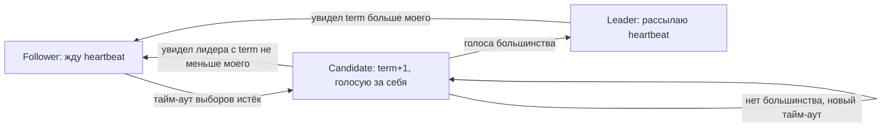
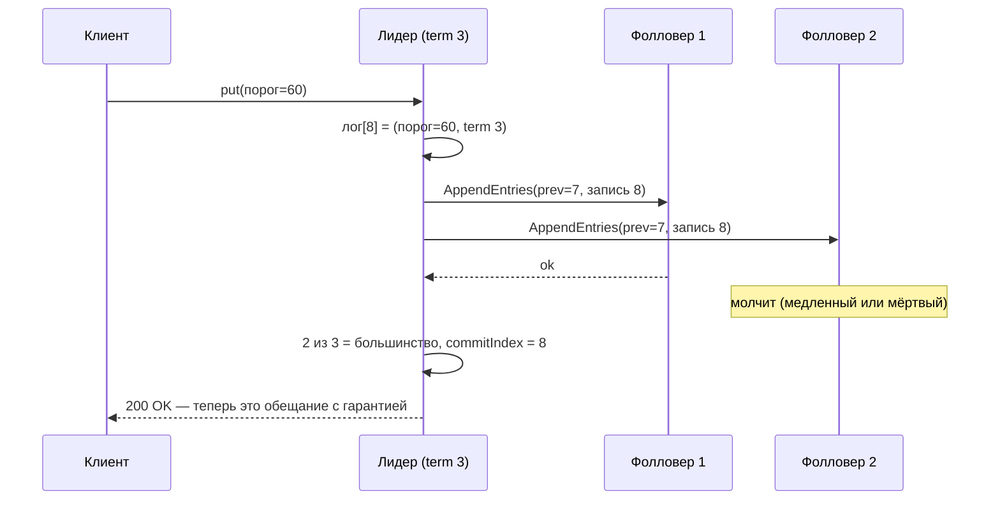
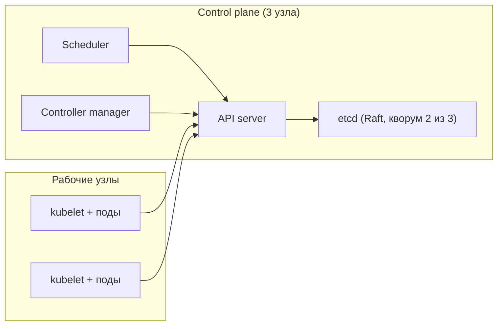

# Лекция 07. Консенсус и Raft на практике: etcd — сердце Kubernetes

> **Дисциплина:** Распределённые системы и облачные технологии (РСиОТ)
> **Занятие:** лекция 7 из 28 · **Время:** 1 пара (80 мин)
> **Зачем это:** прошлая пара закончилась вопросом без ответа: кто решает,
> что лидер мёртв, кто выдаёт номера эпох, кто считает большинство? Сегодня —
> ответ: консенсус, алгоритм Raft и его самый массовый носитель etcd,
> на котором держится каждый кластер Kubernetes в мире.
> Сырьё 2025 года (`Лекция_06_Raft_подробно.md`) сохранено в `archive_2025/`.

---

## Крючок: свитч, который был «не жив и не мёртв»

> 🖥 **Слайд 2.** Крючок: Cloudflare 02.11.2020

2 ноября 2020 года в основном дата-центре Cloudflare сетевой свитч вошёл в
состояние, которого не было ни в одной модели отказов из лекции 01: он
**частично** работал. Протоколы LACP и BGP отвечали, vPC — нет. Свитч не
умер — он ослеп на один глаз.

За этим свитчем стоял один из трёх узлов кластера etcd. Возникла асимметрия:
узел 1 не видел узла 3 (действующего лидера), но прекрасно видел узел 2.
А узлы 2 и 3 видели друг друга нормально. Дальше — трагикомедия по ролям:
узел 1, не слыша лидера, честно решал «лидер умер», объявлял выборы и
голосовал за себя. Узел 2, который лидера слышал, голосовал за узел 3.
Ничья. Новый раунд. Опять ничья. Стабильного лидера нет — кластер etcd
ушёл в **read-only**.

Каскад: через etcd координировались кластеры баз данных; координация
встала, автоматика промоутила реплику, критическая база аутентификации
осталась без реплик вовсе. Успешность API упала до 75 %, дашборд
замедлился в 80 раз. Итог — **6 часов 33 минуты** деградации.

Вопрос залу: **Raft в etcd отработал правильно или сломался?**

Держите ответ до середины пары. Спойлер: ни одна подтверждённая запись не
потерялась — и это не случайность. Но и «правильно работающий» консенсус,
как видите, умеет превратить один полуживой свитч в шесть часов боли.

*(Источник кейса: `sources/Веб-находки_Лекция_07.md` — постмортем
Cloudflare и разбор liveness Raft; дата доступа 10.08.2026.)*

---

## Квиз-извлечение (по лекции 06)

> 🖥 **Слайд 3.** Вспоминаем репликацию

Ответьте не подглядывая; ответы — в конце лекции.

1. Асинхронная репликация: клиент получил `200 OK` — что ему на самом деле
   пообещали и что может исчезнуть?
2. Split brain при фейловере: как он возникает и как эпоха/фенсинг его
   останавливает?
3. Кворумы N/W/R: почему W + R > N гарантирует свежее чтение — и почему
   это ещё не линеаризуемость?
4. Почему «лидер мёртв» и «лидер медленный» неразличимы для наблюдателя —
   и чем это опасно при автоматическом фейловере?

---

## Результаты обучения

> 🖥 **Слайд 4.** Чему научимся

После этой пары вы сможете:

1. Объяснить, какую задачу решает консенсус и почему её нельзя решить
   «просто голосованием» без термов и кворумов.
2. Проследить полный цикл Raft: выборы лидера, репликацию лога, коммит
   большинством — и назвать свойства безопасности, которые это даёт.
3. Честно перечислить, чего Raft **не** решает: потеря кворума, медленные
   записи в больших кластерах, византийские отказы.
4. Пользоваться etcd как боевым инструментом: ключи, ревизии, watch,
   lease, выборы лидера среди своих сервисов.
5. Объяснить, что происходит с Kubernetes при потере кворума etcd — и
   почему поды при этом продолжают работать.

## Пререквизиты

- Лекция 06: лидерная репликация, WAL, фейловер, split brain, фенсинг,
  кворумы N/W/R.
- Лекция 05: линеаризуемость, CP/AP-интуиция, PACELC.
- Docker Desktop работает (лаба 1) — для быстрой практики с etcd.

---

## Картина мира: журнал, который ведут пятеро

> 🖥 **Слайд 5.** Дорожная карта пары

Вернёмся к аналогии прошлой пары: староста ведёт главную тетрадь, группа
снимает копии. Прошлая лекция закончилась неприятным открытием: если
староста заболел, то *сам процесс выбора нового старосты* — нерешённая
задача. Крикнуть «теперь главный я» может каждый; двое крикнут
одновременно — и у группы две «главные» тетради (split brain).

Сегодняшняя идея переворачивает картинку: **не тетрадь принадлежит
старосте — староста принадлежит тетради.** Пять человек ведут пять копий
одного журнала и подчиняются протоколу: любая новая строка сначала
собирает подписи большинства, и только потом считается «официальной
историей». Староста — просто тот, кому большинство *временно* доверило
порядок строк; его полномочия записаны в том же журнале (номер эпохи), и
большинство в любой момент может выбрать следующего. Такой журнал
переживает смерть любого меньшинства участников — и никогда не
раздваивается.

Эта конструкция называется **реплицируемая машина состояний**
(replicated state machine), протокол подписей — **консенсус**, самый
понятный из промышленных протоколов — **Raft**, а его самый massовый
носитель — **etcd**, база, в которой Kubernetes хранит вообще всё.

Маршрут пары: зачем консенсус → предел возможного (FLP) → Raft: термы и
выборы → репликация лога и коммит → чего Raft не может → живой сеанс
(выборы на пятерых) → etcd → Kubernetes → «СмартДом»: тревога ровно один
раз → Paxos, дедушка всех консенсусов. По дороге — голосование, пауза и
два квиза.

---

## Основные понятия

**Определения** (пополним глоссарий в конце):

- **Консенсус** — протокол, по которому группа узлов принимает **одно
  общее решение** (значение, порядок записей, имя лидера), несмотря на
  отказы части узлов. Контрпример: кворумные N/W/R из лекции 06 — не
  консенсус: две конкурентные записи там могут «пройти» одновременно,
  общего решения о порядке нет.
- **Safety (безопасность)** — «ничего плохого не случится»: два узла
  никогда не примут разные решения; подтверждённая запись не исчезнет.
- **Liveness (живучесть)** — «что-то хорошее когда-нибудь случится»:
  решение будет принято за конечное время.
- **Реплицируемая машина состояний** — все узлы применяют одни и те же
  команды в одном и том же порядке из общего лога → приходят к одному и
  тому же состоянию.
- **Терм (term)** — номер логической эпохи в Raft; в одном терме бывает
  не более одного лидера. Это те самые «номера эпох» фенсинга из
  лекции 06 — теперь мы увидим, кто их выдаёт.

---

## Ядро пары

### 1. Зачем консенсус: три долга лекции 06

> 🖥 **Слайд 6.** Долги прошлой пары

У прошлой пары остались три вопроса, на которые «репликация сама по себе»
ответить не может:

1. **Кто выбирает нового лидера?** Фейловер GitHub делала автоматика
   Orchestrator — и устроила split brain. Нужен способ, которым узлы
   *согласованно* решают «лидер теперь X», причём так, чтобы двух X не
   было даже при порванной сети.
2. **Кто выдаёт номера эпох?** Фенсинг работает, только если эпоха
   монотонно растёт и все видят одну и ту же последовательность эпох.
   Счётчик эпох — общее решение → консенсус.
3. **Где хранить конфигурацию и локи?** «Какая реплика — primary»,
   «у кого лок на обновление прошивки парка устройств» — крошечные
   данные, цена ошибки — катастрофа. Им нужно хранилище, которое не
   раздваивается **никогда**.

Заметьте общий знаменатель: всё это — маленькие, редко меняющиеся, но
критичные факты, о которых **все должны думать одинаково**. Для
терабайтов телеметрии «СмартДома» консенсус не нужен (антипаттерн № 6 —
координация там, где хватает eventual). Для факта «лидер rules-engine —
экземпляр B, эпоха 7» — жизненно необходим.

### 2. Предел возможного: FLP и честный размен

> 🖥 **Слайд 7.** FLP: safety или гарантированный финиш

Прежде чем строить, признаем предел. Результат Фишера, Линча и Патерсона
(FLP, 1985), без математики, одним абзацем: **в асинхронной сети — где
задержка сообщения не ограничена ничем — никакой детерминированный
алгоритм консенсуса не может гарантировать, что решение будет принято за
конечное время, если хотя бы один узел может отказать.** Причина, по
сути, знакома вам с лекции 01: «медленный» и «мёртвый» неразличимы, и
любой алгоритм можно бесконечно водить за нос идеально подлыми
задержками.

Что делает индустрия с теоремой о невозможности? Торгуется. Raft (и все
его родственники) выбирают: **safety — безусловно и всегда**, при любых
задержках, разрывах и перезагрузках; **liveness — «почти всегда»**: пока
сеть ведёт себя достаточно прилично, случайные тайм-ауты сводят
вероятность вечного зависания к нулю. Cloudflare-крючок — это редкий
случай, когда «достаточно прилично» не выполнялось шесть часов подряд:
safety устояла (ни одной потерянной записи!), liveness — нет.

Запомните этот размен: он объясняет и поведение etcd в инциденте, и
всё, что мы увидим дальше.

### 3. Raft: роли, термы и выборы лидера

> 🖥 **Слайды 8–9.** Роли и термы → выборы и тайм-ауты

Raft (Онгаро и Оустерхаут, 2014) спроектирован с одной явной целью —
**понятность**. Весь протокол собирается из трёх ролей и одного счётчика.

Роли:

- **Follower (фолловер)** — состояние по умолчанию: молчит, отвечает на
  запросы, ждёт периодических сигналов лидера (heartbeat).
- **Candidate (кандидат)** — фолловер, который слишком долго не слышал
  лидера и решил баллотироваться.
- **Leader (лидер)** — единственный, кто принимает записи клиентов и
  рассылает их остальным; подтверждает власть постоянными heartbeat.



Счётчик — **терм**: логическая эпоха. Каждые новые выборы = терм + 1.
Правила железные: узел хранит максимальный виденный терм; любое сообщение
из прошлого терма отвергается; узел голосует **не более одного раза за
терм**. Из последнего правила — руками, за полминуты — выводится
центральная гарантия: чтобы стать лидером, нужно большинство голосов;
два большинства в одном терме обязаны пересекаться хотя бы в одном узле;
этот узел дважды в одном терме не голосует → **двух лидеров в одном терме
не существует**. Вот кто «выдаёт эпохи» фенсингу: сами выборы.

Механика выборов. Фолловер ждёт heartbeat со **случайным** тайм-аутом
(в etcd по умолчанию: heartbeat 100 мс, тайм-аут выборов 1000 мс плюс
случайная добавка). Тайм-аут истёк → кандидат: терм + 1, голос за себя,
всем RPC `RequestVote`. Получил большинство — лидер; услышал чужой
heartbeat с термом не меньше своего — смиренно вернулся в фолловеры.

Зачем случайность? Против **расщепления голосов** (split vote): если два
фолловера стартуют одновременно, голоса могут разделиться 2:2 (пятый
спит), большинства нет ни у кого. Все ждут новый *случайный* тайм-аут —
и почти наверняка кто-то проснётся первым и успеет собрать голоса до
пробуждения конкурента. Знакомый приём? Это тот же джиттер, что в
ретраях лекции 01: рассинхронизировать толпу случайностью. Заметьте:
выборы **не** гарантированно завершаются за один раунд — это и есть
плата FLP, размазанная тонким слоем.

### 4. Репликация лога и правило коммита

> 🖥 **Слайды 10–11.** Лог и коммит большинством → кто достоин стать
> лидером

Лидер избран — начинается основная работа: вести журнал. Клиент шлёт
команду («порог дыма = 60»), лидер дописывает её в свой лог с парой
координат `(индекс, терм)` и рассылает фолловерам RPC `AppendEntries`.



Три детали, каждая — с умыслом:

**Проверка стыковки.** В каждом `AppendEntries` лидер передаёт индекс и
терм *предыдущей* записи. Фолловер сверяет со своим логом: не совпало —
отказ, лидер отступает на шаг назад и пробует раньше, пока не найдёт
общий префикс, а дальше перезаписывает хвост фолловера своим. Отсюда
свойство **log matching**: если у двух логов запись с одинаковыми
(индекс, терм) — всё до неё тоже совпадает. Журналы не «сливаются» —
они выравниваются по лидеру.

**Правило коммита.** Запись **закоммичена**, когда её сохранило
большинство узлов. Только после этого лидер применяет её к машине
состояний и отвечает клиенту. Сравните с лекцией 06: это в точности
кворумная запись `ANY N` — но теперь она не опция конфига, а закон
протокола. `200 OK` от etcd означает: «это переживёт смерть любого
меньшинства». Ни один из четырёх режимов `synchronous_commit`, что мы
разбирали, такого не обещал. (Одна тонкость для любознательных: лидер
объявляет закоммиченными по подсчёту большинства только записи *своего*
терма — записи предшественников коммитятся «прицепом» к ним; зачем так —
рисунок 8 в статье Raft.)

**Кто достоин стать лидером.** Осталась щель: вдруг лидером изберётся
узел с *коротким* логом — и перепишет чужие закоммиченные записи своим
«выравниванием»? Raft закрывает её на выборах: в `RequestVote` кандидат
сообщает координаты последней записи своего лога, и узел **отказывает
кандидату, чей лог старее собственного** (сравнение: сначала терм
последней записи, потом длина). Раз запись закоммичена — она есть у
большинства; раз кандидату нужно большинство голосов — среди его
избирателей обязательно есть кто-то с этой записью, и он забракует
кандидата без неё. Итог — свойство **leader completeness**: у каждого
нового лидера уже есть всё закоммиченное. Заметьте, чего здесь *нет*:
передачи данных при выборах. Правильный лог не «доставляется» новому
лидеру — просто неправильный лидер не может быть избран.

Теперь можно честно ответить на вопрос крючка: Raft в etcd Cloudflare
**отработал правильно**. Узел 1 бесконечно навязывал выборы (liveness
страдала), но ни в одном терме не возникло двух лидеров и ни одна
закоммиченная запись не пропала (safety держалась). Протокол выполнил
ровно то, что обещал, — а обещал он не всё.

#### Peer-instruction-вопрос

> 🖥 **Слайды 12–16.** Голосование PI → четыре разбора

Голосуем, обсуждаем с соседом 90 секунд, голосуем снова.

> Кластер etcd из 5 узлов. Два узла сгорели безвозвратно. Что с
> кластером?
>
> A. Недоступен: отказала почти половина узлов, сначала нужно
> восстановить их — потом продолжит работу.
> B. Работает полностью: 3 из 5 — большинство; и записи, и чтения идут
> штатно, потерь нет.
> C. Чтения работают, записи — нет: для коммита записи нужны
> подтверждения всех 5 узлов.
> D. Работает, но записи, которые подтверждали погибшие узлы, потеряны —
> их подтверждения умерли вместе с ними.

Разбор — в конце лекции. Подсказка: два варианта неправильно понимают
слово «большинство», один — забыл, что гарантирует пересечение кворумов.

> 🖥 **Слайд 17.** Пауза (60 секунд)

### 5. Чего Raft не решает — и не обещал

> 🖥 **Слайд 18.** Три «не» Raft

Вокруг Raft накопился фольклор «поставил — и надёжно навсегда». Разберём
три главных «не», пока они не стали вашими постмортемами.

**Не переживает потерю большинства.** 3 из 5 умерло — оставшиеся двое
никогда не соберут большинство: записи невозможны, выборы невозможны.
Кластер не «сломался» — он **сознательно отказался работать**, потому
что любая запись без большинства рискует раздвоить историю. Это CP-выбор
из лекции 05, вшитый в протокол: консистентность дороже доступности.
Отсюда же — практика: кластер **нечётного** размера. Четыре узла
переживают тот же один отказ, что и три (большинство: 3 из 4 против
2 из 3), но отказывать может больше железа, а на выборах возможна ничья
2:2. Чётный узел — расход без дохода.

**Не ускоряется от добавления узлов.** Каждая запись ждёт большинство:
при 5 узлах — 3 подтверждения, при 7 — 4. Больше узлов = больше сетевых
раундов на каждую запись = **медленнее** запись. Узлы добавляют за
отказоустойчивость и масштаб чтений, никогда — за скорость записи.
Документация etcd прямо рекомендует не более 7 узлов; канон — 3 или 5.

**Не защищает от узлов, которые врут.** Модель отказов Raft —
crash-recovery из лекции 01: узел может умереть, перезагрузиться,
потерять сообщения — но не лгать. Cloudflare-кейс потому и назван в
постмортеме «византийским сбоем в реальном мире»: полуживой свитч
создал узлам *противоречивые картины мира*, и это выбило не safety, но
liveness — на шесть часов. Практический вывод из того же постмортема:
современные версии etcd включают предвыборную проверку **PreVote**
(кандидат сначала спрашивает «а вы бы за меня проголосовали?», не
трогая term) — она гасит бесконечную эскалацию термов от изолированного
узла. Полная же защита от вранья (BFT-протоколы, блокчейны) стоит
кратно дороже и в своём ДЦ не окупается.

### 6. Живой сеанс: выборы на пятерых

> 🖥 **Слайд 19.** Живой сеанс

Разыгрываем Raft вживую (7–10 минут). Пять добровольцев — узлы, сидят в
ряд лицом к группе. У каждого: листок с большим текущим термом (сейчас —
«1») и «тайм-аут» — карточка с числом секунд (раздаю случайно: 3, 5, 6,
8, 9). Я — сеть: сообщения передаются только через меня.

**Шаг 1 — штатная жизнь.** Узел 3 — лидер терма 1. Каждые ~2 секунды он
хлопает в ладоши: heartbeat. Остальные при хлопке «сбрасывают тайм-аут»
(кладут ладонь на карточку). Группа видит: пока лидер жив, никто и не
думает про выборы.

**Шаг 2 — смерть лидера.** Узел 3 демонстративно отворачивается. Все
молча считают свои секунды. Первым «дозревает» узел с карточкой «3» —
встаёт: «Терм 2! Голосуйте за меня!» Я разношу RequestVote. Каждый,
кто ещё не голосовал в терме 2, поднимает руку за него. 3 руки из 5
(включая его собственную) — большинство, у нас лидер терма 2. Пишем
«2» на листках. Общее время «простоя» — секунды: вот цена фейловера,
который в лекции 06 делали руками и со слезами.

**Шаг 3 — расщепление голосов.** Возвращаем всех, лидер снова
отворачивается, но теперь я вручаю двум узлам одинаковые карточки «3».
Оба встают одновременно: «Терм 3! За меня!» Каждый голосует за того,
чей запрос я донёс первым; получается 2:2 плюс два самоголоса — 3:3?
Нет: голосов всего 5, скажем 3:2 — а если 2:2 и один не услышал?
Большинства нет ни у кого. Оба берут **новые случайные** карточки — и
во втором раунде побеждает один. Группа своими глазами видит, зачем
тайм-ауту случайность.

**Шаг 4 — одиночка в изоляции.** Увожу одного фолловера в дальний
угол: полная тишина, ни одного heartbeat. Его таймер истекает: «Терм 4!
Голосуйте!» Никто не слышит. «Терм 5! Терм 6!» — голосует сам за себя в
пустоту, накручивая терм. Четвёрка тем временем живёт как жила.
Возвращаем изгнанника — его раздутый терм больше лидерского: лидер,
увидев больший терм, обязан уйти в фолловеры, и кластер проводит
внеочередные выборы. Изгнанник их не выиграет (его лог устарел — раздел
4 на страже), но пару секунд простоя он всем устроил. Неприятно, однако
безопасно: ни в одном терме двух лидеров не было, всё закоммиченное
цело. Это почти узел 1 из Cloudflare — тому было даже проще сеять хаос:
его крики *долетали* до половины кластера и срывали каждые выборы.
Лекарство обоим — PreVote: сначала спроси, проголосовали бы за тебя,
и только потом трогай терм.

Финальный вопрос группе: а если бы в угол ушёл сам лидер — и с одним
спутником? Тройка переизбралась бы; лидер-в-углу продолжил бы принимать
записи в лог (спутник послушно кивает — heartbeat-то идёт), но
закоммитить не смог бы ни одной: большинства в углу нет. Клиенты
получили бы честные тайм-ауты вместо второй истории данных.

Итог сеанса — одна фраза на доске: **«Кворум решает всё; случайность
решает, кто спросит первым».**

### 7. etcd: консенсус как сервис

> 🖥 **Слайд 20.** etcd API

Писать Raft самим — увлекательно (загляните в визуализацию на
raft.github.io), но в бою вы будете использовать готовое. **etcd** —
распределённое KV-хранилище на Raft (актуальная стабильная ветка — 3.6;
на 10.08.2026 ветка 3.7 — в черновике). Именно «маленькие критичные
факты»: конфигурация, локи, членство, — не телеметрия.

Поднимем одноузловой etcd и пощупаем API (Docker Desktop, PowerShell):

```powershell
docker run -d --name etcd -p 2379:2379 quay.io/coreos/etcd:v3.6.4 `
  /usr/local/bin/etcd --advertise-client-urls http://0.0.0.0:2379 `
  --listen-client-urls http://0.0.0.0:2379
docker exec etcd etcdctl put /smartdom/rules/smoke-threshold 60
docker exec etcd etcdctl get /smartdom/rules/smoke-threshold -w json
```

**Пояснение к примеру.** `put`/`get` — обычный KV. Флаг `-w json`
раскрывает главное: у каждого ключа есть **ревизия** — глобальный,
монотонно растущий номер изменения *всего хранилища* (это, по сути,
индекс в логе Raft, торчащий наружу). Ревизия — готовый фенсинг-токен и
основа оптимистичных транзакций: «запиши, только если ревизия ключа не
изменилась».

**Проверка.** В JSON-ответе видны `create_revision`, `mod_revision`,
`version`. Повторите `put` — `mod_revision` вырастет.

Четыре механизма поверх KV — ради них etcd и берут:

- **Watch** — подписка на изменения ключа/префикса:
  `etcdctl watch --prefix /smartdom/rules/` — каждое изменение прилетает
  событием, с ревизией. Так Kubernetes узнаёт «появился новый под».
- **Lease (аренда)** — TTL-объект: `etcdctl lease grant 10` → привяжите
  ключ через `put --lease=...` — не продлеваете аренду (keep-alive), ключ
  исчезает сам. Готовый детектор смерти: жив — ключ есть.
- **Election** — выборы *ваших* лидеров поверх lease:
  `etcdctl elect rules-engine node-a` — кто первый, тот и лидер; умер —
  переизбрание. Заметьте красоту: etcd внутри себя выбирает лидера по
  Raft, чтобы вы поверх него выбирали лидеров своих сервисов.
- **Lock** — распределённый лок: `etcdctl lock fw-update` — критическая
  секция на кластере.

Типичные ошибки: класть в etcd большие или частые данные (телеметрия
Reading — в специализированные хранилища, лекция 10); забывать, что
watch с отставшей ревизии может «съесть» историю после компакции;
и главная — верить локу без фенсинга (следующий раздел).

### 8. etcd — сердце Kubernetes

> 🖥 **Слайд 21.** Потеря кворума ≠ падение подов

Каждый кластер Kubernetes — это приложения плюс **control plane**, и вся
память control plane — один кластер etcd. Желаемое состояние
(Deployment «3 реплики»), фактическое (поды, их адреса), конфигурация
(ConfigMap, Secret) — всё это ключи в etcd. API server — единственный,
кто с ним разговаривает; контроллеры и планировщик живут на watch:
«появился под без узла → назначить узел».



Теперь соберём пару воедино. Почему у прод-кластера 3 или 5 узлов
control plane? Потому что под ним etcd, а Raft живёт большинством:
1 узел — нет отказоустойчивости, 2 — всё ещё нет (кворум 2 из 2!),
3 — переживаем один отказ, 5 — два. Чётное число — расход без дохода.

Что при **потере кворума etcd**? Ровно то, что Raft обещал: записи
невозможны → API server не может ничего изменить → кластер **read-only**.
Нельзя задеплоить, отскейлить, даже удалить под. Но — ключевой факт для
ночного дежурства: **уже запущенные поды продолжают работать**. kubelet
на рабочих узлах автономен: контейнеры крутятся, сервисы отвечают,
трафик ходит. «СмартДом» продолжит слать тревоги — вы просто временно
не можете его менять. Мозг спит — сердце бьётся. (Безвозвратная потеря
большинства — уже катастрофа: восстановление etcd из бэкапа; снапшоты —
не опция, а обязанность эксплуатации.)

### 9. «СмартДом»: тревога ровно один раз

> 🖥 **Слайд 22.** Лидер среди rules-engine + фенсинг

Применим всё к родной платформе. Сервис **rules-engine** проверяет
правила («дым → `Alert`») по потоку показаний. Ради отказоустойчивости
мы запускаем три экземпляра (лекция 01: SPOF). И получаем новую беду:
на один `Reading{smoke=true}` **три** экземпляра создадут **три**
тревоги — а ретраи Hub (лекция 03) размножат их ещё.

Классическое решение — **работает только лидер**. Три экземпляра при
старте участвуют в выборах через etcd election (внутри — lease с TTL
~5 с и keep-alive). Лидер обрабатывает правила и шлёт тревоги; остальные
греются в горячем резерве, наблюдая за ключом выборов через watch. Лидер
умер → keep-alive прекратился → lease истёк → ключ исчез → следующий
экземпляр становится лидером за секунды. Сравните с лекцией 06: тот же
фейловер, но без Orchestrator, без split brain и без ручной магии — всю
грязную работу консенсус уже сделал.

Но одна ловушка осталась, и она любимая на собеседованиях. Лидер A
взял lease и... завис на 15 секунд (GC-пауза, перегрузка, миграция VM).
Lease истёк, лидером стал B. A **просыпается, не зная, что низложен**,
и досылает свою тревогу — дубль; хуже, если он досылает команду реле.
Lease — это *обещание тайм-аута*, а не телепатия. Лечение вам уже
знакомо по лекции 06 — **фенсинг-токен**, только теперь он не абстракция:
при победе на выборах экземпляр запоминает ревизию своего ключа выборов
(она монотонна!), и каждый `Alert`/команда несёт этот номер. Приёмник
(сервис уведомлений, реле) хранит максимальный виденный токен и
отбрасывает всё, что старее. Проснувшийся A приходит с токеном 7 в мир,
где уже видели 9, — и получает отказ. Правило: **lease решает, кто
работает; фенсинг решает, кому верить.**

### 10. Paxos: полстраницы уважения

> 🖥 **Слайд 23.** Почему индустрия выбрала Raft

Честность требует сказать: Raft не первый. **Paxos** Лесли Лэмпорта
(тот же Лэмпорт, что и часы из лекции 04) решил задачу консенсуса ещё в
1990-х и математически безупречен. Идея двухфазная: кандидат сначала
получает от большинства **обещание** («предложений старее твоего не
приму») и узнаёт, не было ли уже принятых значений, затем просит
большинство **принять** значение; номера предложений — те же эпохи.
На Paxos (в форме Multi-Paxos — с выделенным координатором для потока
решений) работают Chubby и Spanner в Google.

Почему же весь опенсорс — etcd, Consul, CockroachDB, TiDB — на Raft?
Потому что Paxos печально знаменит непонятностью: сам Лэмпорт написал
«Paxos Made Simple», начинающийся словами о том, что алгоритм на самом
деле прост, — и мир не поверил. Онгаро и Оустерхаут в 2014-м поставили
понятность целью проектирования (статья так и называется — «In Search
of an Understandable Consensus Algorithm») и проверяли её экспериментом
на студентах: после часовой лекции студенты отвечали на вопросы по Raft
ощутимо лучше, чем по Paxos. Вы — часть этого эксперимента, и он
продолжает сходиться. Инженерная мораль шире алгоритмов: **свойство
«команда способна это понять и правильно эксплуатировать» — такая же
характеристика системы, как производительность.**

---

## Типичные ошибки (запомните до того, как совершите)

> 🖥 **Слайд 24.** Типичные ошибки

1. **«Raft переживает любые отказы».** Только отказ меньшинства — и
   только честные (crash) отказы. Большинство умерло → запись стоит;
   узлы «врут» (полуживой свитч) → может встать даже liveness.
2. **«Добавим узлов — станет быстрее и надёжнее».** Надёжнее — да,
   быстрее — наоборот: каждая запись ждёт большинство из большего числа
   узлов. И чётный узел не добавляет ничего, кроме риска.
3. **«Кворум etcd потерян — Kubernetes упал».** Control plane read-only,
   но поды работают: kubelet автономен. Паника «всё лежит» — ложная;
   правильная тревога — «мы не можем ничего изменить и потеряли бэкапы?»
4. **«Есть лок/lease — значит, я один».** Lease истекает без ведома
   владельца (GC-пауза). Без фенсинг-токена «эксклюзивный» владелец —
   вежливая фикция.
5. **«Положим в etcd всё, он же надёжный»**. etcd — для маленьких
   критичных фактов; телеметрия и история убьют его компакциями и
   снапшотами. Координация — да; данные — в хранилища данных.

---

## Квиз-закрепление (по этой паре)

> 🖥 **Слайд 25.** Закрепление

Ответьте не подглядывая; ответы — в конце лекции.

1. Почему в одном терме Raft не может быть двух лидеров? (Два слова-ключа:
   большинство и «один голос».)
2. Кластер из 5 узлов: сколько отказов переживает запись? Что произойдёт
   при третьем отказе — и почему это правильное поведение?
3. Лидер rules-engine завис, lease истёк, новый лидер работает. Старый
   проснулся и шлёт команду. Что её остановит и как именно?
4. Дежурный видит: etcd прод-кластера Kubernetes потерял кворум. Какие
   две вещи он должен сказать бизнесу в первые 30 секунд?

---

## Вопросы для самопроверки

1. Сформулируйте задачу консенсуса. Чем она отличается от кворумной
   записи W + R > N из лекции 06?
2. Что такое safety и liveness? Какое из двух Raft гарантирует
   безусловно и что жертвует вторым (FLP)?
3. Зачем нужны термы? Перечислите правила обращения с термом на узле.
4. Докажите в три шага, что в одном терме не бывает двух лидеров.
5. Зачем тайм-аут выборов рандомизируют? Что будет с фиксированным?
6. Опишите путь записи от клиента до `200 OK` в кластере из 3 узлов.
   В какой момент запись «закоммичена»?
7. Почему Raft запрещает голосовать за кандидата с устаревшим логом?
   Какое свойство это обеспечивает?
8. Кластер из 4 узлов против кластера из 3: сравните кворум, число
   переживаемых отказов и поведение на выборах.
9. Что произошло с etcd Cloudflare 02.11.2020: что сломалось — safety
   или liveness? Что такое PreVote и что он чинит?
10. Что такое ревизия в etcd и почему она годится как фенсинг-токен?
11. Как устроен lease в etcd? Постройте на нём детектор смерти сервиса.
12. Почему потеря кворума etcd не роняет запущенные поды Kubernetes?
    Что именно перестаёт работать?
13. Три экземпляра rules-engine без выборов лидера: перечислите всё, что
    пойдёт не так, по лекциям 01–07.
14. Почему индустрия выбрала Raft, а не Paxos, хотя Paxos старше и
    математически безупречен?

---

## Мост к лекции 08 и лабе 3

> 🖥 **Слайд 26.** Мост

Мы научились делать **одну неубиваемую ячейку**: пять узлов, один лог,
одна истина. Но вся ячейка хранит *одни и те же* данные — а телеметрия
«СмартДома» не влезает ни на один узел. Следующая пара — **лекция 08,
партиционирование**: как разрезать данные на части (шарды), разложить по
таким ячейкам и не умереть при перекосе нагрузки; consistent hashing и
ребалансировка. Спойлер связки: «кто владеет шардом № 42» — снова
маленький критичный факт, и хранят его... правильно, в консенсусном
хранилище.

В **лабе 3** (отказоустойчивость, `tasks/task_03`) вы будете убивать
собственные сервисы и смотреть, что выжило. Выборы лидера через etcd
lease/election — готовый паттерн для неё: тревога «дым» обязана
сработать ровно один раз, кто бы ни умер по дороге.

**Задание на 1 предложение** (письменно, в конспект): закончите фразу
«Понимание, что консенсус даёт safety всегда, а liveness — почти
всегда, пригодится лично мне, потому что…» — конкретно, про свои
системы. На следующей паре спрошу троих.

---

## Глоссарий

> 🖥 **Слайд 27 (финал).** Вопросы + литература

| Термин | Определение |
| --- | --- |
| Консенсус | Протокол общего решения группы узлов при отказах части из них |
| Safety / liveness | «Плохое не случится» / «хорошее случится за конечное время» |
| FLP | Невозможность детерминированного консенсуса с гарантией финиша в асинхронной сети |
| Реплицируемая машина состояний | Одинаковые команды в одном порядке → одинаковое состояние на всех узлах |
| Терм | Логическая эпоха Raft; максимум один лидер на терм |
| RequestVote / AppendEntries | Два RPC Raft: сбор голосов / репликация лога и heartbeat |
| Commit index | Граница лога, подтверждённая большинством, — применять можно |
| Log matching | Совпали (индекс, терм) → совпадает весь префикс лога |
| Leader completeness | Новый лидер уже содержит все закоммиченные записи |
| Split vote | Расщепление голосов между кандидатами; лечится случайным тайм-аутом |
| PreVote | Предвыборный опрос без роста терма; гасит изолированных «вечных кандидатов» |
| Ревизия (etcd) | Монотонный глобальный номер изменения; готовый фенсинг-токен |
| Lease | Аренда с TTL и keep-alive; детектор смерти и основа выборов |
| Фенсинг-токен | Монотонный номер эпохи/ревизии, по которому приёмник отвергает «воскресших» |
| Control plane | Управляющие компоненты Kubernetes; вся их память — etcd |

## Список литературы

1. Основная литература
   - [1] Ongaro D., Ousterhout J. — «In Search of an Understandable
     Consensus Algorithm» (Raft), USENIX ATC 2014 —
     [raft.github.io/raft.pdf](https://raft.github.io/raft.pdf).
   - [2] Клеппман М. — «Высоконагруженные приложения» (Designing
     Data-Intensive Applications). Глава 9: согласованность и консенсус.
2. Дополнительная литература
   - [3] Lamport L. — «Paxos Made Simple», 2001.
3. Интернет-ресурсы
   - [4] [raft.github.io](https://raft.github.io/) — визуализация выборов
     и репликации (дата обращения: 10.08.2026).
   - [5] Постмортем Cloudflare 02.11.2020 и материалы по etcd — подборка
     с URL в `sources/Веб-находки_Лекция_07.md` (дата обращения:
     10.08.2026).

---

## Ответы

### Ответы: квиз-извлечение

1. Пообещали только «лидер записал у себя» (fsync лидера); хвост WAL,
   не доехавший до фолловеров, умирает вместе с лидером — подтверждённые
   записи исчезают.
2. Старый лидер жив, но объявлен мёртвым; новый промоутится — пишут оба,
   истории расходятся. Фенсинг: при промоушене выдаётся эпоха n + 1,
   все компоненты отвергают команды старых эпох.
3. Множества записи (W) и чтения (R) при W + R > N пересекаются хотя бы
   в одном узле — среди ответов гарантированно есть свежая версия. Но
   записи «в полёте» видны частично, неудачные записи не откатываются —
   строгого порядка (линеаризуемости) нет.
4. Снаружи «мёртв» и «медленный» дают одно наблюдение: нет ответа
   (лекция 01, состояние «неизвестно»). Автофейловер по короткому
   тайм-ауту промоутит реплику при живом лидере → split brain (GitHub:
   43 секунды разрыва — сутки восстановления).

### Ответы: peer instruction

Правильный ответ — **B**: 3 живых узла из 5 — это большинство (кворум
5 узлов = 3). Выборы соберут 3 голоса, записи соберут 3 подтверждения:
кластер полностью работоспособен, все закоммиченные данные на месте —
каждая из них была минимум на 3 узлах, и хотя бы один жив.

- A — «отказала почти половина, значит стоп» — бинарное мышление
  «жив/мёртв» на уровне кластера. Raft спроектирован ровно для работы
  при отказе меньшинства; 2 из 5 — штатный режим, чинить узлы можно
  без остановки сервиса.
- C — «запись требует всех» — путает консенсус с полной синхронной
  репликацией из лекции 06. Правило коммита — большинство (3 из 5),
  иначе один медленный узел останавливал бы мир.
- D — «подтверждения умерли с узлами» — забыто пересечение кворумов:
  закоммиченная запись есть минимум у 3 узлов; любые 3 живых узла
  пересекаются с ними хотя бы в одном. Leader completeness гарантирует,
  что новый лидер эту запись содержит.

### Ответы: квиз-закрепление

1. Лидеру нужно большинство голосов; два большинства пересекаются хотя
   бы в одном узле; узел голосует один раз за терм → второго лидера тому
   же терму не собрать.
2. Два отказа (кворум 3 из 5). Третий отказ: записи и выборы
   останавливаются — оставшиеся двое не соберут большинство. Это
   правильное поведение: запись без большинства могла бы создать вторую
   историю (CP-выбор — недоступность вместо расхождения).
3. Фенсинг-токен: ревизия ключа выборов, полученная при победе, едет в
   каждой команде; приёмник хранит максимум и отбрасывает меньшие.
   Токен старого лидера меньше токена нового → отказ.
4. «Запущенное работает: поды, сервисы и тревоги живы — kubelet
   автономен» и «менять кластер нельзя: деплой/скейлинг/удаление
   заморожены, пока не вернём кворум (или не восстановим etcd из
   бэкапа)».
