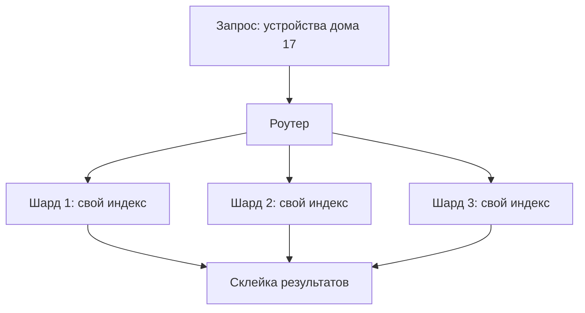
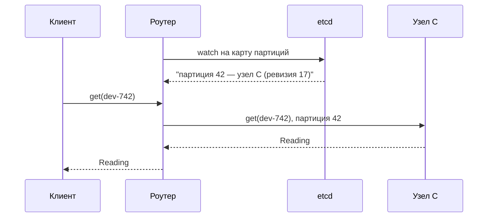

# Лекция 08. Партиционирование и балансировка: шардирование, consistent hashing

> **Дисциплина:** Распределённые системы и облачные технологии (РСиОТ)
> **Занятие:** лекция 8 из 28 · **Время:** 1 пара (80 мин)
> **Зачем это:** репликация (лекция 6) копирует одни и те же данные,
> но телеметрия миллиона датчиков не влезает ни на один узел, сколько
> копий ни делай. Сегодня — как **резать** данные на части, по какому
> ключу, что делать с «горячими» кусками и кто помнит, где какой кусок
> лежит. Конспект 2025 года сохранён в `archive_2025/`.

---

## Крючок: 73 часа тишины — цена одного непартиционированного кластера

> 🖥 **Слайд 2.** Крючок: Roblox, октябрь 2021

28 октября 2021 года платформа Roblox — около 50 миллионов игроков в
день — замолчала. Не «тормозила», не «частично деградировала» — легла
целиком. И лежала **73 часа**: три дня инженеры Roblox и HashiCorp искали
причину.

Сердцем инфраструктуры Roblox был **один центральный кластер Consul** —
сервис-каталог и координатор, через который ходили *все* рабочие нагрузки
компании. За день до сбоя включили новую функцию — streaming. Под
необычно высокой нагрузкой её дизайн упёрся в **contention на одном
Go-канале**: тысячи потоков толкались в одну дверь, записи блокировались.
Параллельно деградировало хранилище BoltDB под Raft-логом. Инженеры
заменили серверы с 64-ядерных на 128-ядерные — **не помогло вообще**:
когда все ломятся в одну точку, мощность точки не лечит очередь в неё.
А диагноз затянулся на дни ещё и потому, что мониторинг сам ходил через
Consul — наблюдаемость умерла вместе с пациентом.

В постмортеме Roblox среди главных выводов: один кластер Consul на всю
компанию — это и единая точка отказа, и горячая точка; лечение —
**распилить его на несколько кластеров** по нагрузкам и разнести по ЦОД.

Вопрос залу: **почему 128 ядер вместо 64 не помогли — и что помогло бы?**

Держите ответ до конца пары: сегодня мы научимся резать данные и
нагрузку на части так, чтобы никакая одна точка не собирала на себя всё.

*(Источник кейса: `sources/Веб-находки_Лекция_08.md` — официальный
постмортем Roblox «Return to Service» и разборы; дата доступа
10.08.2026.)*

---

## Квиз-извлечение (по лекции 7)

> 🖥 **Слайд 3.** Вспоминаем консенсус

Ответьте не подглядывая; ответы — в конце лекции.

1. Почему в одном терме Raft не может быть двух лидеров? Назовите два
   ключевых механизма.
2. Кластер etcd из 5 узлов, два сгорели безвозвратно. Принимает ли
   кластер записи и почему?
3. Что такое lease в etcd — и почему «у меня живой lease» ещё не значит
   «мне можно верить»? Что добавляет фенсинг-токен?
4. Кворум etcd под Kubernetes потерян. Что перестало работать, а что
   продолжает — и почему?

Эти четыре ответа сегодня понадобятся не для галочки: в конце пары
консенсус вернётся в неожиданной роли — хранителя карты шардов.

---

## Результаты обучения

> 🖥 **Слайд 4.** Чему научимся

После этой пары вы сможете:

1. Объяснить, чем партиционирование отличается от репликации и почему
   большим данным нужны оба.
2. Выбирать между партиционированием по диапазону и по хэшу ключа,
   называя цену каждого выбора.
3. Объяснить, почему `hash(key) % N` — мина замедленного действия, и как
   consistent hashing с виртуальными узлами её обезвреживает.
4. Распознавать горячие ключи и шарды и применять лекарства: соль,
   сплит, кэш.
5. Сравнивать локальные и глобальные вторичные индексы по цене чтения и
   записи.
6. Объяснить, где живёт знание «какой шард на каком узле» и причём здесь
   etcd из прошлой лекции.

## Пререквизиты

- Лекция 6: репликация, лидер/фолловеры, кворумы — партиционирование
  работает *поверх* репликации.
- Лекция 7: etcd, lease, фенсинг — сегодня им найдётся работа.
- Хэш-функции на уровне «одинаковый вход → одинаковый выход,
  распределение равномерное».

---

## Картина мира: ксерокс против ножниц

> 🖥 **Слайд 5.** Дорожная карта пары

Всю прошлую неделю мы множили копии: лидер, фолловеры, кворумы. Но
у репликации есть жёсткий предел, который мы честно записали ещё в
лекции 6: **копии масштабируют чтения, а записи — нет**. Каждая запись
приезжает на каждую реплику; и весь набор данных обязан влезать на
каждый узел целиком. Реплицируйте терабайт хоть на десять узлов —
у вас десять узлов, на каждом из которых лежит и пишется весь терабайт.

Сегодняшний инструмент противоположный. Репликация — это ксерокс:
одинаковые копии на разных узлах. **Партиционирование** — это ножницы:
данные режутся на непересекающиеся куски, и каждый узел отвечает только
за свой кусок. Десять узлов — по сто гигабайт на каждом, и поток записей
делится на десять ручьёв.

Аналогия на пару — **библиотека**. Один шкаф переполнился — книги
раскладывают по залам: А–Д сюда, Е–К туда. Немедленно рождаются все
сегодняшние вопросы. По какому правилу раскладывать — по алфавиту или
«как попало, но поровну»? Что делать, когда весь город пришёл за одной
книгой? Как найти книгу, если знаешь автора, а залы разложены по
названиям? И кто перетаскивает полки, когда открывается новый зал?

В реальных системах ножницы и ксерокс работают вместе: сначала данные
режутся на шарды, потом каждый шард реплицируется. Kafka, Cassandra,
MongoDB, YugabyteDB — везде эта пара. Сегодня мы сосредоточимся на
ножницах, помня, что под каждым куском — реплики из лекции 6.

Маршрут пары: зачем резать → резать по диапазону → резать по хэшу и
катастрофа `% N` → consistent hashing и кольцо → горячие ключи →
вторичные индексы → ребалансировка и карта шардов → ключ для
«СмартДома». По дороге — голосование, живой сеанс с кольцом и пауза.

---

## Основные понятия

**Определения** (пополним глоссарий в конце):

- **Партиция (шард)** — непересекающийся фрагмент данных, целиком
  живущий на одном узле (точнее — на одной группе реплик). Слова
  синонимичны: у Kafka это partition, у MongoDB — shard, у HBase —
  region; мы говорим «партиция» о данных и «шард» о куске базы.
- **Ключ партиционирования** — атрибут записи, по которому решают,
  в какую партицию она попадёт. Главное проектное решение сегодняшней
  темы.
- **Перекос (skew)** — неравномерность: одни партиции толстые и
  нагруженные, другие пустые. Партиционирование с перекосом — это
  расходы распределённой системы без её выгод.
- **Горячая точка (hot spot / hot shard)** — партиция или ключ,
  собирающие непропорциональную долю нагрузки.
- **Ребалансировка** — перераспределение партиций по узлам при росте
  данных или изменении состава кластера.

---

## Ядро пары

### 1. Зачем резать: три стены, в которые упирается ксерокс

> 🖥 **Слайд 6.** Репликация — копии, партиционирование — распил

Датчики «СмартДома» шлют показания. Посчитаем на салфетке: миллион
датчиков × одно показание `Reading` в 10 секунд × 100 байт — это
~860 ГБ **в сутки**, треть петабайта в год. Теперь три стены:

1. **Объём.** Весь набор обязан влезать на каждую реплику. Петабайт не
   влезает ни на какой разумный узел — точка. Данные придётся резать
   независимо от любых других соображений.
2. **Пропускная способность записи.** 100 000 записей в секунду
   приезжают на лидера — и на каждую реплику (лекция 6: записи копиями
   не масштабируются). Один узел столько не прожуёт. Десять партиций —
   десять независимых потоков записи по 10 000.
3. **Параллелизм чтения.** Отчёт «средняя температура по всем домам за
   месяц» на одном узле — часы; на пятидесяти партициях параллельно —
   минуты. Большая аналитика живёт партиционированием.

Заметьте, чего в списке **нет**: отказоустойчивости. Её дала репликация.
Партиционирование само по себе отказоустойчивость даже *ухудшает*: узлов
больше — вероятность, что хоть один лежит, выше. Поэтому в проде каждый
шард — это маленькая реплицированная система: у шарда есть свой лидер,
свои фолловеры, свой фейловер из лекции 6. Ножницы поверх ксерокса.

И вспомните крючок: Roblox упёрся именно в стену № 2 — все записи
координации толкались в одну точку. Добавление ядер (вертикальный
рост узла) стену не двигает; двигает её только распил.

### 2. Резать по диапазону: словарь с горячим хвостом

> 🖥 **Слайд 7.** Range: сканы даром, хвост горит

**Определения:** *range-партиционирование* — каждой партиции достаётся
непрерывный диапазон значений ключа: как тома энциклопедии «А–Г»,
«Д–К», «Л–Р», «С–Я».

Первый напрашивающийся способ — резать по диапазону ключа. История
показаний «СмартДома», ключ — время:

```text
Шард 1: Reading с 1 по 10 января
Шард 2: Reading с 11 по 20 января
Шард 3: Reading с 21 по 31 января
```

Сильная сторона немедленно видна: запрос «покажи график температуры за
15–18 января» попадает **в один шард**, и внутри него данные лежат
подряд — диапазонный скан дёшев, как чтение книги с закладки. Границы
диапазонов при этом выбирает система по факту наполнения (как тома
энциклопедии: «А–Г» толще «Х–Я» по числу слов, но одинаков по толщине),
так что *объём* распределяется ровно.

А теперь слабая сторона, и она смертельна для телеметрии. Куда идут все
**новые** показания? Время монотонно растёт — значит, каждая свежая
запись падает в последний диапазон. Один шард принимает 100 % записей
прямо сейчас, остальные — музей. Это называется **горячий хвост**: та же
болезнь у auto-increment ID и у любого монотонного ключа. Мы купили
дешёвые сканы по времени ценой того, что вся пишущая нагрузка снова
стоит в одну дверь — как будто и не партиционировали.

Range-партиционирование прекрасно, когда ключ не монотонный и читают
диапазонами: каталог товаров по названию, пользователи по фамилии.
Для потока событий по времени в чистом виде — антипаттерн.

### 3. Резать по хэшу — и катастрофа `hash % N`

> 🖥 **Слайд 8.** Хэш размазывает; `% N` мстит при решардинге

**Определения:** *hash-партиционирование* — партицию выбирают по хэшу
ключа: детерминированной функции, размазывающей любые ключи равномерно
по числовому диапазону.

Раз монотонный ключ создаёт горячий хвост — сломаем монотонность.
Прогоним ключ через хэш-функцию: соседние `device_id` разлетятся в
далёкие числа, распределение станет равномерным, горячий хвост исчезнет.
Цена честно указана на ценнике: **диапазонные сканы по ключу умирают** —
соседние значения ключа теперь в разных партициях, и запрос «за 15–18
января» превращается в опрос всех шардов.

Первая реализация, которую напишет каждый (и которую пишут в проде чаще,
чем хочется думать):

```python
shard_id = hash(key) % num_shards  # N = 4 узла
```

Работает. Равномерно. Быстро. А теперь бизнес растёт, и мы добавляем
пятый узел:

```python
hash("dev-742") % 4 == 2   # жил на шарде 2
hash("dev-742") % 5 == 0   # теперь должен жить на шарде 0
```

Остаток от деления зависит от делителя — при смене N новый адрес
получают **почти все ключи**. На 12 учебных ключах, которые мы через
десять минут разыграем руками, при переходе 3 → 4 узла переезжают 9 из
12 — три четверти. На проде это значит: добавили узел, чтобы снять
нагрузку, — и устроили миграцию 75 % данных по сети, под нагрузкой,
с промахом всех кэшей. Лекарство от перегрузки хуже болезни.

Забавно, что `% N` при этом живёт в проде совершенно легально — там, где
N жёстко фиксирован. Kafka выбирает партицию как
`murmur2(key) % numPartitions` — но число партиций топика задаётся при
создании и на практике не меняется: увеличить можно, только это ломает
привязку ключей к партициям (об этом — в конце пары). А для систем, где узлы
приходят и уходят, нужен способ добавлять узел, не перетряхивая всё.
Он появился в 1997 году и называется consistent hashing — до него
доберёмся сразу после голосования.

#### Peer-instruction-вопрос

> 🖥 **Слайды 9–13.** Голосование PI → четыре разбора

Голосуем, обсуждаем с соседом 90 секунд, голосуем снова.

> Проектируем хранилище истории `Reading` «СмартДома»: миллион устройств,
> постоянный поток записей, типичный запрос — «график датчика X за
> последние сутки». По какому ключу партиционировать?
>
> A. По `timestamp` показания — свежие данные рядом, отчёты за период
> быстрые.
> B. По `device_id` — показания одного устройства вместе, поток записи
> размазан по всем шардам.
> C. По `hash(reading_id)` (UUID каждого показания) — идеально
> равномерное распределение записей.
> D. По `home_id` — все устройства одного дома вместе, запросы по дому
> локальны.

Разбор — в конце лекции. Подсказка: один вариант — горячий хвост из
раздела 2, один — идеальная равномерность, за которую заплатит каждое
чтение, один — почти правильный, но прячет в себе дом-гигант.

### 4. Consistent hashing: кольцо, на котором соседи не толкаются

> 🖥 **Слайд 14 — пауза 60 секунд, затем слайды 15–16.** Кольцо и
> виртуальные узлы

**Определения:** *consistent hashing* — схема, в которой и узлы, и ключи
хэшируются в одно циклическое пространство (кольцо), и ключ принадлежит
ближайшему узлу по часовой стрелке; при изменении числа узлов переезжает
в среднем лишь `K/N` ключей. *Виртуальный узел (vnode)* — одна из многих
точек, которыми физический узел представлен на кольце.

Идея красива настолько, что заслуживает медленной подачи. Возьмём
выход хэш-функции — скажем, числа от 0 до 2³²−1 — и **свернём в кольцо**:
после максимума снова ноль, как на циферблате.

Теперь хэшируем на это кольцо **и узлы, и ключи**. Узел A попал в точку
0, узел B — в 120, узел C — в 240 (для наглядности будем считать кольцо
циферблатом на 360 делений). Правило маршрутизации одно: **ключ обслуживает
первый узел по часовой стрелке** от точки ключа.

```text
        0 = узел A
       /         \
   (240,360] → A  (0,120] → B
      |               |
 240 = узел C     120 = узел B
       \         /
        (120,240] → C
```

Ключ с хэшем 17 идёт по часовой к 120 — узел B. Ключ 138 — к 240,
узел C. Ключ 289 — к 360=0, узел A.

Магия начинается при изменении состава. Добавим узел D в точку 60.
Что изменилось? **Только дуга (0, 60]**: её ключи раньше шли к B, теперь
их перехватывает D. Ключи на всех остальных дугах даже не заметили
события — их узел по часовой стрелке не изменился. Переезжает в среднем
`1/N` данных — ровно тот кусок, который новый узел и должен взять на
себя. Сравните с `% N`, где переезжали три четверти. Удаление узла
симметрично: его дуга достаётся следующему по часовой, остальные не
шелохнулись.

Одна беда: при малом числе узлов кольцо несправедливо. Три узла,
хэшированные случайно, почти наверняка разрежут кольцо на дуги очень
разной длины — кому-то достанется половина кольца. И при выпадении узла
вся его дуга целиком падает на одного соседа — здравствуй, каскад.

Лечение — **виртуальные узлы**: физический узел ставит на кольцо не одну
точку, а сотню-другую: `hash("nodeA-0")`, `hash("nodeA-1")`, …
Дуги становятся мелкими и перемешанными; по закону больших чисел
суммарная доля каждого физического узла выравнивается. Бонусы: при
выпадении узла его мелкие дуги разлетаются **по всем** соседям, а не
падают на одного; мощному серверу можно дать больше виртуальных точек —
и он честно возьмёт больше данных.

Так работает семейство систем, выросших из статьи Amazon Dynamo (2007):
Cassandra (Murmur3 + vnodes), Riak, ScyllaDB. Поучительная деталь из
прода: Cassandra годами ставила по умолчанию 256 vnodes на узел, а
с версии 4.0 default снижен до **16** — избыток виртуальных узлов
замедлял repair и стриминг. Запомните этот факт до разговора про «шардов
побольше про запас».

### 5. Живой сеанс: кольцо из двенадцати ключей

> 🖥 **Слайд 17.** Живой сеанс: 3 узла → 4 узла двумя способами

Строим вместе на доске (7–10 минут; ход мысли важнее арифметики).
Вопрос модели: **сколько данных переедет при добавлении узла — кольцом
и через `% N`?**

Шаг 1 — кольцо на 360 делений, узлы A=0, B=120, C=240. Выписываем
12 ключей-устройств с уже посчитанными хэшами:

```text
17, 42, 75, 103, 138, 166, 194, 227, 256, 289, 315, 348
```

Шаг 2 — раздаём ключи по правилу «первый узел по часовой стрелке»:

```text
B (дуга 0–120):   17, 42, 75, 103
C (дуга 120–240): 138, 166, 194, 227
A (дуга 240–360): 256, 289, 315, 348
```

По четыре на узел — кольцо уже распределило ровно (в реальности ровность
дают виртуальные узлы, у нас хэши «легли удачно» для наглядности).

Шаг 3 — врывается узел D в точку 60. Проверяем каждый ключ: изменился ли
его «первый узел по часовой»? Только для дуги (0, 60]: ключи **17 и 42**
переезжают B → D. Остальные десять не тронуты. Итог: переехало 2 из 12
(~17 %), близко к теоретическим `1/N` = 25 %.

Шаг 4 — теперь то же самое, но по-старому: `hash % 3` → `hash % 4`.
Считаем прямо на доске:

```text
ключ   %3  %4   переезд?
 17     2   1   да        138    0   2   да        256    1   0   да
 42     0   2   да        166    1   2   да        289    1   1   нет
 75     0   3   да        194    2   2   нет       315    0   3   да
103     1   3   да        227    2   3   да        348    0   0   нет
```

Переехало **9 из 12** — 75 %. Одна и та же задача «добавить четвёртый
узел»: кольцо трогает два ключа, остаток от деления — девять.

Вывод на доску: **кольцо локализует изменение — переезжает только дуга
нового узла; `% N` глобально перемешивает адреса.** Заметьте, чего в
модели нет: репликации, сетевых протоколов, отказов — вопрос был только
про «сколько переедет», и модель отвечает ровно на него.

### 6. Горячие ключи: проблема знаменитости

> 🖥 **Слайд 18.** Знаменитость ломает любой хэш

Хэш размазывает **ключи**. Но он бессилен, если нагрузка сконцентрирована
в **одном ключе**: все запросы к нему честно приходят в одну партицию.
В соцсетях это «celebrity problem» — пост звезды с миллионами лайков
перегревает свой шард. В «СмартДоме» знаменитости прозаичнее: датчик
со сломанной прошивкой, шлющий показания тысячу раз в секунду вместо
раза в десять секунд; интеграция, опрашивающая одно устройство в цикле
без паузы; дом-отель с тысячей датчиков против квартир с десятком.

Это задокументированный режим отказа реальных облачных БД: в DynamoDB
у каждой партиции жёсткий потолок (3000 единиц чтения и 1000 записи в
секунду), и один горячий ключ ловит троттлинг, даже когда таблице
выделена ёмкость в разы больше — соседние партиции простаивают, а ваша
очередь стоит. Три лекарства, по нарастанию цены:

1. **Кэш перед партицией.** Горячее чтение снимается кэшем (Redis из
   лекции 2, DynamoDB DAX): тысяча чтений одного ключа превращается
   в одно чтение БД и тысячу попаданий в кэш. Не помогает записи.
2. **Сплит партиции.** Разрезать горячую партицию на две и развезти по
   узлам — так делает автоматика DynamoDB (adaptive capacity, «split for
   heat») и MongoDB balancer. Не помогает, если горяч **один ключ**:
   ключ неделим, он целиком уедет в одну из половин.
3. **Соль (salting).** Расщепить сам ключ: писать не в `dev-742`, а в
   `dev-742#0` … `dev-742#9`, выбирая суффикс случайно. Запись
   размазывается по 10 партициям. Цена честная: каждое чтение истории
   этого устройства теперь собирает **все 10** осколков (scatter-gather).
   Поэтому солят точечно — только реальные горячие ключи, а не всё
   подряд.

Правило: сначала измерь (метрики по-партиционно — какая горячая?), потом
режь. И вспомните Roblox: их «знаменитостью» был сам Consul — одна
координационная точка на всю компанию. Соль и сплит там назывались
«распилить кластер на несколько».

### 7. Вторичные индексы: платить при чтении или при записи

> 🖥 **Слайд 19.** Local против global: scatter-gather против двойной записи

**Определения:** *вторичный индекс* — поиск записей не по ключу
партиционирования, а по другому атрибуту («все датчики протечки», «все
устройства с прошивкой 2.1»). *Scatter-gather* — опрос всех партиций
с последующей склейкой результатов.

Партиционировали `Reading` по `device_id` — а служба поддержки
спрашивает: «покажи все устройства дома № 17». Ключ не тот. Два способа
устроить индекс по чужому атрибуту:

**Локальный индекс** (document-partitioned): каждый шард индексирует
только свои данные. Запись дешёвая — данные и индекс обновляются на
одном шарде одной операцией. Зато читать приходится **везде**:



Задержка такого чтения — **максимум** из задержек шардов: вспомните
p99 из лекции 1 — чем больше шардов, тем вероятнее зацепить чей-то
хвост. Один тормозящий шард тормозит каждый scatter-gather запрос.

**Глобальный индекс** (term-partitioned): индекс — отдельная структура,
сама партиционированная по индексируемому атрибуту. Все ссылки «дом
№ 17 → такие-то устройства» лежат в одном месте: чтение — два точных
запроса (индекс, затем данные) вместо опроса всех. Зато каждая запись
устройства теперь обновляет **две** партиции — свою и индексную,
возможно на разных узлах. Атомарно и синхронно — это распределённая
транзакция (дорого, лекция 11); поэтому в проде глобальные индексы
обычно обновляются **асинхронно** и слегка отстают от данных — знакомая
по лекции 5 eventual consistency, теперь внутри одной БД. Так устроены
Global Secondary Indexes в DynamoDB.

Правило выбора то же, что всюду сегодня: локальный индекс — платит
читатель, глобальный — платит писатель (и честность индекса). Частые
точечные чтения по атрибуту → глобальный; редкие аналитические → хватит
локального.

### 8. Ребалансировка и карта шардов: кто перетаскивает полки и кто помнит, где что

> 🖥 **Слайды 20–21.** Стратегии ребалансировки → маршрутизация запросов

Данные растут, узлы приходят и уходят — партиции надо перекладывать.
Две продовые стратегии помимо кольца:

- **Фиксированное число партиций.** Нарезать партиций сильно больше,
  чем узлов, — и навсегда. Redis Cluster: ровно **16384 слота**,
  `CRC16(key) % 16384`; слот — неделимая единица переезда. Kafka: число
  партиций топика фиксируется при создании (добавить можно, но привязка
  ключей сломается — потому задают с запасом и не трогают).
  Ребалансировка = перекладывание
  целых партиций на новые узлы; сами ключи внутри партиций не
  перехэшируются никогда — вот почему тамошний `% N` безопасен: N — это
  число партиций, и оно не меняется. Цена: число надо угадать заранее
  (мало — упрётесь, много — накладные расходы на каждую).
- **Динамический сплит.** Партиций мало, но при росте сверх порога
  (например, 10 ГБ) партиция автоматически делится пополам, при усыхании
  — сливается. Так живут HBase и MongoDB. Число партиций подстраивается
  под данные само; цена — сложность механизма и миграции в момент
  сплита.

И общее правило любых стратегий: ребалансировка — это **фоновая**
миграция с ограничением скорости. Она гоняет гигабайты по той же сети,
которая обслуживает клиентов; ребалансировка на полной скорости в час
пик — самодельный DDoS (retry storm из лекции 1 передаёт привет).

Остался последний вопрос пары — на первый взгляд бытовой, на деле
глубокий: клиент хочет `dev-742`. **Кто знает, на каком узле его
партиция?** Три варианта, где жить этому знанию:

1. **Знает каждый узел** — спрашивай любой, он перешлёт куда надо или
   ответит сам (gossip-протокол, так делает Cassandra: любой узел —
   координатор).
2. **Знает прокси-роутер** — клиенты ходят в лёгкий маршрутизатор, тот
   держит карту (mongos в MongoDB).
3. **Знает сам клиент** — драйвер кэширует карту партиций и бьёт сразу
   в нужный узел (smart-клиенты Kafka, Redis Cluster).

Но в каждом варианте под картой лежит один и тот же вопрос: «партиция 42
принадлежит узлу C» — это **маленький критичный факт, о котором все
обязаны думать одинаково**. Узнаёте формулировку? Это дословно критерий
из лекции 7: карту шардов хранят в консенсусном хранилище — etcd,
ZooKeeper (HBase, Kafka до KRaft), или во встроенном Raft-модуле. Если
два узла одновременно считают себя владельцами партиции — это split
brain на уровне данных: два узла принимают записи в один диапазон
ключей, и слово «фенсинг» из прошлой пары снова в деле.



Отдельная красота: роутер сидит на `watch` (лекция 7) — при переезде
партиции etcd сам пришлёт обновление карты, никто ничего не опрашивает
в цикле.

### 9. «СмартДом»: выбираем ключ и заглядываем в Kafka

> 🖥 **Слайд 22.** Ключ для Reading + трейлер лекции 12

Соберём пару в одно проектное решение. История `Reading`: миллион
устройств, сплошной поток записей, главный запрос — «график датчика за
период». Прогоним кандидатов в ключи через сегодняшние фильтры:

- **`timestamp`** — монотонный ключ, горячий хвост из раздела 2: 100 %
  записей в одну партицию. Отпадает первым.
- **`hash(reading_id)`** — идеальная равномерность записи, но история
  одного устройства размазана по всем шардам: каждый график —
  scatter-gather. Платим на каждом чтении. Отпадает.
- **`home_id`** — локальность по дому хороша для правил `Rule` (они
  смотрят на устройства одного дома), но дома чудовищно разного размера:
  отель с тысячей датчиков — готовая знаменитость.
- **`device_id`** — миллион устройств пишут одновременно → запись
  размазана по всем партициям; график датчика — чтение одной партиции.
  Оба главных потока довольны.

Победил `device_id`, но настоящий продовый ответ — **составной ключ**
`(device_id, timestamp)`: по `device_id` выбираем партицию (хэшем),
внутри партиции записи лежат **отсортированными по времени** — и запрос
«датчик X за сутки» становится дешёвым range-сканом внутри одной
партиции. Хэш снаружи, диапазон внутри: обе стратегии пары в одном
ключе. Ровно так проектируют ключи в Cassandra (partition key +
clustering key) и во временны́х БД. Остаточный риск — датчик-психопат из
раздела 6 — лечится точечной солью по факту, по метрикам.

Тот же выбор ключа вернётся через месяц с другой стороны: в лекции 12
телеметрия поедет через **Kafka**, где топик разрезан на партиции, ключ
сообщения — `device_id`, и Kafka гарантирует порядок **только внутри
партиции**. Выберете ключом `home_id` — потеряете порядок показаний
датчика; выберете `reading_id` — потеряете его же. Решение о ключе
партиционирования — одно из самых дорогих в системе: оно зашивается и в
хранилище, и в шину событий, и менять его потом — это миграция всего.

Последний штрих — терминологическая граница. Всё сегодняшнее —
**балансировка данных**: где лежат и пишутся байты. Есть и вторая
балансировка — **запросов**: load balancer, раскидывающий HTTP-запросы
по одинаковым stateless-репликам API. Там нет ключа и нет владения
данными — любой инстанс обслужит любой запрос, потому и алгоритмы
простые (round-robin, least-connections). Это тема лекции 17 (DNS, LB,
L4/L7); краткий обзор — в приложении. Не путайте: LB делит **работу**
между равными, партиционирование делит **данные** между владельцами.

---

## Типичные ошибки (запомните до того, как совершите)

> 🖥 **Слайд 23.** Типичные ошибки

1. **«Зашардируем через `hash % N` — чего мудрить».** Пока N не
   изменился — ничего. Добавили узел — переезд 75–80 % данных под
   нагрузкой. Кольцо или фиксированные партиции — с первого дня.
2. **«Ключ по времени — удобно же строить отчёты».** Монотонный ключ =
   горячий хвост: пишет одна партиция, остальные отдыхают. Время —
   внутрь партиции (clustering key), наружу — высококардинальный ключ.
3. **«Нарежем 10 000 шардов про запас — это бесплатно».** У каждой
   партиции есть цена: файлы, метаданные, соединения, время фейловера.
   Cassandra не зря снизила дефолт vnodes с 256 до 16.
4. **«Хэш равномерный — значит, горячих точек не будет».** Хэш
   размазывает ключи, а не популярность. Один бешеный датчик греет свою
   партицию при идеальном хэше. Мониторинг по-партиционный, соль — по
   факту.
5. **«Партиционирование заменяет репликацию».** Распил без копий — это
   потеря 1/N данных при первом же отказе узла. Каждый шард обязан быть
   реплицирован (лекция 6).

---

## Квиз-закрепление (по этой паре)

> 🖥 **Слайд 24.** Закрепление

Ответьте не подглядывая; ответы — в конце лекции.

1. Чем партиционирование отличается от репликации по цели — и почему
   записи масштабирует только первое?
2. При добавлении узла: сколько данных переезжает при `hash % N` и
   сколько при consistent hashing? Почему такая разница?
3. Телеметрию партиционировали по `timestamp`. Что произойдёт и как
   называется этот эффект?
4. Kafka выбирает партицию как `murmur2(key) % numPartitions` — то есть
   `% N`. Почему там это не катастрофа?

---

## Вопросы для самопроверки

1. Три причины партиционировать данные. Какая из них главная для
   истории `Reading` «СмартДома»?
2. Почему репликация не решает проблему объёма данных и пропускной
   способности записи?
3. Range-партиционирование: за что его любят аналитики и почему оно
   опасно для потока событий?
4. Опишите катастрофу решардинга при `hash % N` на конкретных числах.
5. Как устроено кольцо consistent hashing? Что переезжает при
   добавлении узла и что — при удалении?
6. Зачем нужны виртуальные узлы? Назовите три эффекта, которые они дают.
7. Что такое горячий ключ и почему хэширование от него не спасает?
   Три лекарства и цена каждого.
8. Соль (salting) ключа: как работает, что ускоряет, что замедляет?
9. Локальный и глобальный вторичный индекс: кто платит в каждом случае
   и чем?
10. Почему scatter-gather чтение тем хуже, чем больше шардов? Свяжите
    с p99 из лекции 1.
11. Две стратегии ребалансировки помимо кольца — как работают и чем
    платят Redis Cluster и MongoDB?
12. Три места, где может жить карта «партиция → узел». Почему сама карта
    — работа для консенсуса из лекции 7?
13. Составной ключ `(device_id, timestamp)`: что даёт внешняя часть и
    что — внутренняя?
14. Чем балансировка данных отличается от балансировки запросов?
15. Вернитесь к крючку: что именно в архитектуре Roblox было
    «непартиционированным» и как это связано с 73 часами простоя?

---

## Мост к лекции 9 и лабораторной № 3

> 🖥 **Слайд 25.** Мост: отказ шарда ≠ отказ системы

Мы научились резать данные так, что система переживает рост. Следующий
вопрос — переживёт ли она **отказ**. Заметьте, что партиционирование
изменило саму природу сбоя: раньше «база лежит» значило «лежит всё»,
теперь отказ одного шарда — это «потерян 1 % данных и 1 % пользователей,
остальные 99 % не должны ничего заметить». Не должны — но заметят, если
таймауты не настроены, а один тормозящий шард через scatter-gather
тащит за собой каждый запрос. Лекция 9 — отказоустойчивость: таймауты,
circuit breaker, backpressure, chaos engineering — и лаба 3 (
`tasks/task_03`), где вы будете убивать собственные сервисы и смотреть,
что выжило. Всё сегодняшнее там пригодится: перегретый шард — первый
кандидат на circuit breaker.

**Задание на 1 предложение** (письменно, в конспект): закончите фразу
«Умение выбрать ключ партиционирования пригодится лично мне, потому
что…» — конкретно, про свои проекты. На следующей паре спрошу троих
добровольцев.

---

## Глоссарий

> 🖥 **Слайд 26 (финал).** Вопросы + литература

| Термин | Определение |
| --- | --- |
| Партиция / шард | Непересекающийся фрагмент данных, живущий на одной группе реплик |
| Ключ партиционирования | Атрибут записи, определяющий её партицию |
| Range-партиционирование | Партиция = непрерывный диапазон значений ключа |
| Hash-партиционирование | Партиция выбирается по хэшу ключа |
| Горячий хвост | Все записи монотонного ключа падают в последнюю партицию |
| Consistent hashing | Узлы и ключи на одном кольце; ключ — первому узлу по часовой; переезд ~K/N |
| Виртуальный узел (vnode) | Одна из многих точек физического узла на кольце |
| Горячий ключ / шард | Ключ или партиция с непропорциональной нагрузкой |
| Соль (salting) | Расщепление горячего ключа суффиксами ценой scatter-gather при чтении |
| Scatter-gather | Опрос всех партиций со склейкой результатов |
| Локальный индекс | Индекс своих данных на каждом шарде: дёшево писать, дорого читать |
| Глобальный индекс | Индекс, партиционированный по атрибуту: дёшево читать, дорого писать |
| Ребалансировка | Фоновое перераспределение партиций по узлам |
| Карта партиций | «Партиция → узел»; маленький критичный факт, живёт в консенсусном хранилище |

## Список литературы

1. Основная литература
   - [1] Клеппман М. — «Высоконагруженные приложения» (Designing
     Data-Intensive Applications). O'Reilly / Питер. Глава 6
     «Партиционирование».
2. Дополнительная литература
   - [2] DeCandia G. и др. — «Dynamo: Amazon's Highly Available
     Key-value Store» (SOSP 2007) — статья-родоначальник consistent
     hashing с виртуальными узлами в промышленных хранилищах.
3. Интернет-ресурсы
   - [3] Постмортем Roblox «Return to Service», документация AWS по
     горячим партициям DynamoDB, материалы по vnodes Cassandra и слотам
     Redis Cluster — подборка с URL в `sources/Веб-находки_Лекция_08.md`
     (дата обращения: 10.08.2026).

---

## Ответы

### Ответы: квиз-извлечение

1. Кандидату нужно **большинство** голосов, а каждый узел голосует
   **один раз за терм** — два большинства в одном терме обязаны
   пересечься, и узел в пересечении дважды не голосует.
2. Принимает: 3 из 5 — живое большинство, кворум и для выборов, и для
   коммита записей. Отказ меньшинства — расчётный режим Raft.
3. Lease — аренда с TTL, продлеваемая keep-alive; она решает, *кто
   работает*, но зависший экс-лидер может очнуться после истечения
   lease и продолжить слать команды. Фенсинг-токен (монотонная ревизия
   etcd) решает, *кому верить*: приёмник отбрасывает всё со старым
   номером.
4. Control plane становится read-only: нельзя деплоить, скейлить,
   менять конфигурацию (вся память Kubernetes — в etcd). Но поды,
   сервисы и трафик живут: kubelet на узлах автономен.

### Ответы: peer instruction

Правильный ответ — **B** (`device_id`), а в полном виде — составной ключ
`(device_id, timestamp)`: хэш по устройству размазывает запись, время
внутри партиции даёт дешёвый скан истории.

- A (`timestamp`) — горячий хвост: время монотонно, все новые показания
  падают в последнюю партицию — пишет один узел, остальные музей.
  Раздел 2 в чистом виде.
- C (`hash(reading_id)`) — равномерность есть, но показания одного
  датчика разлетаются по всем шардам: каждый график — scatter-gather по
  всему кластеру, задержка равна максимуму из шардов. Платите на каждом
  чтении за равномерность, которая была и у варианта B.
- D (`home_id`) — почти хорошо (локальность для правил дома), но
  кардинальность ниже, дома радикально разного размера, и дом-отель —
  готовая знаменитость. Плюс порядок показаний в Kafka по этому ключу
  гарантирован на дом, а не на датчик — графики поедут.

### Ответы: квиз-закрепление

1. Репликация — **копии** ради отказоустойчивости и масштабирования
   чтений; партиционирование — **распил** ради объёма и масштабирования
   записей. Каждая запись приезжает на каждую реплику — копии поток
   записи не делят; партиции делят.
2. `% N` — почти все ключи (в живом сеансе 9 из 12, ~75 %): остаток
   зависит от делителя. Кольцо — в среднем `K/N` (2 из 12): меняется
   владелец только одной дуги.
3. Все новые показания идут в партицию последнего диапазона: один узел
   принимает 100 % записей. «Горячий хвост» монотонного ключа.
4. N там — число **партиций топика**, а не узлов; оно фиксируется при
   создании (увеличить можно, но это ломает привязку ключей — потому не
   трогают). Партиции целиком перекладываются между брокерами — ключи
   не перехэшируются.

---

## Приложение: для любознательных

Материал за рамками 80 минут; пригодится в лабах, на экзамене не
спрашивается сверх лекции.

### A. Балансировка запросов: L4/L7, алгоритмы, health checks

Краткая карта темы до лекции 17. Балансировщик **L4** работает на уровне
TCP/UDP: видит только IP и порт, быстр, протокол-независим (AWS NLB,
HAProxy в tcp-режиме). **L7** разбирает HTTP: умеет маршрутизировать по
URL и заголовкам, терминировать TLS, переписывать запросы — ценой
парсинга (NGINX, Envoy, AWS ALB).

Алгоритмы: **round robin** (по кругу; хорош при одинаковых запросах),
**weighted round robin** (мощным — больше), **least connections** (кому
сейчас легче), **least response time** (по метрикам), **consistent
hashing по клиенту/URL** (липкость сессий и кэш-локальность; Envoy
`RING_HASH`, NGINX `hash ... consistent`). Health checks: активные
(периодический `GET /health`, исключение после N провалов — в HAProxy
`check inter 5s fall 3 rise 2`) и пассивные (наблюдение за ошибками
реальных запросов). Обратите внимание: consistent hashing пригодился и
здесь — те же ножницы, только режут не данные, а клиентов по бэкендам.

### B. Геораспределение данных

Гео-шардирование — партиционирование по географии: данные европейцев в
европейском регионе (задержка + GDPR-комплаенс). Маршрутизация к
ближайшему региону: GeoDNS, anycast, CDN. Мультирегиональные БД:
CockroachDB (гео-партиции таблиц), Google Spanner (внешняя
консистентность на TrueTime — вспомните лекцию 4), AWS Aurora Global
Database. Цена — знакомый по PACELC выбор: синхронная межрегиональная
запись = сотни миллисекунд задержки, асинхронная = отставание реплик.
Cross-region запросы (немец заказывает товар из Японии) остаются болью
любой геосхемы.

### C. Стратегии ребалансировки — подробности

Помимо разобранных: **пропорциональное партиционирование** — число
партиций пропорционально числу узлов (Cassandra: vnodes на узел), при
добавлении узла создаются новые точки на кольце, забирающие дуги
понемногу у всех. Практические правила любой миграции: инкрементальный
перенос батчами с паузами, переключение маршрутизации только после
полного копирования партиции, удаление источника — последним шагом,
лимит скорости, чтобы фоновая миграция не съела полосу продакшена.

### D. Consistent hashing на Python (каркас для самостоятельной игры)

```python
import hashlib
from bisect import bisect_right

class ConsistentHash:
    def __init__(self, vnodes=150):
        self.vnodes = vnodes
        self.ring = {}          # hash -> имя узла
        self.sorted_keys = []   # отсортированные хэши кольца

    def _hash(self, key: str) -> int:
        return int(hashlib.md5(key.encode()).hexdigest(), 16)

    def add_node(self, node: str) -> None:
        for i in range(self.vnodes):
            self.ring[self._hash(f"{node}#{i}")] = node
        self.sorted_keys = sorted(self.ring)

    def remove_node(self, node: str) -> None:
        for i in range(self.vnodes):
            del self.ring[self._hash(f"{node}#{i}")]
        self.sorted_keys = sorted(self.ring)

    def get_node(self, key: str) -> str:
        h = self._hash(key)
        idx = bisect_right(self.sorted_keys, h) % len(self.sorted_keys)
        return self.ring[self.sorted_keys[idx]]
```

**Пояснение к примеру.** Кольцо — словарь «хэш → узел» плюс
отсортированный список хэшей; поиск владельца — бинарный поиск первого
хэша не меньше ключа (`bisect_right`), с заворотом на начало через
`% len` — это и есть «первый узел по часовой стрелке».

**Проверка.** Добавьте 4 узла, распределите 10 000 ключей
`f"dev-{i}"`, посчитайте по узлам — доли должны быть 25 % ± пара
процентов. Добавьте пятый узел и посчитайте долю ключей, сменивших
владельца, — должно выйти ~20 % (`1/N`), а не ~80 %, как при `% N`.

**Типичные ошибки.** (1) Забыть пересортировать `sorted_keys` после
добавления/удаления узла. (2) Не обработать заворот кольца — ключ с
хэшем больше максимального узла обязан достаться первому узлу.
(3) Слишком мало виртуальных узлов — перекос долей; поиграйте с
`vnodes=1` и посмотрите на разброс. (4) Использовать `random` вместо
хэша — распределение перестанет быть детерминированным, ключ «переедет»
при каждом запуске.
