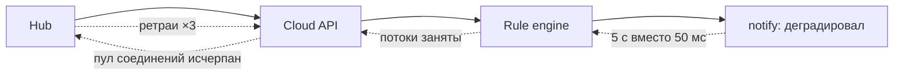

# Лекция 09. Отказоустойчивость: таймауты, circuit breaker, backpressure, chaos engineering

> **Дисциплина:** Распределённые системы и облачные технологии (РСиОТ)
> **Занятие:** лекция 9 из 28 · **Время:** 1 пара (80 мин)
> **Зачем это:** в лекции 1 вы получили «аптечку первого дня» — таймаут,
> ретрай, идемпотентность, circuit breaker. Сегодня аптечка превращается в
> инженерную дисциплину: как отказ одного узла НЕ превратить в отказ всей
> системы — и как проверять это специально устроенными авариями.

---

## Крючок: null pointer, уронивший половину интернета

> 🖥 **Слайд 2.** Крючок: сбой Google Cloud 12.06.2025

12 июня 2025 года, 10:49 по тихоокеанскому времени. В Service Control —
компонент Google Cloud, который проверяет квоты и политики **на пути каждого
API-запроса**, — прилетает обновление политики с пустыми полями. Свежий код,
выехавший без обработки ошибок и без feature-флага, ловит null pointer, и
бинарь уходит в crash loop. Не в одном регионе — **во всех сразу**: политики
реплицируются глобально за секунды.

Три часа Compute Engine, Cloud Storage, BigQuery, Gmail — сотни сервисов —
отдают 503. Лежат и чужие продукты: Cloudflare WARP, Spotify, Discord.
А когда пожар потушили, регион us-central1 ещё долго не мог встать:
логика повторов у клиентов не имела случайного сдвига — восстановление
добивал **шторм ретраев**, и инженеры дросселировали трафик вручную.

Вопрос залу: **что здесь страшнее — сам null pointer или то, как система
на него отреагировала?**

Ответ держите до конца пары. Заметьте: баг был тривиальный, а вот
*распространение* отказа — глобальный crash loop плюс вторая волна из
ретраев — это ровно то, чем сегодня займёмся.

*(Источник кейса: `sources/Веб-находки_Лекция_09.md` — разборы ThousandEyes
и The Register; дата доступа 09.08.2026.)*

---

## Квиз-извлечение (по лекции 8: партиционирование)

> 🖥 **Слайд 3.** Квиз-извлечение

Ответьте не подглядывая; ответы — в конце лекции.

1. Что такое шардирование и какую из «четырёх стен» лекции 1 оно пробивает?
2. Почему хеширование по `device_id % N` ломается при добавлении узла — и
   как эту проблему решает consistent hashing?
3. Что такое «горячий ключ» (hot key)? Приведите пример из «СмартДома».
4. Чем ребалансировка «всё переехало» отличается от ребалансировки
   «переехал минимум» и почему это важно под нагрузкой?

---

## Результаты обучения

> 🖥 **Слайд 4.** Чему научимся

После этой пары вы сможете:

1. Объяснить анатомию каскадного отказа: как локальная авария
   распространяется через разделяемые ресурсы, очереди и ретраи.
2. Строить бюджет таймаутов вдоль цепочки вызовов.
3. Проектировать безопасные ретраи: какие ошибки повторять, где в цепочке
   ретраить и как ограничить повторы бюджетом.
4. Настраивать circuit breaker и объяснять его три состояния.
5. Применять изоляцию (bulkhead, rate limiting) и backpressure с load
   shedding вместо «бесконечных» очередей.
6. Считать error budget и burn rate; планировать chaos-эксперимент по
   канону: steady state → гипотеза → минимальный blast radius.

## Пререквизиты

- Лекция 1: аптечка надёжности, SLI/SLO, p99, четыре сценария «нет ответа».
- Лекция 3: идемпотентность, ретраи, коды ошибок HTTP.
- Лаба 1: Docker и docker-compose — на них построен живой сеанс.

---

## Картина мира: авария — это не событие, а процесс

> 🖥 **Слайд 5.** Дорожная карта пары

На корабле пробоина в одном отсеке — неприятность; пробоина в корабле без
переборок — катастрофа. «Титаник» утонул не потому, что столкнулся с
айсбергом, а потому, что вода перетекала через переборки, оказавшиеся
слишком низкими.

Распределённая система без защит устроена так же: отказ одного узла —
норма (лекция 1), но через **разделяемые ресурсы** (пулы соединений,
потоки, память), **растущие очереди** и **неограниченные ретраи** локальная
авария перетекает в соседние отсеки. Это называется **каскадный отказ** —
и все сегодняшние инструменты суть переборки, клапаны и предохранители,
которые останавливают перетекание.

Маршрут пары: анатомия каскада → таймауты → ретраи всерьёз → circuit
breaker → изоляция → backpressure → error budget и деградация → chaos
engineering: ломаем сами, пока не сломалось само. По дороге — два квиза,
одно голосование и один живой сеанс с настоящей аварией.

---

## Основные понятия

**Определения** (пополним глоссарий в конце):

- **Каскадный отказ** — распространение локального отказа на соседние
  компоненты через разделяемые ресурсы, очереди и повторные запросы.
- **Fail fast** — отвечать ошибкой сразу, не тратя ресурсы на заведомо
  обречённый вызов; противоположность «висеть до таймаута».
- **Backpressure** («обратное давление») — механизм, которым перегруженный
  потребитель сообщает производителю «помедленнее» — вместо молчаливого
  накопления очереди.
- **Load shedding** («сброс нагрузки») — намеренный отказ части запросов
  при перегрузке, чтобы выжили остальные.
- **Blast radius** — «радиус поражения»: сколько пользователей/функций
  задевает единичный отказ или эксперимент.

---

## Ядро пары

### 1. Анатомия каскадного отказа

> 🖥 **Слайд 6.** Анатомия каскада

Проследим типичный сценарий на «СмартДоме». Сервис уведомлений
(`notify`) начал отвечать за 5 секунд вместо 50 миллисекунд — например,
у него распухла база.



Механика перетекания, шаг за шагом:

1. `Rule engine` ждёт ответа `notify`. Его потоки заняты ожиданием — он
   перестаёт принимать новые события.
2. `Cloud API` держит соединения к `Rule engine` — пул исчерпан, новые
   запросы Hub'ов ждут в очереди.
3. Hub'ы не дожидаются ответа и **ретраят** — нагрузка на больную систему
   удваивается и утраивается.
4. Итог: деградация одного второстепенного сервиса положила весь приём
   телеметрии. Отказала не машина — отказала *связность без переборок*.

Заметьте: каждый участник вёл себя «разумно» — ждал, держал соединение,
повторял. Каскад — эмерджентное свойство системы, а не чья-то ошибка.
Инцидент Google из крючка — тот же учебник: crash loop одного компонента
на пути всех запросов (максимальный blast radius) плюс шторм ретраев на
восстановлении.

### 2. Таймауты всерьёз: бюджет вдоль цепочки

> 🖥 **Слайд 7.** Бюджет таймаутов

Из лекции 1 вы знаете: таймаут выбирается по p99 зависимости. Сегодня —
уровень выше: таймауты в **цепочке** вызовов обязаны быть согласованы.

Виды таймаутов у любого сетевого клиента:

- **connect** — время на установление соединения (обычно 1–3 с);
- **read** — время ожидания ответа после отправки;
- **total** — потолок на весь вызов, включая ретраи.

Правило цепочки: **каждый следующий уровень должен иметь таймаут меньше,
чем у вышестоящего** — иначе верхний уровень сдастся раньше и его ретрай
наложится на ещё живой нижний запрос:

```text
Hub (5 с) → Cloud API (4 с) → Rule engine (3 с) → notify (2 с) → БД (1 с)
```

Это называется **бюджет таймаутов**: у запроса есть общий дедлайн, и каждый
уровень тратит свою долю. Зрелые системы передают дедлайн прямо в запросе
(заголовок вида `X-Deadline` или дедлайны gRPC) — нижний сервис видит,
сколько времени осталось, и не начинает работу, которую уже никто не ждёт.

**Пояснение к примеру:** цифры не догма — догма убывание слева направо и
привязка каждого числа к p99 своего уровня, а не «на глазок».

**Проверка:** возьмите любую цепочку своего проекта и выпишите фактические
таймауты. Убывают ли они? Чаще всего обнаруживается «60 секунд по
умолчанию» на всех уровнях сразу.

Типичные ошибки:

1. Таймаут по умолчанию (∞ или 60 с) — потоки копятся, каскад из раздела 1.
2. Одинаковый таймаут на всех уровнях — верх сдаётся одновременно с низом,
   ретраи дублируют живую работу.
3. Таймаут меньше p99 зависимости — «ложные похороны» здоровых ответов и
   лишние ретраи.

### 3. Ретраи всерьёз: что, где и сколько повторять

> 🖥 **Слайд 8.** Ретраи: три вопроса

Backoff и джиттер вы знаете. Три взрослых вопроса про ретраи:

**Что повторять.** Только transient-ошибки: сетевой обрыв, таймаут, 502/504.
Повторять `400 Bad Request` бессмысленно — запрос не станет корректнее.
Повторять `429 Too Many Requests` и `503` с `Retry-After` **вредно раньше
указанного срока**: сервис прямо сказал «мне плохо, приходи позже», а
немедленный повтор — это удар по лежачему. И всякий повтор изменяющего
запроса требует идемпотентности (лекция 3).

**Где повторять.** У краёв системы, а не на каждом уровне. Если Hub, Cloud
API и Rule engine ретраят каждый по 3 раза, то один сбойный вызов внизу
превращается в 3 × 3 × 3 = 27 запросов — **амплификация ретраев**. Правило:
повторяет тот, кто владеет пользовательским результатом (край), середина —
передаёт ошибку наверх быстро.

**Сколько повторять.** Не «3 раза каждый запрос», а **retry budget** на
сервис: например, повторы могут составлять не более 10 % трафика. Пока
сбои единичны — бюджет покрывает все повторы; при массовой аварии бюджет
кончается, и ретраи отключаются сами — шторм не разгоняется.

#### Peer-instruction-вопрос

> 🖥 **Слайды 9–13.** Голосование PI → четыре разбора

Голосуем, обсуждаем с соседом 90 секунд, голосуем снова.

> В «СмартДоме» жилец открывает историю показаний: запрос идёт по цепочке
> Приложение → Cloud API → History service → БД. БД один раз моргнула.
> Каждый уровень настроен ретраить до 3 попыток. Сколько запросов в худшем
> случае получит БД от этого одного клика?
>
> A. 3 — ретраит только приложение.
> B. 9 — перемножаются два верхних уровня.
> C. 27 — перемножаются все три уровня над БД.
> D. 6 — ретраи складываются: 3 + 3.

Разбор — в конце лекции. Подсказка: подумайте, что видит каждый уровень,
когда его нижний сосед «не ответил», — и что он в ответ делает.

> 🖥 **Слайд 14.** Пауза (60 секунд)

### 4. Circuit breaker: предохранитель, который умеет прощать

> 🖥 **Слайд 15.** Три состояния breaker'а

Таймауты и ретраи защищают *один вызов*. Circuit breaker смотрит на
*статистику* вызовов и защищает всю связь между сервисами. Название — из
электрики: автомат в щитке размыкает цепь при перегрузке, не дожидаясь
пожара.

Три состояния:

- **CLOSED** («цепь замкнута») — вызовы идут; считаем ошибки. Порог
  превышен → размыкаемся.
- **OPEN** («разомкнуто») — вызовы **мгновенно** отклоняются (fail fast):
  ни потоков в ожидании, ни ударов по больному сервису. По таймеру →
  полуоткрытое.
- **HALF-OPEN** — пропускаем несколько пробных вызовов. Успех → CLOSED,
  неудача → снова OPEN.

Мини-реализация для вызова push-шлюза «СмартДома» (сжатая до сути):

```python
import time

class CircuitBreaker:
    def __init__(self, threshold=5, cooldown=30):
        self.threshold, self.cooldown = threshold, cooldown
        self.failures, self.opened_at, self.state = 0, None, "CLOSED"

    def call(self, func):
        if self.state == "OPEN":
            if time.time() - self.opened_at < self.cooldown:
                raise RuntimeError("breaker OPEN: fail fast")
            self.state = "HALF_OPEN"          # пробуем восстановление
        try:
            result = func()
        except Exception:
            self.failures += 1
            if self.state == "HALF_OPEN" or self.failures >= self.threshold:
                self.state, self.opened_at = "OPEN", time.time()
            raise
        self.failures, self.state = 0, "CLOSED"
        return result
```

**Пояснение к примеру:** `call()` оборачивает любой вызов. В OPEN мы падаем
за микросекунды — вызывающий сразу уходит в fallback (следующий раздел про
деградацию), а больной шлюз получает передышку.

**Проверка:** оберните функцию, которая всегда бросает исключение, и
вызовите её 7 раз: после пятой ошибки должны увидеть `breaker OPEN: fail
fast` без обращения к функции. Подождите 30 секунд — увидите пробный вызов.

Типичные ошибки:

1. Порог из головы: threshold и cooldown надо калибровать по реальной
   статистике ошибок, иначе breaker либо дребезжит, либо спит.
2. Breaker без fallback: отклонить вызов — полдела; что покажет жилец
   вместо уведомления, решаете вы, а не исключение.
3. Один breaker на все зависимости: у каждой зависимости — свой (иначе
   больная БД «размыкает» и здоровый push-шлюз).
4. Считать только исключения: медленный ответ (p99 превышен) — тоже
   сигнал ошибки, иначе breaker проспит деградацию.

### 5. Изоляция: переборки и ограничители

> 🖥 **Слайд 16.** Bulkhead и rate limiting

**Bulkhead** (переборка) — делим разделяемый ресурс на изолированные
отсеки. Классика: не один пул на 50 потоков для всех зависимостей, а
20 — для History, 20 — для Rule engine, 10 — для notify. Теперь деградация
notify съедает максимум свои 10 потоков — приём телеметрии живёт. Это
прямой ответ на шаг 1–2 анатомии каскада.

**Rate limiting** — ограничитель скорости на входе. Самый ходовой алгоритм —
**token bucket**: в ведро капают жетоны с постоянной скоростью (скажем,
100/с), каждый запрос забирает жетон, пустое ведро — `429 Too Many
Requests` с заголовком `Retry-After`. Ведро ёмкостью 200 прощает короткие
всплески, но держит среднюю скорость. В «СмартДоме» лимит на Hub — защита
облака от прошивки, взбесившейся на одном из миллиона устройств.

**Blast radius** — третий инструмент изоляции, архитектурный: зоны
доступности, независимые регионы, канареечные деплои (новая версия — сначала
на 5 % трафика). Смысл один: чтобы единичная авария физически не могла
задеть всех. Инцидент Google — антипример: Service Control стоял на пути
100 % запросов во всех регионах, и его blast radius был равен «всё».

Резервирование считают формулой **N+1 / N+2**: нужно N узлов для нагрузки —
разверните N+1, чтобы пережить отказ одного (при обновлениях — N+2:
один узел в ремонте, один отказал).

### 6. Backpressure и load shedding: очередь не резиновая

> 🖥 **Слайд 17.** Ограниченные очереди

Интуиция подсказывает: потребитель не успевает — поставим очередь побольше.
Это **миф буфера**: если потребитель *стабильно* медленнее производителя,
любой буфер заполнится — вопрос времени. Пока он заполняется, растёт
задержка: тревога «дым на кухне», простоявшая в очереди 40 минут, хуже
потерянной — жилец уже сам увидел дым, а система ещё «работает».

Взрослое решение — **ограниченная очередь + явная реакция на переполнение**:

- **Backpressure** — сказать производителю «помедленнее»: заблокировать
  отправку, вернуть 429, уменьшить окно. TCP так работает со времён
  динозавров: receive window — это backpressure в чистом виде.
- **Load shedding** — сбросить часть нагрузки по приоритету. В «СмартДоме»
  при перегрузке облако отбрасывает штатную телеметрию (датчик пришлёт
  снова через минуту), но никогда — события `Alert`. Сброшенному клиенту —
  честный `503` + `Retry-After`, а не молчаливый таймаут.

Правило приоритетов формулируйте заранее, в мирное время: под огнём
некогда решать, что важнее — история температуры или тревога протечки.

И свяжем с ретраями: клиент, получивший 429/503 из-за shedding, **не должен
ретраить немедленно** — иначе сброс нагрузки не разгружает, а
переупаковывает шторм. Уважайте `Retry-After` — это и есть backpressure,
дошедшее до клиента.

### 7. Error budget и грациозная деградация

> 🖥 **Слайды 18–19.** Error budget → деградация

Сколько можно ломаться? SLO отвечает точно. Если SLO доставки тревог —
99,9 % в месяц, то **бюджет ошибок**:

$$
\text{Error budget} = (100\% - 99{,}9\%) \times N_{\text{запросов}}
$$

При 100 млн тревог в месяц — 100 000 «разрешённых» отказов, или 43,2 минуты
полного простоя. Бюджет — это управленческий инструмент: пока он цел,
команда деплоит смело (и жжёт его chaos-экспериментами); бюджет истощён —
мораторий на фичи, все силы на стабильность. Скорость расхода меряют
**burn rate**:

$$
\text{Burn rate} = \frac{\text{текущая доля ошибок}}{\text{допустимая доля по SLO}}
$$

Burn rate = 5 означает: месячный бюджет сгорит за 6 дней. Алерты строят на
burn rate в нескольких окнах (1 час / 6 часов / сутки), а не на каждом
единичном отказе — иначе дежурный оглохнет от ложных тревог.

**Грациозная деградация** — куда падать, когда бюджет горит. Иерархия
fallback'ов на примере панели «СмартДома»:

1. Персонализированная панель (всё живо) →
2. панель из **кэша**, пусть данные на 5 минут устарели (History лёг) →
3. упрощённая панель: только текущие тревоги (лёг и кэш) →
4. режим «только чтение»: смотреть можно, менять правила нельзя.

Каждая ступень — заранее написанный код за feature-флагом или breaker'ом,
а не импровизация дежурного в 3 часа ночи.

### 8. Chaos engineering: ломаем сами — и живой сеанс

> 🖥 **Слайд 20.** Принципы chaos engineering

Всё перечисленное — таймауты, breaker'ы, очереди — это *гипотезы* о
поведении системы под отказом. Chaos engineering превращает гипотезы в
знание: **устраиваем аварию намеренно, в контролируемых условиях, и
смотрим, сработали ли защиты**. Netflix начал с Chaos Monkey, случайно
убивавшего серверы в проде; сегодня это дисциплина с каноном:

1. **Steady state** — определить метрики нормы (p95, доля ошибок).
2. **Гипотеза** — «при отказе X метрики останутся в пределах Y».
3. **Минимальный blast radius** — начинать со стенда или 1 % трафика.
4. **Впрыснуть отказ** — и наблюдать метрики, имея план отката.
5. Гипотеза не подтвердилась → найдена уязвимость → чиним → повторяем.

Инструменты (обзорно; Kubernetes-инструменты пощупаем после лекции 18):
Chaos Mesh (CNCF: отказы pod/сети/IO/времени, свой дашборд), LitmusChaos
(CNCF: ChaosHub с 50+ готовыми экспериментами, GitOps-подход), Gremlin
(коммерческий SaaS), Pumba (для Docker). Для первого эксперимента хватит
`tc netem` и `docker`.

#### Живой сеанс: первый chaos-эксперимент на «СмартДоме»

> 🖥 **Слайд 21.** Живой сеанс

Строим на глазах (7–10 минут); стенд — compose из лабы 1: `hub` шлёт
показания в `cloud-api` раз в секунду. Ход мысли важнее команд.

**Шаг 1 — steady state.** Меряем норму: скрипт `hub` логирует задержку
каждой отправки. Норма: p95 ≈ 40 мс, ошибок 0.

**Шаг 2 — гипотеза.** «Если сеть Hub↔облако деградирует до +200 мс задержки
и 5 % потерь (плохой Wi-Fi), все показания доедут, p95 отправки < 2 с».

**Шаг 3 — впрыск.** Контейнеру `hub` нужен `cap_add: [NET_ADMIN]` в
compose. Ломаем сеть изнутри контейнера:

```bash
docker exec smarthome-hub tc qdisc add dev eth0 root netem delay 200ms loss 5%
```

**Шаг 4 — наблюдаем.** p95 вырос до ~450 мс — терпимо. Но в логе дыры:
5 % показаний **пропали молча** — у `hub` нет ни таймаута на отправку, ни
ретрая. Гипотеза опровергнута: эксперимент нашёл уязвимость раньше, чем
её нашёл бы реальный сбой Wi-Fi.

**Шаг 5 — чиним и повторяем.** Добавляем в `hub` таймаут 1 с и до 3
повторов с джиттером (лекция 1, аптечка). Повторяем впрыск: p95 ≈ 700 мс,
потерь 0. Гипотеза подтверждена. Убираем аварию:

```bash
docker exec smarthome-hub tc qdisc del dev eth0 root
```

**Пояснение к примеру:** `tc netem` — линуксовый шейпер трафика; работает
внутри контейнера, потому что контейнер — это Linux (даже на вашем
Windows: Docker Desktop держит Linux в WSL). `delay/loss` — минимальный
набор; умеет и дубли, и переупорядочивание.

**Проверка:** команда `docker exec smarthome-hub tc qdisc show dev eth0`
покажет активную дисциплину `netem`; после `del` — снова `noqueue`
либо дефолтную дисциплину.

Типичные ошибки:

1. Эксперимент без плана отката: правило — сначала напишите команду
   `del`, потом команду `add`.
2. Хаос в проде без гвардов: старт — стенд, затем канареечный 1 %, и
   всегда — автостоп по SLO-порогу.
3. Впрыснуть отказ и не смотреть метрики: без steady state это не
   эксперимент, а вандализм.

---

## Типичные ошибки (сводка пары)

> 🖥 **Слайд 22.** Типичные ошибки

1. **Таймауты по умолчанию и одинаковые на всех уровнях.** Бюджет
   таймаутов обязан убывать вниз по цепочке.
2. **Ретраи на каждом уровне.** Амплификация 3 × 3 × 3; повторяет край,
   середина отдаёт ошибку быстро.
3. **Повтор 429/503 в лоб.** Сервис сбрасывает нагрузку, а клиент
   заворачивает её обратно; `Retry-After` — закон.
4. **«Увеличим очередь» вместо backpressure.** Буфер лишь отложит взрыв и
   добавит задержку — тревога из очереди через 40 минут никому не нужна.
5. **Breaker без fallback и без учёта медленных ответов.** Fail fast —
   полдела; деградация — вторая половина.
6. **Chaos без гипотезы и отката.** Сначала steady state и команда
   отмены, потом впрыск.

---

## Квиз-закрепление (по этой паре)

> 🖥 **Слайд 23.** Закрепление

Ответьте не подглядывая; ответы — в конце лекции.

1. Цепочка A → B → C. Таймауты: A = 2 с, B = 5 с, C = 10 с. Что не так и
   чем это грозит?
2. Сервис вернул `503` с `Retry-After: 30`. Клиент повторил через 100 мс.
   Какие два механизма этой пары он сломал?
3. SLO 99,9 % в месяц, текущая доля ошибок 0,4 %. Чему равен burn rate и
   за сколько дней сгорит месячный бюджет?
4. Назовите три обязательных элемента chaos-эксперимента, без которых он
   превращается в «просто сломали».

---

## Вопросы для самопроверки

1. Опишите анатомию каскадного отказа на примере «СмартДома»: через какие
   три механизма локальный отказ распространяется?
2. Чем connect-, read- и total-таймауты отличаются и зачем нужны все три?
3. Что такое deadline propagation и какую проблему бюджета таймаутов он
   решает?
4. Какие HTTP-ошибки НЕ надо ретраить и почему?
5. Что такое retry budget и чем он лучше «максимум 3 попытки»?
6. Нарисуйте диаграмму состояний circuit breaker и подпишите переходы.
7. Почему у каждой зависимости должен быть свой breaker?
8. Чем bulkhead отличается от rate limiting? Приведите по примеру.
9. Почему «увеличить очередь» не решает проблему перегрузки? Что решает?
10. Чем backpressure отличается от load shedding? Где в TCP живёт
    backpressure?
11. Посчитайте error budget: SLO 99,95 %, 20 млн запросов в месяц.
12. Постройте иерархию деградации для страницы истории показаний.
13. Перечислите пять шагов канонического chaos-эксперимента.
14. Почему chaos-эксперимент начинают с минимального blast radius и что
    это такое?

---

## Мост к лабораторной

> 🖥 **Слайд 24.** Мост к лабе

Лабораторная № 3 «Отказоустойчивость» (`tasks/task_03`) — прямое
применение этой пары: вы добавите своему сервису из лаб 1–2 таймауты,
ретраи с джиттером и circuit breaker, а затем проверите их
мини-chaos-экспериментом с tc netem — сегодняшний живой сеанс и есть
каркас этой проверки. Дальше по курсу защиты пригодятся снова:
Kubernetes (лабы 5–6) убивает поды штатно, а в лабе 8 (наблюдаемость и
SLO) вы построите алерты на burn rate для собственного сервиса.

**Задание на 1 предложение** (письменно, в конспект): закончите фразу
«Умение локализовать отказ пригодится лично мне, потому что…» — про свой
реальный или будущий проект. На следующей паре спрошу троих добровольцев.

---

## Глоссарий

> 🖥 **Слайд 25 (финал).** Вопросы + литература

| Термин | Определение |
| --- | --- |
| Каскадный отказ | Распространение локального отказа через общие ресурсы, очереди, ретраи |
| Fail fast | Мгновенный отказ вместо ожидания до таймаута |
| Бюджет таймаутов | Распределение общего дедлайна по уровням цепочки, по убыванию |
| Deadline propagation | Передача оставшегося дедлайна вниз по цепочке вызовов |
| Retry budget | Лимит доли повторов в трафике сервиса (например, 10 %) |
| Амплификация ретраев | Умножение повторов при ретраях на каждом уровне (3×3×3) |
| Circuit breaker | Предохранитель: CLOSED → OPEN (fail fast) → HALF-OPEN |
| Bulkhead | Изоляция ресурсов по отсекам: свой пул на каждую зависимость |
| Token bucket | Алгоритм rate limiting: жетоны капают с постоянной скоростью |
| Backpressure | Сигнал производителю «помедленнее» вместо роста очереди |
| Load shedding | Намеренный сброс части нагрузки по приоритету при перегрузке |
| Blast radius | Радиус поражения отказа или эксперимента |
| N+1 / N+2 | Резервирование: узлов на 1–2 больше, чем нужно для нагрузки |
| Error budget | Допустимый объём ошибок при заданном SLO |
| Burn rate | Скорость расхода error budget относительно нормы |
| Chaos engineering | Намеренные контролируемые аварии для проверки гипотез о защитах |
| Steady state | Метрики нормального поведения системы до впрыска отказа |

## Список литературы

1. Основная литература
   - [1] Nygard M. — «Release It!», 2nd ed. Pragmatic Bookshelf, 2018.
     Части I–II (stability patterns).
   - [2] Beyer B. и др. — «Site Reliability Engineering». O'Reilly.
     Главы 3–4 (error budget, SLO).
2. Дополнительная литература
   - [3] Rosenthal C., Jones N. — «Chaos Engineering». O'Reilly, 2020.
3. Интернет-ресурсы
   - [4] Постмортем-разборы сбоя Google Cloud 12.06.2025 и материалы по
     backpressure/ретраям — подборка с URL в
     `sources/Веб-находки_Лекция_09.md` (дата обращения: 09.08.2026).

---

## Ответы

### Ответы: квиз-извлечение (лекция 8)

1. Шардирование — разрезание данных на части (шарды) по ключу с
   размещением на разных узлах; пробивает «стену данных» (данные не
   влезают на один узел) и частично «стену нагрузки».
2. При `device_id % N` добавление узла меняет N — почти все ключи меняют
   владельца, начинается тотальный переезд данных. Consistent hashing
   кладёт узлы и ключи на кольцо: при добавлении узла переезжает лишь
   ~1/N ключей — соседний сектор кольца.
3. Hot key — ключ, на который приходится непропорциональная доля
   обращений. В «СмартДоме»: один дом-шоурум с тысячами датчиков или
   вирусная камера, чей поток смотрит весь город.
4. «Переехал минимум» (consistent hashing, диапазоны) сохраняет кэши и
   не создаёт лавину копирования; «всё переехало» под нагрузкой — само
   по себе авария, сравнимая с отказом.

### Ответы: peer instruction

Правильный ответ — **C (27)**: каждый уровень видит отказ нижнего и
честно повторяет до 3 раз; повторы перемножаются: приложение ×3 →
Cloud API ×3 → History ×3 = 27 обращений к БД в худшем случае.

- A (3) — заблуждение «ретраит только верх»: так и *должно быть*
  (повторяет край), но в условии ретраит каждый уровень — вопрос ровно
  про то, чем это кончается.
- B (9) — учли два уровня из трёх; амплификация растёт по числу ВСЕХ
  уровней с ретраями над точкой отказа.
- D (6) — ретраи не складываются, а перемножаются: каждый повтор верхнего
  уровня запускает полный цикл повторов нижнего.

### Ответы: квиз-закрепление

1. Бюджет таймаутов инвертирован: верх (A, 2 с) сдаётся раньше низа
   (C, 10 с). A уже ретраит или вернул ошибку, а C ещё честно работает —
   двойная работа, дубли, потоки B и C заняты мёртвым запросом.
2. Load shedding (сервис сбросил нагрузку и назвал срок) и backpressure
   (клиент обязан замедлиться). Немедленный повтор возвращает сброшенную
   нагрузку и разгоняет шторм.
3. Burn rate = 0,4 % / 0,1 % = 4; месячный бюджет сгорит за 30 / 4 ≈
   7,5 дней.
4. Steady state (метрики нормы), гипотеза с порогами и минимальный blast
   radius с планом отката (команда отмены написана до впрыска).
