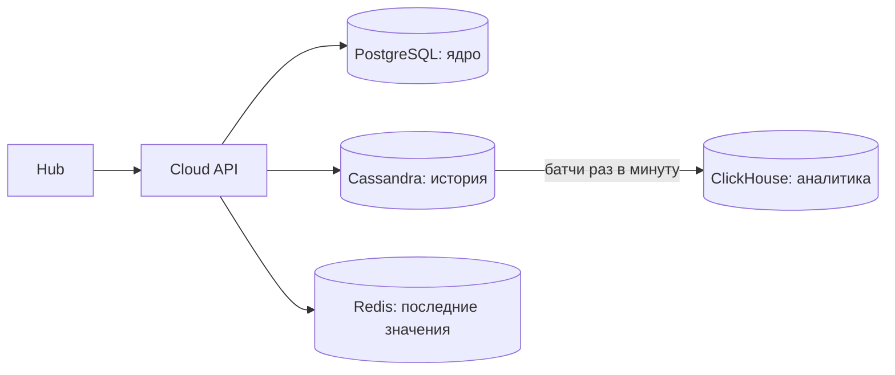

# Лекция 10. Хранилища данных в РС: KV, документные, колоночные, NewSQL

> **Дисциплина:** Распределённые системы и облачные технологии (РСиОТ)
> **Занятие:** лекция 10 из 28 · **Время:** 1 пара (80 мин)
> **Зачем это:** «положим всё в одну базу» — работает до первого миллиона
> записей в час. Сегодня — карта мира хранилищ: какие семейства существуют,
> что у них под капотом и как выбирать хранилище под нагрузку, а не по моде.

---

## Крючок: 177 узлов Cassandra и триллионы сообщений Discord

> 🖥 **Слайд 2.** Крючок: Discord мигрирует триллионы сообщений

Начало 2022 года. У Discord — триллионы сообщений в Cassandra, кластер
разросся до **177 узлов**, и он горит. Популярный канал — это «горячая
партиция»: тысячи людей читают одни и те же сообщения, запросы к одному
узлу выстраиваются в очередь, задержки каскадно растут (лекция 9 — вот
она). Сборщик мусора JVM добавляет паузы-«пилу», дежурные тушат горячие
партиции вручную, по ночам.

Discord мигрировал на ScyllaDB — ту же модель данных и тот же протокол,
но движок на C++ без GC, — а между API и базой поставил data-сервисы на
Rust с request coalescing: сотни одинаковых запросов «дай сообщения
канала X» схлопываются в один запрос к БД. Итог: 177 узлов → **72**,
p99 чтения упал с 40–125 мс до **15 мс**.

Вопрос залу: **Discord сменил базу — а что он НЕ сменил?**

Ответ: модель данных. Партиционирование «сообщения по каналу и времени»,
compaction, кворумы — всё осталось. Сегодня мы учим именно это — семейства
моделей данных и их компромиссы: они переживают конкретные продукты.

*(Источник кейса: `sources/Веб-находки_Лекция_10.md` — блог Discord,
The New Stack, InfoQ; дата доступа 09.08.2026.)*

---

## Квиз-извлечение (по лекции 9: отказоустойчивость)

> 🖥 **Слайд 3.** Квиз-извлечение

Ответьте не подглядывая; ответы — в конце лекции.

1. Почему таймауты в цепочке вызовов должны убывать сверху вниз?
2. Цепочка из трёх уровней, каждый делает до 3 попыток. Во сколько раз
   умножается нагрузка на нижний уровень при его сбое?
3. Назовите три состояния circuit breaker и события переходов.
4. Чем load shedding отличается от backpressure?

---

## Результаты обучения

> 🖥 **Слайд 4.** Чему научимся

После этой пары вы сможете:

1. Раскладывать нагрузку системы на четыре типовых вокрлада и подбирать
   семейство хранилища под каждый.
2. Объяснить, куда «исчезает» схема в NoSQL: schema-on-write против
   schema-on-read.
3. Объяснить на пальцах B-дерево и LSM-дерево и предсказать, кто из них
   выиграет на записи, а кто на чтении.
4. Различать KV, документные, wide-column, колоночные и NewSQL-хранилища —
   и не путать Cassandra с ClickHouse.
5. Спроектировать polyglot-хранение «СмартДома»: какие данные куда и почему.

## Пререквизиты

- Лекция 5: CAP/PACELC — цена согласованности.
- Лекция 6: репликация и кворумы; лекция 7: Raft.
- Лекция 8: партиционирование, hot key.
- SQL на базовом уровне (SELECT, JOIN, индекс).

---

## Картина мира: инструмент под нагрузку, а не наоборот

> 🖥 **Слайд 5.** Дорожная карта пары

В мастерской не бывает «одного универсального инструмента»: молотком
можно закрутить шуруп, но соседи услышат. С хранилищами так же: реляционная
БД — прекрасный универсал, но «СмартДом» страны генерирует 200 тысяч
показаний в секунду, жилец хочет видеть текущую температуру за 10 мс,
аналитик — среднее по миллиарду строк за секунды, а биллинг — строгие
транзакции. Это **четыре разные нагрузки**, и совать их в одну базу —
значит настроить её плохо для всех сразу.

Отсюда термин **polyglot persistence**: одна система — несколько хранилищ,
каждое под свой вокрлад. Плата — сложность синхронизации (об этом лекция 11
про транзакции и лекция 13 про событийные архитектуры).

Маршрут пары: вокрлады → куда девается схема → B-дерево против LSM →
четыре семейства по очереди (KV → документы → wide-column → колоночные) →
NewSQL → собираем хранение «СмартДома». По дороге — два квиза, одно
голосование и один живой сеанс.

---

## Основные понятия

**Определения** (пополним глоссарий в конце):

- **Вокрлад (workload)** — характер нагрузки: соотношение чтений и записей,
  паттерн доступа (по ключу / диапазон / агрегация), требования к задержке.
- **OLTP** — оперативные транзакции: много мелких чтений/записей по ключу
  (показать устройство, записать показание).
- **OLAP** — аналитика: редкие, но тяжёлые запросы-агрегации по огромным
  объёмам (среднее за год по всем домам).
- **Schema-on-write / schema-on-read** — схему проверяет БД при записи /
  схему знает только читающий код.
- **NoSQL** — зонтичный термин для нереляционных хранилищ; не «нет SQL»,
  а «не только реляционная модель».

---

## Ядро пары

### 1. Четыре вокрлада «СмартДома»

> 🖥 **Слайд 6.** Четыре вокрлада

Прежде чем выбирать хранилище, опишем нагрузку. У «СмартДома» страны:

| Вокрлад | Пример | Профиль |
| --- | --- | --- |
| Горячее чтение по ключу | «текущая температура в спальне» | миллионы чтений/с, ответ < 10 мс, данные крошечные |
| Поток записи (append) | 200 тыс. `Reading`/с со всех датчиков | запись почти без чтения, данные не меняются задним числом |
| Аналитика | «средняя температура по стране за март» | скан миллиардов строк, но 2–3 колонок |
| Транзакционное ядро | пользователи, дома, тарифы, биллинг | строгая целостность, связи, умеренный объём |

Один и тот же байт данных — показание датчика — участвует в трёх вокрладах
по-разному: как «последнее значение» (горячий ключ), как строка истории
(append) и как слагаемое среднего (аналитика). Держите эту таблицу в
голове: вся пара — подбор инструментов к её строкам.

### 2. Куда девается схема: миф «schema-less»

> 🖥 **Слайд 7.** Schema-on-write против schema-on-read

Маркетинг NoSQL девяностых… простите, десятых обещал: «никакой схемы —
пишите что хотите!» Правда скучнее: **схема не исчезает, а переезжает**.

- **Schema-on-write** (реляционные БД): схема объявлена в БД; запись, не
  прошедшая проверку, отвергается. Схема явная, задокументированная,
  единая для всех потребителей.
- **Schema-on-read** (документные и KV): БД примет любой байтовый блоб;
  что в нём лежит — знает только читающий код. Схема стала *неявной* и
  размазалась по приложениям.

Гибкость schema-on-read реальна: датчик нового типа шлёт новые поля — и
ничего не надо мигрировать. Но плата — тоже реальна: три сервиса читают
`Device` по-разному, и однажды один из них встречает документ 2023 года
без поля `firmware` и падает. Схема есть всегда; вопрос лишь в том,
**кто её проверяет и где написано, какая она**.

### 3. Под капотом: B-дерево против LSM-дерева

> 🖥 **Слайд 8.** B-дерево против LSM

Почему Cassandra глотает 200 тысяч записей в секунду, а PostgreSQL на том
же железе — на порядок меньше? Разница — в структуре на диске.

**B-дерево** (PostgreSQL, MySQL): данные лежат в отсортированных страницах;
запись находит нужную страницу и меняет её **на месте**. Чтение по ключу —
несколько переходов по дереву, предсказуемо быстро. Плата: каждая запись —
это случайный доступ к диску (найди страницу, перепиши).

**LSM-дерево** (Cassandra, RocksDB, ClickHouse-семейство идей): запись
падает в память (**memtable**) — это мгновенно; когда память наполнилась,
она сортируется и **одним куском** сбрасывается на диск неизменяемым
файлом (**SSTable**). Фоновый **compaction** сливает файлы и выбрасывает
устаревшие версии. Плата: чтение может заглянуть в memtable и несколько
SSTable-файлов, прежде чем найдёт ключ.

Отсюда правило выбора: **пишем много, читаем точечно — LSM; читаем много
и по диапазонам — B-дерево**. Заблуждение «LSM просто быстрее» не выживает
после первого запроса, собирающего ключ по пяти файлам.

Поток телеметрии «СмартДома» — учебный LSM-вокрлад: сплошной append,
чтения редки и свежи.

### 4. Ключ-значение: Redis/Valkey

> 🖥 **Слайд 9.** KV-хранилища

Простейшая модель: ключ → значение, никаких запросов «внутрь» значения.
За счёт простоты — микросекундные задержки, особенно у in-memory систем.

Флагман — **Redis**; после смены лицензии в 2024 у него появился
популярный открытый форк **Valkey** (Linux Foundation, тот же протокол) —
в облаках сегодня предлагают оба. Помимо строк Redis умеет структуры:
списки, множества, hash'и, sorted sets, TTL на ключах.

Классическая роль в «СмартДоме» — **кэш последних значений**:

```bash
# последнее показание датчика: пишем с TTL 5 минут
SET sensor:42:last '{"t":21.5,"ts":"2026-08-09T10:15:00Z"}' EX 300
GET sensor:42:last
TTL sensor:42:last
```

**Пояснение к примеру:** ключ — строка с соглашением об именовании
(`sensor:<id>:last`), значение — небольшой JSON-блоб. `EX 300` — время
жизни: если датчик замолчал, ключ сам исчезнет, и приложение честно
покажет «нет данных», а не прошлогоднюю температуру.

**Проверка:** `GET` возвращает JSON; `TTL` — число секунд ≤ 300; через
5 минут без обновлений `GET` вернёт `(nil)`.

Типичные ошибки:

1. Кэш без TTL: датчик умер, а «текущая» температура живёт вечно.
2. Redis как единственное хранилище истории: in-memory база — не место
   для миллиарда строк, а персистентность у кэша — вторичная функция.
3. Держать в значении мегабайтные блобы: KV любит маленькие значения.

### 5. Документные: MongoDB

> 🖥 **Слайд 10.** Документные хранилища

Документная БД хранит **агрегаты** — вложенные JSON-подобные документы —
и умеет запросы по их полям и индексы (этим отличается от KV, где значение
непрозрачно). `Device` со своими сенсорами — естественный документ:

```json
{
  "_id": "dev-17",
  "home": "home-3",
  "type": "thermostat",
  "firmware": "2.4.1",
  "sensors": [
    { "id": "s-42", "kind": "temperature", "unit": "C" },
    { "id": "s-43", "kind": "humidity", "unit": "%" }
  ]
}
```

Сила: документ читается и пишется целиком, одним обращением — то, что в
реляционке потребовало бы JOIN трёх таблиц. Регистрация устройства, показ
карточки устройства — одна операция.

Слабость — та же монета с другой стороны: **связи между документами**.
«Все датчики температуры во всех домах, где живёт пользователь X» —
в документной модели это либо дублирование данных, либо ручные «джойны»
в коде. Много связей «многие-ко-многим» — сигнал, что агрегатная модель
не ваша.

И помните раздел 2: гибкость документа = schema-on-read; версии документов
разъезжаются, и валидировать их — работа вашего кода (или встроенной
schema validation, которую придётся включить явно).

### 6. Wide-column: Cassandra

> 🖥 **Слайд 11.** Cassandra: таблица, партиция, кластеризация

Модель Cassandra (и ScyllaDB, и HBase) выглядит как таблицы, но живёт как
распределённый отсортированный KV. Главные слова — в DDL:

```sql
CREATE TABLE readings (
    device_id text,
    day date,
    ts timestamp,
    sensor_id text,
    value double,
    PRIMARY KEY ((device_id, day), ts)
) WITH CLUSTERING ORDER BY (ts DESC);
```

**Пояснение к примеру:** `(device_id, day)` — **ключ партиции**: все
показания одного устройства за один день лежат вместе на узлах-репликах
(consistent hashing из лекции 8 — вот где он живёт). `ts` — **ключ
кластеризации**: внутри партиции строки отсортированы по времени, свежие
первыми. Запрос «последние показания устройства за сегодня» — одно
обращение к одной партиции.

**Проверка:** `SELECT * FROM readings WHERE device_id='dev-17' AND
day='2026-08-09' LIMIT 10;` — мгновенно. А вот `WHERE value > 60` без
ключа партиции Cassandra честно отвергнет: full scan в этой модели —
запрещённый приём.

Репликация и кворумы (лекция 6) здесь встроены: `QUORUM` на запись и
чтение — и вы собираете нужную консистентность сами. Внутри — LSM: отсюда
любовь к append-нагрузке.

Типичные ошибки:

1. Ключ партиции без ограничителя объёма: `PRIMARY KEY ((device_id), ts)`
   без `day` — партиция растёт годами до гигабайтов. День/месяц в ключе —
   стандартный «bucketing».
2. Горячая партиция: один популярный ключ ловит весь трафик — Discord
   из крючка; лечится дроблением ключа и кэшем перед БД.
3. Моделирование «как в реляционке» — сначала таблицы, потом запросы.
   В Cassandra наоборот: **сначала запросы, потом таблицы под них**.

#### Peer-instruction-вопрос

> 🖥 **Слайды 12–16.** Голосование PI → четыре разбора

Мы знаем уже три семейства. Голосуем, обсуждаем с соседом 90 секунд,
голосуем снова.

> Аналитик просит: «средняя температура по всем домам страны за март,
> в разрезе по областям» — миллиарды строк, ответ нужен за секунды,
> запрос раз в день. Куда положить историю показаний для таких запросов?
>
> A. Redis — он самый быстрый, до 1 мс.
> B. MongoDB — документы гибкие, положим показания в документы.
> C. Cassandra — она ведь создана для больших данных.
> D. Колоночное хранилище (ClickHouse) — читаем только нужные колонки.

Разбор — в конце лекции. Подсказка: посчитайте, сколько *колонок* из
каждой строки нужно этому запросу — и сколько прочитает с диска каждое
из хранилищ.

> 🖥 **Слайд 17.** Пауза (60 секунд)

### 7. Колоночные аналитические: ClickHouse

> 🖥 **Слайд 18.** Колоночное хранение

Разбор PI подводит к четвёртому семейству. Строковое хранилище кладёт на
диск строку целиком: `(device_id, ts, sensor_id, value, home, region…)`.
Запросу «среднее value за март» придётся прочитать **все байты всех
строк** — хотя нужны две колонки из десяти.

**Колоночное** хранилище (ClickHouse, а также облачные BigQuery,
Snowflake) кладёт каждую колонку отдельным файлом. Запрос читает только
`value` и `region`; однотипные значения в колонке сжимаются в разы лучше
(миллион чисел `21.5` подряд — мечта компрессора); агрегации летят по
векторным инструкциям процессора.

```sql
SELECT region, avg(value)
FROM readings
WHERE kind = 'temperature' AND ts BETWEEN '2026-03-01' AND '2026-03-31'
GROUP BY region;
```

Секунды на миллиардах строк — норма. Плата симметричная: точечная запись
и обновление одной строки колоночному хранилищу неудобны — оно любит
пакетные вставки и почти никогда — UPDATE.

**Не путайте**: **wide-column** (Cassandra) — про OLTP-доступ по ключу
партиции, хранение по строкам партиции; **columnar** (ClickHouse) — про
OLAP-агрегации, хранение по колонкам. Похожие названия, противоположные
назначения — любимый вопрос собеседований.

### 8. NewSQL и time-series: два специальных случая

> 🖥 **Слайд 19.** NewSQL и time-series

**NewSQL / distributed SQL** (Google Spanner, CockroachDB, YugabyteDB) —
попытка взять лучшее из двух миров: полноценный SQL и транзакции, но с
горизонтальным масштабированием. Под капотом — знакомые вам детали:
шардирование диапазонами (лекция 8) + Raft на каждый шард (лекция 7).
Цена по PACELC (лекция 5): каждая транзакция платит задержкой за
консенсус — межконтинентальный COMMIT занимает десятки миллисекунд.
Транзакционное ядро «СмартДома» (пользователи, тарифы) на такой БД
переживёт рост от города до континента без смены модели.

**Time-series БД** (TimescaleDB — расширение PostgreSQL, InfluxDB) —
специализация ровно под наш поток `Reading`: автоматический bucketing по
времени, downsampling (храним посекундные данные неделю, поминутные — год),
retention-политики удаления старья. Если ваша нагрузка — «метки времени и
числа», посмотрите сначала сюда.

### 9. Живой сеанс: собираем хранение «СмартДома»

> 🖥 **Слайд 20.** Живой сеанс

Строим вместе, на глазах (7–10 минут). Вопрос: **какие хранилища и зачем
купит архитектор «СмартДома»?** Идём по таблице вокрладов из раздела 1,
строка за строкой, и спорим вслух.

Шаг 1 — транзакционное ядро (пользователи, дома, устройства, тарифы):
объёмы скромные, связи богатые, целостность критична → **PostgreSQL**.
Скучно и правильно: реляционка по умолчанию, пока не доказано обратное.

Шаг 2 — поток показаний (200 тыс./с, append-only): LSM-семейство →
**Cassandra** с партицией `(device_id, day)` — или **TimescaleDB**, пока
масштаб позволяет остаться в экосистеме PostgreSQL. Проговариваем компромисс:
Cassandra масштабнее, Timescale проще и SQL-нативнее.

Шаг 3 — «текущее значение» для приложений жильцов (миллионы чтений/с):
**Redis/Valkey**, ключ `sensor:<id>:last`, TTL. Пишем в него в момент
приёма показания — кэш обновляется потоком, а не по промаху.

Шаг 4 — аналитика (миллиарды строк, агрегаты): **ClickHouse**; данные
попадают туда пакетами раз в минуту. Схема-звезда не нужна — одна широкая
таблица.

Итоговая картинка:



Заметьте, чего в схеме **нет**: MongoDB. Не потому, что документные БД
плохи, а потому, что для этих вокрладов не нашлось агрегатной нагрузки.
Инструмент под нагрузку — не наоборот. И заметьте, что появилось: **четыре
копии данных**, которые надо синхронизировать. Чем это чревато и как с
этим жить — лекции 11 (транзакции) и 13 (событийные архитектуры).

---

## Типичные ошибки (сводка пары)

> 🖥 **Слайд 21.** Типичные ошибки

1. **«NoSQL — это без схемы».** Схема переехала в читающий код и стала
   неявной; версии документов разъезжаются молча.
2. **«LSM быстрее B-дерева»** — на записи; чтение собирает ключ по
   нескольким SSTable. Выбор — по вокрладу.
3. **«Redis быстрый — пусть хранит всё».** In-memory KV — не хранилище
   истории и не аналитика.
4. **Путать Cassandra и ClickHouse:** wide-column ≠ columnar; OLTP по
   ключу ≠ OLAP-агрегации.
5. **Партиция без bucketing** — партиции-гиганты и горячие ключи
   (Discord, 177 узлов).
6. **Polyglot без плана синхронизации:** четыре копии данных — это
   четыре версии правды, если не спроектировать поток обновлений.

---

## Квиз-закрепление (по этой паре)

> 🖥 **Слайд 22.** Закрепление

Ответьте не подглядывая; ответы — в конце лекции.

1. Назовите четыре вокрлада «СмартДома» и по хранилищу на каждый.
2. Что такое schema-on-read и кто в этой модели отвечает за валидность
   данных?
3. Почему LSM-дерево пишет быстро, а читает — «как повезёт»?
4. Чем ключ партиции отличается от ключа кластеризации в Cassandra?

---

## Вопросы для самопроверки

1. Разложите на вокрлады систему заказа такси. Какие хранилища возьмёте?
2. Куда «переезжает» схема при переходе от PostgreSQL к MongoDB и какие
   риски это создаёт?
3. Опишите путь записи в LSM-дереве: memtable → SSTable → compaction.
4. Почему UPDATE неудобен и колоночному хранилищу, и LSM-дереву?
5. Зачем кэшу последних значений TTL? Что сломается без него?
6. Когда документная модель выигрывает у реляционной, а когда проигрывает?
7. Спроектируйте таблицу Cassandra для запроса «уведомления пользователя
   за неделю, свежие первыми».
8. Что такое горячая партиция и какими тремя способами её лечат?
9. Чем wide-column отличается от columnar? Приведите по представителю.
10. За счёт чего ClickHouse сжимает данные лучше строковой БД?
11. Какую цену платит CockroachDB за SQL-транзакции на 30 узлах?
    Сформулируйте через PACELC.
12. Что умеет time-series БД такого, чего нет в «обычной» реляционке?
13. Сколько копий одного показания датчика живёт в итоговой схеме живого
    сеанса? Перечислите их роли.

---

## Мост к лабораторной

> 🖥 **Слайд 23.** Мост к лабе

В лабораторной № 6 (Kubernetes: состояние и хранение, `tasks/task_06`,
после лекции 19) вы развернёте stateful-хранилище в кластере: том,
который переживает перезапуск пода, StatefulSet и его гарантии.
Сегодняшняя карта семейств — это ответ на вопрос «ЧТО мы разворачиваем
и почему именно его»; лекция 19 ответит «КАК не потерять его данные в
оркестраторе». Спойлер связки:
антипаттерн № 4 курса — «состояние внутри контейнера» — сегодня получил
обоснование: состоянию место во внешнем хранилище, подобранном под вокрлад.

**Задание на 1 предложение** (письменно, в конспект): закончите фразу
«Умение раскладывать данные по вокрладам пригодится лично мне, потому
что…» — про свой проект. На следующей паре спрошу троих добровольцев.

---

## Глоссарий

> 🖥 **Слайд 24 (финал).** Вопросы + литература

| Термин | Определение |
| --- | --- |
| Вокрлад (workload) | Профиль нагрузки: чтения/записи, паттерн доступа, задержки |
| OLTP / OLAP | Мелкие операции по ключу / тяжёлые агрегации по массивам |
| Schema-on-write / on-read | Схему проверяет БД при записи / знает только читающий код |
| B-дерево | Диск-структура: отсортированные страницы, запись на место; чемпион чтения |
| LSM-дерево | Memtable → неизменяемые SSTable → compaction; чемпион записи |
| Memtable / SSTable | Буфер записи в памяти / отсортированный неизменяемый файл на диске |
| Compaction | Фоновое слияние SSTable с выбросом устаревших версий |
| KV-хранилище | Ключ → непрозрачное значение; Redis/Valkey, микросекунды |
| Документная БД | Хранит агрегаты (JSON-документы), запросы по полям; MongoDB |
| Wide-column | Таблицы поверх распределённого KV: Cassandra, ScyllaDB; OLTP по ключу |
| Ключ партиции / кластеризации | Определяет узел размещения / порядок строк внутри партиции |
| Колоночное хранилище | Каждая колонка — отдельно; ClickHouse; OLAP-агрегации |
| NewSQL | SQL + транзакции + шардирование + Raft: Spanner, CockroachDB |
| Time-series БД | Специализация под метки времени: Timescale, InfluxDB; retention |
| Polyglot persistence | Несколько хранилищ в одной системе, каждое под свой вокрлад |
| Hot partition | Партиция-ключ, собирающая непропорциональный трафик |

## Список литературы

1. Основная литература
   - [1] Клеппман М. — «Высоконагруженные приложения» (Designing
     Data-Intensive Applications). O'Reilly / Питер. Главы 2–3.
2. Дополнительная литература
   - [2] Petrov A. — «Database Internals». O'Reilly, 2019. Части I–II.
3. Интернет-ресурсы
   - [3] Кейс Discord (Cassandra → ScyllaDB), сравнения Redis/Valkey,
     материалы по LSM и schema-on-read — подборка с URL в
     `sources/Веб-находки_Лекция_10.md` (дата обращения: 09.08.2026).

---

## Ответы

### Ответы: квиз-извлечение (лекция 9)

1. Если верхний уровень сдаётся раньше нижнего, он ретраит или отдаёт
   ошибку, пока внизу ещё идёт живая работа: дубли, занятые потоки,
   двойная нагрузка. Дедлайн должен убывать вниз по цепочке.
2. В 3 × 3 × 3 = 27 раз (амплификация ретраев: повторы уровней
   перемножаются).
3. CLOSED (считаем ошибки) → порог превышен → OPEN (fail fast) → таймер →
   HALF-OPEN (пробные вызовы) → успех → CLOSED / неудача → OPEN.
4. Backpressure — сигнал производителю «помедленнее» (окно, блокировка,
   429); load shedding — намеренный сброс части нагрузки по приоритету,
   чтобы выжило важное.

### Ответы: peer instruction

Правильный ответ — **D**: колоночное хранилище. Запросу нужны 2–3 колонки
из миллиардов строк — колоночное чтение поднимет с диска только их, сжатые
в десятки раз, и агрегирует векторно: секунды вместо часов.

- A — «Redis самый быстрый» — быстрый *по ключу* и *в памяти*: миллиарды
  строк истории в RAM не влезут, а агрегаций по значениям KV не умеет
  вовсе.
- B — гибкость документов не помогает агрегации: строки-документы всё
  равно читаются целиком, JOIN'ов и быстрых GROUP BY нет.
- C — «Cassandra для больших данных» — для больших *OLTP-потоков по ключу
  партиции*. Запрос без ключа партиции по всем устройствам — full scan,
  который она сама же и запрещает.

### Ответы: квиз-закрепление

1. Горячее чтение по ключу → Redis/Valkey; поток записи → Cassandra или
   time-series БД; аналитика → ClickHouse; транзакционное ядро →
   PostgreSQL (или NewSQL при росте).
2. Схему знает и проверяет читающий код приложения; БД примет что угодно.
   За валидность отвечают разработчики всех читающих сервисов — поэтому
   нужны явные версии/валидация документов.
3. Запись падает в memtable (память, мгновенно) и сбрасывается на диск
   большими последовательными кусками. Чтение же может проверить memtable
   и несколько SSTable-файлов, пока не найдёт ключ; спасают bloom-фильтры
   и compaction.
4. Ключ партиции определяет, на каких узлах лежат данные (маршрутизация);
   ключ кластеризации — порядок строк внутри партиции (сортировку и
   диапазонные запросы).
