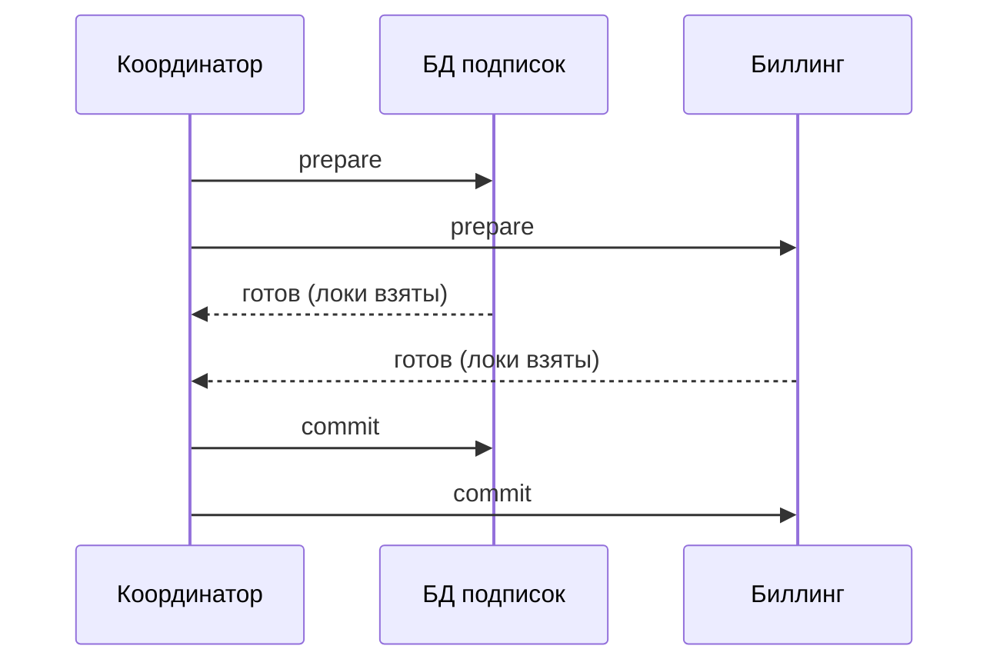

# Лекция 11. Распределённые транзакции: 2PC, saga, outbox

> **Дисциплина:** Распределённые системы и облачные технологии (РСиОТ)
> **Занятие:** лекция 11 из 28 · **Время:** 1 пара (80 мин)
> **Зачем это:** на прошлой паре вы разложили данные «СмартДома» по четырём
> хранилищам — и получили четыре копии правды. Сегодня — как менять данные
> в нескольких системах так, чтобы правда осталась одна: почему классический
> 2PC в микросервисах не жилец и что вместо него — saga и outbox.

---

## Крючок: три часа, в которые банкоматы раздавали чужие деньги

> 🖥 **Слайд 2.** Крючок: глюк CBE 15.03.2024

Ночь на 15 марта 2024 года, Эфиопия. Крупнейший банк страны (Commercial
Bank of Ethiopia) проводит «обновление и инспекцию систем». С полуночи до
трёх утра ломается связка между выдачей денег и учётом остатков: банкомат
выдаёт наличные, а баланс не списывается — и лимиты не проверяются.

Слух разносится по мессенджерам быстрее, чем дежурная смена замечает
проблему. У банкоматов возле студенческих кампусов выстраиваются очереди.
За три часа — около **490 тысяч транзакций** и **8 миллионов долларов**,
рождённых из воздуха. К концу месяца банк вернул примерно половину;
президент банка пообещал уголовные дела «тем, кто не вернёт чужое».

Вопрос залу: **какое свойство транзакций сломалось — и почему обычный
`BEGIN … COMMIT` тут не спас?**

Держите ответ до конца пары. Спойлер: внутри одной БД атомарность даёт
СУБД. А «выдай наличные» и «спиши остаток» жили в **разных системах** —
и сегодняшняя пара ровно о том, как жить, когда транзакция размазана по
нескольким сервисам.

*(Источник кейса: `sources/Веб-находки_Лекция_11.md`; дата доступа
09.08.2026.)*

---

## Квиз-извлечение (по лекции 10: хранилища)

> 🖥 **Слайд 3.** Квиз-извлечение

Ответьте не подглядывая; ответы — в конце лекции.

1. Назовите четыре вокрлада «СмартДома» и по хранилищу на каждый.
2. Почему LSM-дерево быстро пишет? Что происходит при чтении?
3. Чем wide-column (Cassandra) отличается от columnar (ClickHouse)?
4. Сколько копий одного показания живёт в polyglot-схеме прошлой пары —
   и какую новую проблему это создало?

---

## Результаты обучения

> 🖥 **Слайд 4.** Чему научимся

После этой пары вы сможете:

1. Опознавать проблему dual write: почему две записи в две системы нельзя
   сделать атомарными «аккуратным кодом».
2. Объяснить протокол 2PC, его цену (блокировки, in-doubt, координатор)
   и почему микросервисы его избегают.
3. Проектировать saga: цепочка локальных транзакций + компенсации;
   выбирать между хореографией и оркестрацией.
4. Объяснять, чего у саги нет (изоляции) и как жить с промежуточными
   состояниями.
5. Реализовать transactional outbox и идемпотентного потребителя —
   рабочую лошадку согласованности в микросервисах.

## Пререквизиты

- Лекция 3: идемпотентность, ретраи.
- Лекция 5: консистентность, итоговая согласованность.
- Лекция 10: polyglot persistence — источник сегодняшней проблемы.
- SQL: `BEGIN`/`COMMIT`, представление об ACID.

---

## Картина мира: атомарность кончается на границе процесса

> 🖥 **Слайд 5.** Дорожная карта пары

Внутри одной БД транзакция — как сейф с одной дверцей: либо всё положили
и закрыли, либо ничего не изменилось. ACID вам дарит СУБД, бесплатно для
прикладного кода.

Как только операция затрагивает **две** системы — БД подписок и биллинг,
БД и брокер сообщений, банкомат и учёт остатков, — сейфов становится два,
а руки у вас по-прежнему две: пока закрываете второй, первый уже закрыт,
и между этими моментами процесс может умереть. Это **проблема dual
write** — фундаментальная, а не «плохо написали код».

Дальше три пути, и все три сегодня разберём:

- **2PC** — назначить координатора, который командует обоим сейфам
  «приготовиться» и «закрыть» (и чем это кончается в облаке);
- **saga** — признать, что атомарности не будет, и заменить её цепочкой
  шагов с планом отката для каждого;
- **outbox** — свести две записи к одной локальной транзакции, а вторую
  систему догонять надёжной доставкой.

Маршрут: dual write → 2PC и его цена → saga и компенсации → чего у саги
нет → outbox → идемпотентный потребитель → как выбирать. По дороге — два
квиза, одно голосование и один живой сеанс.

---

## Основные понятия

**Определения** (пополним глоссарий в конце):

- **Локальная транзакция** — ACID-транзакция в границах одной БД.
- **Dual write** — запись в две независимые системы без общей транзакции;
  между записями возможен отказ.
- **Координатор** — узел, управляющий распределённой транзакцией (в 2PC).
- **Компенсация** — операция, семантически отменяющая уже закоммиченный
  шаг («вернуть деньги», а не «отменить запись»).
- **At-least-once** — гарантия доставки «хотя бы раз»: потери исключены,
  дубли — нет.

---

## Ядро пары

### 1. Dual write: анатомия проблемы

> 🖥 **Слайд 6.** Dual write

Сценарий из «СмартДома»: жилец подключает платный тариф «Расширенный
мониторинг». Сервис подписок должен (а) записать подписку в свою БД и
(б) сообщить биллингу, что пора списывать деньги. Наивный код:

```python
def subscribe(user_id, plan):
    db.execute("INSERT INTO subscriptions ...")   # запись 1
    db.commit()
    billing.charge(user_id, plan)                 # запись 2 (другая система)
```

Переберём отказы (лекция 1 приучила: отказ — норма):

- Процесс умер **между** commit и `billing.charge` → подписка есть,
  денег нет. «Бесплатный премиум» — привет банкоматам Эфиопии.
- `billing.charge` вернул таймаут → состояние «неизвестно»: списал или
  нет? Повторить? А если спишется дважды?
- Поменяем порядок (сначала charge, потом commit) → теперь наоборот:
  деньги списаны, подписки нет.

Никакая перестановка строк и никакой try/catch проблему не решают:
**двух фаз фиксации в двух независимых системах наивным кодом не
получить**. Нужен протокол — или другая постановка задачи.

### 2. Двухфазный коммит: честный протокол с нечестной ценой

> 🖥 **Слайд 7.** 2PC: протокол и цена

**2PC (two-phase commit)** — классика 1980-х: добавим координатора и две
фазы.



Фаза 1 (**prepare**): координатор спрашивает всех участников «готов ли
зафиксировать?». Участник проверяет всё, пишет намерение в журнал, берёт
блокировки и отвечает «готов» — теперь он **обязан** уметь закоммитить.
Фаза 2 (**commit/abort**): если все ответили «готов» — всем commit; хоть
один «нет» — всем abort. Атомарность честная.

Цена в распределённом мире:

1. **Блокировки через сеть.** Между prepare и commit участники держат
   локи. Сеть моргнула — локи висят, чужие транзакции ждут.
2. **In-doubt: худшее состояние в БД.** Координатор умер после prepare —
   участник не знает, коммитить или откатывать. Сам решить **не имеет
   права**: вдруг другой участник уже закоммитил. Он ждёт. С локами.
3. **Координатор — SPOF**, а протокол блокирующий: доступность всей
   связки равна доступности худшего участника, умноженной на надёжность
   координатора.

Отсюда вердикт индустрии: 2PC уместен внутри одного доверенного контура
(кластер одной СУБД, XA между двумя базами в одном ЦОДе, короткие
транзакции), но между микросервисами через интернет — антипаттерн по
умолчанию. Брокеры сообщений и большинство NoSQL prepare вообще не умеют.

### 3. Saga: атомарности нет — есть план отката

> 🖥 **Слайд 8.** Saga и компенсации

**Saga** — смена постановки: вместо одной большой транзакции — **цепочка
локальных**, каждая коммитится сразу; на случай отказа у каждого шага есть
**компенсация** — операция, семантически отменяющая его эффект.

Подключение тарифа как saga:

| Шаг | Локальная транзакция | Компенсация |
| --- | --- | --- |
| T1 | создать подписку со статусом `pending` | удалить/пометить `cancelled` |
| T2 | списать оплату в биллинге | вернуть деньги |
| T3 | включить премиум-правила в Rule engine | выключить правила |
| T4 | подписка → статус `active` | — (последний шаг) |

Отказ на T3 → выполняем компенсации C2 (вернуть деньги), C1 (отменить
подписку) — **в обратном порядке**. Система прошла через промежуточные
состояния, но пришла в согласованное.

Два способа управлять цепочкой:

- **Хореография**: шаги общаются событиями («оплата прошла» → Rule engine
  сам включает правила). Просто начать, но логика процесса размазана по
  сервисам: «кто за чем идёт» не видно нигде целиком, легко получить
  циклы событий.
- **Оркестрация**: отдельный оркестратор (код процесса, Temporal/Camunda
  как готовые движки) командует шагами и помнит состояние. Логика
  в одном месте, проще отлаживать и компенсировать; оркестратор не SPOF,
  если его состояние — в надёжном хранилище.

Практическое правило: 2–3 шага и один владелец процесса — хватит
хореографии; длинные процессы с ветвлениями — оркестрация.

### 4. Чего у саги нет: изоляции

> 🖥 **Слайд 9.** Saga ≠ ACID

Главная ловушка: saga — **не** «ACID, только распределённый». Буква I
потеряна по дороге. Каждый шаг коммитится сразу, и промежуточные состояния
**видимы всем**:

- Пока saga не дошла до T4, жилец видит подписку `pending` — интерфейс
  обязан уметь её показывать (и это правильно: честный статус).
- Компенсация — не rollback. Письмо «добро пожаловать в премиум»,
  отправленное на шаге T2, не отзовёшь; деньги вернутся, но SMS о
  списании жилец уже получил.
- Между T2 и компенсацией C2 другой процесс может прочитать «оплачено»
  и принять решение на данных, которые скоро «откатятся».

Приёмы выживания: **семантические статусы** (`pending`, `cancelling` —
пусть промежуточность видна явно), откладывать необратимые действия
(письма, отгрузку) в конец цепочки, проектировать компенсации заранее —
на каждом шаге спрашивать «а как это отменять?».

#### Peer-instruction-вопрос

> 🖥 **Слайды 10–14.** Голосование PI → четыре разбора

Голосуем, обсуждаем с соседом 90 секунд, голосуем снова.

> Сервис подписок закоммитил строку в свою БД и должен опубликовать
> событие `SubscriptionCreated` в брокер. Как гарантировать, что событие
> не потеряется, даже если сервис упадёт в самый неудачный момент?
>
> A. Опубликовать событие ДО коммита БД — тогда оно точно уйдёт.
> B. Опубликовать ПОСЛЕ коммита, обернув в try/catch с ретраями.
> C. В той же транзакции записать событие в таблицу outbox; отдельный
> процесс публикует его из таблицы.
> D. Обернуть БД и брокер в 2PC — пусть коммитят атомарно.

Разбор — в конце лекции. Подсказка: для каждого варианта найдите момент,
в который смерть процесса или отказ брокера ломает гарантию.

> 🖥 **Слайд 15.** Пауза (60 секунд)

### 5. Transactional outbox: одна транзакция вместо двух

> 🖥 **Слайд 16.** Outbox

Идея outbox побеждает dual write элегантно: **не пишите во вторую систему
вовсе**. Пишите в свою БД — и бизнес-данные, и событие — одной локальной
транзакцией; ACID у вас уже есть, бесплатно:

```sql
BEGIN;
INSERT INTO subscriptions (id, user_id, plan, status)
VALUES ('sub-77', 'u-13', 'premium', 'pending');
INSERT INTO outbox (event_id, type, payload)
VALUES ('evt-421', 'SubscriptionCreated',
        '{"sub":"sub-77","user":"u-13","plan":"premium"}');
COMMIT;
```

Либо закоммитились обе строки, либо ни одной — dual write исчез.
Доставкой занимается отдельный **relay**: он читает `outbox` и публикует
события в брокер, помечая отправленные. Умер после публикации, но до
пометки? Опубликует ещё раз — получаем **at-least-once**: потерь нет,
дубли возможны. Дубли лечит идемпотентный потребитель (следующий раздел).

Relay бывает двух видов: **poller** (простой цикл с SELECT — для старта
идеально) и **CDC** (change data capture: Debezium читает журнал БД и
льёт строки outbox в Kafka — производственный стандарт, без нагрузки
запросами).

#### Живой сеанс: собираем outbox на глазах

> 🖥 **Слайд 17.** Живой сеанс

Строим вместе (7–10 минут), на PostgreSQL из лабы 1. Ход мысли важнее
синтаксиса.

**Шаг 1 — таблица.** Что минимально нужно событию?

```sql
CREATE TABLE outbox (
    event_id   uuid PRIMARY KEY,
    type       text NOT NULL,
    payload    jsonb NOT NULL,
    created_at timestamptz DEFAULT now(),
    sent_at    timestamptz          -- NULL = ещё не отправлено
);
```

**Шаг 2 — запись.** В коде сервиса подписок обе INSERT — в одной
транзакции (пример выше). Проговариваем: упади процесс где угодно —
рассинхрона нет.

**Шаг 3 — relay-poller.** Раз в 200 мс:

```sql
BEGIN;
SELECT event_id, type, payload FROM outbox
WHERE sent_at IS NULL
ORDER BY created_at
LIMIT 100
FOR UPDATE SKIP LOCKED;
-- публикуем пачку в брокер; после подтверждения:
UPDATE outbox SET sent_at = now() WHERE event_id IN (...);
COMMIT;
```

**Шаг 4 — ломаем.** Убиваем relay между «опубликовал» и «пометил».
После рестарта он публикует пачку снова — дубль. Фиксируем вывод на
доске: **outbox гарантирует «не потеряем», а «не задвоим» — обязанность
потребителя.**

**Пояснение к примеру:** `FOR UPDATE SKIP LOCKED` позволяет запускать
несколько relay параллельно: каждый забирает свою пачку, не блокируя
соседей. `ORDER BY created_at` сохраняет порядок в пределах одного relay.

**Проверка:** вставьте подписку + событие транзакцией, убейте сервис до
вызова брокера — строка в outbox лежит с `sent_at IS NULL`; после запуска
relay событие в брокере, `sent_at` заполнен.

Типичные ошибки:

1. Чистить outbox сразу после публикации DELETE'ом без подтверждения
   брокера — потеря при падении между publish и delete.
2. Забыть индекс по `(sent_at, created_at)` — poller начнёт сканировать
   миллионную таблицу.
3. Писать в outbox ВНЕ транзакции с бизнес-данными — вернулись к dual
   write, ради борьбы с которым всё затевалось.

### 6. Идемпотентный потребитель: половина контракта

> 🖥 **Слайд 18.** Инбокс и дедупликация

At-least-once означает: каждый потребитель обязан переживать дубли.
Рецепт — **inbox / дедупликация по `event_id`**:

```sql
INSERT INTO processed_events (event_id) VALUES ('evt-421')
ON CONFLICT DO NOTHING;
-- если строка не вставилась — событие уже обработано, выходим
```

Проверка и бизнес-обработка — в одной локальной транзакции потребителя:
тогда «обработали и запомнили, что обработали» атомарно. Знакомая
идея? Это Idempotency-Key из лекции 1, доросший до архитектурного
паттерна. «Exactly-once доставка» как свойство сети — миф; на практике
exactly-once **обработка** = at-least-once доставка + идемпотентность.

### 7. Как выбирать: дерево решений

> 🖥 **Слайд 19.** Выбор инструмента

1. **Можно не распределять транзакцию?** Лучшая распределённая
   транзакция — та, которой нет: если данные меняются вместе всегда,
   может, им место в одной БД у одного сервиса.
2. **Нужно опубликовать событие о локальном изменении?** Outbox +
   идемпотентный потребитель. Это 80 % случаев.
3. **Многошаговый бизнес-процесс между сервисами?** Saga: короткая и
   линейная — хореография; длинная, с ветвлениями — оркестрация.
4. **Один контур, одна СУБД/XA, миллисекунды, полный контроль?** Можно
   2PC — но осознавая блокировки и in-doubt.

И мостик в следующую пару: события outbox надо куда-то публиковать —
про брокеры, очереди и Kafka поговорим на лекции 12.

---

## Типичные ошибки (сводка пары)

> 🖥 **Слайд 20.** Типичные ошибки

1. **Dual write «аккуратным кодом»**: commit + вызов соседа в try/catch.
   Смерть процесса между ними неустранима перестановкой строк.
2. **2PC между микросервисами**: блокировки через интернет, in-doubt
   участники, координатор-SPOF.
3. **Saga без спроектированных компенсаций**: «потом допишем откат» —
   значит, при первом отказе система застрянет в промежуточном состоянии.
4. **Вера, что saga изолированна**: промежуточные статусы видимы;
   необратимое (письма, отгрузка) — в конец цепочки.
5. **Outbox без идемпотентного потребителя**: at-least-once честно
   приносит дубли — и биллинг списывает дважды.
6. **Чистка outbox до подтверждения брокера**: потеря события.

---

## Квиз-закрепление (по этой паре)

> 🖥 **Слайд 21.** Закрепление

Ответьте не подглядывая; ответы — в конце лекции.

1. Почему «сначала commit, потом отправка события» теряет события, а
   «сначала отправка, потом commit» — рождает ложные?
2. Что такое in-doubt состояние в 2PC и почему участник не может выйти
   из него самостоятельно?
3. Чем компенсация отличается от rollback? Приведите пример необратимого
   действия.
4. Какую гарантию даёт связка outbox + relay и что обязан сделать
   потребитель?

---

## Вопросы для самопроверки

1. Сформулируйте проблему dual write и объясните, почему try/catch её
   не решает.
2. Опишите обе фазы 2PC. Что записывает участник в журнал на prepare?
3. Перечислите три причины, по которым 2PC избегают в микросервисах.
4. Спроектируйте saga для «оформить заказ: резерв товара → оплата →
   доставка». Выпишите компенсации.
5. В каком порядке выполняются компенсации и почему?
6. Хореография против оркестрации: критерии выбора?
7. Какие аномалии возможны из-за отсутствия изоляции у саг? Как их
   смягчают семантические статусы?
8. Нарисуйте путь события через outbox: транзакция → таблица → relay →
   брокер → потребитель. Где возможны дубли?
9. Чем CDC-relay (Debezium) лучше poller'а и когда poller достаточен?
10. Зачем `FOR UPDATE SKIP LOCKED` в запросе poller'а?
11. Как устроен идемпотентный потребитель? Почему проверка и обработка
    должны быть в одной транзакции?
12. Почему «exactly-once доставка» — миф, а «exactly-once обработка» —
    достижима?
13. Верните крючок: какие из сегодняшних паттернов спасли бы банк от
    «денег из воздуха»?

---

## Мост к лабораторной

> 🖥 **Слайд 22.** Мост к лабе

Уже в лабе 4 (очереди и стриминг, `tasks/task_04`, после лекции 13)
связка «outbox → брокер → идемпотентный потребитель» станет вашим
рабочим инструментом: телеметрия «СмартДома» поедет через брокер, и
разбираться с дублями придётся руками. Проверьте свой код лаб 1–3 уже
сейчас: есть ли там «commit + отправка»? А когда сервис переедет в
Kubernetes (лабы 5–6), его начнут **убивать штатно** — выселение пода,
обновление, автоскейл, — и каждый dual write в коде станет лотереей.

**Задание на 1 предложение** (письменно, в конспект): закончите фразу
«Умение доводить многошаговые операции до конца при отказах пригодится
лично мне, потому что…» — про свой проект. Спрошу троих на следующей паре.

---

## Глоссарий

> 🖥 **Слайд 23 (финал).** Вопросы + литература

| Термин | Определение |
| --- | --- |
| Dual write | Запись в две независимые системы без общей транзакции |
| 2PC | Двухфазный коммит: prepare (голосование + локи) → commit/abort |
| Координатор | Узел, управляющий 2PC; его отказ блокирует участников |
| In-doubt | Участник после prepare без вердикта: держит локи и ждёт |
| Saga | Цепочка локальных транзакций с компенсацией на каждый шаг |
| Компенсация | Семантическая отмена закоммиченного шага (вернуть деньги) |
| Хореография | Saga на событиях без центра; логика размазана по сервисам |
| Оркестрация | Saga с центральным управляющим процессом (Temporal, Camunda) |
| Transactional outbox | Событие пишется в таблицу той же БД одной транзакцией с данными |
| Relay | Процесс доставки из outbox в брокер: poller или CDC |
| CDC | Change data capture: чтение журнала БД (Debezium) |
| At-least-once | Доставка без потерь, но с возможными дублями |
| Идемпотентный потребитель | Дедупликация по event_id в одной транзакции с обработкой |
| Inbox | Таблица обработанных событий у потребителя |

## Список литературы

1. Основная литература
   - [1] Клеппман М. — «Высоконагруженные приложения». Главы 7, 9
     (транзакции, консистентность и консенсус).
   - [2] Richardson C. — «Microservices Patterns». Manning, 2018.
     Главы 4–6 (saga, outbox, обмен сообщениями).
2. Интернет-ресурсы
   - [3] microservices.io — паттерны Saga и Transactional Outbox;
     кейс CBE и материалы по dual write — подборка с URL в
     `sources/Веб-находки_Лекция_11.md` (дата обращения: 09.08.2026).

---

## Ответы

### Ответы: квиз-извлечение (лекция 10)

1. Горячее чтение по ключу → Redis/Valkey; поток записи → Cassandra /
   time-series; аналитика → ClickHouse; транзакционное ядро → PostgreSQL
   или NewSQL.
2. Запись падает в memtable (память) и сбрасывается на диск большими
   последовательными SSTable-файлами. Чтение может проверять memtable и
   несколько SSTable, пока не найдёт ключ.
3. Wide-column — OLTP-доступ по ключу партиции, строки партиции хранятся
   вместе; columnar — OLAP-агрегации, каждая колонка хранится отдельно.
4. Четыре (ядро, история, кэш, аналитика); новая проблема —
   синхронизация копий: как менять данные в нескольких системах
   согласованно — тема сегодняшней пары.

### Ответы: peer instruction

Правильный ответ — **C**: транзакционный outbox. Обе INSERT — в одной
локальной ACID-транзакции; событие физически не может потеряться или
возникнуть без данных. Доставку делает relay с at-least-once.

- A — событие уходит ДО коммита: транзакция может откатиться, и брокер
  разнесёт новость о подписке, которой нет. Ложное событие хуже
  потерянного.
- B — смерть процесса между commit и publish теряет событие навсегда;
  try/catch и ретраи не работают в мёртвом процессе. Это и есть dual
  write в чистом виде.
- D — большинство брокеров prepare не умеют; там, где 2PC возможен, вы
  платите блокировками, in-doubt и координатором-SPOF за задачу, которую
  outbox решает одной локальной транзакцией.

### Ответы: квиз-закрепление

1. «Commit → отправка»: процесс может умереть между ними — данные есть,
   события нет. «Отправка → commit»: транзакция может откатиться —
   событие есть, данных нет. Оба порядка ломаются, потому что операций
   две; outbox сводит их к одной.
2. Участник проголосовал «готов» и держит локи, но вердикта координатора
   нет. Сам решить не может: другой участник мог уже получить commit —
   односторонний abort разорвал бы атомарность.
3. Rollback стирает эффект, будто транзакции не было; компенсация — новая
   операция, отменяющая смысл предыдущей. Необратимое: отправленное
   письмо, SMS, физическая отгрузка.
4. Outbox + relay гарантируют at-least-once: событие не потеряется, но
   может прийти повторно. Потребитель обязан дедуплицировать по event_id
   (inbox) в одной транзакции с обработкой.
