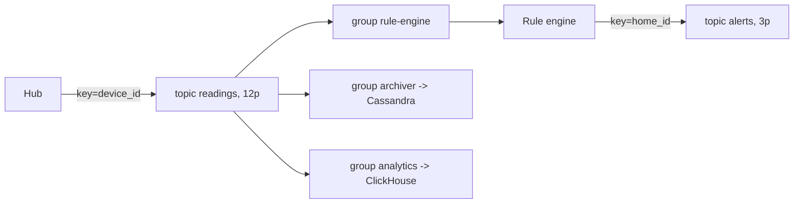

# Лекция 12. Очереди и стриминг: брокеры сообщений и Kafka

> **Дисциплина:** Распределённые системы и облачные технологии (РСиОТ)
> **Занятие:** лекция 12 из 28 · **Время:** 1 пара (80 мин)
> **Зачем это:** на прошлой паре relay читал outbox и «публиковал события
> в брокер». Сегодня разберём сам брокер: чем очередь отличается от
> журнала, как устроена Kafka, что такое партиции, консюмер-группы и
> offset — и почему «добавим консюмеров» не ускоряет разгребание лага.

---

## Крючок: rolling restart, который останавливал систему 9 минут

> 🖥 **Слайд 2.** Крючок: rebalance storm

Продовая система: топик на 360 партиций, группа из **240 консюмеров**.
Команда выкатывает обычное обновление — rolling restart, по несколько
процессов за раз. Внезапно обработка встаёт. Не на секунду — на **девять
минут** непрерывной толкотни.

Что произошло: в классическом протоколе Kafka каждый вход и выход
участника группы запускает **ребаланс** — перераспределение партиций,
на время которого ВСЯ группа прекращает обработку (stop the world).
Rolling restart 240 процессов — это сотни входов-выходов подряд: группа
только и делала, что перераспределялась. Ошибка в session-timeout
(вдвое меньше нужного) добила: живые консюмеры объявлялись мёртвыми, и
карусель раскручивалась заново.

Лечение оказалось конфигом из одной строки: **static membership** —
стабильный `group.instance.id` для каждого процесса. Рестарт стал
выглядеть как «тот же участник моргнул», а не «новый пришёл»: счётчик
ребалансов при выкатке упал с 30+ до нуля.

Вопрос залу: **почему система, созданная для масштабирования
потребителей, останавливается целиком, когда потребители приходят и
уходят?**

Ответ соберём к середине пары, когда доберёмся до консюмер-групп.

*(Источник кейса: `sources/Веб-находки_Лекция_12.md` — Petascale Labs,
Michal Drozd; дата доступа 09.08.2026.)*

---

## Квиз-извлечение (по лекции 11: транзакции)

> 🖥 **Слайд 3.** Квиз-извлечение

Ответьте не подглядывая; ответы — в конце лекции.

1. Что такое dual write и почему try/catch его не лечит?
2. Что такое in-doubt участник в 2PC и чем он опасен?
3. Чем компенсация в saga отличается от rollback?
4. Какую гарантию даёт outbox + relay и что обязан уметь потребитель?

---

## Результаты обучения

> 🖥 **Слайд 4.** Чему научимся

После этой пары вы сможете:

1. Выбирать модель обмена: очередь, pub/sub или журнал (лог) — по
   потребности в реплее, fan-out и конкурентном потреблении.
2. Объяснить устройство Kafka: топики, партиции, реплики/ISR, KRaft.
3. Проектировать ключ партиционирования и объяснять, где кончается
   гарантия порядка.
4. Настраивать консюмер-группы: параллелизм, offset, ребалансы и как
   их укрощать (static membership, KIP-848).
5. Различать семантики at-most/at-least/exactly-once и строить
   надёжную обработку с DLQ и ретраями.

## Пререквизиты

- Лекция 8: партиционирование, ключи, hot key.
- Лекция 9: backpressure, ограниченные очереди.
- Лекция 11: at-least-once, идемпотентный потребитель, outbox.
- Docker: брокер поднимем в контейнере (лаба 1).

---

## Картина мира: почта вместо телефонных звонков

> 🖥 **Слайд 5.** Дорожная карта пары

До сих пор наши сервисы общались как по телефону: REST-вызов требует,
чтобы собеседник был на месте прямо сейчас (temporal coupling). Брокер
сообщений — это почта: отправитель бросает письмо и живёт дальше;
получатель заберёт, когда сможет. Три выгоды сразу:

- **развязка во времени** — Rule engine перезагружается, а Hub'ы
  продолжают слать показания: копятся в брокере;
- **сглаживание пиков** — вечерний всплеск телеметрии ложится в буфер,
  потребители разгребают со своей скоростью (и это буфер с границами —
  лекция 9 научила, что бездонных не бывает: у брокера есть retention);
- **fan-out** — одно показание нужно и движку правил, и архиватору, и
  аналитике: каждый читает свою копию, отправитель об этом не знает.

Плата привычная: ещё один кластер в хозяйстве, асинхронность в голове
разработчика и вечные вопросы «дошло ли?» и «в каком порядке?». Ответы
на оба — сегодня.

Маршрут: три модели обмена → анатомия Kafka → продюсер и порядок →
консюмер-группы и ребалансы (тут добьём крючок) → семантики доставки →
DLQ → схемы событий → проектируем топики «СмартДома». Два квиза, одно
голосование, один живой сеанс.

---

## Основные понятия

**Определения** (пополним глоссарий в конце):

- **Брокер сообщений** — посредник, принимающий, хранящий и доставляющий
  сообщения; развязывает отправителя и получателя во времени.
- **Очередь** — сообщение потребляется **одним** из конкурирующих
  потребителей и исчезает.
- **Журнал (commit log)** — неизменяемая упорядоченная последовательность
  записей; читатели двигают свой указатель, записи не исчезают до
  истечения retention.
- **Offset** — позиция записи в партиции журнала; «закладка» потребителя.
- **Retention** — политика хранения: по времени (7 дней) или объёму.

---

## Ядро пары

### 1. Три модели обмена: очередь, pub/sub, журнал

> 🖥 **Слайд 6.** Три модели

**Очередь** (RabbitMQ и семейство AMQP): задача попадает одному из
конкурирующих обработчиков и после подтверждения исчезает. Идеал для
«разошли миллион push-уведомлений»: важно, чтобы каждое ушло один раз,
а история не нужна.

**Pub/sub**: издатель публикует в тему, каждый подписчик получает свою
копию. Fan-out из коробки; истории обычно тоже нет.

**Журнал** (Kafka, а также Redpanda, Pulsar): записи не удаляются при
чтении — лежат, пока не истечёт retention. Каждый потребитель двигает
свой offset. Отсюда суперспособность — **реплей**: новый сервис
аналитики может прочитать неделю истории с нуля; после бага можно
отмотать offset и переобработать. Очередь так не умеет — что
потреблено, то исчезло.

Kafka покрывает все три роли: конкурирующее потребление — консюмер-группы,
fan-out — несколько групп, журнал — по построению. Поэтому дальше пара —
про Kafka; RabbitMQ остаётся правильным выбором для классических задач
«очередь заданий» с маршрутизацией.

### 2. Анатомия Kafka: топики, партиции, реплики

> 🖥 **Слайд 7.** Анатомия Kafka

**Топик** — именованный поток («readings», «alerts»). Топик разрезан на
**партиции** — вот оно, партиционирование из лекции 8, дословно: каждая
партиция — независимый упорядоченный журнал, живущий на своих брокерах.
Партиция — единица параллелизма и единица порядка одновременно.

Каждая партиция реплицируется (**RF**, обычно 3): один лидер принимает
записи, фолловеры догоняют. **ISR** (in-sync replicas) — реплики, не
отставшие от лидера; запись с `acks=all` подтверждается, когда её
приняли все ISR — это кворумная запись из лекции 6 в действии.

Метаданными кластера (кто лидер какой партиции, состав ISR) с Kafka 4.0
управляет **KRaft** — встроенный Raft-кворум контроллеров (лекция 7,
узнаёте?). ZooKeeper, 14 лет прослуживший внешним мозгом Kafka, из
версии 4.0 (март 2025) **удалён полностью** — одним кластером в
хозяйстве меньше.

```bash
kafka-topics.sh --create --topic readings \
  --partitions 6 --replication-factor 3 \
  --bootstrap-server localhost:9092
```

**Пояснение к примеру:** 6 партиций — до 6 параллельных потребителей в
группе; RF=3 — переживаем отказ двух брокеров (для учебного стенда в
docker-compose хватит RF=1).

**Проверка:** `kafka-topics.sh --describe --topic readings ...` покажет
для каждой партиции лидера и список ISR.

Типичные ошибки:

1. Одна партиция «для простоты» — потолок параллелизма = 1 потребитель.
2. Сотни партиций «про запас» — каждая стоит памяти, файлов и времени
   выборов лидера; число партиций планируют, а не бросают наугад.
3. RF=1 в проде — отказ брокера теряет партицию целиком.

### 3. Продюсер: ключ, порядок и acks

> 🖥 **Слайд 8.** Продюсер и порядок

Продюсер решает, в какую партицию попадёт запись: `hash(key) % N`.
Записи с одним ключом — в одну партицию, а внутри партиции порядок
гарантирован. Отсюда главное правило проектирования: **ключ = сущность,
для которой важен порядок**. Для телеметрии — `device_id`: события
одного датчика упорядочены, разных — нет, и это нормально.

Границы гарантии честные:

- порядок **между** партициями не гарантирован: топик в целом — не
  очередь;
- горячий ключ (дом-шоурум с тысячей датчиков на одном `home_id`) —
  горячая партиция: hot key из лекции 8 живёт и здесь;
- ретраи продюсера могут переставить записи местами — если не включить
  **идемпотентный продюсер**:

```properties
enable.idempotence=true
acks=all
```

**Пояснение к примеру:** `acks=all` — подтверждение от всех ISR (не
потеряем при смерти лидера); `enable.idempotence` — брокер отбрасывает
дубли ретраев продюсера и сохраняет порядок. С Kafka 3.x это умолчания,
но в конфиге их фиксируют явно — самодокументация надёжности.

**Проверка:** отправьте две записи с одним ключом, убейте сеть между
ними (tc netem из лекции 9), дождитесь ретраев — в партиции записи
лежат по одному разу и в исходном порядке.

### 4. Консюмер-группы: параллелизм и его цена

> 🖥 **Слайд 9.** Консюмер-группы

**Консюмер-группа** — команда потребителей, деляшая партиции топика:
каждая партиция читается ровно одним участником группы. Прогресс группы —
это **offset** по каждой партиции, хранится на стороне брокера.

Следствия, которые надо знать наизусть:

- **Параллелизм группы ≤ числа партиций.** Седьмой консюмер на шести
  партициях будет стоять без работы. «Добавим консюмеров» упирается в
  потолок, заданный при создании топика.
- **Несколько групп = fan-out.** Группа `rule-engine` и группа
  `archiver` читают один топик независимо, у каждой свои offset'ы.
- **Вход/выход участника = ребаланс.** В классическом протоколе — stop
  the world для всей группы: вот и ответ на вопрос крючка. Лекарства:
  **static membership** (`group.instance.id` — рестарт не считается
  сменой состава) и новый протокол **KIP-848** (Kafka 4.0): назначением
  партиций управляет брокер, ребаланс инкрементальный, без глобальной
  паузы — но консюмер должен явно включить `group.protocol=consumer`.

#### Peer-instruction-вопрос

> 🖥 **Слайды 10–14.** Голосование PI → четыре разбора

Голосуем, обсуждаем с соседом 90 секунд, голосуем снова.

> Топик `readings`, 6 партиций. Группа из 6 консюмеров не успевает:
> лаг растёт. Что поможет?
>
> A. Добавить в группу ещё 6 консюмеров — станет 12, будет вдвое быстрее.
> B. Найти узкое место обработки: профилировать консюмер, батчить,
> ускорить то, что он делает с каждой записью.
> C. Чаще коммитить offset — лаг же считается по коммитам.
> D. Пересоздать топик с 60 партициями — сразу с запасом.

Разбор — в конце лекции. Подсказка: вспомните, что такое единица
параллелизма в Kafka и из чего складывается скорость потребления.

> 🖥 **Слайд 15.** Пауза (60 секунд)

### 5. Семантики доставки: выбор между потерей и дублем

> 🖥 **Слайд 16.** Семантики доставки

Когда коммитить offset — вопрос на миллион (иногда буквально):

- **At-most-once**: закоммитил offset ДО обработки. Упал в середине —
  запись потеряна навсегда. Быстро, но для тревог «дым» — преступление.
- **At-least-once**: коммит ПОСЛЕ обработки. Упал между обработкой и
  коммитом — запись придёт снова: дубль. Стандарт индустрии — в паре с
  идемпотентным потребителем из лекции 11.

```python
for record in consumer.poll():
    process(record)        # сначала обработать
    consumer.commit()      # потом зафиксировать
```

- **Exactly-once**: маркетинговое слово с звёздочкой. Идемпотентный
  продюсер и транзакции Kafka дают exactly-once на пути
  продюсер→брокер и в цепочках Kafka→Kafka (Kafka Streams). Сквозной
  exactly-once с внешними системами (БД, SMS-шлюз) — это всегда
  **at-least-once + идемпотентность на вашей стороне**. Флага
  «сделать хорошо» не существует — прошлая пара это доказала.

Отдельная ловушка — **auto-commit**: коммит по таймеру может
зафиксировать offset до того, как вы обработали записи из последнего
poll — тихий at-most-once там, где вы рассчитывали на at-least-once.
Для критичных данных — только ручной коммит.

### 6. Когда обработка не удаётся: ретраи и DLQ

> 🖥 **Слайд 17.** DLQ

Запись не обрабатывается: в payload мусор, внешний сервис лежит. Просто
падать нельзя — после рестарта вы прочтёте ту же запись и упадёте снова:
**poison message** заблокирует партицию навсегда.

Взрослый конвейер: N попыток с backoff (лекция 9) → не получилось →
запись с приложенной ошибкой уезжает в **DLQ** (dead letter queue —
отдельный топик `readings.dlq`), а партиция едет дальше. DLQ обязана
быть под мониторингом и с процедурой разбора: молчаливая свалка мёртвых
сообщений — это то же незамеченное падение, только отложенное.

### 7. Схемы событий: контракт в потоке

> 🖥 **Слайд 18.** Schema Registry

Событие в топике — это байты. Что в них — schema-on-read во весь рост
(лекция 10): продюсер поменял поле, сто потребителей упали. Лекарство —
**Schema Registry**: реестр версий схем (Avro/Protobuf/JSON Schema)
с политикой совместимости. `BACKWARD` — новый читатель понимает старые
записи (можно удалять поля с default, добавлять optional); несовместимую
схему реестр просто не примет. Это тот же принцип «схема должна быть
явной и проверяемой», что и в лекции 10, — перенесённый с таблиц на
события. Контракты переживают команды: топик читают люди, которых вы
никогда не видели.

### 8. Живой сеанс: проектируем топики «СмартДома»

> 🖥 **Слайд 19.** Живой сеанс

Строим вместе (7–10 минут). Задача: телеметрия и тревоги «СмартДома»
едут через Kafka. Проектируем на доске, проговаривая каждый выбор.

**Шаг 1 — сколько топиков?** Один `events` на всё? Нет: у телеметрии и
тревог разные retention, разная критичность, разные читатели. Решение:
`readings` (retention 7 дней — хватит для реплея аналитики) и `alerts`
(retention 30 дней, RF=3, мониторинг лага жёстче).

**Шаг 2 — ключ для `readings`?** Кандидаты: без ключа (round-robin —
порядок теряется), `home_id` (порядок по дому, но дом-шоурум = горячая
партиция), `device_id` (порядок по устройству, распределение ровнее).
Берём `device_id` — и проговариваем: порядок между устройствами нам и
не нужен, у показаний есть таймстемпы.

**Шаг 3 — сколько партиций?** Считаем от нагрузки: 200 тыс. показаний/с,
один консюмер переваривает ~20 тыс./с → минимум 10, берём 12 (запас на
рост, чётно делится между 2–4 потребителями). Фиксируем: партиции —
решение «на вырост», менять число позже — значит перемешать ключи.

**Шаг 4 — кто читает?** Группа `rule-engine` (12 консюмеров, горячий
путь тревог), группа `archiver` (пишет в Cassandra из лекции 10, батчами),
группа `analytics-loader` (льёт в ClickHouse раз в минуту). Три группы —
три независимых offset'а: fan-out без ведома продюсера.

Итог на доске:



Заметьте: сегодняшняя схема — это стрелка «батчи раз в минуту» из живого
сеанса лекции 10, раскрытая в честную архитектуру. Курс собирается в
одну систему.

---

## Типичные ошибки (сводка пары)

> 🖥 **Слайд 20.** Типичные ошибки

1. **«Kafka гарантирует порядок в топике».** Только внутри партиции;
   глобального порядка в топике из N партиций нет.
2. **«Лаг растёт — добавим консюмеров».** Сверх числа партиций —
   простой; сам вход триггерит ребаланс (в классике — stop the world).
3. **Auto-commit для критичных данных** — тихая потеря записей:
   offset уехал раньше обработки.
4. **Exactly-once «флагом»** — сквозной exactly-once с внешним миром
   не настраивается, а строится идемпотентностью.
5. **Обработка без DLQ** — одна ядовитая запись останавливает партицию
   навсегда.
6. **События без схем и реестра** — schema-on-read мстит на первом же
   изменении продюсера.

---

## Квиз-закрепление (по этой паре)

> 🖥 **Слайд 21.** Закрепление

Ответьте не подглядывая; ответы — в конце лекции.

1. Чем журнал отличается от очереди и что такое реплей?
2. Топик: 8 партиций, в группе 3 консюмера. Сколько партиций достанется
   каждому? А если консюмеров станет 10?
3. Где заканчивается гарантия порядка Kafka и как на неё влияет выбор
   ключа?
4. Почему auto-commit может превратить at-least-once в at-most-once?

---

## Вопросы для самопроверки

1. Сравните очередь, pub/sub и журнал: что происходит с сообщением
   после потребления в каждой модели?
2. Что такое retention и как реплей помогает при вводе нового сервиса?
3. Зачем топику партиции? Назовите обе роли партиции.
4. Что такое ISR и что подтверждает `acks=all`?
5. Что изменилось в Kafka 4.0 и причём тут Raft из лекции 7?
6. Как выбрать ключ партиционирования? Разберите на `readings`.
7. Чем опасен горячий ключ и как вы его лечили в лекции 8?
8. Что делает `enable.idempotence=true` у продюсера?
9. Почему ребаланс в классическом протоколе — stop the world и как
   помогают static membership и KIP-848?
10. Разложите семантики доставки по месту коммита offset.
11. Спроектируйте конвейер с DLQ: сколько попыток, что кладём в DLQ,
    кто её разбирает?
12. Какую проблему решает Schema Registry и что такое BACKWARD-совместимость?
13. Свяжите outbox из лекции 11 с сегодняшней парой: каким путём событие
    из PostgreSQL доезжает до группы `analytics-loader`?

---

## Мост к лабораторной

> 🖥 **Слайд 22.** Мост к лабе

Лабораторная № 4 «Очереди и стриминг» (`tasks/task_04`, после лекции 13) —
прямое применение этой пары: вы переведёте телеметрию «СмартДома» с
HTTP-вызовов на брокер — спроектируете топик и ключ, напишете продюсера
и консюмер-группу, выберете момент коммита offset и своими руками
разберётесь с дублями при падении консюмера. Всё, что сегодня было на
слайдах — партиции, ключи, at-least-once, идемпотентность, — станет
вашим кодом. А уже в следующей паре (лекция 13, событийные архитектуры)
журнал превратится из транспорта в **источник правды** — event sourcing
строится ровно на том реплее, который вы сегодня узнали.

**Задание на 1 предложение** (письменно, в конспект): закончите фразу
«Умение развязывать сервисы через брокер пригодится лично мне, потому
что…» — про свой проект. Спрошу троих на следующей паре.

---

## Глоссарий

> 🖥 **Слайд 23 (финал).** Вопросы + литература

| Термин | Определение |
| --- | --- |
| Брокер сообщений | Посредник, развязывающий отправителя и получателя во времени |
| Очередь | Сообщение потребляется одним из конкурентов и исчезает |
| Журнал (commit log) | Неизменяемая последовательность; читатели двигают offset |
| Реплей | Повторное чтение истории журнала с нужного offset |
| Топик / партиция | Именованный поток / его независимый упорядоченный кусок |
| Offset | Позиция в партиции; «закладка» группы потребителей |
| RF / ISR | Число реплик партиции / реплики, не отставшие от лидера |
| KRaft | Встроенный Raft-кворум метаданных Kafka (ZooKeeper удалён в 4.0) |
| Ключ партиционирования | hash(key) выбирает партицию; один ключ — один журнал |
| Идемпотентный продюсер | Брокер отбрасывает дубли ретраев, порядок сохраняется |
| Консюмер-группа | Команда, делящая партиции; параллелизм ≤ числа партиций |
| Ребаланс | Перераспределение партиций; в классике — stop the world |
| Static membership | Стабильный group.instance.id: рестарт ≠ смена состава |
| KIP-848 | Протокол Kafka 4.0: инкрементальный ребаланс на стороне брокера |
| At-most / at-least-once | Потеря возможна, дублей нет / потерь нет, дубли возможны |
| DLQ | Топик для записей, не обработанных за N попыток |
| Poison message | Запись, стабильно роняющая обработчик |
| Schema Registry | Реестр версий схем событий с политикой совместимости |

## Список литературы

1. Основная литература
   - [1] Клеппман М. — «Высоконагруженные приложения». Глава 11
     (потоковая обработка).
   - [2] Narkhede N., Shapira G., Palino T. — «Kafka: The Definitive
     Guide», 2nd ed. O'Reilly, 2021. Главы 1–6.
2. Интернет-ресурсы
   - [3] Анонс Kafka 4.0, разборы rebalance storm и материалы KIP-848 —
     подборка с URL в `sources/Веб-находки_Лекция_12.md` (дата
     обращения: 09.08.2026).

---

## Ответы

### Ответы: квиз-извлечение (лекция 11)

1. Dual write — запись в две независимые системы без общей транзакции;
   процесс смертен между записями, и try/catch в мёртвом процессе некому
   выполнять.
2. Участник, проголосовавший «готов» и не получивший вердикта
   координатора: держит блокировки и не имеет права решить сам —
   система ждёт.
3. Rollback стирает эффект транзакции; компенсация — новая операция,
   семантически отменяющая сделанное (вернуть деньги); необратимое
   (письмо) компенсация не отзывает.
4. At-least-once: событие не потеряется, но может прийти повторно;
   потребитель обязан дедуплицировать (inbox по event_id) в одной
   транзакции с обработкой.

### Ответы: peer instruction

Правильный ответ — **B**: лаг разгребает не количество консюмеров, а
скорость обработки. Профилировать: что консюмер делает с записью
(синхронный вызов внешнего API? запись по одной вместо батча?), батчить,
выносить тяжёлое, а уже потом думать о партициях.

- A — параллелизм группы ограничен числом партиций: консюмеры 7–12
  будут простаивать, а их вход в группу ещё и вызовет ребаланс — в
  классическом протоколе группа встанет (крючок пары).
- C — лаг измеряется разницей между концом партиции и позицией
  потребления; частота коммитов влияет на объём повторной обработки
  после сбоя, но не на скорость чтения.
- D — партиции не бесплатны (память, файлы, выборы лидеров), рехеширование
  ключей при смене их числа ломает локальный порядок, а главное — если
  узкое место в обработке, 60 партиций дадут те же 20 тыс./с на
  консюмера.

### Ответы: квиз-закрепление

1. Очередь удаляет сообщение после потребления; журнал хранит до
   истечения retention, потребители двигают offset. Реплей — повторное
   чтение истории с нужной позиции (новый сервис, переобработка после
   бага).
2. 8 партиций на 3 консюмера: 3 + 3 + 2. При 10 консюмерах — 8 работают
   по одной партиции, 2 простаивают.
3. Порядок гарантирован внутри партиции; записи с одним ключом попадают
   в одну партицию, поэтому ключ = сущность, для которой важен порядок.
   Между партициями порядка нет.
4. Auto-commit фиксирует offset по таймеру — возможно, до того, как
   записи из последнего poll обработаны; падение в этот момент = записи
   пропущены (offset уже уехал), то есть фактически at-most-once.
