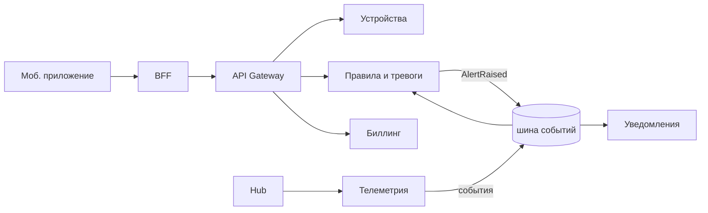

# Лекция 15. Микросервисы и интеграционные паттерны

> **Дисциплина:** Распределённые системы и облачные технологии (РСиОТ)
> **Занятие:** лекция 15 из 28 · **Время:** 1 пара (80 мин)
> **Зачем это:** лекции 9–14 дали все кирпичи — устойчивость, хранилища,
> транзакции, события, потоки. Сегодня учимся резать систему на сервисы:
> где проводить границы, как договариваться контрактами, когда звать
> синхронно, а когда событием — и почему иногда правильный ответ:
> «не резать вовсе».

---

## Крючок: Amazon вернулся в монолит и сэкономил 90 %

> 🖥 **Слайд 2.** Крючок: Prime Video

Март 2023 года. Команда мониторинга качества видео Amazon Prime Video
публикует пост, от которого индустрию слегка подбросило: они перевели
свой сервис **с микросервисов обратно в монолит** — и сократили
инфраструктурные затраты на **~90 %**, попутно увеличив масштаб.

Что было: конвейер анализа аудио/видео, нарезанный на микросервисы по
техническим шагам (разбить на кадры → детекторы дефектов → агрегация),
с оркестрацией на AWS Step Functions. Видеокадры между шагами
передавались через S3 — миллионы дорогих вызовов хранилища только для
того, чтобы передать данные соседнему шагу конвейера.

Что стало: все шаги — в одном процессе, кадры передаются в памяти.
Масштабирование — клонированием целого сервиса, а не каждого шага.

Заголовки кричали «Amazon хоронит микросервисы!». Вопрос залу:
**что на самом деле было ошибкой — микросервисы как идея или что-то
другое?**

Держите ответ до конца пары: к финалу у вас будет точный диагноз этой
архитектуры — и слова, чтобы его назвать.

*(Источники кейса: `sources/Веб-находки_Лекция_15.md` — The Stack,
DevClass; дата доступа 10.08.2026.)*

---

## Квиз-извлечение (по лекции 14: обработка данных)

> 🖥 **Слайд 3.** Квиз-извлечение

Ответьте не подглядывая; ответы — в конце лекции.

1. Чем event time отличается от processing time?
2. Что такое watermark и по чему выбирают его допуск?
3. Как сделать batch-джоб безопасно перезапускаемым?
4. Из чего складывается exactly-once потокового движка?

---

## Результаты обучения

> 🖥 **Слайд 4.** Чему научимся

После этой пары вы сможете:

1. Объяснять, какую проблему микросервисы решают на самом деле — и
   какую цену за это назначает сеть.
2. Проводить границы сервисов по bounded context и проверять границу
   тестом автономии.
3. Обосновывать правило database-per-service и заменять общую БД
   интеграцией через события.
4. Оформлять контракты API (OpenAPI), версионировать их без поломки
   потребителей и объяснять идею contract-тестов.
5. Выбирать между синхронной и событийной интеграцией для конкретного
   сценария.
6. Объяснять роли API Gateway и BFF; распознавать распределённый
   монолит и другие анти-паттерны.

## Пререквизиты

- Лекция 3: REST/gRPC, идемпотентность; лекция 9: таймауты, breaker,
  амплификация цепочек.
- Лекции 11–13: outbox, события, event-carried state transfer.
- Лекция 10: polyglot persistence.

---

## Картина мира: организационная технология

> 🖥 **Слайд 5.** Дорожная карта пары

Неудобная правда: микросервисы **не делают систему быстрее**. Вызов
функции внутри процесса — наносекунды; тот же вызов через сеть —
миллисекунды плюс все радости лекции 1 (таймауты, ретраи, «неизвестно»).
Технически монолит почти всегда эффективнее — Prime Video тому свидетель.

Зачем тогда? Ответ лежит не в технике, а в **организации**. Двадцать
команд не могут одновременно релизить один монолит: очередь на деплой,
конфликты, страх трогать чужой код. Микросервисы покупают **независимую
разработку и деплой**: каждая команда владеет своим сервисом, своей БД
и своим расписанием релизов. Это закон Конвея в действии: архитектура
повторяет структуру коммуникаций организации — так пусть повторяет
осознанно.

Отсюда главный тезис пары: **микросервисы — это стратегия
масштабирования организации, оплачиваемая сетью**. Все сегодняшние
паттерны — способы платить меньше.

Маршрут: зачем на самом деле → границы по домену → своя БД у каждого →
контракты и версии → sync против async → gateway и BFF → discovery и
здоровье → анти-паттерны и честное «когда не надо». Режем «СмартДом»
вживую. Два квиза, одно голосование.

---

## Основные понятия

**Определения** (пополним глоссарий в конце):

- **Микросервис** — независимо развёртываемый сервис, владеющий своей
  предметной областью и своими данными; принадлежит одной команде.
- **Bounded context** — граница предметной модели, внутри которой
  термины и правила согласованы («устройство» для биллинга и для
  телеметрии — разные модели).
- **Контракт API** — формальное описание интерфейса (OpenAPI-схема,
  схема события), по которому живут потребители.
- **Распределённый монолит** — сервисы разделены физически, но связаны
  логически: релизятся вместе, падают вместе.
- **API Gateway** — единая входная точка для внешних клиентов.

---

## Ядро пары

### 1. Границы: резать по домену, а не по слоям и шагам

> 🖥 **Слайд 6.** Границы по bounded context

Три способа порезать «СмартДом» — и только один правильный:

- **По слоям** (сервис-UI, сервис-логика, сервис-БД): каждый пользовательский
  сценарий проходит через все сервисы → любое изменение трогает все
  команды. Это не границы, это этажи одного здания.
- **По техническим шагам** (приём → валидация → обогащение →
  сохранение): конвейер с сетью между шагами и данными, гоняемыми по
  кругу, — ровно то, что похоронило экономику Prime Video.
- **По bounded context**: телеметрия, управление устройствами, правила
  и тревоги, уведомления, биллинг, пользователи. Внутри каждого — своя
  согласованная модель («Device» биллинга — это тарифная позиция,
  «Device» телеметрии — источник потока; и это нормально, что модели
  разные).

Тест границы — **автономия**: может ли команда сервиса выкатить релиз,
не согласовывая его с соседями? Есть ли у сервиса один владелец? Живут
ли его данные только у него? Три «да» — граница здоровая.

### 2. Database-per-service: данные — часть границы

> 🖥 **Слайд 7.** Своя БД у каждого

Правило без исключений в здоровой архитектуре: **у каждого сервиса —
своя БД, и никто чужой в неё не ходит**. Почему это так важно:

- Общая БД — это общая схема: миграция одного сервиса ломает соседей,
  релизы снова связаны — распределённый монолит через чёрный ход.
- Запросы соседа в вашу таблицу — это контракт, о котором вы не знаете:
  переименовали колонку — упал чужой сервис.
- Своя БД = свобода выбора вокрлада (лекция 10): телеметрии — Cassandra,
  биллингу — PostgreSQL, и никто никому не мешает.

А как же данные, которые нужны нескольким сервисам? Ответ вы уже
знаете: **интеграция через события** (лекции 11–13) — outbox публикует
факты, соседи строят свои локальные копии под свои нужды.

#### Peer-instruction-вопрос

> 🖥 **Слайды 8–12.** Голосование PI → четыре разбора

Голосуем, обсуждаем с соседом 90 секунд, голосуем снова.

> Сервис уведомлений шлёт жильцам push и email. Email'ы хранит сервис
> пользователей. Уведомлений — тысячи в минуту. Как сервису уведомлений
> получать адреса?
>
> A. Читать напрямую из БД сервиса пользователей — быстрее и проще.
> B. Синхронный вызов API пользователей при каждом уведомлении.
> C. Локальная копия контактов, обновляемая событиями
> `UserContactChanged` (event-carried state transfer).
> D. Слить уведомления и пользователей в один сервис — раз данные
> нужны вместе, зачем их разделять?

Разбор — в конце лекции. Подсказка: проверьте каждый вариант на
автономию (кто с кем связан релизами?) и на поведение при отказе
сервиса пользователей.

> 🖥 **Слайд 13.** Пауза (60 секунд)

### 3. Контракты: договор дороже кода

> 🖥 **Слайд 14.** Контракты и версии

Сервисы общаются только через интерфейсы — значит, интерфейс и есть
главный артефакт. Дисциплина контрактов:

- **Описание — машиночитаемое**: OpenAPI для HTTP, схемы из реестра для
  событий (лекция 12). Из описания генерируются клиенты и валидация;
  «контракт в вики» контрактом не является.
- **Эволюция — только совместимая**: добавлять необязательные поля —
  можно; переименовывать и удалять — нельзя. Ломающее изменение = новая
  версия (`/v2/...`) при живой старой, пока потребители не переехали.
- **Contract-тесты** (Pact и родня): потребитель фиксирует, какие поля
  и форматы он реально использует; CI поставщика проверяет каждую
  сборку против ожиданий всех потребителей. Ломающее изменение
  обнаруживается до деплоя, а не в проде в пятницу.

Знакомая логика? Это schema-on-write против schema-on-read (лекция 10)
на уровне организаций: контракт должен быть явным и проверяемым
машиной, потому что потребители — люди, которых вы никогда не видели.

### 4. Sync против async: критичный путь и всё остальное

> 🖥 **Слайд 15.** Выбор интеграции

Правило выбора на пальцах:

- **Синхронно** (REST/gRPC) — когда ответ нужен для продолжения
  сценария *прямо сейчас*: проверить права, узнать тариф при
  подключении. Цена: доступности перемножаются (цепочка из 5 сервисов
  по 99,9 % даёт ≈ 99,5 %), амплификация ретраев (лекция 9), рост p99.
- **Асинхронно** (события через брокер) — когда «сделай когда сможешь»:
  уведомления, аналитика, синхронизация копий. Цена: итоговая
  согласованность и вся дисциплина лекций 11–13.

Практическое следствие: **длинные синхронные цепочки — запах**.
Если запрос жильца проходит через пять сервисов последовательно —
либо границы порезаны неправильно, либо половину пути надо перевести
на события. Здоровый профиль: короткий синхронный «передний край» +
событийная «задняя шина».

### 5. API Gateway и BFF: один вход вместо зоопарка

> 🖥 **Слайд 16.** Gateway и BFF

Снаружи микросервисный зоопарк не должен быть виден. **API Gateway** —
единая входная точка: TLS, аутентификация (JWT/OAuth2), rate limiting
(token bucket из лекции 9 живёт именно здесь), маршрутизация к
сервисам. Клиент видит один API, а не двадцать адресов.

**BFF** (backend for frontend) — специализация идеи: у мобильного
приложения и веб-панели разные потребности, и вместо «одного жирного
API на всех» каждая витрина получает свой тонкий агрегирующий слой.
BFF мобильного «СмартДома» одним запросом собирает: текущие показания
(Redis, лекция 10), активные тревоги, статус подписки — три внутренних
вызова, один ответ, меньше чатости по мобильной сети.

Ловушка: не превращайте gateway в новый монолит с бизнес-логикой —
его работа маршрутизировать и защищать, а не решать.

### 6. Discovery и здоровье: как сервисы находят друг друга

> 🖥 **Слайд 17.** Discovery и health checks

Инстансы сервисов приходят и уходят (лекция 1: топология не вечна) —
адреса нельзя зашивать в конфиги. **Service discovery** — реестр живых
инстансов: Consul, etcd (тот самый, на Raft — лекция 7), а в Kubernetes
это встроено в DNS: имя сервиса резолвится в живые поды.

Чтобы реестр знал, кто жив, сервисы отвечают на **health checks**, и их
два, а не один:

- **liveness** — «процесс жив?» Нет — перезапустить.
- **readiness** — «готов принимать трафик?» Прогрев кэша, миграция,
  потерянная БД — жив, но не готов: трафик не слать.

Один эндпоинт на обе роли — классическая ошибка: временно не готовый
сервис перезапускают, делая только хуже. Глубже — в лекции 18 и лабе 5,
где Kubernetes возьмёт discovery и здоровье на себя. Service mesh
(mTLS, канареечная маршрутизация между сервисами) — отдельная
лекция 20; пока просто знайте, что этот слой существует.

### 7. Живой сеанс: режем «СмартДом» на сервисы

> 🖥 **Слайд 18.** Живой сеанс

Строим вместе (7–10 минут), на доске. Задача: провести границы и
проверить каждую тестом автономии.

**Шаг 1 — кандидаты.** Зал называет домены; выписываем: устройства
(реестр, прошивки), телеметрия (приём потока), правила/тревоги,
уведомления, пользователи/дома, биллинг.

**Шаг 2 — спорное место.** Телеметрия и правила — вместе или врозь?
Аргумент «врозь»: разные вокрлады (200 тыс. записей/с против чтения
правил), разные команды, разный темп изменений (правила меняются
каждую неделю, приём — раз в квартал). Проверка тестом: может ли
команда правил релизить, не трогая приём? Да → врозь.

**Шаг 3 — данные.** Каждому — своё (лекция 10 предсказала): телеметрия →
Cassandra; устройства, пользователи, биллинг → свои PostgreSQL;
уведомления → своя копия контактов (PI-вопрос!). Событийная шина
(лаба 4) — между ними.

**Шаг 4 — вход.** Gateway: auth + rate limit; BFF мобильного
приложения. Итог:

**Проверка:** пройдите по каждой стрелке и назовите её тип: синхронная
(нужен ответ сейчас) или событийная. Синхронных цепочек длиннее двух
звеньев на схеме нет — это и был критерий из раздела 4.

Типичные ошибки:

1. Резать по оргструктуре прошлого года или по таблицам БД, а не по
   доменам.
2. Начинать с 15 сервисов на команду из четырёх человек — каждый
   сервис стоит конвейера, мониторинга и дежурств.
3. Забыть спросить «кто владелец?» — сервис без владельца гниёт.

### 8. Анти-паттерны и честное «когда не надо»

> 🖥 **Слайд 19.** Анти-паттерны

Галерея боли (первые два — диагнозы для крючка):

- **Распределённый монолит** — порезали, но не развязали: синхронные
  цепочки через всё, релизы согласуются, общие библиотеки моделей.
  Все минусы сети, ни одного плюса автономии.
- **Границы по техническим шагам** — конвейер Prime Video: данные
  гоняются между «сервисами», которым нечем владеть. Вот и диагноз
  крючка: ошибкой были не микросервисы, а границы + транспорт данных
  через S3 вместо памяти.
- **Общая БД** — связность через таблицы, спрятанная от глаз.
- **Nanoservices** — сервис на каждую функцию: сеть там, где хватило
  бы вызова.
- **Chatty-интеграция** — двадцать мелких вызовов там, где нужен один
  агрегирующий (лекарства: BFF, локальные копии).

И честный вывод для своих проектов: команде из трёх человек с одним
продуктом почти всегда правильнее **модульный монолит** — те же
bounded context'ы как модули одного процесса, одна БД, один деплой.
Границы уже прочерчены — если организация вырастет, модули станут
сервисами. Микросервисы — не пропуск во взрослый мир, а плата за
большой мир; не платите её раньше времени.

---

## Типичные ошибки (сводка пары)

> 🖥 **Слайд 20.** Типичные ошибки

1. **«Микросервисы = скорость»** — сеть медленнее вызова функции на
   порядки; выигрыш организационный, и только при верных границах.
2. **Границы по слоям/шагам/таблицам** — вместо bounded context.
3. **Общая БД «на переходный период»** — распределённый монолит
   навсегда.
4. **Контракт в вики** — контракт должен проверяться машиной
   (OpenAPI + contract-тесты).
5. **Длинные синхронные цепочки** — доступности перемножаются,
   ретраи амплифицируются.
6. **Один health-эндпоинт на всё** — неготовых перезапускают вместо
   того, чтобы просто не слать трафик.

---

## Квиз-закрепление (по этой паре)

> 🖥 **Слайд 21.** Закрепление

Ответьте не подглядывая; ответы — в конце лекции.

1. Сформулируйте тест здоровой границы сервиса (три вопроса).
2. Почему общая БД превращает микросервисы в распределённый монолит?
3. Цепочка из 5 синхронных сервисов по 99,9 % — какая доступность у
   сценария и что с этим делать?
4. Чем liveness отличается от readiness и что будет, если их слить?

---

## Вопросы для самопроверки

1. Какую проблему микросервисы решают, а какую — создают?
2. Что такое bounded context? Почему «Device» в биллинге и телеметрии —
   разные модели, и это нормально?
3. Переформулируйте закон Конвея своими словами и приведите пример.
4. Почему database-per-service — правило, а не рекомендация?
5. Как сервису получить чужие данные, не нарушая границ? Три способа
   из PI-вопроса — и когда каждый уместен?
6. Что фиксирует contract-тест и когда он должен падать?
7. Какие изменения API совместимы, а какие требуют новой версии?
8. Постройте правило выбора sync/async для трёх сценариев «СмартДома».
9. Что делает API Gateway и чем BFF отличается от него?
10. Зачем discovery, если адреса можно записать в конфиг? (Лекция 1
    подскажет.)
11. Опишите распределённый монолит тремя симптомами.
12. Поставьте диагноз архитектуре Prime Video до миграции — какие два
    анти-паттерна там жили?
13. Когда модульный монолит правильнее микросервисов? Назовите три
    признака.

---

## Мост к лабораторной

> 🖥 **Слайд 22.** Мост к лабе

Этой парой закрывается блок «данные и интеграция» (лекции 10–15): у вас
теперь есть полный словарь внутренностей распределённой системы — от
хранилищ до границ сервисов. В лабе 4 вы уже строите событийную
интеграцию — ровно ту «заднюю шину», которую мы сегодня рисовали на
доске. Дальше — блок C: облака и оркестрация. В лабе 5 (Kubernetes,
после лекции 18) сервисы «СмартДома» поедут в кластер — и всё
сегодняшнее станет физикой: discovery окажется DNS-именами Kubernetes,
health checks — пробами в манифесте, а независимый деплой — командой
`kubectl rollout`.

**Задание на 1 предложение** (письменно, в конспект): закончите фразу
«Умение проводить границы сервисов пригодится лично мне, потому что…» —
про свой проект. Спрошу троих на следующей паре.

---

## Глоссарий

> 🖥 **Слайд 23 (финал).** Вопросы + литература

| Термин | Определение |
| --- | --- |
| Микросервис | Независимо развёртываемый сервис со своим доменом, данными и командой |
| Bounded context | Граница модели домена с согласованными терминами и правилами |
| Закон Конвея | Архитектура повторяет структуру коммуникаций организации |
| Database-per-service | У каждого сервиса своя БД; чужим вход воспрещён |
| Контракт API | Машиночитаемое описание интерфейса (OpenAPI, схема события) |
| Обратная совместимость | Новая версия обслуживает старых потребителей |
| Contract-тесты | CI-проверка поставщика против ожиданий потребителей (Pact) |
| API Gateway | Единый вход: TLS, auth, rate limit, маршрутизация |
| BFF | Агрегирующий API-слой под конкретную витрину (mobile/web) |
| Service discovery | Реестр живых инстансов (Consul, etcd, DNS Kubernetes) |
| Liveness / readiness | «Жив?» → перезапуск / «готов?» → слать ли трафик |
| Распределённый монолит | Порезано, но не развязано: релизы и отказы общие |
| Nanoservices / chatty | Слишком мелкие сервисы / шквал мелких вызовов |
| Модульный монолит | Bounded context'ы как модули одного процесса; честный старт |

## Список литературы

1. Основная литература
   - [1] Richardson C. — «Microservices Patterns». Manning, 2018.
     Главы 1–4.
   - [2] Newman S. — «Building Microservices», 2nd ed. O'Reilly, 2021.
     Главы 1–2, 4–5.
2. Интернет-ресурсы
   - [3] Кейс Prime Video, анти-паттерны микросервисов —
     подборка с URL в `sources/Веб-находки_Лекция_15.md`
     (дата обращения: 10.08.2026).

---

## Ответы

### Ответы: квиз-извлечение (лекция 14)

1. Event time — когда событие произошло (ts из конверта); processing
   time — когда доехало до обработчика. Расходятся из-за буферизации и
   обрывов — штатно.
2. Watermark — движущийся порог «события старше T не ждём»
   (max(event time) − допуск); допуск выбирают по измеренному p99
   опозданий.
3. Единица работы — партиция по дате (ключ идемпотентности), выход
   перезаписывается атомарно; параметр `--date` вместо `now()`.
4. Чекпоинты (состояние + offset'ы атомарно) + транзакционные или
   идемпотентные sink'и; кончается на внешних побочных эффектах.

### Ответы: peer instruction

Правильный ответ — **C**: локальная копия контактов, обновляемая
событиями `UserContactChanged` (event-carried state transfer,
лекция 13). Уведомления автономны: сервис пользователей может лежать,
а push'и идут; нагрузка тысяч отправок не бьёт по чужому API; данных
ровно столько, сколько нужно (email, не весь профиль).

- A — прямое чтение чужой БД: скрытый контракт на чужую схему;
  миграция сервиса пользователей молча ломает уведомления — общая БД
  через чёрный ход, распределённый монолит.
- B — честнее A, но: доступности перемножаются (пользователи легли —
  уведомления встали, включая тревоги!), тысячи вызовов в минуту
  создают chatty-нагрузку, p99 уведомления включает чужой p99.
  Для редких некритичных запросов — приемлемо; здесь — нет.
- D — слияние по «данные нужны вместе» вернёт монолит по кусочку:
  уведомлениям нужны и устройства (что сломалось), и правила (что
  сработало) — сливать всё? Домены разные: жизненный цикл аккаунта
  против доставки сообщений. Нужны данные — стройте копию, не сносите
  границу.

### Ответы: квиз-закрепление

1. Может ли команда релизить независимо? Есть ли один владелец?
   Живут ли данные сервиса только у него? Три «да» — граница здоровая.
2. Общая схема связывает релизы (миграция одного ломает других),
   создаёт скрытые контракты на таблицы и запрещает выбирать хранилище
   под вокрлад — сервисы разделены физически, но не логически.
3. 0,999⁵ ≈ 0,995 — примерно 99,5 %: из «трёх девяток» получились
   «две с половиной». Лечение: укоротить цепочку (границы!), перевести
   некритичные звенья на события, добавить деградацию (лекция 9).
4. Liveness — «процесс жив?» (нет → перезапуск); readiness — «готов
   принимать трафик?» (нет → не слать, но не трогать). Слитые в один:
   временно не готовый сервис перезапускают — прогрев начинается
   заново, становится хуже.
