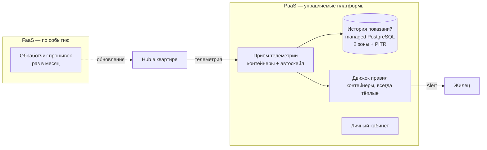

# Лекция 16. Облачные модели и провайдеры

> **Дисциплина:** Распределённые системы и облачные технологии (РСиОТ)
> **Занятие:** лекция 16 из 28 · **Время:** 1 пара (80 мин)
> **Зачем это:** до сих пор мы строили распределённые системы «в вакууме» —
> с этой пары начинается блок про то, **где они живут**. Облако — это не
> «чей-то сервер», а набор моделей аренды инфраструктуры с чёткими границами
> ответственности; неверно провести эту границу — значит потерять данные
> или деньги. Конспект 2025 года сохранён в `archive_2025/`; сравнение — в
> `docs/Сравнение_со_старым_курсом.md`.

---

## Крючок: 858 терабайт, у которых не было плана Б

> 🖥 **Слайд 2.** Крючок: пожар NIRS 26.09.2025

26 сентября 2025 года, Тэджон, Южная Корея. В государственном дата-центре
NIRS техники перемещают литий-ионные батареи. Через сорок минут батареи
вспыхивают. Огонь уничтожает **96 информационных систем** правительства.

У 95 из них были резервные копии. У 96-й — внутреннего файлового хранилища
госслужащих **G-Drive** (Government Drive, по 30 ГБ на чиновника, всего
**858 ТБ** документов) — бэкапа не было. Официальное объяснение: «слишком
большой объём для резервного копирования». Более 700 государственных
цифровых сервисов ушли в офлайн: идентификация, налоги, экстренные службы,
почта. Работа министерств встала; 858 ТБ признаны, скорее всего,
утраченными навсегда.

Вопрос залу: **а если бы G-Drive жил в публичном облаке — данные бы
уцелели?** И контрвопрос: в лекции 1 мы разбирали, как AWS сам лежал
15 часов. Так «своя серверная» или облако — что надёжнее?

Держите оба вопроса до конца пары. Спойлер: правильный ответ — не «своё»
и не «чужое», а «понимать, какую модель ты выбрал и **что в ней остаётся
твоей обязанностью**». Слова «слишком большой объём» перестанут звучать
как оправдание примерно к середине лекции.

*(Источник кейса: `sources/Веб-находки_Лекция_16.md` — разборы DCD,
Tom's Hardware, TechSpot; дата доступа 09.08.2026.)*

---

## Квиз-извлечение (по лекции 15 «Микросервисы»)

> 🖥 **Слайд 3.** Квиз-извлечение

Ответьте не подглядывая; ответы — в конце лекции.

1. Назовите две причины разрезать монолит на микросервисы — и одну причину
   этого **не** делать.
2. Чем синхронная интеграция сервисов (REST/gRPC-вызов) отличается от
   асинхронной (сообщение в очередь) по связанности и отказам?
3. Зачем перед парком микросервисов ставят API gateway?
4. Почему «общая база данных на все микросервисы» считается антипаттерном?

---

## Результаты обучения

> 🖥 **Слайд 4.** Чему научимся

После этой пары вы сможете:

1. Определять облако через пять признаков NIST и объяснять экономику
   CapEx → OpEx.
2. Различать IaaS, PaaS, FaaS и SaaS и выбирать модель под конкретный
   компонент системы.
3. Сравнивать модели развёртывания: публичное, частное, гибридное облако,
   мульти-облако.
4. Проводить границу ответственности по shared responsibility model — и
   отвечать за свою половину.
5. Ориентироваться в ландшафте провайдеров (AWS, Azure, GCP), регионах и
   зонах доступности.
6. Видеть экономические ловушки: egress-трафик, vendor lock-in, data
   gravity.

## Пререквизиты

- Лекции 1–15: частичные отказы и fallacies (л. 1), контейнеры (л. 2),
  микросервисы и интеграция (л. 15).
- Docker: образ, контейнер, `docker run` — уровень лабы 1.
- Понимание, что такое SLA/SLO (л. 1).

---

## Картина мира: аренда вместо стройки

> 🖥 **Слайд 5.** Дорожная карта пары

До 2006 года запуск веб-сервиса начинался с покупки серверов: капитальные
затраты (**CapEx**), недели поставки, годы амортизации. Облако превратило
инфраструктуру в **аренду по счётчику** (**OpEx**): сервер — за минуту,
плати за часы, выключил — не платишь. Это то же электричество: свою
электростанцию строят единицы, остальные втыкают вилку в розетку.

Аналогия пары — **жильё**. Свой дата-центр — собственный дом: полная
свобода и полная ответственность, от фундамента до пожарной сигнализации
(вспомните Тэджон). IaaS — аренда пустой квартиры: стены и коммуникации
хозяина, мебель и порядок — ваши. PaaS — отель: приходишь со своим
чемоданом-кодом, уборка и инженерия включены. FaaS — такси: платишь за
поездку, машина существует для тебя только пока едешь. SaaS — ресторан:
готовый продукт, твой только выбор из меню.

Сквозной пример остаётся с нами: сегодня решаем, **где жить платформе
«СмартДом»** — приёму телеметрии, истории показаний, движку правил и
сайту — и кто отвечает за каждый этаж.

Маршрут пары: что такое облако → четыре модели обслуживания → модели
развёртывания → граница ответственности → провайдеры и регионы → живой
сеанс: расселяем «СмартДом» → экономика облака. По дороге — два квиза,
одно голосование и пауза.

---

## Основные понятия

**Определения** (пополним глоссарий в конце):

- **Облачные вычисления** — модель предоставления вычислительных ресурсов
  (серверы, хранилища, сети, ПО) по требованию через сеть, с оплатой по
  использованию.
- **CapEx / OpEx** — капитальные затраты (купить сервер) против
  операционных (арендовать час сервера).
- **Модель обслуживания** — сколько слоёв стека берёт на себя провайдер:
  IaaS / PaaS / FaaS / SaaS.
- **Модель развёртывания** — чьё облако и для кого: публичное, частное,
  гибридное, мульти-облако.
- **Shared responsibility model** — договорное разделение: за что отвечает
  провайдер, за что — клиент. Меняется с моделью обслуживания.

---

## Ядро пары

### 1. Что такое облако: пять признаков NIST

> 🖥 **Слайд 6.** Пять признаков облака

«Облако» — затасканное слово, поэтому инженеры пользуются определением
NIST (Национальный институт стандартов США), где облаком считается сервис
с пятью признаками:

1. **Самообслуживание по требованию** — сервер создаётся кнопкой или API,
   без письма администратору и ожидания в очереди.
2. **Широкий сетевой доступ** — ресурсы доступны по стандартным протоколам
   откуда угодно.
3. **Пул ресурсов** — железо общее, арендаторы делят его, не видя друг
   друга (мультиарендность).
4. **Быстрая эластичность** — масштабирование вверх и вниз за минуты;
   для клиента ресурсы выглядят бесконечными.
5. **Измеряемость** — всё посчитано по счётчику: секунды CPU, гигабайты,
   запросы. Отсюда оплата по факту.

Контрпример: сервер под столом кафедры, на который вы заходите по SSH, —
не облако, даже если на нём крутится веб-сервис: нет ни эластичности, ни
пула, ни счётчика. Виртуалка в университетском VMware, которую выдают по
заявке за три дня, — тоже не облако: нет самообслуживания.

Экономический смысл: пять признаков превращают CapEx в OpEx и — главное
для распределённых систем — позволяют **добавлять узлы за минуты**.
Горизонтальное масштабирование из лекции 1 без облака упирается в недели
поставки железа.

### 2. Четыре модели обслуживания: лестница ответственности

> 🖥 **Слайд 7.** Лестница IaaS → SaaS

**Определения:**

- **IaaS** (Infrastructure as a Service) — аренда виртуальных машин, сетей
  и дисков. Провайдер даёт железо и гипервизор; ОС, рантайм и приложение —
  ваши. Примеры: EC2, Azure VM, Compute Engine.
- **PaaS** (Platform as a Service) — аренда платформы: управляемые базы
  данных, контейнерные рантаймы, очереди. Вы приносите код или контейнер,
  провайдер держит ОС, патчи, отказоустойчивость платформы. Примеры:
  Cloud Run, App Service, RDS, managed Kubernetes.
- **FaaS** (Functions as a Service, serverless) — аренда исполнения
  **функции**: код запускается по событию, биллинг — за миллисекунды
  работы, простаивающая функция стоит ноль. Примеры: Lambda, Azure
  Functions, Cloud Functions.
- **SaaS** (Software as a Service) — аренда готового приложения: почта,
  CRM, трекер задач. Ваши только данные и настройки.

Чем выше по лестнице — тем меньше вашего контроля и тем меньше вашей
эксплуатационной работы. Это не «лучше/хуже», это **компромисс**: IaaS
выбирают за контроль (специфичное ядро, лицензии, GPU в нестандартной
конфигурации), FaaS — за нулевую эксплуатацию и оплату по факту, PaaS —
золотая середина для большинства сервисов.

«СмартДом» по лестнице:

| Компонент «СмартДома» | Модель | Почему |
| --- | --- | --- |
| Приём телеметрии (пики по вечерам) | PaaS-контейнеры | автоскейл без нашего дежурства |
| История показаний | PaaS (managed PostgreSQL) | бэкапы и реплики — забота платформы |
| Реакция на редкое событие «прошивка вышла» | FaaS | срабатывает раз в месяц — платить за простой глупо |
| Видеоархив камер с GPU-аналитикой | IaaS | нестандартное железо, полный контроль |
| Почта поддержки, трекер задач команды | SaaS | не наш бизнес — арендуем готовое |

> 🖥 **Слайд 8.** «СмартДом» на лестнице моделей

Обратите внимание на строку с FaaS: биллинг за миллисекунды имеет обратную
сторону — **cold start**. Простаивавшая функция при первом вызове
поднимается сотни миллисекунд, иногда секунды. Для тревоги «дым на кухне»
из лекции 1 это может съесть заметную долю SLO «доставка за 5 секунд» —
критичный путь тревог мы на FaaS не понесём. Подробно serverless разберём
в лекции 23.

### 3. Модели развёртывания: чьё облако

> 🖥 **Слайд 9.** Публичное, частное, гибрид, мульти

**Определения:**

- **Публичное облако** — инфраструктура провайдера, общая для всех
  клиентов (AWS, Azure, GCP, Yandex Cloud).
- **Частное облако** — те же пять признаков NIST, но железо принадлежит
  одной организации (OpenStack, VMware в своём ЦОД).
- **Гибридное облако** — связка частного и публичного: чувствительное —
  у себя, эластичное — у провайдера.
- **Мульти-облако** — использование нескольких публичных провайдеров
  одновременно.

Частное облако выбирают не из ностальгии: регуляторика (персональные
данные граждан обязаны храниться в стране, где нет региона гиперскейлера),
предсказуемая цена при стабильной нагрузке, специфичные требования
безопасности. Плата — вся эксплуатация на вас: пожарная сигнализация,
дизель-генератор и бэкапы в другом здании. Тэджон — это частная
инфраструктура, в которой ответственность за бэкап «оптимизировали».

Гибрид — реальность большинства крупных компаний: базы с персональными
данными в своём ЦОД, фронтенды и аналитика — в публичном облаке.
Мульти-облако звучит как страховка от отказа провайдера, но помните
инцидент AWS из лекции 1: чтобы пережить его в мульти-облаке, нужно
**заранее** дублировать данные и трафик у второго провайдера — это двойная
сложность и двойной счёт. Для большинства команд честный ответ —
«мульти-облако у нас случайное: купили компанию, у неё Azure».

### 4. Shared responsibility: где кончается провайдер

> 🖥 **Слайд 10.** Граница ответственности

Главная таблица пары. Провайдер отвечает за безопасность **облака**
(здания, железо, гипервизор, свои сервисы), клиент — за безопасность
**в облаке** (данные, доступы, конфигурация). Граница сдвигается с моделью
обслуживания:

| Слой | Свой ЦОД | IaaS | PaaS | SaaS |
| --- | --- | --- | --- | --- |
| Здание, железо, сеть ЦОД | 🟥 вы | 🟦 провайдер | 🟦 провайдер | 🟦 провайдер |
| ОС, патчи, рантайм | 🟥 вы | 🟥 вы | 🟦 провайдер | 🟦 провайдер |
| Приложение и его конфигурация | 🟥 вы | 🟥 вы | 🟥 вы | 🟦 провайдер |
| **Данные, доступы, бэкап-стратегия** | 🟥 вы | 🟥 **вы** | 🟥 **вы** | 🟥 **вы** |

Нижняя строка не меняется никогда — и именно на ней горят и компании, и
министерства. Managed PostgreSQL делает автоматические снимки — но если
**вы** не настроили их срок хранения, не проверили восстановление и не
включили point-in-time recovery, ваша миграция, удалившая таблицу
`readings`, честно отреплицируется на все копии провайдера. **Репликация —
не бэкап**: она с одинаковой надёжностью сохраняет и ваши данные, и вашу
ошибку. Корзина в SaaS-офисе — тоже не бэкап: у неё срок хранения.

Из этой же таблицы — ответ на второй вопрос крючка. Публичное облако почти
наверняка спасло бы 858 ТБ **от пожара**: объектные хранилища
гиперскейлеров реплицируют данные по нескольким зданиям, а за копейки — и
по регионам. Но от «скрипт удалил всё» облако само по себе не спасает —
это ваша половина таблицы.

#### Peer-instruction-вопрос № 1

> 🖥 **Слайды 11–15.** Голосование PI-1 → четыре разбора

Голосуем, обсуждаем с соседом 90 секунд, голосуем снова.

> История показаний «СмартДома» живёт в managed PostgreSQL (PaaS). Ваш
> скрипт миграции по ошибке удалил таблицу `readings`. Кто и как вернёт
> данные?
>
> A. Провайдер: база managed — восстановление данных входит в сервис.
> B. Никто: удалённое в облаке теряется навсегда, надо было держать базу
> у себя.
> C. Вы: восстановитесь из бэкапов/PITR — если сами включили их и хотя бы
> раз проверили восстановление.
> D. Данные вернёт репликация: у провайдера есть вторая копия базы.

Разбор — в конце лекции. Подсказка: вспомните нижнюю строку таблицы
ответственности — и чем репликация отличается от бэкапа.

### 5. Ландшафт провайдеров: большая тройка и остальные

> 🖥 **Слайд 16 — пауза 60 секунд, затем слайд 17.** Провайдеры

Рынок облачной инфраструктуры в первом квартале 2026 года — **129 млрд
долларов за квартал** (+35 % за год). Большая тройка держит 63 %:
**AWS — 28 %**, **Azure — 21 %**, **Google Cloud — 14 %** (Synergy
Research; источники в `sources/`). Быстрее всех растёт GCP (+63 % за год),
а быстрее всего внутри всех троих растут **AI-нагрузки** — уже 19 % всех
облачных расходов против 8 % в 2023-м: обучение и инференс моделей стали
главным новым потребителем GPU-инстансов (экономику этого разберём в
лекции 27).

Классы сервисов у всех одинаковые, различаются имена — таблица-разговорник:

| Класс | AWS | Azure | GCP |
| --- | --- | --- | --- |
| Виртуальные машины | EC2 | Virtual Machines | Compute Engine |
| Объектное хранилище | S3 | Blob Storage | Cloud Storage |
| Managed SQL | RDS / Aurora | Azure SQL | Cloud SQL |
| Managed Kubernetes | EKS | AKS | GKE |
| Функции | Lambda | Functions | Cloud Functions |
| Очереди / события | SQS / SNS | Service Bus | Pub/Sub |

Выбирают провайдера не по названиям, а по: наличию региона рядом с
пользователями, ценам на ваш профиль нагрузки, зрелости нужных managed-
сервисов, экосистеме компании (у «всё на Microsoft» дорога в Azure
короче). Помимо тройки есть нишевые игроки: Cloudflare (edge), Hetzner и
DigitalOcean (дёшево и просто), национальные облака под регуляторику.

### 6. Регионы и зоны доступности

> 🖥 **Слайд 18.** Регионы и зоны

**Определения:**

- **Регион** — географическая площадка провайдера: `eu-central-1`
  (Франкфурт), `us-east-1` (Вирджиния). Десятки регионов по планете.
- **Зона доступности (AZ)** — изолированный дата-центр (или группа) внутри
  региона: своё питание, охлаждение, сеть. Зоны соединены быстрыми
  каналами, но **не разделяют точки отказа** — пожар в одной зоне не
  трогает соседнюю.

Правило проектирования: **сервис на один регион, минимум на две зоны**.
Реплики PostgreSQL из лекции 6 разъезжаются по зонам; балансировщик
раскидывает трафик между зонами. Тэджон в терминах облака — «одна зона,
ноль реплик»: единственное здание было единой точкой отказа. Мульти-регион
(переживаем гибель Франкфурта целиком) — дорогое удовольствие для DR,
разберём в лекции 28. И помните us-east-1 из лекции 1: даже у
гиперскейлера регион — не абстракция, а конкретное место, которое умеет
болеть целиком.

### 7. Живой сеанс: расселяем «СмартДом» по облаку

> 🖥 **Слайд 19.** Живой сеанс

Строим вместе, на глазах, по шагам (7–10 минут; ход мысли важнее
результата). Вопрос: **какую модель обслуживания выбрать каждому
компоненту «СмартДома» — и почему?**

Шаг 1 — выписываем компоненты и их профиль нагрузки:

- приём телеметрии: постоянный поток, вечерние пики ×5;
- история показаний: PostgreSQL, данные терять нельзя;
- движок правил и тревог: критичный путь, SLO 5 секунд;
- обработчик «вышла новая прошивка»: раз в месяц, но тяжёлый;
- сайт-личный кабинет: обычный веб.

Шаг 2 — раскладываем по лестнице, проговаривая компромисс:

Шаг 3 — проверяем решения на прочность вопросами из пары:

- почему движок правил не на FaaS? — cold start против SLO тревоги;
- почему история не на IaaS с «своим» PostgreSQL? — бэкапы, патчи и
  реплики по зонам стали бы нашей ночной работой; мы оставили себе только
  нижнюю строку таблицы ответственности — и включили PITR;
- где здесь IaaS? — пока нигде: он появится, когда добавим видеоаналитику
  на GPU. Не берите контроль, за который не готовы дежурить.

Заметьте: мы ни разу не назвали провайдера. Модель обслуживания выбирается
**раньше** логотипа — таблица-разговорник переведёт решение на язык любого
из тройки.

### 8. Экономика облака: три ловушки

> 🖥 **Слайд 20.** Экономика и ловушки

Оплата по счётчику подкупает, но у счётчика есть три особенности, о
которых узнают из первого большого счёта:

1. **Egress-трафик.** Входящий трафик бесплатен, **исходящий из облака** —
   платный (примерно $0,05–0,12/ГБ у тройки). Гнать видеоархив камер
   «СмартДома» наружу каждый день — золотые гигабайты. Отсюда **data
   gravity**: чем больше данных накоплено у провайдера, тем дороже уйти —
   данные притягивают вычисления к себе.
2. **Vendor lock-in.** Уникальные сервисы провайдера (DynamoDB, BigQuery)
   удобны, но переезд с них — переписывание кода. Страховка — строить на
   переносимых стандартах: контейнеры, Kubernetes, PostgreSQL,
   OpenTelemetry, Terraform. Плата за страховку — отказ от части удобств;
   покупать её стоит осознанно, а не «на всякий случай» с первого дня.
3. **Тариф под профиль нагрузки.** On-demand — самый дорогой способ
   платить за **постоянную** нагрузку: reserved-инстансы и savings plans
   дают −40…70 % за обязательство на 1–3 года; spot-инстансы — до −90 %
   за готовность к отзыву машины в любой момент (идеально для батчей,
   недопустимо для базы данных).

Обратное движение тоже существует — **репатриация**: компании со
стабильной, предсказуемой нагрузкой возвращаются на своё железо, потому
что аренда выгодна для переменной нагрузки и дорога для ровной. Облако —
не религия, а тариф: раз в год пересчитывайте.

---

## Типичные ошибки (запомните до того, как совершите)

> 🖥 **Слайд 21.** Типичные ошибки

1. **«База managed — значит, бэкапы не моя забота».** Нижняя строка таблицы
   ответственности всегда ваша: включить PITR, задать срок хранения,
   **проверить восстановление**. Непроверенный бэкап — это лотерейный билет.
2. **«Репликация защищает данные».** Репликация защищает от отказа железа
   и честно тиражирует ваш `DROP TABLE` на все копии за миллисекунды.
3. **«Публичный бакет — да кто его найдёт»**. Сканеры находят открытые
   S3-бакеты за минуты; утечки «база клиентов лежала открытой» — регулярный
   жанр новостей. Закрыто по умолчанию, открыто — по явному решению.
4. **«Возьмём IaaS, будет полный контроль».** Контроль = эксплуатация:
   патчи ОС, реплики, дежурства. Платите инженерным временем за то, что
   PaaS отдаёт за деньги — чаще всего это невыгодный курс обмена.
5. **«Счёт придёт — разберёмся».** Бюджет-алерты включаются в первый день,
   а не после счёта на тысячу долларов за забытый GPU-инстанс.

---

## Квиз-закрепление (по этой паре)

> 🖥 **Слайд 22.** Закрепление

Ответьте не подглядывая; ответы — в конце лекции.

1. Назовите пять признаков облака по NIST. Какого из них не хватает
   «серверу под столом с SSH-доступом»?
2. Постройте лестницу IaaS → PaaS → FaaS → SaaS по убыванию вашего
   контроля. Что остаётся вашей ответственностью на **каждой** ступени?
3. Чем зона доступности отличается от региона и почему «две зоны» —
   минимум для продакшена?
4. Почему исходящий трафик — ловушка при выборе облака для видеоархива?

---

## Вопросы для самопроверки

1. Дайте определение облачных вычислений через пять признаков NIST.
2. Чем CapEx отличается от OpEx и почему облако — это OpEx?
3. Университетская виртуалка «по заявке за три дня» — облако? Почему?
4. Сравните IaaS и PaaS для хостинга PostgreSQL: что берёт на себя
   провайдер в каждом случае, что остаётся вам?
5. Что такое cold start в FaaS и какому компоненту «СмартДома» он
   противопоказан?
6. Когда оправдано частное облако? Назовите две причины.
7. Почему «настоящее» мульти-облако дорого? Что такое «случайное
   мульти-облако»?
8. Сформулируйте shared responsibility model одной фразой. Какая строка
   таблицы не переходит к провайдеру никогда?
9. Пожар в Тэджоне: какие два решения из сегодняшней пары предотвратили бы
   потерю 858 ТБ?
10. Почему репликация — не бэкап? Приведите сценарий, где реплики
    невредимы, а данные потеряны.
11. Что такое egress-стоимость и data gravity? Как они связаны?
12. Spot-инстанс дешевле on-demand до 90 %. Для каких задач «СмартДома» он
    подходит, для каких — нет?
13. Как застраховаться от vendor lock-in и чем за эту страховку платят?
14. По каким четырём критериям выбирают провайдера, если классы сервисов
    у всех одинаковые?

---

## Мост к лабораторной № 5

> 🖥 **Слайд 23.** Мост к лабе

Лабораторная № 5 (`tasks/task_05`) — деплой stateless-сервиса «СмартДома»
в Kubernetes. Сегодняшняя пара — первый из трёх её китов: вы теперь
понимаете, **что такое managed Kubernetes (EKS/AKS/GKE) как PaaS** и почему
локальный kind/minikube на вашем ноутбуке честно воспроизводит то, что в
облаке продаётся за деньги. Следующие две пары дадут остальное: сетевые
основы (лекция 17) и сам Kubernetes (лекция 18). Из этой пары в лабу
берём: лестницу ответственности (kubelet и ноды — чьи?), привычку читать
таблицу «кто отвечает за данные» и бюджетное мышление — kind бесплатен,
EKS-кластер — нет.

**Задание на 1 предложение** (письменно, в конспект): закончите фразу
«Умение проводить границу ответственности с провайдером пригодится лично
мне, потому что…» — конкретно, про свои проекты. На следующей паре спрошу
троих добровольцев.

---

## Глоссарий

> 🖥 **Слайд 24 (финал).** Вопросы + литература

| Термин | Определение |
| --- | --- |
| Облачные вычисления | Ресурсы по требованию через сеть, оплата по использованию (5 признаков NIST) |
| CapEx / OpEx | Капитальные затраты (купить) / операционные (арендовать) |
| IaaS | Аренда ВМ, сетей, дисков; ОС и выше — ваши |
| PaaS | Аренда платформы (managed БД, контейнерные рантаймы); код — ваш |
| FaaS (serverless) | Исполнение функций по событию, биллинг за время работы |
| SaaS | Готовое приложение в аренду; ваши — данные и настройки |
| Shared responsibility | Разделение ответственности: провайдер — «безопасность облака», клиент — «безопасность в облаке» |
| Регион / зона доступности | География провайдера / изолированный ЦОД внутри региона |
| Egress | Платный исходящий трафик из облака |
| Data gravity | Накопленные данные притягивают вычисления и удорожают уход |
| Vendor lock-in | Зависимость от уникальных сервисов провайдера |
| PITR | Point-in-time recovery — восстановление БД на момент времени |
| Spot / Reserved | Скидка за прерываемость / за обязательство на 1–3 года |
| Репатриация | Возврат нагрузки из облака на собственное железо |

## Список литературы

1. Основная литература
   - [1] Клеппман М. — «Высоконагруженные приложения». Питер. Глава 1
     (надёжность, масштабируемость — фундамент выбора модели).
   - [2] AWS Well-Architected Framework — обзорные разделы Cost
     Optimization и Reliability.
2. Интернет-ресурсы
   - [3] NIST SP 800-145 — The NIST Definition of Cloud Computing.
   - [4] Разборы пожара NIRS (Тэджон) и данные рынка Q1 2026 — подборка с
     URL в `sources/Веб-находки_Лекция_16.md` (дата обращения: 09.08.2026).

---

## Ответы

### Ответы: квиз-извлечение (лекция 15)

1. За: независимый деплой и масштабирование частей, автономия команд,
   изоляция отказов. Против: сетевые вызовы вместо вызовов функций — все
   fallacies лекции 1 внутри вашего приложения; для маленькой команды
   монолит проще и дешевле.
2. Синхронная: вызывающий ждёт ответа — просто, но отказ и задержка callee
   каскадируют на caller. Асинхронная: сообщение в очередь — слабая
   связанность, переживает недоступность получателя, но итоговая
   консистентность и сложнее отладка.
3. Единая точка входа: маршрутизация, аутентификация, rate limiting, TLS —
   вместо дублирования этого в каждом сервисе; клиент не знает внутреннюю
   топологию.
4. Общая БД связывает сервисы схемой: миграция одного ломает всех,
   независимый деплой умирает; каждый сервис владеет своими данными и
   публикует их через API/события.

### Ответы: peer instruction № 1

Правильный ответ — **C**: данные — всегда ваша половина таблицы. Managed
PostgreSQL даёт **инструменты** (автоснимки, PITR), но включить их, задать
срок хранения и проверить восстановление обязаны вы. Не проверяли
восстановление — считайте, что бэкапа нет.

- A — заблуждение «managed = провайдер отвечает за данные»: провайдер
  отвечает за работу СУБД, не за содержимое ваших таблиц. В типовых SLA
  потеря данных из-за действий клиента — проблема клиента.
- B — обратная крайность: у себя вы получили бы ту же задачу (бэкапы),
  только ещё и железо ваше. Тэджон — ровно этот сценарий.
- D — репликация не бэкап: `DROP TABLE` реплицируется на вторую копию за
  миллисекунды. Реплика защищает от отказа узла, не от вашей ошибки.

### Ответы: квиз-закрепление

1. Самообслуживание, сетевой доступ, пул ресурсов, эластичность,
   измеряемость. Серверу под столом не хватает минимум эластичности, пула
   и измеряемости (обычно — и самообслуживания).
2. Контроль убывает: IaaS (ваше всё от ОС) → PaaS (ваши код и конфигурация)
   → FaaS (ваша функция) → SaaS (ваши настройки). Данные, доступы и
   бэкап-стратегия — ваши на **всех** ступенях.
3. Регион — географическая площадка; зона — изолированный ЦОД внутри него
   (своё питание/охлаждение). Одна зона = единая точка отказа уровня
   здания: пожар, авария питания — и сервис лежит; две зоны переживают
   гибель одной.
4. Видеоархив — терабайты исходящего трафика; egress платный
   ($0,05–0,12/ГБ), просмотр архива снаружи ежедневно превращается в
   заметную статью счёта. Данные тяжелеют (data gravity) — вычисления
   придётся вести рядом с архивом.
