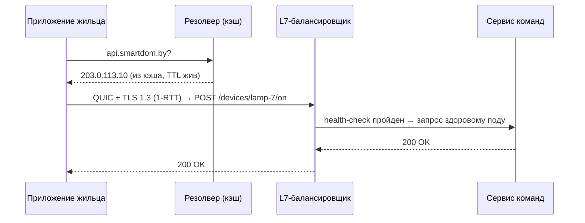

# Лекция 17. Сетевые основы для распределённых систем

> **Дисциплина:** Распределённые системы и облачные технологии (РСиОТ)
> **Занятие:** лекция 17 из 28 · **Время:** 1 пара (80 мин)
> **Зачем это:** между Hub'ом «СмартДома» и облаком лежат DNS, TLS, HTTP и
> балансировщики — четыре механизма, отказ любого из которых пользователь
> называет одинаково: «у вас всё лежит». Эта пара — про то, как запрос
> на самом деле находит сервер, и где по дороге ломается. Конспект 2025
> года сохранён в `archive_2025/`; сравнение — в
> `docs/Сравнение_со_старым_курсом.md`. Ретраи и gRPC были в лекции 3;
> сегодня — слои ниже.

---

## Крючок: один конфиг уронил Microsoft на несколько часов

> 🖥 **Слайд 2.** Крючок: Azure Front Door 29.10.2025

29 октября 2025 года, 16:00 UTC. В Azure Front Door — глобальном
L7-балансировщике и CDN Microsoft, через который в мир смотрят Microsoft
365, Xbox Live и тысячи клиентских сайтов, — уезжает **ошибочное изменение
конфигурации**. Edge-узлы по всей планете начинают ронять трафик: растут
потери пакетов, HTTP-таймауты, сыплются DNS-аномалии. Outlook не пускает,
Teams не грузится, Minecraft не заходит, портал Azure — тот, из которого
всё это чинят, — сам за Front Door и сам лежит.

Microsoft блокирует **все** дальнейшие изменения конфигурации, откатывается
на «last known good», уводит портал с Front Door и несколько часов
восстанавливает edge-парк. Заметьте дату: это случилось через **девять
дней** после сбоя AWS из лекции 1. Октябрь 2025-го инженеры запомнили
надолго.

Вопрос залу: Front Door — это «просто балансировщик». Почему его
конфигурация валит **глобально и мгновенно** — ведь серверы Microsoft 365
всё это время были живы и здоровы?

Ответ соберём по кусочкам к концу пары: сегодня мы разберём весь путь
запроса — DNS, TLS, HTTP и балансировку — и увидим, что «вход» в систему
и есть её самое хрупкое место.

*(Источник кейса: `sources/Веб-находки_Лекция_17.md` — разборы ThousandEyes
и Build5Nines; дата доступа 09.08.2026.)*

---

## Квиз-извлечение (по лекции 16 «Облачные модели»)

> 🖥 **Слайд 3.** Квиз-извлечение

Ответьте не подглядывая; ответы — в конце лекции.

1. Назовите пять признаков облака по NIST.
2. Managed PostgreSQL удалил вашу таблицу по вашей же миграции. Чья это
   проблема по shared responsibility model и почему?
3. Чем зона доступности отличается от региона?
4. Что такое egress-стоимость и почему она — ловушка?

---

## Результаты обучения

> 🖥 **Слайд 4.** Чему научимся

После этой пары вы сможете:

1. Проследить полный путь запроса: DNS-резолв → соединение → TLS →
   балансировщик → сервис.
2. Объяснить, как работает DNS: иерархия, типы записей, TTL — и почему
   «пропагация 72 часа» — миф.
3. Читать TLS-рукопожатие: сертификаты, цепочка доверия, SNI, TLS 1.3.
4. Сравнивать HTTP/1.1, HTTP/2 и HTTP/3/QUIC и объяснять, кому нужен
   каждый.
5. Различать балансировку L4 и L7, выбирать алгоритм и понимать health
   checks.
6. Учитывать облачные сетевые реалии: NAT, эфемерные порты, MTU.

## Пререквизиты

- Сети из пререквизитов курса: IP, TCP/UDP, порты — «понимаю, что
  происходит».
- Лекция 1: таймауты, состояние «неизвестно», p99.
- Лекция 3: HTTP-методы, идемпотентность, ретраи.
- Лекция 16: регионы, зоны, PaaS.

---

## Картина мира: путь одного тапа

> 🖥 **Слайд 5.** Дорожная карта пары

Жилец тапает в приложении «СмартДома» кнопку «включить свет». Между тапом
и вспыхнувшей лампочкой — целая экспедиция: телефон должен **найти** сервер
(DNS), **договориться** с ним о защищённом канале (TCP или QUIC + TLS),
**сказать**, чего хочет (HTTP), и попасть не в один-единственный сервер, а
в **один из многих** — здоровый и ближайший (балансировщик). Каждый этап —
отдельный протокол со своими отказами; сегодня пройдём их по порядку, как
проходит их каждый ваш запрос.

Аналогия пары — **телефонный звонок в большую компанию**: сначала ищете
номер в справочнике (DNS), потом дозваниваетесь (TCP/QUIC), убеждаетесь,
что это не мошенники, а голос узнаваем (TLS), называете добавочный (HTTP),
и секретарь соединяет вас со свободным оператором (балансировщик).

Маршрут пары: стек уровней → DNS → TLS → HTTP/1.1–2–3 → балансировка →
живой сеанс «путь тапа» → сетевые мелочи облака. По дороге — два квиза,
голосование и пауза.

---

## Основные понятия

**Определения** (пополним глоссарий в конце):

- **DNS** (Domain Name System) — распределённый справочник
  «имя → данные», прежде всего «имя → IP-адрес».
- **Резолвер** — сервер (у провайдера, 8.8.8.8, 1.1.1.1), который по
  просьбе клиента обходит иерархию DNS и **кэширует** ответы.
- **TTL** (time to live) — сколько секунд ответ DNS можно держать в кэше.
- **TLS** (Transport Layer Security) — протокол шифрования и
  аутентификации поверх транспорта; «замочек» в браузере.
- **Балансировщик нагрузки (LB)** — компонент, распределяющий входящие
  запросы по пулу серверов.
- **QUIC** — транспортный протокол поверх UDP с встроенным шифрованием и
  мультиплексированием; фундамент HTTP/3.

---

## Ядро пары

### 1. Стек уровней: карта местности

> 🖥 **Слайд 6.** Стек протоколов

Сетевые протоколы живут слоями — каждый решает свою задачу и опирается на
нижний. Для инженера РС рабочая карта выглядит так:

| Слой | Протоколы | Что решает | Единица |
| --- | --- | --- | --- |
| Прикладной | HTTP/1.1, HTTP/2, HTTP/3, DNS, gRPC | смысл: «что я хочу» | запрос |
| Безопасность | TLS 1.2/1.3 | шифрование, аутентификация | сессия |
| Транспортный | TCP, UDP, QUIC | доставка между процессами | сегмент |
| Сетевой | IPv4/IPv6, ICMP | маршрутизация между сетями | пакет |
| Канальный | Ethernet, Wi-Fi | доставка в локальном сегменте | кадр |

Зачем это знать: когда «не работает», слои позволяют **делить проблему
пополам**: имя резолвится? соединение устанавливается? сертификат валиден?
HTTP-статус какой? Каждый вопрос — один слой, и инструменты диагностики
привязаны к слоям (`Resolve-DnsName`, `Test-NetConnection`, `curl -v`).

Одна деталь нижних слоёв, которая ещё аукнется в Kubernetes: **MTU** —
максимальный размер кадра (обычно 1500 байт). Туннели и оверлейные сети
«съедают» часть кадра заголовками; пакет ровно в 1500 байт в туннель не
влезает и фрагментируется или тихо теряется. Запомните слово — вернёмся к
нему в конце пары и в лекции 20.

### 2. DNS: справочник, который все кэшируют

> 🖥 **Слайд 7.** Как работает резолв

**Определения:**

- **Авторитетный сервер** — сервер, который *владеет* записями зоны
  (например, зоны `smartdom.by`).
- **Рекурсивный резолвер** — посредник, который обходит иерархию за
  клиента и кэширует результат.
- **Зона** — участок пространства имён под единым управлением.

Телефон жильца спрашивает адрес `api.smartdom.by`. Что происходит:

1. Кэш телефона/ОС: не спрашивали ли недавно? Если да — ответ мгновенно.
2. Рекурсивный резолвер (провайдера или 1.1.1.1): его кэш.
3. Если кэш пуст — резолвер идёт по иерархии: корневые серверы («кто
   отвечает за `.by`?») → серверы зоны `.by` («кто за `smartdom.by`?») →
   **авторитетный** сервер зоны → ответ: `api.smartdom.by = 203.0.113.10`.
4. Ответ кэшируется на каждом уровне на **TTL** секунд и отдаётся клиенту.

Иерархия и кэширование делают DNS феноменально масштабируемым (триллионы
запросов в сутки по планете) — и объясняют оба его знаменитых свойства:

- **Отказ DNS = отказ всего.** Клиент не может даже *найти* живые серверы —
  ровно это случилось с DynamoDB в лекции 1 и с частью сервисов за Front
  Door в крючке. У инженеров есть горькая шутка: «It's always DNS».
- **Смена записи не мгновенна.** Пока не истёк TTL, резолверы по миру
  честно отдают **старый** закэшированный ответ.

Основные типы записей — рабочий минимум:

| Запись | Что хранит | Пример «СмартДома» |
| --- | --- | --- |
| A / AAAA | IPv4 / IPv6 адрес | `api.smartdom.by → 203.0.113.10` |
| CNAME | псевдоним на другое имя | `www → smartdom.by` |
| MX | почтовые серверы домена | почта поддержки |
| TXT | произвольный текст | подтверждение владения, SPF |
| NS | авторитетные серверы зоны | делегирование `smartdom.by` |

> 🖥 **Слайд 8.** TTL и миф о «пропагации»

Про «DNS-изменения расходятся 24–72 часа» — это **миф**. DNS ничего
никуда не «рассылает»: записи тянутся по требованию и кэшируются.
«Пропагация» — это просто истечение самой медленной кэшированной копии.
Планируете переезд на новый IP — **заранее** (за TTL до переезда!)
понизьте TTL с суток до минут, переключите запись, а после стабилизации
верните TTL обратно. Понижать TTL одновременно со сменой IP бесполезно:
старое значение TTL уже закэшировано вместе со старым адресом.

DNS умеет больше, чем «имя → адрес»: отдавая разным клиентам разные
адреса, он превращается в **первый эшелон балансировки** — GeoDNS
направляет жильца из Бреста на европейский кластер, а из Алматы — на
азиатский. Об этом — через два раздела.

#### Peer-instruction-вопрос № 1

> 🖥 **Слайды 9–13.** Голосование PI-1 → четыре разбора

Голосуем, обсуждаем с соседом 90 секунд, голосуем снова.

> Вы переехали на новый сервер: сменили A-запись `api.smartdom.by`
> (TTL = 3600) на новый IP. Через час часть Hub'ов всё ещё ломится на
> старый адрес. Почему?
>
> A. DNS-серверы мира медленно синхронизируются между собой — надо ждать
> до 72 часов.
> B. Резолверы отдают старый ответ, пока не истечёт закэшированный TTL;
> часть кэшей ещё живёт, а некоторые резолверы держат записи дольше
> заявленного.
> C. Надо было перезагрузить авторитетный сервер зоны — он рассылает
> обновления подписчикам.
> D. Ошибка в Hub'ах: правильный клиент запрашивает DNS перед каждым
> запросом.

Разбор — в конце лекции. Подсказка: вспомните, кто и что кэширует — и
рассылает ли DNS хоть что-нибудь.

### 3. TLS: замочек и рукопожатие

> 🖥 **Слайд 14 — пауза 60 секунд, затем слайд 15.** TLS

**Определения:**

- **Сертификат** — электронный документ: «этот публичный ключ принадлежит
  `api.smartdom.by`», подписанный удостоверяющим центром.
- **Удостоверяющий центр (CA)** — организация, чьим подписям доверяют ОС
  и браузеры (их корневые сертификаты предустановлены).
- **SNI** (Server Name Indication) — поле в начале TLS-рукопожатия: «мне
  нужен сертификат вот этого имени» (на одном IP живут сотни сайтов).

IP-адрес найден — но слать телеметрию открытым текстом через чужие сети
нельзя (заблуждение № 4 из лекции 1: «сеть безопасна»). TLS решает две
задачи: **шифрование** (никто по дороге не читает и не подменяет) и
**аутентификацию сервера** (вы говорите именно со «СмартДомом», а не с
поддельной точкой доступа в кафе).

Рукопожатие TLS 1.3 — за один RTT: клиент и сервер обмениваются ключевым
материалом, сервер предъявляет сертификат, клиент проверяет **цепочку
доверия**: сертификат сайта подписан промежуточным CA, тот — корневым,
корневой лежит в хранилище ОС. Порвалась цепочка (сертификат истёк, имя
не совпало, CA неизвестен) — браузер рисует страшный экран, а правильный
клиент обрывает соединение.

Практические факты, которые понадобятся в лабах и жизни:

- Сертификаты сегодня бесплатны и автоматизированы: **Let's Encrypt** и
  протокол **ACME** выпускают и продлевают их без человека. «Сертификат
  истёк» в 2026 году — признак отсутствия автоматизации, а не бедности.
- TLS терминируют обычно **на балансировщике/ингрессе**, а не в каждом
  сервисе; внутри кластера — свой разговор про mTLS (лекция 20).
- 0-RTT в TLS 1.3 ускоряет повторные подключения, но данные нулевого
  раунда можно **реплеить** — только для идемпотентных запросов (лекция 3
  снова с нами).

### 4. HTTP/1.1 → HTTP/2 → HTTP/3: три поколения за 25 лет

> 🖥 **Слайд 16.** Эволюция HTTP

**Определения:**

- **Head-of-line blocking (HOL)** — «затор у кассы»: первый застрявший
  запрос/пакет задерживает всех за ним.
- **Мультиплексирование** — много параллельных потоков в одном
  соединении.

Эволюцию HTTP двигала одна и та же боль — HOL, просто на разных этажах:

- **HTTP/1.1** (1997): одно соединение — один запрос за раз. Страница из
  50 ресурсов — очередь; браузеры костылят 6 параллельными соединениями
  на хост. HOL на уровне **приложения**.
- **HTTP/2** (2015): мультиплексирование — десятки потоков в одном
  TCP-соединении, заголовки сжимаются. Но TCP гарантирует **общий**
  порядок байтов: один потерянный пакет тормозит **все** потоки, пока не
  доедет ретрансмиссия. HOL спустился на уровень **транспорта**.
- **HTTP/3** (2022, RFC 9114): транспорт заменён на **QUIC** поверх UDP.
  Потоки независимы: потеря пакета тормозит только свой поток. Плюс
  рукопожатие быстрее (транспорт и TLS 1.3 договариваются одновременно),
  плюс **миграция соединения**: телефон жильца ушёл из домашнего Wi-Fi в
  LTE, IP сменился — а QUIC-соединение с Connection ID выжило, приложение
  «СмартДома» даже не заметило.

> 🖥 **Слайд 17.** HTTP/3 сегодня

Почему QUIC построен поверх UDP, а не как новый транспорт рядом с TCP?
Потому что миллионы маршрутизаторов и файрволов мира пропускают только
то, что знают, — TCP и UDP (это называют **окостенением** сети,
ossification). Новый номер протокола IP просто не прошёл бы через
интернет. UDP — «дырка», через которую удалось протащить инновацию.

Состояние 2026 года: HTTP/3 — уже 21–39 % веб-трафика (по разным
методикам подсчёта), среди топ-1000 сайтов — больше половины; сильнее
всего он выигрывает на мобильных сетях с потерями — то есть ровно там,
где живут Hub'ы и телефоны «СмартДома». Правило: HTTP/3 включаем на
внешнем крае (пользователь ↔ платформа), внутри дата-центра чаще хватает
HTTP/2 (сети там почти без потерь). И всегда держим fallback на
HTTP/2/1.1: UDP/443 кое-где режут.

### 5. Балансировка: секретарь на входе

> 🖥 **Слайд 18.** L4 против L7

**Определения:**

- **L4-балансировщик** — работает на уровне транспорта: видит IP и порты,
  раскидывает **соединения**, внутрь не заглядывает.
- **L7-балансировщик** — работает на уровне HTTP: видит путь, заголовки,
  куки; раскидывает **запросы** и умеет маршрутизировать по содержимому.
- **Health check** — периодическая проверка «жив ли бэкенд»; мёртвые
  выводятся из ротации.

Приём телеметрии «СмартДома» — это не один сервер, а пул контейнеров
(лекция 16). Кто-то должен раздавать запросы по пулу — это и есть LB:

| | L4 | L7 |
| --- | --- | --- |
| Видит | IP, порт | HTTP: путь, заголовки, куки |
| Решение | на соединение | на каждый запрос |
| Умеет | быстро и дёшево | маршрутизация `/api → X`, `/video → Y`, TLS-терминация, ретраи |
| Цена | минимальная задержка | парсинг HTTP, больше CPU |

Алгоритмы раздачи: **round robin** (по кругу), **least connections**
(наименее занятому), взвешенные варианты, а для кэшей — **consistent
hashing** (лекция 8, чтобы один и тот же ключ ходил на тот же узел).
Health checks выводят больные бэкенды из ротации — но помните лекцию 1:
«не ответил на проверку» — это «неизвестно», а не «мёртв»; поэтому
проверок несколько подряд, с гистерезисом.

> 🖥 **Слайд 19.** Глобальная балансировка — и крючок

Балансировка бывает и **глобальной** — между регионами: GeoDNS отдаёт
ближний кластер, **anycast** объявляет один IP из многих точек планеты
(так работают 1.1.1.1 и корневые DNS), а edge-сервисы вроде **Azure Front
Door** и CloudFront совмещают anycast, CDN и L7-маршрутизацию. Теперь у
вас есть все детали, чтобы ответить на вопрос крючка: Front Door — это
**глобальный вход**, через который идёт каждый запрос к Microsoft 365.
Его конфигурация действует на всех edge-узлах планеты сразу — поэтому
ошибка в ней валит всё и везде **мгновенно**, при живых серверах позади.
Вход в систему — самое концентрированное место отказа; чем мощнее
«секретарь на входе», тем страшнее его ошибка.

### 6. Живой сеанс: путь одного тапа — строим вместе

> 🖥 **Слайд 20.** Живой сеанс

Строим вместе, на глазах, по шагам (7–10 минут; ход мысли важнее
результата). Вопрос модели: **что происходит между «жилец тапнул
„включить свет"» и ответом сервера — по слоям?**

Шаг 1 — счастливый путь, все кэши тёплые:

Шаг 2 — добавляем реальность по одному отказу на слой, проговаривая
диагностику:

- **DNS молчит** → приложение даже не знает, куда идти; симптом: ошибка
  резолва, `Resolve-DnsName api.smartdom.by` для проверки;
- **TLS не сходится** (истёк сертификат) → соединение есть, канала нет;
  симптом: certificate error, чинится автопродлением ACME;
- **бэкенд умер** → health check вывел его из ротации, LB отправил запрос
  соседнему поду — жилец ничего не заметил: вот зачем пул и LB.

Шаг 3 — телефон уходит из Wi-Fi в LTE посреди сессии: с TCP соединение
рвётся и устанавливается заново (плюс новое рукопожатие), с QUIC —
Connection ID переживает смену IP. Одна строка в модели — а на телефоне
это разница между «мигнуло» и «не заметил».

Заметьте, чего в модели нет: ни Kubernetes, ни конкретного облака. Путь
тапа одинаков на любом провайдере — меняются только названия
балансировщиков.

### 7. Сетевые мелочи облака, о которые спотыкаются

> 🖥 **Слайд 21.** NAT, порты, MTU

Три прозаичные вещи, которые ломают продакшен чаще, чем экзотика:

- **NAT и эфемерные порты.** Исходящее соединение занимает локальный порт
  (Windows: 49152–65535 — всего ~16 тысяч). Тысячи коротких соединений в
  секунду без пула → порты кончаются (port exhaustion), новые соединения
  не открываются. Лекарство из лекции 3: **переиспользуйте соединения**
  (keep-alive, пулы).
- **MTU в туннелях.** Оверлейные сети (VPN, Kubernetes CNI) добавляют
  свои заголовки: полезный MTU становится 1450 или меньше. Симптом
  фирменный: мелкие запросы ходят, большие — «зависают». Быстрый тест:
  `ping api.smartdom.by -f -l 1472` (кадр 1500 без фрагментации).
- **Идемпотентность на границе.** LB и клиенты умеют повторять запросы —
  ключи идемпотентности из лекции 3 нужны на каждом ретрае любого слоя.

---

## Типичные ошибки (запомните до того, как совершите)

> 🖥 **Слайд 22.** Типичные ошибки

1. **«Подождём 72 часа, DNS распространится».** DNS не распространяется —
   он кэшируется. Планируйте TTL заранее; при живом старом кэше ждать
   больше TTL бессмысленно.
2. **«Сертификат поставили — забыли».** Истёкший сертификат кладёт сервис
   надёжнее иного бага. ACME-автопродление — с первого дня.
3. **«HTTP/2 всегда быстрее»** — в сетях с потерями HOL на уровне TCP
   бьёт по всем потокам сразу; мобильному клиенту нужен HTTP/3.
4. **«Health check прошёл — сервис здоров».** Проверка `GET /health` —
   это «порт отвечает», а не «бизнес-логика работает»; и «нет ответа» —
   по-прежнему «неизвестно», а не «мёртв».
5. **«Балансировщик — просто железка, что ей будет».** Перечитайте
   крючок: вход — самое концентрированное место отказа. Изменения его
   конфигурации катят как код: постепенно и с откатом.

---

## Квиз-закрепление (по этой паре)

> 🖥 **Слайд 23.** Закрепление

Ответьте не подглядывая; ответы — в конце лекции.

1. Перечислите четыре остановки запроса от тапа жильца до ответа сервиса.
2. Почему смена A-записи с TTL 86400 «применяется» до суток и как
   мигрировать быстрее?
3. Что проверяет клиент в TLS-рукопожатии и что будет, если цепочка
   доверия порвана?
4. Чем HTTP/3 лучше HTTP/2 на мобильной сети с потерями? Назовите два
   механизма.

---

## Вопросы для самопроверки

1. Расскажите путь резолва `api.smartdom.by` при холодных кэшах: какие
   серверы участвуют и в каком порядке?
2. Чем авторитетный сервер отличается от рекурсивного резолвера?
3. Зачем DNS-ответу TTL? Что даёт большой TTL, что — маленький?
4. Опишите миграцию на новый IP без потери клиентов (пошагово, с TTL).
5. Какие две задачи решает TLS? Почему одного шифрования мало?
6. Что такое SNI и зачем он нужен на IP с сотней сайтов?
7. Почему 0-RTT данные TLS 1.3 опасны для неидемпотентных операций?
8. Где HOL blocking у HTTP/1.1 и где — у HTTP/2? Как HTTP/3 убирает оба?
9. Что такое миграция соединения QUIC и какому клиенту «СмартДома» она
   нужнее всего?
10. Сравните L4 и L7 балансировку: что видит каждая и что умеет?
11. Почему health check должен срабатывать несколько раз подряд, прежде
    чем вывести бэкенд из ротации?
12. Что такое anycast и где вы встречаете его ежедневно?
13. Почему ошибка конфигурации глобального балансировщика страшнее отказа
    одного бэкенда?
14. Что такое port exhaustion и как его избежать?

---

## Мост к лабораторной № 5

> 🖥 **Слайд 24.** Мост к лабе

Лабораторная № 5 (`tasks/task_05`) — деплой stateless-сервиса «СмартДома»
в Kubernetes — стартует после следующей пары. Сегодняшняя пара — её второй
кит из трёх: в Kubernetes вы встретите **всё то же самое под новыми
именами**. Service — это L4-балансировщик с виртуальным IP; Ingress —
L7-балансировщик с маршрутизацией по путям; сервис-дискавери внутри
кластера — это DNS (`telemetry.default.svc.cluster.local`); проблемы MTU
оверлейной сети — те самые, из раздела 7. Кто понял DNS + LB + TLS —
тому в Kubernetes останется выучить только орфографию YAML.

**Задание на 1 предложение** (письменно, в конспект): закончите фразу
«Понимание пути запроса от DNS до балансировщика пригодится лично мне,
потому что…» — конкретно. На следующей паре спрошу троих добровольцев.

---

## Глоссарий

> 🖥 **Слайд 25 (финал).** Вопросы + литература

| Термин | Определение |
| --- | --- |
| DNS | Распределённый иерархический справочник «имя → данные» |
| Резолвер | Посредник, обходящий иерархию DNS и кэширующий ответы |
| Авторитетный сервер | Владелец записей зоны |
| TTL | Срок жизни DNS-ответа в кэше, секунды |
| A / AAAA / CNAME / TXT / NS | Основные типы DNS-записей |
| TLS | Шифрование + аутентификация поверх транспорта |
| Сертификат / CA | «Ключ принадлежит имени», подписано удостоверяющим центром |
| SNI | Имя запрашиваемого сайта в начале TLS-рукопожатия |
| ACME / Let's Encrypt | Автоматический выпуск и продление сертификатов |
| HOL blocking | Застрявший первый элемент задерживает очередь |
| QUIC | Транспорт поверх UDP: TLS внутри, независимые потоки, миграция соединения |
| HTTP/3 | HTTP поверх QUIC (RFC 9114) |
| L4 / L7 LB | Балансировка соединений (транспорт) / запросов (HTTP) |
| Health check | Проверка живости бэкенда с выводом из ротации |
| Anycast | Один IP объявлен из многих точек; трафик идёт в ближайшую |
| MTU | Максимальный размер кадра; туннели его уменьшают |
| Port exhaustion | Исчерпание эфемерных портов при шторме коротких соединений |

## Список литературы

1. Основная литература
   - [1] Клеппман М. — «Высоконагруженные приложения». Питер. Глава 8
     (проблемы распределённых систем — сеть).
   - [2] RFC 9000 (QUIC), RFC 9114 (HTTP/3) — обзорное чтение введений.
2. Интернет-ресурсы
   - [3] Cloudflare Learning Center — разделы DNS, TLS, HTTP/3.
   - [4] Разборы сбоя Azure Front Door 29.10.2025 и статистика HTTP/3 —
     подборка с URL в `sources/Веб-находки_Лекция_17.md` (дата обращения:
     09.08.2026).

---

## Ответы

### Ответы: квиз-извлечение (лекция 16)

1. Самообслуживание по требованию, широкий сетевой доступ, пул ресурсов,
   быстрая эластичность, измеряемость.
2. Ваша: данные, доступы и бэкап-стратегия — нижняя строка таблицы
   ответственности, она не передаётся провайдеру ни в одной модели.
   Провайдер отвечает за работу СУБД, не за содержимое.
3. Регион — географическая площадка; зона — изолированный ЦОД внутри
   региона со своим питанием/охлаждением; минимум продакшена — две зоны.
4. Плата за исходящий из облака трафик ($0,05–0,12/ГБ): входящий
   бесплатен, поэтому данные легко занести и дорого выносить (data
   gravity).

### Ответы: peer instruction № 1

Правильный ответ — **B**: резолверы по миру кэшируют независимо и отдают
старый ответ до истечения TTL (час при 3600), а некоторые держат записи
дольше заявленного. DNS ничего не рассылает.

- A — миф о «пропагации»: серверы DNS не синхронизируются между собой;
  «72 часа» — фольклор из эпохи суточных TTL.
- C — авторитетный сервер никого не оповещает: записи **тянут** (pull)
  резолверы, а не **толкает** (push) владелец зоны.
- D — «правильный» клиент, резолвящий имя перед каждым запросом, убил бы
  DNS нагрузкой и свой p99 лишним RTT; кэширование — не баг, а основа
  масштабируемости DNS.

### Ответы: квиз-закрепление

1. Четыре остановки: (1) DNS-резолв имени; (2) установка соединения и TLS
   (или QUIC, где TLS внутри); (3) HTTP-запрос; (4) балансировщик,
   отдающий запрос здоровому бэкенду из пула.
2. Резолверы держат старую запись до истечения TTL — до суток. Миграция:
   заранее (минимум за старый TTL) понизить TTL до минут, дождаться
   истечения старого, переключить запись, вернуть TTL.
3. Цепочку доверия: сертификат принадлежит запрошенному имени, не истёк,
   подписан CA, ведущим к доверенному корню. Порвана — соединение
   обрывается (браузер — страшный экран).
4. Независимые потоки QUIC (потеря пакета тормозит один поток, а не все,
   как в TCP) и миграция соединения (смена Wi-Fi → LTE не рвёт сессию);
   плюс более быстрое рукопожатие.
