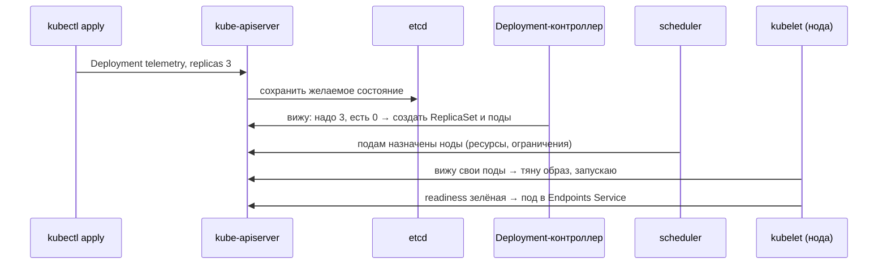

# Лекция 18. Kubernetes: основы

> **Дисциплина:** Распределённые системы и облачные технологии (РСиОТ)
> **Занятие:** лекция 18 из 28 · **Время:** 1 пара (80 мин)
> **Зачем это:** контейнеры вы упаковали ещё в лабе 1 — но кто будет
> перезапускать их ночью, раскатывать новые версии без даунтайма и
> раздавать трафик по репликам? Kubernetes — стандарт де-факто для этой
> работы и сердце лабы 5. Конспект 2025 года сохранён в `archive_2025/`;
> сравнение — в `docs/Сравнение_со_старым_курсом.md`.

---

## Крючок: телеметрия, убившая ChatGPT

> 🖥 **Слайд 2.** Крючок: сбой OpenAI 11.12.2024

11 декабря 2024 года, 15:16 по тихоокеанскому времени. Инженеры OpenAI
выкатывают на **все** кластеры новый телеметрический сервис — безобидный,
казалось бы, сборщик метрик. За полчаса он раскатывается по парку — и все
сервисы компании, от ChatGPT до Sora, ложатся на **четыре часа**.

Что произошло: телеметрия засыпала kube-apiserver — «ресепшен» каждого
кластера Kubernetes — дорогими запросами, стоимость которых росла с
размером кластера. Стейджинг этого не поймал: там кластеры маленькие.
Control plane — управляющий мозг кластеров — умер. Пикантная деталь:
**DNS-кэширование двадцать минут маскировало проблему**, поэтому деплой
успел доехать до всех кластеров раньше, чем сработала тревога. А когда
внутрикластерный DNS протух окончательно, перестали находить друг друга и
сами приложения. Вишенка: чтобы откатить плохой деплой, нужен доступ к
API-серверу — а он-то и лежит. Инженеры OpenAI буквально не могли войти в
собственные кластеры.

Вопрос залу: **как «сборщик метрик» смог положить систему, которая
спроектирована переживать смерть серверов?**

К концу пары вы будете знать устройство Kubernetes достаточно, чтобы
разобрать этот инцидент по винтикам — и увидеть, что упало и почему
пользователи заметили это не сразу.

*(Источник кейса: `sources/Веб-находки_Лекция_18.md` — официальный
постмортем OpenAI и разборы; дата доступа 09.08.2026.)*

---

## Квиз-извлечение (по лекции 17 «Сетевые основы»)

> 🖥 **Слайд 3.** Квиз-извлечение

Ответьте не подглядывая; ответы — в конце лекции.

1. Почему смена DNS-записи не применяется мгновенно и что с этим делать
   при переезде?
2. Чем L4-балансировщик отличается от L7?
3. Что проверяет клиент в TLS-рукопожатии?
4. За счёт чего HTTP/3 быстрее HTTP/2 на сети с потерями?

---

## Результаты обучения

> 🖥 **Слайд 4.** Чему научимся

После этой пары вы сможете:

1. Объяснить, зачем нужен оркестратор и что Kubernetes делает (и чего
   не делает).
2. Читать архитектуру кластера: control plane (apiserver, etcd,
   scheduler, controller-manager) и ноды (kubelet, kube-proxy, runtime).
3. Пользоваться матрёшкой Pod → ReplicaSet → Deployment и понимать
   reconcile loop.
4. Публиковать сервис через Service и Ingress; выносить конфигурацию в
   ConfigMap/Secret.
5. Настраивать пробы (readiness/liveness/startup) и ресурсы
   (requests/limits) без рестарт-штормов.
6. Выполнять обновление RollingUpdate и откат `rollout undo`.

## Пререквизиты

- Лаба 1 и лекция 2: образы, контейнеры, `docker run`, реестр.
- Лекция 16: managed Kubernetes = PaaS; kind/minikube локально.
- Лекция 17: DNS, L4/L7-балансировка, health checks.

---

## Картина мира: из зоопарка — в декларативный кластер

> 🖥 **Слайд 5.** Дорожная карта пары

Вспомните финал лекции 1 и представьте платформу «СмартДома» без
оркестратора: пять серверов, на каждом руками запущены контейнеры приёма
телеметрии. Адреса вбиты в балансировщик руками. Ночью умирает сервер № 3 —
балансировщик продолжает слать туда запросы, тревоги жильцов тонут, вас
будит телефон. Обновление версии? Убивать и поднимать контейнеры по
одному, руками, на пяти серверах. Нашлась утечка памяти? Всё то же самое
в обратную сторону, в три часа ночи.

Kubernetes (греч. «рулевой»; K8s — восемь букв между K и s) автоматизирует
ровно эту рутину. Ключевой сдвиг — **декларативность**: вы не командуете
«запусти контейнер на сервере 3», вы описываете **желаемое состояние** —
«хочу 3 реплики телеметрии версии 1.2, с проверкой здоровья и лимитом
памяти» — и кластер сам непрерывно приводит реальность к описанию. Умер
под — поднимется новый. Умерла нода — поды переедут. Это тот же
термостат: вы задаёте 22°, а не командуете котлу «гори 7 минут».

Маршрут пары: зачем оркестратор → декларативность и reconcile →
архитектура кластера → Pod/ReplicaSet/Deployment → Service и Ingress →
конфигурация → пробы → ресурсы и обновления → живой сеанс «день из жизни
кластера». По дороге — два квиза, голосование и пауза.

---

## Основные понятия

**Определения** (пополним глоссарий в конце):

- **Оркестратор** — система, автоматизирующая размещение, восстановление
  и масштабирование контейнеров по парку машин.
- **Кластер** — набор узлов (нод) под управлением control plane.
- **Желаемое состояние** — описание «как должно быть» (YAML-манифест);
  хранится в кластере и является источником истины.
- **Reconcile loop (цикл согласования)** — бесконечный цикл контроллера:
  прочитать желаемое → сравнить с реальностью → сделать шаг к цели.
- **Под (Pod)** — минимальная единица запуска: один или несколько
  контейнеров с общей сетью и томами; у пода эфемерный IP.

---

## Ядро пары

### 1. Зачем оркестратор — и что K8s не делает

> 🖥 **Слайд 6.** Зачем оркестратор

Kubernetes делает за вас четыре вещи, которые в «зоопарке из пяти
серверов» вы делали руками и по ночам:

- **размещает** контейнеры по нодам с учётом свободных ресурсов;
- **лечит**: перезапускает упавшие контейнеры, переселяет поды с умерших
  нод (частичный отказ из лекции 1 — норма, а не ЧП);
- **масштабирует**: больше нагрузки — больше реплик (вручную или
  автоматически);
- **обновляет** без даунтайма: постепенная замена версий и откат.

Не менее важно, чего Kubernetes **не** делает: не собирает образы (это
CI — лекция 22), не хранит код, не даёт из коробки мониторинг и
логирование (лекция 24), не является базой данных. Это конструктор
платформы, а не готовая платформа.

И границы честности: Kubernetes — не «бесплатная надёжность». Это сложная
распределённая система (etcd внутри — тот самый Raft из лекции 7), и
крючок показывает: неправильно нагруженный control plane умирает так же
эффектно, как любой сервис. Оркестратор снимает рутину, но требует
понимания — за этим вы и здесь.

### 2. Декларативность и reconcile loop

> 🖥 **Слайд 7.** Термостат, а не сценарий

Императивный подход — сценарий: «сделай A, потом B, потом C»; если шаг B
упал ночью, сценарий мёртв, а вы разбужены. Декларативный подход —
термостат: «должно быть 22°» — и система сама решает, греть или ждать,
сколько бы раз ни открывали окно.

Каждый контроллер Kubernetes крутит **цикл согласования**:

1. прочитать желаемое состояние из API;
2. посмотреть на реальность (что запущено, что готово);
3. сделать **один маленький шаг** к цели: создать под, удалить лишний,
   обновить запись.

Упала нода — контроллер на очередном витке заметит недостачу реплик и
доздаст их на живых нодах. Никто не «обрабатывает сбой» специально: сбой —
это просто очередное расхождение желаемого и реального. Помните
антипаттерн № 5 курса — «ручные правки кластера мимо git»: побеждённый
вами вручную под контроллер вернёт на место через секунды, потому что
источник истины — манифест, а не ваши руки.

### 3. Архитектура: мозг и мышцы

> 🖥 **Слайд 8.** Control plane и ноды

**Определения:**

- **Control plane** — управляющие компоненты кластера («мозг»).
- **Нода (worker node)** — машина, где работают поды («мышцы»).

Control plane — четыре компонента:

| Компонент | Роль |
| --- | --- |
| **kube-apiserver** | единственная дверь: весь кластер общается только через него (REST API) |
| **etcd** | распределённое KV-хранилище состояния кластера — консенсус Raft из лекции 7 |
| **kube-scheduler** | решает, на какую ноду поставить новый под (ресурсы, ограничения) |
| **kube-controller-manager** | пачка контроллеров с их reconcile-циклами |

На каждой ноде:

| Компонент | Роль |
| --- | --- |
| **kubelet** | агент: запускает поды, гоняет пробы, докладывает состояние |
| **kube-proxy** | сетевые правила для Service (L4 из лекции 17) |
| **container runtime** | containerd/CRI-O — реально запускает контейнеры (Docker не обязателен: образы OCI-совместимы) |

Теперь инцидент OpenAI читается по схеме: телеметрия завалила
**kube-apiserver** — единственную дверь. Уже запущенные поды продолжали
работать (kubelet автономен — поэтому пользователи заметили не сразу,
а DNS-кэш добавил двадцать минут иллюзии), но ничего нельзя было ни
изменить, ни починить: дверь заперта, и даже откат деплоя идёт через неё.
Урок на всю жизнь: **data plane переживает смерть мозга, но недолго** —
как только сервис-дискавери (DNS) протух, посыпались и работающие поды.

Версии: Kubernetes выпускает три релиза в год (сейчас актуальны ветки
1.34–1.36, поддержка ~14 месяцев) — в лабе версию за вас выберет kind.

### 4. Матрёшка: Pod → ReplicaSet → Deployment

> 🖥 **Слайд 9.** Матрёшка контроллеров

**Определения:**

- **ReplicaSet** — контроллер «держи N одинаковых подов живыми».
- **Deployment** — контроллер над ReplicaSet: версии, обновления, откаты.
- **Манифест** — YAML-описание объекта API.

Под напрямую почти никогда не создают: он смертен, и это нормально.
Вместо этого описывают Deployment; тот создаёт ReplicaSet; тот — поды.
Матрёшка нужна для обновлений: новая версия = новый ReplicaSet, и
Deployment постепенно переливает реплики из старого в новый.

> 🖥 **Слайд 10.** Первый манифест

Deployment приёма телеметрии «СмартДома»:

```yaml
apiVersion: apps/v1
kind: Deployment
metadata:
  name: telemetry
  namespace: smartdom
spec:
  replicas: 3
  selector:
    matchLabels:
      app: telemetry
  template:
    metadata:
      labels:
        app: telemetry
    spec:
      containers:
        - name: api
          image: ghcr.io/smartdom/telemetry:1.2.0
          ports:
            - containerPort: 8080
```

**Пояснение к примеру.** `spec.replicas` — желаемое число подов;
`selector.matchLabels` обязан совпадать с `template.metadata.labels` —
по меткам ReplicaSet узнаёт «своих». Образ — с тегом версии, никогда
`:latest` в проде: непонятно, что именно запущено, и невозможно откатить.
`namespace` — пространство имён: папка-изолятор для команды/окружения
(квоты и права — лекция 25).

**Проверка:**

```powershell
kubectl apply -f telemetry.yaml
kubectl -n smartdom get deploy,rs,pods -o wide
kubectl -n smartdom describe deploy telemetry
```

Ожидаемо: `telemetry` READY 3/3, три пода `Running` с уникальными
суффиксами имён.

**Типичные ошибки:** selector не совпал с labels (ReplicaSet «не видит»
поды и плодит новые); опечатка в имени образа → `ImagePullBackOff`;
контейнер падает на старте → `CrashLoopBackOff` — читать
`kubectl logs`.

### 5. Service и Ingress: вчерашняя лекция в новых именах

> 🖥 **Слайд 11.** Service

У подов эфемерные IP — они умирают вместе с подом. **Service** даёт
группе подов (по селектору меток) стабильное имя и виртуальный IP, а
внутрикластерный DNS (CoreDNS) — запись
`telemetry.smartdom.svc.cluster.local`. Это ровно L4-балансировщик и
DNS-дискавери из лекции 17, только автоматические.

```yaml
apiVersion: v1
kind: Service
metadata:
  name: telemetry
  namespace: smartdom
spec:
  selector:
    app: telemetry
  ports:
    - port: 80
      targetPort: 8080
```

**Пояснение к примеру.** Запрос на `telemetry:80` уйдёт одному из
здоровых подов на порт 8080. Типы Service: **ClusterIP** (по умолчанию,
только изнутри), **NodePort** (порт на каждой ноде — для стендов),
**LoadBalancer** (просит облако поднять внешний L4 — в kind его нет).

**Проверка:** `kubectl -n smartdom get endpoints telemetry` — в списке
должны быть IP всех готовых подов. Пусто? Селектор не совпал или ни один
под не прошёл readiness.

> 🖥 **Слайд 12.** Ingress

Наружу по HTTP ходят через **Ingress** — L7-маршрутизацию по хостам и
путям: `api.smartdom.local/telemetry → Service telemetry`. Ingress —
только правила; исполняет их **Ingress Controller** (например,
ingress-nginx), который нужно установить отдельно. В новых проектах его
постепенно сменяет **Gateway API** — разберём в лекции 20 вместе с
сервис-мешами.

**Типичные ошибки:** Ingress создан, контроллер не установлен (правила
некому исполнять); забыт DNS/hosts на хост из правила.

### 6. Конфигурация: ConfigMap и Secret

> 🖥 **Слайд 13.** Конфигурация вне образа

Правило из лабы 1: **конфигурация не запекается в образ** — один образ
едет через dev/stage/prod, меняется только окружение. В Kubernetes для
этого **ConfigMap** (настройки) и **Secret** (пароли, токены):

```yaml
apiVersion: v1
kind: ConfigMap
metadata:
  name: telemetry-config
  namespace: smartdom
data:
  ALERT_THRESHOLD_C: "60"
---
apiVersion: v1
kind: Secret
metadata:
  name: telemetry-secret
  namespace: smartdom
type: Opaque
stringData:
  DB_PASSWORD: change-me
```

Подключение — переменными окружения (`valueFrom:
configMapKeyRef/secretKeyRef`) или монтированием как файлы.

**Типичные ошибки:** думать, что Secret зашифрован — это лишь base64
(кодирование, не шифрование): нужны encryption at rest и внешние
менеджеры секретов (лекция 25); менять ConfigMap и ждать, что поды
подхватят сами — переменные окружения читаются на старте, нужен
перезапуск подов.

### 7. Пробы: readiness, liveness, startup

> 🖥 **Слайд 14.** Три пробы — три вопроса

kubelet умеет опрашивать контейнер тремя видами проб, и путать их —
самый популярный способ устроить себе рестарт-шторм:

| Проба | Вопрос | При провале |
| --- | --- | --- |
| **readiness** | можно слать трафик? | под выводится из Service (капасити ↓) |
| **liveness** | процесс безнадёжно завис? | kubelet **перезапускает** контейнер |
| **startup** | инициализация закончилась? | пока «ждёт» — остальные пробы молчат |

Золотое правило: **liveness проверяет только сам процесс**, readiness —
способность делать полезную работу (включая зависимости). Liveness,
которая ходит во внешнюю БД, перезапускает здоровые контейнеры, когда
болеет БД, — и делает инцидент хуже.

#### Peer-instruction-вопрос № 1

> 🖥 **Слайды 15–19.** Голосование PI-1 → четыре разбора

Голосуем, обсуждаем с соседом 90 секунд, голосуем снова.

> Сервис телеметрии стартует 60 секунд (прогрев), а при недоступной БД
> отвечает ошибками, но сам жив. Как настроить пробы?
>
> A. liveness с проверкой «БД отвечает» — если БД упала, перезапуск всё
> починит.
> B. readiness проверяет «могу работать» (включая БД), liveness — только
> «процесс жив», startup покрывает 60 секунд старта.
> C. Только liveness с `initialDelaySeconds: 5` — чем раньше проверим,
> тем быстрее найдём проблему.
> D. Пробы не нужны: Kubernetes и так перезапускает упавшие контейнеры.

Разбор — в конце лекции. Подсказка: перезапуск лечит только то, что
лечится перезапуском.

### 8. Ресурсы и обновления

> 🖥 **Слайд 20 — пауза 60 секунд, затем слайд 21.** Ресурсы и rollout

**Определения:**

- **requests** — сколько ресурсов планировщик гарантированно бронирует
  поду на ноде.
- **limits** — потолок: CPU сверх лимита троттлится, память сверх лимита —
  **OOMKill** (контейнер убит).

```yaml
resources:
  requests:
    cpu: "100m"
    memory: "128Mi"
  limits:
    memory: "256Mi"
```

Без requests планировщик размещает поды вслепую — ноды перегружаются.
Слишком низкий limit памяти — контейнер погибает под нагрузкой. Калибруют
по метрикам (лекция 24), автомасштабирование реплик — HPA (лекция 26).

Обновления: Deployment по умолчанию делает **RollingUpdate** — постепенно
заменяет поды новой версией, дожидаясь readiness каждого нового
(`maxUnavailable: 0, maxSurge: 1` — «сначала подними нового, потом гаси
старого»). Если новая версия не проходит readiness — раскатка
останавливается сама, а не роняет прод:

```powershell
kubectl -n smartdom set image deploy/telemetry api=ghcr.io/smartdom/telemetry:1.3.0
kubectl -n smartdom rollout status deploy/telemetry
kubectl -n smartdom rollout undo deploy/telemetry
```

Blue/green и canary — в лекции 22 (progressive delivery).

### 9. Живой сеанс: «Хочу 3 реплики!» — день из жизни кластера

> 🖥 **Слайд 22.** Живой сеанс

Строим вместе, на глазах, по шагам (7–10 минут; ход мысли важнее
результата). Вопрос модели: **что происходит внутри кластера между
`kubectl apply` и «трафик пошёл»?**

Шаг 1 — прослеживаем путь манифеста:



Шаг 2 — ломаем: нода с одним из подов умирает. Контроллер на очередном
витке видит «желаемое 3, реальных 2» — доздаёт под на живой ноде;
Service перестаёт слать трафик на мёртвый под, как только пропала
readiness. Никакой специальной «обработки сбоя» — просто ещё один виток
цикла согласования.

Шаг 3 — обновляемся на 1.3.0: Deployment создаёт **второй** ReplicaSet и
переливает реплики по одной; сломанная readiness новой версии = раскатка
замирает, `rollout undo` возвращает старый ReplicaSet. Заметьте: во всех
трёх шагах мы ничего не делали руками на серверах — меняли только
желаемое состояние.

---

## Типичные ошибки (запомните до того, как совершите)

> 🖥 **Слайд 23.** Типичные ошибки

1. **Состояние внутри пода.** Файлы контейнера умирают вместе с подом —
   антипаттерн № 4 курса. Данные — во внешние хранилища и PVC (вся
   следующая лекция об этом).
2. **`image: latest`.** Непонятно, что запущено; откат невозможен;
   реплики могут тянуть разные версии. Только явные теги/дайджесты.
3. **Liveness, проверяющая зависимости.** Перезапускает здоровые
   контейнеры при болезни соседа; рестарт-шторм в довесок к инциденту.
4. **Нет requests/limits.** Планирование вслепую, ноды в перегрузе,
   внезапные OOMKill у соседей по ноде.
5. **`kubectl edit` в прод мимо git.** Контроллер и коллеги ничего не
   знают о ваших правках; следующая раскатка их сотрёт (антипаттерн № 5,
   GitOps — лекция 22).

---

## Квиз-закрепление (по этой паре)

> 🖥 **Слайд 24.** Закрепление

Ответьте не подглядывая; ответы — в конце лекции.

1. Что такое reconcile loop и почему «убитый» вручную под возвращается?
2. Назовите компоненты control plane и что из них отказало у OpenAI.
3. Зачем матрёшка Deployment → ReplicaSet → Pod, а не «просто поды»?
4. Чем readiness отличается от liveness и что будет, если их перепутать?

---

## Вопросы для самопроверки

1. Какие четыре задачи решает оркестратор? Что Kubernetes не делает?
2. Чем декларативный подход отличается от императивного? Приведите
   аналогию.
3. Почему kube-apiserver — «единственная дверь» и чем это опасно
   (вспомните крючок)?
4. Какую роль играет etcd и какой алгоритм из прошлых лекций внутри него?
5. Почему поды переживали смерть control plane у OpenAI — и почему
   недолго?
6. Что делает scheduler и на что он смотрит при размещении пода?
7. Зачем Service, если у подов есть IP? Перечислите типы Service.
8. Как Ingress связан с L7-балансировкой из лекции 17? Что нужно, чтобы
   Ingress заработал?
9. Почему Secret — не шифрование? Что с этим делать?
10. Сформулируйте золотое правило liveness/readiness. Что такое
    startupProbe и когда она обязательна?
11. Что произойдёт с контейнером, превысившим limit памяти? А CPU?
12. Как RollingUpdate обеспечивает «ноль даунтайма» и что его
    останавливает при плохой версии?
13. Разберите инцидент OpenAI терминами пары: что упало, почему деплой
    доехал до всех кластеров, почему откат был мучительным.
14. Почему `kubectl edit` на проде — антипаттерн?

---

## Мост к лабораторной № 5

> 🖥 **Слайд 25.** Мост к лабе

Лабораторная № 5 (`tasks/task_05`) начинается: вы поднимете локальный
кластер (kind/minikube), задеплоите stateless-сервис «СмартДома»
Deployment'ом с пробами и ресурсами, опубликуете его Service'ом и
Ingress'ом, вынесете конфигурацию в ConfigMap/Secret и прогоните
RollingUpdate с откатом. Всё это — сегодняшняя пара плюс два кита
предыдущих: модели облака (лекция 16 — почему kind бесплатно повторяет
EKS) и сеть (лекция 17 — Service это L4, Ingress это L7, дискавери это
DNS). Стейт в кластере (базы, тома, PVC) — тема следующей пары и лабы 6.

**Задание на 1 предложение** (письменно, в конспект): закончите фразу
«Умение читать reconcile loop пригодится лично мне, потому что…» —
конкретно. На следующей паре спрошу троих добровольцев.

---

## Глоссарий

> 🖥 **Слайд 26 (финал).** Вопросы + литература

| Термин | Определение |
| --- | --- |
| Оркестратор | Автоматизация размещения, лечения, масштабирования и обновления контейнеров |
| Кластер / нода | Парк машин под управлением control plane / одна машина парка |
| Control plane | apiserver (дверь), etcd (состояние, Raft), scheduler, controller-manager |
| kubelet / kube-proxy | Агент подов на ноде / сетевые правила Service |
| Reconcile loop | Цикл: желаемое → сравнить с реальным → шаг к цели |
| Pod | Минимальная единица запуска; эфемерный IP |
| ReplicaSet / Deployment | «Держи N подов» / версии, раскатки, откаты поверх ReplicaSet |
| Service (ClusterIP/NodePort/LoadBalancer) | Стабильное имя + VIP для группы подов |
| Ingress / Ingress Controller | L7-правила / их исполнитель |
| ConfigMap / Secret | Конфигурация вне образа; Secret — base64, не шифрование |
| readiness / liveness / startup | Слать трафик? / перезапустить? / инициализация закончена? |
| requests / limits | Бронь ресурсов для планировщика / потолок (OOMKill, троттлинг) |
| RollingUpdate / rollout undo | Постепенная замена версий / откат |
| Namespace | Пространство имён: изоляция ресурсов, квот, прав |
| CrashLoopBackOff / ImagePullBackOff | Контейнер падает на старте / образ не тянется |

## Список литературы

1. Основная литература
   - [1] Kubernetes Documentation — Concepts: Workloads, Services &
     Networking, Configuration ([kubernetes.io/docs](https://kubernetes.io/docs/home/)).
   - [2] Бёрнс Б., Беда Дж., Хайтауэр К., Эвенсон Л. — «Kubernetes: Up
     and Running», 3-е изд. O'Reilly (обзорно, гл. 1–7).
2. Интернет-ресурсы
   - [3] Постмортем OpenAI 11.12.2024 и разборы, версии Kubernetes,
     заблуждения о пробах — подборка с URL в
     `sources/Веб-находки_Лекция_18.md` (дата обращения: 09.08.2026).

---

## Ответы

### Ответы: квиз-извлечение (лекция 17)

1. Резолверы кэшируют запись на TTL; пока кэш жив, отдаётся старый ответ.
   Переезд: заранее (минимум за старый TTL) понизить TTL, переключить
   запись, вернуть TTL.
2. L4 видит IP/порты и раздаёт соединения; L7 видит HTTP (путь,
   заголовки) и раздаёт запросы, умеет маршрутизацию по содержимому и
   TLS-терминацию.
3. Цепочку доверия сертификата: имя совпадает, срок не истёк, подпись
   ведёт к доверенному корневому CA.
4. Независимые потоки QUIC (потеря пакета не тормозит чужие потоки) и
   быстрое рукопожатие; плюс миграция соединения при смене сети.

### Ответы: peer instruction № 1

Правильный ответ — **B**: три пробы отвечают на три разных вопроса.
Readiness — «могу ли делать полезную работу» (да, с проверкой ключевых
зависимостей): БД упала → под выходит из Service, трафик не льётся в
ошибки, но контейнер жив и вернётся сам. Liveness — только «процесс не
завис безнадёжно». Startup с щедрым порогом покрывает 60 секунд прогрева.

- A — перезапуск не лечит чужую болезнь: БД от рестарта вашего пода не
  оживёт, а вот рестарт-шторм здоровых контейнеров вы получите.
- C — liveness с задержкой 5 с на приложении, стартующем минуту, убьёт
  контейнер до первого запуска — вечный CrashLoop руками мониторинга.
- D — «перезапускает упавшие» ≠ «не шлёт трафик неготовым»: без readiness
  Service будет слать запросы в под, который ещё греется или отвечает
  ошибками.

### Ответы: квиз-закрепление

1. Цикл контроллера «желаемое → реальное → шаг к цели». Убитый под —
   расхождение с желаемым `replicas`, и контроллер его доздаёт; источник
   истины — манифест, а не ручные действия.
2. kube-apiserver, etcd, kube-scheduler, kube-controller-manager. У
   OpenAI лёг apiserver (завален дорогими запросами телеметрии), с ним —
   возможность что-либо менять и чинить.
3. Для обновлений и откатов: новая версия = новый ReplicaSet, Deployment
   переливает реплики постепенно и умеет вернуться к старому ReplicaSet.
4. Readiness — «слать ли трафик» (провал = вывод из Service), liveness —
   «перезапустить ли» (провал = рестарт). Перепутать: рестарты здоровых
   контейнеров при болезни зависимостей или трафик в неготовые поды.
