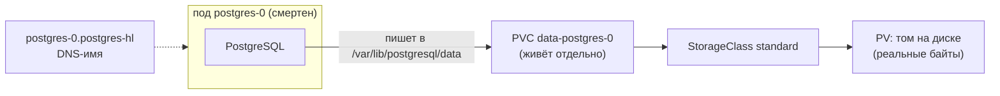

# Лекция 19. Kubernetes: состояние и хранение

> **Дисциплина:** Распределённые системы и облачные технологии (РСиОТ)
> **Занятие:** лекция 19 из 28 · **Время:** 1 пара (80 мин)
> **Зачем это:** в лабе 5 вы деплоили stateless-сервис — его поды можно
> убивать без жалости. Но история показаний «СмартДома» убиваться не
> должна: сегодня — как Kubernetes работает с данными, которые обязаны
> пережить и под, и ноду, и (спойлер крючка) даже своего облачного
> провайдера. Конспект 2025 года сохранён в `archive_2025/`; сравнение —
> в `docs/Сравнение_со_старым_курсом.md`.

---

## Крючок: Google удалил пенсионный фонд

> 🖥 **Слайд 2.** Крючок: UniSuper, май 2024

Начало мая 2024 года. Австралийский пенсионный фонд UniSuper — 620 тысяч
клиентов, около **125 миллиардов долларов** активов — обнаруживает, что
его приватное облако в Google Cloud… **исчезло**. Целиком. Вместе с
резервными копиями в обеих географических зонах.

Причина унизительно проста: при создании окружения баг в скрипте
провижининга выставил подписке срок **один год вместо бессрочной**. Год
прошёл — и автоматика Google честно удалила «истёкшее» окружение. Никто
не взламывал, ничего не горело: инфраструктуру съело её собственное
средство автоматизации. Сервисы фонда лежали почти **две недели** —
с 2 по 13 мая.

Почему UniSuper вообще выжил? Потому что у фонда была резервная копия
**у другого провайдера** — вне Google. Правило 3-2-1 (три копии, два
типа носителей, одна вне площадки) сработало в тот единственный день,
ради которого его придумали.

Вопрос залу: в лекции 16 мы говорили «реплики провайдера по зонам спасут
ваши данные». UniSuper имел копии в двух зонах — **и потерял обе
одновременно**. Что мы упустили тогда — и как хранить данные «СмартДома»,
чтобы пережить даже такое?

*(Источник кейса: `sources/Веб-находки_Лекция_19.md` — Gizmodo, Axios,
разборы; дата доступа 10.08.2026.)*

---

## Квиз-извлечение (по лекции 18 «Kubernetes основы»)

> 🖥 **Слайд 3.** Квиз-извлечение

Ответьте не подглядывая; ответы — в конце лекции.

1. Что такое reconcile loop и почему удалённый вручную под возвращается?
2. Назовите компоненты control plane и роль каждого.
3. Чем readiness-проба отличается от liveness?
4. Почему «состояние внутри пода» — антипаттерн?

---

## Результаты обучения

> 🖥 **Слайд 4.** Чему научимся

После этой пары вы сможете:

1. Различать эфемерное и постоянное хранение и объяснять, кто на самом
   деле хранит данные (PVC, а не контроллер).
2. Читать цепочку PVC → StorageClass → PV → диск и режимы доступа
   RWO/ROX/RWX.
3. Объяснять, что StatefulSet добавляет к Deployment: стабильные имена,
   PVC на реплику, порядок.
4. Пользоваться Headless Service и DNS-именами подов.
5. Строить стратегию бэкапа: dump против снапшота, RPO/RTO, правило
   3-2-1, тест восстановления.
6. Осознанно выбирать: база в кластере (оператор) или managed вне
   кластера.

## Пререквизиты

- Лекция 18 и лаба 5: Deployment, Service, пробы, `kubectl`.
- Лекция 16: shared responsibility, «репликация ≠ бэкап», PITR.
- Лекция 6 (репликация) и 10 (хранилища) — пригодятся, но ключевые места
  напомним.

---

## Картина мира: палатка и квартира

> 🖥 **Слайд 5.** Дорожная карта пары

Под из лаборатории 5 — **палатка**: поставили, пожили, свернули — всё,
что лежало внутри, исчезло вместе с ней. Для приёма телеметрии это
идеально: любую палатку можно мгновенно поставить заново в другом месте.
Но история показаний за год — не палаточное имущество. Ей нужна
**квартира с адресом**: жильцы (поды) могут съезжать и въезжать, а мебель
(данные) остаётся на месте.

Kubernetes разделяет эти две сущности жёстко: **контейнер и под —
одноразовые**, их файловая система умирает с ними; **том (volume)** —
отдельный объект со своим жизненным циклом, который монтируется в под,
как квартира сдаётся очередному жильцу. Сегодняшняя пара — про то, как
эта аренда устроена: кто выдаёт квартиры (StorageClass), как их просят
(PVC), чем отличается общежитие Deployment от именных квартир
StatefulSet — и что делать, чтобы пожар у арендодателя (буквально —
лекция 16, Тэджон; юридически — крючок, UniSuper) не уничтожил ваше
имущество.

Маршрут пары: почему состояние — особый случай → PV и PVC → StorageClass
и режимы доступа → StatefulSet → Headless Service → живой сеанс
«PostgreSQL переживает смерть пода» → бэкапы и 3-2-1 → операторы против
managed. По дороге — два квиза, голосование и пауза.

---

## Основные понятия

**Определения** (пополним глоссарий в конце):

- **Том (volume)** — хранилище, смонтированное в под; живёт по своим
  правилам, не по правилам контейнера.
- **emptyDir** — эфемерный том: создаётся с подом, умирает с подом.
- **PersistentVolume (PV)** — объект кластера «вот конкретный том»:
  облачный диск, NFS-шара, локальный диск ноды.
- **PersistentVolumeClaim (PVC)** — заявка приложения: «нужно 10 ГБ с
  режимом RWO»; Kubernetes подбирает или создаёт под неё PV.
- **StorageClass** — «прейскурант» видов хранилища: какой драйвер (CSI)
  создаёт тома, с какими параметрами (тип диска, IOPS).
- **StatefulSet** — контроллер для реплик с личностью: стабильные имена,
  свой PVC у каждой, упорядоченные операции.

---

## Ядро пары

### 1. Почему состояние — особый случай

> 🖥 **Слайд 6.** Палатка против квартиры

Всё, что мы делали в лабе 5, опиралось на взаимозаменяемость подов:
любой можно убить, новый — неотличим. У данных это свойство отсутствует
по определению: новый пустой PostgreSQL **не** неотличим от старого с
годом показаний. Отсюда три следствия:

1. **Файловая система контейнера — не хранилище.** Записали файл в под —
   считайте, что записали на песке до прилива (антипаттерн № 4 курса).
2. **Данным нужен объект с отдельным жизненным циклом** — том, который
   переживает под, ноду и даже удаление контроллера.
3. **За данные всё равно отвечаете вы** — нижняя строка таблицы
   ответственности из лекции 16 действует и внутри кластера.

Эфемерные тома тоже полезны: `emptyDir` — законное место для кэша,
временных файлов, буфера между контейнерами одного пода. Правило
простое: **всё, что жалко потерять при пересоздании пода, не имеет права
жить в поде.**

### 2. PV и PVC: заявка и квартира

> 🖥 **Слайд 7.** PVC → PV

Kubernetes разводит «что нужно приложению» и «что есть у кластера»:

- **PVC** пишет разработчик рядом с приложением: «10 ГиБ, ReadWriteOnce,
  класс fast» — ни слова про EBS, Ceph или локальные диски;
- **PV** — конкретный том: его либо заранее создал администратор
  (статически), либо — обычный путь — кластер **создаёт сам** по заявке
  (динамический провижининг через StorageClass).

```yaml
apiVersion: v1
kind: PersistentVolumeClaim
metadata:
  name: readings-data
  namespace: smartdom
spec:
  accessModes: ["ReadWriteOnce"]
  resources:
    requests:
      storage: 10Gi
  storageClassName: standard
```

**Пояснение к примеру.** Под монтирует PVC как каталог; всё, что
приложение туда пишет, живёт в PV. Убили под — новый под смонтирует
**тот же** PVC и увидит те же файлы. `standard` — StorageClass по
умолчанию в kind (локальные тома нод).

**Проверка:** `kubectl -n smartdom get pvc` — STATUS `Bound` и имя
автоматически созданного PV; `kubectl describe pvc readings-data` —
события провижининга.

**Типичные ошибки:** PVC висит в `Pending` — нет StorageClass с таким
именем или (при `WaitForFirstConsumer`) ещё нет пода-потребителя;
удалить PVC «для чистоты» — с политикой `Delete` у StorageClass вместе с
PVC умрёт и PV с данными.

### 3. StorageClass и режимы доступа

> 🖥 **Слайд 8.** Прейскурант хранилища

**Определения:**

- **CSI (Container Storage Interface)** — стандартный интерфейс между
  Kubernetes и системами хранения; драйверы CSI пишут провайдеры
  (EBS, Ceph, Longhorn…).
- **reclaimPolicy** — судьба PV после удаления PVC: `Delete` (том
  удаляется) или `Retain` (том остаётся сиротой до ручного решения).

StorageClass — это позиция в прейскуранте: «быстрый SSD, 3000 IOPS,
создаёт драйвер ebs.csi.aws.com, после освобождения — удалять».
Кластеру можно иметь несколько классов: `fast` для баз, `standard` для
всего остального. Две настройки, которые стреляют:

- **`volumeBindingMode: WaitForFirstConsumer`** — не создавать том, пока
  не запланирован под-потребитель. Зачем: облачный диск живёт в одной
  зоне доступности (лекция 16); если создать его раньше пода, планировщик
  может поставить под в другую зону — и том не примонтируется.
- **`allowVolumeExpansion: true`** — разрешает потом увеличить PVC
  правкой манифеста (уменьшить — нельзя).

Режимы доступа — про **сколько нод** могут монтировать том:

| Режим | Кто монтирует | Типаж |
| --- | --- | --- |
| RWO (ReadWriteOnce) | одна нода на запись | облачные блочные диски (EBS) |
| ROX (ReadOnlyMany) | много нод, только чтение | справочники, модели |
| RWX (ReadWriteMany) | много нод на запись | NFS, CephFS — файловые системы |

Классическая засада: два пода Deployment на разных нодах и один
RWO-том — второй под навсегда в `ContainerCreating`. RWO — не «один
под», а «одна нода», но рассчитывать на совпадение нод нельзя.

#### Peer-instruction-вопрос № 1

> 🖥 **Слайды 9–13.** Голосование PI-1 → четыре разбора

Голосуем, обсуждаем с соседом 90 секунд, голосуем снова.

> История показаний «СмартДома» должна пережить пересоздание пода.
> Коллега говорит: «Обязательно StatefulSet — Deployment данные не
> сохраняет». Он прав?
>
> A. Прав: только StatefulSet умеет постоянное хранение, Deployment —
> нет.
> B. Не прав: сохранность даёт PVC — Deployment с PVC хранит данные;
> StatefulSet добавляет стабильные имена, отдельный PVC каждой реплике
> и порядок операций.
> C. Не прав, но по другой причине: данные в Kubernetes вообще хранить
> нельзя — только managed-БД вне кластера.
> D. Прав наполовину: Deployment сохраняет данные, но только с одной
> репликой.

Разбор — в конце лекции. Подсказка: спросите себя, **какой именно
объект** переживает пересоздание пода.

### 4. StatefulSet: реплики с личностью

> 🖥 **Слайд 14 — пауза 60 секунд, затем слайд 15.** StatefulSet

Deployment штампует безымянных клонов: `telemetry-7f6b9-x2x4z`, общий
PVC на всех (если он вообще есть). Для кластера PostgreSQL этого мало:
у реплики-лидера и реплик-фолловеров (лекция 6) разные роли, им нужны
**личности**. StatefulSet даёт репликам три вещи:

1. **Стабильные имена:** `postgres-0`, `postgres-1`, `postgres-2` —
   и после пересоздания под получает **то же** имя.
2. **Свой PVC каждой реплике** через `volumeClaimTemplates`:
   `data-postgres-0`, `data-postgres-1`… Под `postgres-1` пересоздан на
   другой ноде — Kubernetes примонтирует ему его личный том.
3. **Порядок:** создание 0 → 1 → 2, обновление в обратном порядке,
   по одному.

```yaml
apiVersion: apps/v1
kind: StatefulSet
metadata:
  name: postgres
  namespace: smartdom
spec:
  serviceName: postgres-hl
  replicas: 2
  selector:
    matchLabels:
      app: postgres
  template:
    metadata:
      labels:
        app: postgres
    spec:
      containers:
        - name: db
          image: postgres:16.4
          ports:
            - containerPort: 5432
          env:
            - name: POSTGRES_USER
              value: app
            - name: POSTGRES_DB
              value: app
            - name: POSTGRES_PASSWORD
              valueFrom:
                secretKeyRef:
                  name: postgres-secret
                  key: password
            - name: PGDATA # подкаталог: в корне тома живёт lost+found
              value: /var/lib/postgresql/data/pgdata
          volumeMounts:
            - name: data
              mountPath: /var/lib/postgresql/data
  volumeClaimTemplates:
    - metadata:
        name: data
      spec:
        accessModes: ["ReadWriteOnce"]
        resources:
          requests:
            storage: 10Gi
```

**Пояснение к примеру.** Пароль приходит из Secret `postgres-secret`
(создайте его заранее — лаба 5 научила), а `PGDATA` указывает на
подкаталог: в корне свежесмонтированного тома лежит служебный
`lost+found`, и PostgreSQL отказывается инициализироваться в «непустом»
каталоге — классическая грабля первого запуска. `volumeClaimTemplates` —
шаблон: на каждую реплику StatefulSet сам создаст отдельный PVC. Важная особенность: при
удалении StatefulSet эти PVC **по умолчанию остаются жить** — защита от
случайной потери данных (авто-очистку можно включить полем
`persistentVolumeClaimRetentionPolicy`).

**Проверка:** `kubectl -n smartdom get pvc` покажет `data-postgres-0`,
`data-postgres-1`; `kubectl delete pod postgres-0` — новый `postgres-0`
поднимется с тем же PVC и теми же данными.

**Типичные ошибки:** ждать, что StatefulSet сам превратит два
PostgreSQL-контейнера в кластер с репликацией — нет, он даёт только
имена, тома и порядок; репликацию настраивает либо сама СУБД, либо
оператор (раздел 7).

### 5. Headless Service: DNS-имена для каждой реплики

> 🖥 **Слайд 16.** Headless Service

Обычный Service (лаба 5) — один виртуальный IP на всех: балансировщик.
Для реплик с ролями это вредно: писать нужно строго в лидера, а не «в
кого попало». **Headless Service** (`clusterIP: None`) не балансирует,
а раздаёт **прямые DNS-имена** каждому поду StatefulSet:

```text
postgres-0.postgres-hl.smartdom.svc.cluster.local  →  IP пода postgres-0
postgres-1.postgres-hl.smartdom.svc.cluster.local  →  IP пода postgres-1
```

Приложение «СмартДома» пишет показания в `postgres-0.postgres-hl`
(лидер), читает отчёты с `postgres-1.postgres-hl` (фолловер). Это
сервис-дискавери из лекции 17, доведённый до отдельной реплики. Пара
«StatefulSet + Headless Service» — стандартный дуэт: поле `serviceName`
StatefulSet ссылается ровно на него.

### 6. Живой сеанс: PostgreSQL переживает смерть пода

> 🖥 **Слайд 17.** Живой сеанс

Строим вместе, на глазах, по шагам (7–10 минут; ход мысли важнее
результата). Вопрос: **что именно переживает пересоздание пода — и как
это увидеть руками?**

Шаг 1 — рисуем, кто на ком стоит:



Шаг 2 — проверяем гипотезу командами (в лабе 6 повторите сами):

```powershell
kubectl -n smartdom exec -it postgres-0 -- psql -U app -c "CREATE TABLE t(id INT); INSERT INTO t VALUES (42);"
kubectl -n smartdom delete pod postgres-0        # убиваем под
kubectl -n smartdom get pods -w                  # reconcile: postgres-0 возвращается
kubectl -n smartdom exec -it postgres-0 -- psql -U app -c "SELECT * FROM t;"  # 42 на месте
```

Проговариваем ход мысли: под умер → StatefulSet (reconcile из лекции 18)
создал новый под **с тем же именем** → тот примонтировал **тот же PVC** →
данные на месте. Ни одна строка не «скопировалась» — байты всё время
лежали в PV и не умирали ни на секунду.

Шаг 3 — контрольный вопрос себе: а что, если умрёт не под, а **диск** с
PV? Пауза. Правильный ответ: PVC не спасёт — спасёт только следующий
раздел.

### 7. Бэкапы: dump, снапшот и правило 3-2-1

> 🖥 **Слайд 18.** Стратегия бэкапа

**Определения:**

- **RPO** (Recovery Point Objective) — сколько данных допустимо
  потерять: интервал между копиями.
- **RTO** (Recovery Time Objective) — за какое время обязаны
  восстановиться.
- **Логический бэкап (dump)** — выгрузка данных командами СУБД
  (`pg_dump`): переносимо между версиями, медленно на больших объёмах.
- **Снапшот тома** — мгновенная копия на уровне хранилища
  (VolumeSnapshot через CSI): быстро, но привязано к платформе.

Слои защиты данных «СмартДома», от быстрого к последнему рубежу:

1. **Реплики** (StatefulSet + репликация СУБД) — переживают смерть пода
   и ноды; **не** переживают `DROP TABLE` (лекция 16).
2. **Снапшоты + PITR** — переживают `DROP TABLE`: откат на момент
   времени.
3. **Копия вне кластера и вне провайдера** — переживает Тэджон
   (лекция 16) и UniSuper (крючок): дамп по расписанию (CronJob) в
   объектное хранилище **другого** провайдера. Это и есть 3-2-1: три
   копии, два типа носителей, одна — вне площадки.

И железное правило, дважды оплаченное героями наших крючков:
**непроверенное восстановление — не бэкап.** Тест восстановления
(развернуть копию с нуля, посчитать строки) — по расписанию, а не «когда
случится».

### 8. База в кластере или managed: честный выбор

> 🖥 **Слайд 19.** Оператор против managed

В лекции 16 мы поселили историю показаний в managed PostgreSQL — и для
большинства команд это правильный ответ: бэкапы, реплики и failover
входят в тариф. Когда БД тащат **в кластер**:

- регуляторика/своё железо (частное облако — некому продать managed);
- десятки окружений, где счёт за managed кусается;
- нужен полный контроль версий и расширений.

Инструмент 2026 года для этого — **операторы**: контроллеры, кодирующие
эксплуатационные знания СУБД. CloudNativePG (CNCF, самый популярный
оператор PostgreSQL) сам разворачивает StatefulSet-подобный кластер,
следит за репликацией, делает failover с кворумом, бэкапы и PITR — вам
остаётся описать желаемое состояние (знакомо по лекции 18?). Правило
выбора простое: **если вы не готовы отвечать за failover в 3 часа
ночи — берите managed; если готовы — берите оператор, а не голый
StatefulSet.**

---

## Типичные ошибки (запомните до того, как совершите)

> 🖥 **Слайд 20.** Типичные ошибки

1. **`emptyDir` для данных БД.** Красиво работает до первого
   пересоздания пода; потом — как палатка после урагана.
2. **«StatefulSet сохранит данные».** Данные сохраняет PVC; StatefulSet —
   про имена, личные тома и порядок. Перепутаете — будете искать
   пропавшие данные не там.
3. **Два пода на один RWO-том.** Второй под вечно в
   `ContainerCreating`, если ноды разошлись. RWO — «одна нода», RWX —
   дорогой и особый случай.
4. **«Снапшоты у провайдера — значит, бэкап есть».** UniSuper потерял
   копии в двух зонах одним нажатием чужой кнопки. Одна копия обязана
   жить вне провайдера — и восстановление из неё обязано быть проверено.
5. **Удаление PVC «для порядка»** при reclaimPolicy `Delete` — PV с
   данными уезжает вместе с заявкой. Сначала бэкап, потом уборка.

---

## Квиз-закрепление (по этой паре)

> 🖥 **Слайд 21.** Закрепление

Ответьте не подглядывая; ответы — в конце лекции.

1. Постройте цепочку от `volumeMounts` в поде до байтов на диске: какие
   объекты участвуют и кто кого создаёт?
2. Что даёт `WaitForFirstConsumer` и какую проблему он решает?
3. Назовите три вещи, которые StatefulSet добавляет к Deployment.
4. Почему реплики и снапшоты внутри одного провайдера не заменяют
   правило 3-2-1?

---

## Вопросы для самопроверки

1. Чем эфемерное хранение отличается от постоянного? Где законное место
   `emptyDir`?
2. Кто пишет PVC, а кто создаёт PV? Что такое динамический провижининг?
3. Что случится с PV после удаления PVC при `reclaimPolicy: Delete`?
   А при `Retain`?
4. RWO/ROX/RWX: расшифруйте и приведите по примеру хранилища.
5. Почему RWO — это «одна нода», а не «один под», и чем это опасно?
6. Зачем StatefulSet стабильные имена? Приведите пример из репликации
   (лекция 6).
7. Что такое `volumeClaimTemplates` и почему PVC StatefulSet по
   умолчанию не удаляются?
8. Чем Headless Service отличается от обычного? Постройте DNS-имя
   пода `postgres-1`.
9. Сформулируйте RPO и RTO для истории показаний «СмартДома» — и для
   тревог.
10. Сравните dump и снапшот: скорость, переносимость, применимость.
11. Разложите кейс UniSuper по слоям защиты: какие слои у фонда были и
    какой его спас?
12. Когда базу тащат в кластер и почему тогда оператор, а не голый
    StatefulSet?
13. Как проверить, что бэкап настоящий?
14. Почему нельзя два пода Deployment с общим RWO-томом раскидать по
    нодам?

---

## Мост к лабораторной № 6

> 🖥 **Слайд 22.** Мост к лабе

Лабораторная № 6 (`tasks/task_06`) — состояние и хранение: вы добавите
платформе «СмартДома» настоящую память. StatefulSet с PostgreSQL,
volumeClaimTemplates, Headless Service, эксперимент «удали под — данные
живы» из живого сеанса, CronJob с логическим бэкапом и — главное —
**тест восстановления** с фиксацией RPO/RTO в отчёте. Всё из
сегодняшней пары, плюс хранилища из лекции 10 (какие данные куда) —
перечитайте её раздел про модели данных перед лабой.

**Задание на 1 предложение** (письменно, в конспект): закончите фразу
«Правило 3-2-1 и тест восстановления пригодятся лично мне, потому
что…» — конкретно. На следующей паре спрошу троих добровольцев.

---

## Глоссарий

> 🖥 **Слайд 23 (финал).** Вопросы + литература

| Термин | Определение |
| --- | --- |
| Том (volume) | Хранилище с собственным жизненным циклом, монтируется в под |
| emptyDir | Эфемерный том: создаётся и умирает вместе с подом |
| PV / PVC | Конкретный том кластера / заявка приложения на том |
| StorageClass | «Прейскурант»: каким CSI-драйвером и с какими параметрами создавать PV |
| CSI | Стандартный интерфейс Kubernetes ↔ системы хранения |
| reclaimPolicy | Судьба PV после удаления PVC: Delete / Retain |
| WaitForFirstConsumer | Создавать том только после планирования пода (учёт зоны) |
| RWO / ROX / RWX | Одна нода на запись / много на чтение / много на запись |
| StatefulSet | Реплики с личностью: имена, свой PVC каждой, порядок |
| volumeClaimTemplates | Шаблон PVC на каждую реплику StatefulSet |
| Headless Service | clusterIP: None — DNS-имена подов вместо балансировки |
| VolumeSnapshot | Снапшот PVC средствами CSI |
| RPO / RTO | Сколько данных можно потерять / за сколько восстановиться |
| Правило 3-2-1 | 3 копии, 2 типа носителей, 1 вне площадки |
| Оператор | Контроллер с эксплуатационными знаниями (CloudNativePG) |

## Список литературы

1. Основная литература
   - [1] Kubernetes Documentation — Storage: Volumes, Persistent
     Volumes, StatefulSets ([kubernetes.io/docs/concepts/storage](https://kubernetes.io/docs/concepts/storage/)).
   - [2] Клеппман М. — «Высоконагруженные приложения». Питер. Глава 3
     (хранение и извлечение — контекст к выбору СУБД).
2. Интернет-ресурсы
   - [3] CloudNativePG — [cloudnative-pg.io](https://cloudnative-pg.io/).
   - [4] Разборы инцидента UniSuper и заблуждения про StatefulSet —
     подборка с URL в `sources/Веб-находки_Лекция_19.md` (дата
     обращения: 10.08.2026).

---

## Ответы

### Ответы: квиз-извлечение (лекция 18)

1. Цикл контроллера: желаемое → реальное → шаг к цели. Удалённый под —
   расхождение с `replicas`, контроллер его доздаёт; источник истины —
   манифест.
2. kube-apiserver (единственная дверь), etcd (состояние, Raft),
   scheduler (размещение подов), controller-manager (reconcile-циклы).
3. Readiness — «слать ли трафик» (провал = вывод из Service); liveness —
   «перезапустить ли» (провал = рестарт; проверяет только сам процесс).
4. Файловая система контейнера умирает с подом; данные обязаны жить во
   внешних объектах — сегодняшняя пара ровно об этом.

### Ответы: peer instruction № 1

Правильный ответ — **B**: пересоздание пода переживает **PVC** — он и
хранит данные. Deployment с примонтированным PVC сохраняет данные не
хуже. StatefulSet нужен для другого: стабильные имена, **отдельный** PVC
каждой реплике (volumeClaimTemplates), упорядоченные операции — то, без
чего не собрать кластер СУБД с ролями.

- A — популярное заблуждение: контроллер не хранит байты; и Deployment,
  и StatefulSet лишь управляют подами, данные живут в PV.
- C — крайность: базы в кластере — зрелая практика 2026 года
  (операторы); вопрос выбора — эксплуатационная готовность, а не
  «нельзя».
- D — Deployment с одной репликой и PVC действительно хранит данные, но
  формулировка «прав наполовину» неверна: сохранность даёт PVC, а не
  число реплик; и с двумя репликами данные в PVC не исчезнут (проблемы
  будут с RWO-монтированием и конкурентной записью — это другая
  история).

### Ответы: квиз-закрепление

1. Под (`volumeMounts`) → PVC (заявка) → StorageClass (правила
   создания) → PV (объект-том, создан CSI-драйвером) → реальный диск.
   PVC пишет разработчик; PV создаёт кластер (динамически) или админ.
2. Откладывает создание тома до планирования пода-потребителя — чтобы
   том оказался в той же зоне доступности, что и под (диски зональны,
   лекция 16).
3. Стабильные имена подов, персональный PVC каждой реплике
   (volumeClaimTemplates), упорядоченные создание/обновление/удаление.
4. Копии внутри провайдера разделяют с ним судьбу: аккаунт удалён
   (UniSuper) или площадка сгорела без внешней копии (Тэджон) — и
   реплики, и снапшоты исчезают вместе с основными данными. Нужна
   копия вне площадки и вне провайдера.
