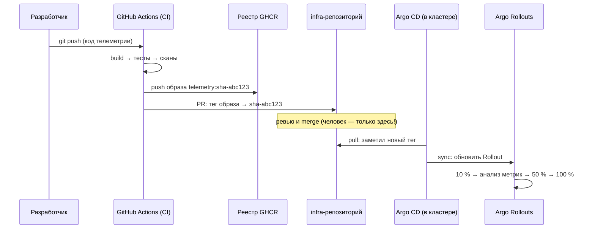

# Лекция 22. CI/CD и GitOps

> **Дисциплина:** Распределённые системы и облачные технологии (РСиОТ)
> **Занятие:** лекция 22 из 28 · **Время:** 1 пара (80 мин)
> **Зачем это:** прошлая пара научила описывать инфраструктуру кодом —
> сегодня заставим робота возить этот код (и приложения) в прод:
> конвейер CI/CD, GitOps с Argo CD и прогрессивная доставка. Это вторая
> половина лабы 7, которая стартует после пары. Конспект 2025 года
> сохранён в `archive_2025/`; сравнение — в
> `docs/Сравнение_со_старым_курсом.md`.

---

## Крючок: обновление, уложившее 8,5 миллиона машин

> 🖥 **Слайд 2.** Крючок: CrowdStrike, 19.07.2024

19 июля 2024 года, 04:09 UTC. CrowdStrike — компания, чей агент
безопасности Falcon стоит на машинах половины корпоративного мира, —
выпускает очередное «быстрое» контентное обновление сенсора. В файле —
дефект; валидатор контента из-за собственного бага его пропускает.
Обновление уходит **сразу на весь парк** — без поэтапного выката, без
канарейки, на всех клиентов одновременно.

Через минуты **8,5 миллиона** Windows-машин по планете уходят в синий
экран. Встают аэропорты (тысячи отменённых рейсов), больницы, банки,
биржи. Это крупнейший IT-сбой в истории — с оценками ущерба в миллиарды
долларов. И его причина — не хакеры и не железо, а **процесс доставки
изменений**: одно непроверенное изменение, доставленное всем сразу.

Первые же обещания CrowdStrike в постмортеме читаются как оглавление
сегодняшней пары: поэтапный выкат, canary-стадия на малой доле машин,
мониторинг во время развёртывания, автоматическая остановка при
проблемах.

Вопрос залу: у CrowdStrike были и тесты, и валидатор. Почему этого
оказалось мало — и что должно стоять **между** «проверки прошли» и
«доставлено всем»?

*(Источник кейса: `sources/Веб-находки_Лекция_22.md` — постмортем
CrowdStrike и разборы; дата доступа 10.08.2026.)*

---

## Квиз-извлечение (по лекции 21 «IaC»)

> 🖥 **Слайд 3.** Квиз-извлечение

Ответьте не подглядывая; ответы — в конце лекции.

1. Что такое state и что произойдёт при apply после ручных правок в
   консоли?
2. Почему plan обязателен к чтению перед apply?
3. Назовите четыре «суперсилы», которые даёт инфраструктуре текст в git.
4. Что общего у Terraform и OpenTofu и почему появился форк?

---

## Результаты обучения

> 🖥 **Слайд 4.** Чему научимся

После этой пары вы сможете:

1. Различать CI, continuous delivery и continuous deployment; называть
   DORA-метрики.
2. Проектировать конвейер: build → test → scan → package → publish →
   deploy.
3. Объяснять, почему артефакты неизменяемы и как тег связан с коммитом.
4. Отличать push-доставку от pull (GitOps) и формулировать четыре
   принципа GitOps.
5. Читать модель Argo CD: Application, sync, drift, самолечение.
6. Выбирать стратегию выкатки (rolling/blue-green/canary) и объяснять
   progressive delivery с автооткатом.

## Пререквизиты

- Лекция 21: IaC, «источник истины — код», plan → review → apply.
- Лекция 18: reconcile loop, RollingUpdate; лекция 20: canary по весам.
- Лаба 5: Deployment, образы с тегами; git/PR — процесс сдачи лаб.

---

## Картина мира: конвейер и робот-кладовщик

> 🖥 **Слайд 5.** Дорожная карта пары

Как изменение попадает в прод без автоматизации? Разработчик собирает
образ у себя («на моей машине работало»), заливает по SSH, что-то
перезапускает, крестится. Каждый шаг — руки, каждые руки — своя версия
реальности. Это тот же clickops из прошлой пары, только для приложений.

Сегодняшняя пара строит два механизма. Первый — **конвейер CI/CD**:
завод, через который проезжает каждый коммит — сборка, тесты, сканы,
упаковка, публикация. На выходе — **артефакт**: запечатанная коробка с
версией, которую уже никто не вскрывает. Второй — **GitOps**:
робот-кладовщик внутри кластера, который постоянно сверяет «что
развёрнуто» с накладной в git и сам устраняет расхождения. Знакомая
музыка? Это reconcile loop из лекции 18, поднятый на уровень доставки:
git — желаемое состояние, кластер — реальность, Argo CD — контроллер.

А поверх обоих — урок CrowdStrike: даже проверенную коробку не выдают
всем сразу. Сначала — одному стеллажу, посмотреть на метрики, потом —
остальным. Это progressive delivery, и сегодня мы соберём всю цепочку.

Маршрут пары: словарь CI/CD и DORA → стадии конвейера → артефакты →
push против pull и GitOps → Argo CD → стратегии выкатки → progressive
delivery → живой сеанс: путь коммита «СмартДома» → цепочка поставки.
По дороге — два квиза, голосование и пауза.

---

## Основные понятия

**Определения** (пополним глоссарий в конце):

- **CI (continuous integration)** — частая интеграция кода в главную
  ветку с автоматической сборкой и тестами каждого изменения.
- **Continuous delivery** — каждое изменение автоматически доведено до
  состояния «готово к выкату» (артефакт собран и проверен); выкат — по
  кнопке.
- **Continuous deployment** — и выкат автоматический: прошло проверки —
  уехало в прод.
- **Артефакт** — неизменяемый результат сборки: образ контейнера, пакет.
- **GitOps** — доставка pull-моделью: агент в кластере непрерывно
  приводит кластер к состоянию, описанному в git.
- **Progressive delivery** — выкат по нарастающей доле трафика/машин с
  автоматическим анализом метрик и откатом.

---

## Ядро пары

### 1. Словарь: CI, CD, CD и DORA

> 🖥 **Слайд 6.** CI / CD / CD

Три термина, которые вечно путают, различаются **степенью
автоматизации после тестов**:

| Уровень | Что автоматизировано | Что руками |
| --- | --- | --- |
| CI | сборка + тесты каждого изменения | всё после |
| Continuous delivery | + артефакт готов к выкату всегда | нажать «deploy» |
| Continuous deployment | + сам выкат | ничего |

Как понять, хорош ли ваш процесс доставки? Индустрия меряет четырьмя
**DORA-метриками**: частота деплоев, lead time (от коммита до прода),
доля неудачных изменений, время восстановления (MTTR — знакомое из
лекции 1). Элитные команды деплоят по многу раз в день с lead time в
часы — не потому, что смелые, а потому, что каждый шаг автоматизирован
и мал: маленькое изменение легко проверить и легко откатить.

### 2. Конвейер: что происходит с каждым коммитом

> 🖥 **Слайд 7.** Стадии конвейера

Конвейер (pipeline) — это скрипт, который CI-система (в нашем курсе —
GitHub Actions) прогоняет на каждый push или PR:

```text
push → build → unit-тесты → линт/сканы → сборка образа →
  публикация в реестр → деплой (dev) → продвижение выше
```

Кусочек конвейера «СмартДома» в GitHub Actions:

```yaml
name: telemetry-ci
on:
  push:
    branches: [main]
jobs:
  build-test-push:
    runs-on: ubuntu-latest
    steps:
      - uses: actions/checkout@v4
      - run: pip install -r requirements.txt && pytest
      - run: docker build -t ghcr.io/smartdom/telemetry:${{ github.sha }} .
      - run: docker push ghcr.io/smartdom/telemetry:${{ github.sha }}
```

**Пояснение к примеру.** Файл живёт в `.github/workflows/` рядом с
кодом — конвейер тоже код (ревью, история — всё как в лекции 21). Тег
образа — SHA коммита: любой работающий под можно проследить до строчки
кода и автора.

**Проверка:** вкладка Actions в репозитории — зелёная галочка на
коммите; `docker pull` образа с тегом SHA.

**Типичные ошибки:** тесты «пока отключим, чтобы не мешали» — конвейер
без тестов лишь быстрее довозит баги; сборка образа локально у
разработчика «потому что так быстрее» — среда сборки перестаёт быть
воспроизводимой.

### 3. Артефакты: запечатанная коробка

> 🖥 **Слайд 8.** Неизменяемые артефакты

Три правила артефактов, за нарушение которых платят ночными
инцидентами:

1. **Неизменяемость.** Тег опубликован — содержимое под ним не меняется
   никогда. Перезаписать `1.4.2` другим кодом — значит, «одна и та же
   версия» ведёт себя по-разному на stage и prod (и вспомните `:latest`
   из лекции 18 — это та же болезнь в максимальной форме).
2. **Прослеживаемость.** Версия → SHA коммита → PR → автор. Semver для
   людей (`1.4.2`), SHA/digest для машин.
3. **Один артефакт на все окружения.** Собрали один раз — этот же образ
   едет dev → stage → prod. Меняется конфигурация (ConfigMap из лабы 5),
   а не бинарь: «на stage работало» тогда что-то значит.

### 4. Push против pull: рождение GitOps

> 🖥 **Слайд 9.** Push против pull

Классическая доставка — **push**: конвейер после сборки сам делает
`kubectl apply` в кластер. Работает, но с двумя родовыми травмами:
CI-системе нужен **полный доступ к проду** (украли токен раннера —
украли кластер), и никто не следит за кластером **между** деплоями —
ручные правки живут до следующего выката (дрейф, знакомый по лекции 21).

**GitOps** разворачивает стрелку: в кластере живёт **агент**, который
сам **тянет** желаемое состояние из git и непрерывно сверяет с
реальностью. Четыре принципа:

1. **Декларативность** — всё желаемое описано манифестами (лекции 18 и
   21 подготовили вас идеально).
2. **Git — единственный источник истины** — что в репозитории, то и в
   кластере.
3. **Непрерывная реконсиляция** — агент постоянно сравнивает и сводит;
   ручной `kubectl apply` мимо git будет откатан так же, как дрейф в
   Terraform.
4. **Изменения только через git** — PR, ревью, история; откат = `git
   revert`.

Бонусы: CI больше не имеет доступа в кластер (агент внутри ходит
наружу только читать git); аудит бесплатно (вся история изменений
прода — это git log); дрейф лечится сам.

#### Peer-instruction-вопрос № 1

> 🖥 **Слайды 10–14.** Голосование PI-1 → четыре разбора

Голосуем, обсуждаем с соседом 90 секунд, голосуем снова.

> Команда настроила конвейер: по мерджу в main CI запускает
> `kubectl apply -f k8s/`. Коллеги говорят: «у нас GitOps — деплой же
> из git!» Они правы?
>
> A. Правы: изменения приезжают из git автоматически — это и есть
> GitOps.
> B. Не правы: это push-модель; нет агента в кластере и непрерывной
> реконсиляции — дрейф между деплоями никто не чинит, а CI держит
> ключи от прода.
> C. Правы наполовину: это GitOps, но только если apply запускается из
> ветки main.
> D. Не правы: GitOps требует установленного Argo CD с веб-интерфейсом.

Разбор — в конце лекции. Подсказка: вспомните, **кто** и **как часто**
сверяет кластер с git в каждой из моделей.

### 5. Argo CD: робот-кладовщик

> 🖥 **Слайд 15 — пауза 60 секунд, затем слайд 16.** Argo CD

Стандарт де-факто pull-модели — **Argo CD** (CNCF Graduated; по опросам
2026 года — примерно в 60 % Kubernetes-кластеров). Модель простая:

- **Application** — объект «следи за этим»: URL git-репозитория, путь к
  манифестам, целевой кластер/namespace.
- **Sync** — привести кластер к состоянию из git (руками или
  автоматически).
- **Drift detection** — постоянное сравнение; статус OutOfSync виден в
  UI; **self-heal** — автоматический откат ручных правок.
- Откат релиза — `git revert` + sync: та же механика, что «источник
  истины — код» из лекции 21.

Сосед по экосистеме — **Flux** (тоже CNCF Graduated): без UI, набор
контроллеров-«кубиков»; концепции те же. В лабе 7 используем Argo CD —
его UI нагляднее для первого знакомства с реконсиляцией.

Важная честность (заблуждение из веб-находок): GitOps решает
**доставку** состояния, но не **стратегию выкатки** — какими порциями и
когда останавливаться, решает следующий слой.

### 6. Стратегии выкатки: как менять версию под трафиком

> 🖥 **Слайд 17.** Стратегии выкатки

| Стратегия | Суть | Цена/риск |
| --- | --- | --- |
| Rolling (л. 18) | постепенная замена подов | нет контроля доли трафика |
| Blue/green | второй стек целиком, переключение разом | двойные ресурсы; откат мгновенный |
| Canary (л. 20) | малая доля трафика на новую версию | нужны маршрутизация и метрики |
| Feature flags | код выкачен, функция включается флагом | управление флагами — своя сложность |

Выбор — по цене ошибки: внутренний сервис переживёт rolling; платёжный
шлюз заслуживает canary с метриками; большой релиз со схемой БД — часто
blue/green.

### 7. Progressive delivery: канарейка с автопилотом

> 🖥 **Слайд 18.** Progressive delivery

В лекции 20 вы двигали веса canary руками и обещали «смотреть на
метрики». **Progressive delivery** автоматизирует ровно это:
контроллер (**Argo Rollouts** в экосистеме Argo, **Flagger** у Flux)
ведёт выкат по шагам и **сам** принимает решение:

```yaml
strategy:
  canary:
    steps:
      - setWeight: 10        # 10 % трафика на новую версию
      - pause: { duration: 5m }
      - analysis:            # запрос к Prometheus: error rate, p99
          templates:
            - templateName: error-rate-check
      - setWeight: 50
      - pause: { duration: 5m }
      - setWeight: 100
```

**Пояснение к примеру.** На каждом шаге контроллер спрашивает метрики
(лекция 24 расскажет, откуда они берутся); анализ провален → **автооткат
на предыдущую версию без человека**. Сравните с крючком: дефектное
обновление CrowdStrike при таком процессе умерло бы на первых
процентах парка — что компания и пообещала внедрить в постмортеме.
Круг замкнулся: это ответ на вопрос крючка — между «проверки прошли» и
«доставлено всем» должен стоять **наблюдаемый поэтапный выкат**.

### 8. Живой сеанс: путь коммита «СмартДома»

> 🖥 **Слайд 19.** Живой сеанс

Строим вместе, на глазах, по шагам (7–10 минут; ход мысли важнее
результата). Вопрос: **что происходит между `git push` разработчика и
новой версией телеметрии на 100 % трафика — без единого ручного шага?**



Проговариваем ключевые развилки: **два репозитория** — код отдельно,
манифесты (инфра) отдельно: CI пишет только в инфра-репо через PR, в
кластер не ходит вообще; единственное место с человеком — ревью PR;
плохие метрики на 10 % — Rollouts сам откатывает, Argo CD показывает
статус. Заметьте, сколько лекций сошлось в одной схеме: конвейер
(сегодня), reconcile (18), canary по весам (20), «источник истины —
код» (21).

### 9. Цепочка поставки: кто собрал эту коробку?

> 🖥 **Слайд 20.** Supply chain и секреты CI

Два коротких взрослых вопроса — подробности в лекции 25:

- **Доверие артефактам.** Конвейер тянет сотни чужих пакетов и базовых
  образов; атаки на цепочку поставки подменяют их. Ответ индустрии:
  **подпись образов** (Cosign — «эту коробку запечатал наш конвейер»)
  и **SBOM** — опись состава образа, чтобы при следующем Log4Shell за
  минуты найти, где лежит уязвимая библиотека.
- **Секреты в CI.** Долгоживущий ключ облака в настройках CI — любимая
  добыча атакующих. Современный ответ — **OIDC**: раннер получает
  короткоживущий токен под конкретный запуск; красть нечего.

---

## Типичные ошибки (запомните до того, как совершите)

> 🖥 **Слайд 21.** Типичные ошибки

1. **«kubectl apply из CI — это GitOps».** Это push без реконсиляции:
   дрейф никто не чинит, CI владеет ключами от прода.
2. **Перезапись тега образа.** «Тот же 1.4.2, но другой» — прощай,
   прослеживаемость и осмысленный откат.
3. **Разные сборки для разных окружений.** «На stage работало» ничего
   не значит, если в prod поехал другой бинарь.
4. **Canary без анализа метрик.** 10 % трафика без наблюдения — это не
   canary, а жертвоприношение 10 % пользователей (лекция 20 предупреждала).
5. **Выкат всем сразу.** Даже идеальные тесты не ловят всего —
   CrowdStrike заплатил за этот урок 8,5 миллионами машин.

---

## Квиз-закрепление (по этой паре)

> 🖥 **Слайд 22.** Закрепление

Ответьте не подглядывая; ответы — в конце лекции.

1. Чем continuous delivery отличается от continuous deployment?
2. Назовите четыре принципа GitOps. Какой из них отсутствует в
   push-модели?
3. Почему один и тот же артефакт должен ехать через все окружения?
4. Опишите шаги canary в progressive delivery. Что происходит при
   провале анализа?

---

## Вопросы для самопроверки

1. Расшифруйте DORA-метрики. Почему частые маленькие деплои безопаснее
   редких больших?
2. Перечислите стадии конвейера и назначение каждой.
3. Почему конвейер — это код и где он живёт?
4. Три правила артефактов — и чем наказуемо нарушение каждого.
5. Чем push-доставка опасна с точки зрения безопасности?
6. Как GitOps лечит дрейф? Сравните с terraform apply из лекции 21.
7. Что такое Application в Argo CD? Что значит статус OutOfSync?
8. Как выполняется откат релиза в GitOps-модели?
9. Сравните blue/green и canary: ресурсы, скорость отката, требования.
10. Что делает analysis-шаг в Argo Rollouts и откуда берутся метрики?
11. Разберите крючок CrowdStrike терминами пары: какие механизмы
    отсутствовали?
12. Зачем в живом сеансе два репозитория и где единственный ручной шаг?
13. Что такое SBOM и какую атаку затрудняет подпись образов?
14. Чем OIDC в CI лучше долгоживущего ключа?

---

## Мост к лабораторной № 7

> 🖥 **Слайд 23.** Мост к лабе

Лабораторная № 7 (`tasks/task_07`) стартует: обе половины у вас в
руках. Вы опишете стенд кодом (Terraform/OpenTofu — лекция 21),
поднимете Argo CD, отдадите ему infra-репозиторий с манифестами
«СмартДома» и соберёте конвейер GitHub Actions: push → build → тесты →
образ в GHCR → бамп тега в инфра-репо → автосинк Argo CD. Финальный
эксперимент лабы — тот самый живой сеанс, только руками: сломать
кластер вручную и посмотреть, как self-heal возвращает всё по git.

**Задание на 1 предложение** (письменно, в конспект): закончите фразу
«Поэтапный выкат с автооткатом пригодится лично мне, потому что…» —
конкретно. На следующей паре спрошу троих добровольцев.

---

## Глоссарий

> 🖥 **Слайд 24 (финал).** Вопросы + литература

| Термин | Определение |
| --- | --- |
| CI | Частая интеграция + автоматическая сборка и тесты каждого изменения |
| Continuous delivery / deployment | Артефакт всегда готов к выкату / выкат тоже автоматический |
| DORA-метрики | Частота деплоев, lead time, доля неудач, MTTR |
| Конвейер (pipeline) | Код стадий: build → test → scan → package → publish → deploy |
| Артефакт | Неизменяемый результат сборки; тег → SHA → PR → автор |
| Push / pull доставка | CI толкает в кластер / агент в кластере тянет из git |
| GitOps | Декларативность, git — истина, непрерывная реконсиляция, изменения через git |
| Argo CD / Flux | GitOps-агенты (оба CNCF Graduated); Application, sync, self-heal |
| OutOfSync / drift | Кластер разошёлся с git; лечится реконсиляцией |
| Rolling / blue-green / canary / flags | Стратегии выкатки |
| Progressive delivery | Поэтапный выкат с автоанализом метрик и автооткатом |
| Argo Rollouts / Flagger | Контроллеры progressive delivery |
| Cosign / SBOM | Подпись образов / опись состава артефакта |
| OIDC в CI | Короткоживущие токены вместо вечных ключей |

## Список литературы

1. Основная литература
   - [1] Humble J., Farley D. — «Continuous Delivery». Addison-Wesley
     (гл. 1–5 — обзорно).
   - [2] Argo CD Documentation —
     [argo-cd.readthedocs.io](https://argo-cd.readthedocs.io/);
     Argo Rollouts — [argoproj.github.io/rollouts](https://argoproj.github.io/argo-rollouts/).
2. Интернет-ресурсы
   - [3] OpenGitOps — принципы GitOps ([opengitops.dev](https://opengitops.dev/)).
   - [4] Постмортем CrowdStrike 19.07.2024 и GitOps-ландшафт 2026 —
     подборка с URL в `sources/Веб-находки_Лекция_22.md` (дата
     обращения: 10.08.2026).

---

## Ответы

### Ответы: квиз-извлечение (лекция 21)

1. State — реестр «код ↔ реальные ресурсы». После ручных правок plan
   покажет дрейф, apply вернёт ресурсы к описанному в коде состоянию —
   ручные правки будут снесены.
2. Только plan показывает полный дифф (включая «-destroy …») до того,
   как изменения необратимо применятся; apply без чтения плана — езда с
   закрытыми глазами.
3. История (git log), ревью до применения, воспроизводимость окружений,
   откат (git revert + apply).
4. Общие язык HCL, цикл plan/apply, state. Форк случился в 2023-м после
   смены лицензии Terraform с MPL на BSL; OpenTofu — открытый форк под
   Linux Foundation/CNCF.

### Ответы: peer instruction № 1

Правильный ответ — **B**. `kubectl apply` из CI — **push**-модель: CI
держит полный доступ к кластеру (украденный токен раннера = украденный
прод), а главное — сверка кластера с git происходит **только в момент
деплоя**. Ручная правка, сделанная между деплоями, живёт до следующего
мерджа. GitOps добавляет агента в кластере и **непрерывную**
реконсиляцию: дрейф замечается и чинится за минуты.

- A — «из git» — необходимое, но недостаточное условие: нет
  реконсиляции — нет главной выгоды.
- C — ветка не меняет модель: push из main — всё ещё push.
- D — GitOps — это принципы, а не конкретный инструмент: Flux без UI —
  такой же GitOps; а Argo CD, к которому вручную носят манифесты, —
  уже нет.

### Ответы: квиз-закрепление

1. Delivery: артефакт всегда готов, выкат — по кнопке человека.
   Deployment: и выкат автоматический — прошёл проверки, уехал.
2. Декларативность; git — единственный источник истины; непрерывная
   реконсиляция; изменения только через git. В push-модели отсутствует
   непрерывная реконсиляция (и обычно нарушается четвёртый).
3. Иначе окружения проверяют разные бинари: «на stage работало» теряет
   смысл; различия окружений — в конфигурации, не в артефакте.
4. setWeight (малая доля) → пауза → analysis по метрикам → рост доли →
   … → 100 %. Провал анализа — автоматический откат на предыдущую
   версию без участия человека.
