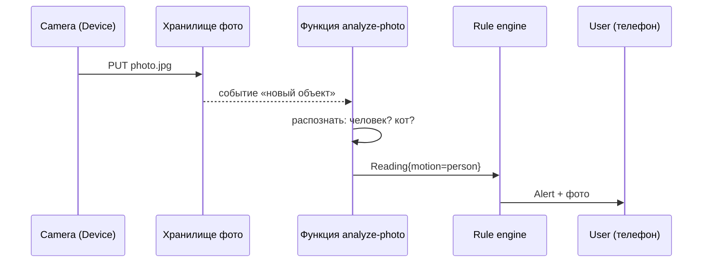
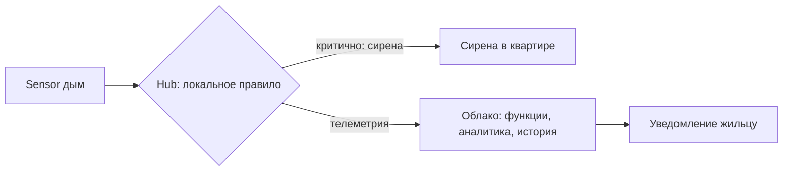

# Лекция 23. Serverless и edge computing

> **Дисциплина:** Распределённые системы и облачные технологии (РСиОТ)
> **Занятие:** лекция 23 из 28 · **Время:** 1 пара (80 мин)
> **Зачем это:** вы уже умеете упаковать сервис в контейнер, задеплоить в
> Kubernetes и доставить через GitOps. Осталась верхняя ступень лестницы
> абстракций: отдать провайдеру и серверы, и оркестрацию — платить только
> за миллисекунды работы кода. Когда это гениально, когда разорительно и
> при чём тут «край» сети — сегодняшняя пара.

---

## Крючок: файл, который вырос вдвое и выключил край интернета

> 🖥 **Слайд 2.** Крючок: сбой Cloudflare 18.11.2025

18 ноября 2025 года, 11:28 UTC. В Cloudflare — компании, через edge-сеть
которой идёт заметная доля мирового веб-трафика, — меняют права доступа в
базе ClickHouse. Побочный эффект: SQL-запрос, собирающий признаки для
модуля Bot Management, начинает возвращать дубли строк. Файл конфигурации,
который каждые несколько минут разъезжается на **тысячи серверов в сотнях
городов**, вырастает вдвое и пробивает зашитый в код лимит. Прокси-слой на
краю падает с ошибками 5xx — и вместе с ним «падают» X, ChatGPT, Discord и
тысячи сайтов, которые сами по себе были здоровы. Отказали и Workers KV
(хранилище edge-функций), и Access (аутентификация). Восстановление —
5 часов 38 минут.

Вопрос залу: **edge-сеть — это тысячи независимых точек по всему миру.
Почему же отказ случился ВЕЗДЕ сразу?**

Держите вопрос до раздела про edge. Спойлер: точек присутствия тысячи, а
вот управляющая плоскость и конфигурация — одна на всех. Сегодня разберём,
что край сети умеет, чего не умеет и как «СмартДому» жить с обоими.

*(Источник кейса: `sources/Веб-находки_Лекция_23.md` — официальный
постмортем Cloudflare и разборы; дата доступа 09.08.2026.)*

---

## Квиз-извлечение (по лекции 22: CI/CD и GitOps)

> 🖥 **Слайд 3.** Разминка

Ответьте не подглядывая; ответы — в конце лекции.

1. Чем CI отличается от CD? Что «непрерывно» в каждом из них?
2. Главный принцип GitOps: где живёт желаемое состояние системы и кто
   приводит кластер к нему?
3. Что такое canary-релиз и какую задачу он решает?
4. Инженер поправил Deployment «руками» через `kubectl edit`, минуя git.
   Как называется возникшее явление и что с ним сделает GitOps-оператор?

---

## Результаты обучения

> 🖥 **Слайд 4.** Чему научимся

После этой пары вы сможете:

1. Расставить IaaS, контейнеры, PaaS и FaaS на лестнице абстракций и
   объяснить, кто чем управляет на каждой ступени.
2. Описать событийную модель FaaS: триггеры, масштабирование до нуля,
   ограничения по времени и состоянию.
3. Объяснить природу холодного старта, его типичные величины и способы
   лечения (лёгкие рантаймы, SnapStart, provisioned concurrency).
4. Прикинуть стоимость serverless-нагрузки и определить, когда выгоднее
   постоянный сервис.
5. Объяснить, что такое edge computing — от CDN и V8-изолятов до шлюза
   «СмартДома» — и когда край действительно ускоряет систему.

## Пререквизиты

- Контейнеры и Kubernetes (лекции 2, 18–20): образ, под, deployment.
- Облачные модели IaaS/PaaS/SaaS (лекция 16).
- Сетевые основы: DNS, anycast, TLS, задержка распространения (лекция 17).
- CI/CD и GitOps (лекция 22) — для квиза-разминки.

---

## Картина мира: лестница «кто чем управляет»

> 🖥 **Слайд 5.** Дорожная карта пары

Вся история облаков — это торговля контролем за удобство. Внизу лестницы
IaaS: провайдер даёт виртуальную машину, дальше всё ваше — ОС, патчи,
рантайм, масштабирование. Ступенькой выше — контейнеры в managed
Kubernetes: провайдер держит control plane, вы — образы, манифесты и
ёмкость узлов. Ещё выше PaaS: платформа сама собирает и запускает
приложение. И на вершине — **serverless**: вы отдаёте функцию или
контейнер, а провайдер сам решает, где, когда и в скольких экземплярах её
запустить, — и берёт деньги только за фактические миллисекунды работы.

Слово «serverless» — маркетинговое лукавство: серверы никуда не делись,
просто **их не видно вам**. Аналогия: такси против личной машины. Машина
(IaaS) стоит денег, даже когда стоит у подъезда; такси (FaaS) — платишь
только за поездку, но не выбираешь марку, не хранишь вещи в багажнике и
в час пик можешь подождать подачу — это, забегая вперёд, холодный старт.

Маршрут пары: лестница абстракций → событийная модель FaaS → холодный
старт → экономика → serverless шире функций → edge computing → живой
сеанс: проектируем «СмартДом» на событиях → мост к наблюдаемости.

---

## Основные понятия

**Определения** (пополним глоссарий в конце):

- **Serverless** — модель исполнения, в которой провайдер полностью
  управляет серверами и масштабированием, а оплата идёт за фактическое
  использование (вызовы, миллисекунды, гигабайты), включая ноль при
  простое.
- **FaaS** (Function as a Service) — разновидность serverless: единица
  деплоя — функция, запускаемая в ответ на событие (AWS Lambda, Azure
  Functions, Google Cloud Functions, Yandex Cloud Functions).
- **Триггер** — событие, запускающее функцию: HTTP-запрос, новый объект в
  хранилище, сообщение в очереди, таймер.
- **Масштабирование до нуля (scale to zero)** — при отсутствии событий не
  работает ни один экземпляр и не тратится ни копейки.
- **Холодный старт** — задержка первого вызова, пока провайдер создаёт
  окружение функции: контейнер, рантайм, ваш код и его инициализация.
- **Edge computing** — выполнение кода и хранение данных близко к
  источнику запросов: в точках присутствия CDN, на региональных
  мини-площадках или прямо на устройстве/шлюзе.

---

## Ядро пары

### 1. FaaS: код, который просыпается от события

> 🖥 **Слайд 6.** Лестница абстракций · **Слайд 7.** Событийная модель

Ментальная модель FaaS — не «маленький сервер», а **обработчик события**.
Сервис в контейнере живёт постоянно: слушает порт, держит пул соединений,
ждёт. Функция не живёт нигде: она **материализуется**, когда происходит
событие, обрабатывает его и через секунды-минуты окружение может быть
уничтожено. Отсюда три следствия, которые ломают привычки:

1. **Состояние не хранится между вызовами.** Глобальная переменная может
   дожить до следующего вызова (окружение переиспользуется), а может и
   нет. Всё, что должно жить, — во внешнем хранилище (лекции 10, 19).
2. **Время ограничено.** Типичный лимит — минуты (у AWS Lambda — 15).
   Долгие задачи режутся на шаги через очереди или отдаются контейнерам.
3. **Параллелизм даётся бесплатно — и бьёт по зависимостям.** Тысяча
   одновременных событий = тысяча экземпляров функции. Функции
   масштабируются мгновенно, а база данных за ними — нет: пул соединений
   СУБД захлёбывается. Классическая авария первого serverless-проекта.

«СмартДом» на событиях выглядит естественно, потому что IoT — это и есть
поток событий:

| Событие (триггер) | Функция | Результат |
| --- | --- | --- |
| Камера положила фото в хранилище | `analyze-photo` | распознать движение, создать `Reading` |
| Сообщение телеметрии в очереди | `ingest-reading` | валидация, запись в БД |
| Таймер 03:00 | `nightly-report` | суточный отчёт жильцу |
| HTTP-вебхук производителя | `firmware-check` | пометить устройства на обновление |

**Пояснение к примеру.** Ни один из этих сценариев не требует постоянно
работающего сервера: события редкие или рваные, а между ними — тишина,
за которую при FaaS вы не платите.

**Проверка.** Для каждой строки таблицы спросите себя: что произойдёт при
двух одинаковых событиях подряд? Если ответ «две записи вместо одной» —
вспоминайте идемпотентность из лекции 1: провайдер FaaS гарантирует
доставку события *как минимум один раз*, дубли — ваша забота.

Типичные ошибки новичка: хранить счётчик в глобальной переменной функции;
открывать новое соединение к БД в каждом вызове; вешать на функцию задачу
на полчаса.

### 2. Холодный старт: цена материализации

> 🖥 **Слайд 8.** Анатомия холодного старта · **Слайд 9.** Лечение

Первый вызов функции после простоя проходит длинный путь: провайдер ищет
свободную машину, создаёт микро-ВМ или контейнер, загружает рантайм,
ваш код и зависимости, выполняет инициализацию — и только потом обработчик
видит событие. Это и есть **холодный старт**. Последующие вызовы попадают
в уже тёплое окружение и стартуют за микросекунды.

Порядки величин (2026 год, детали — в `sources/Веб-находки_Лекция_23.md`):

- лёгкие рантаймы (Node.js, Python) — обычно **< 200 мс**;
- JVM/.NET без подготовки — секунды: тяжёлая инициализация классов;
- edge-изоляты (V8) — **единицы миллисекунд**: изолят легче контейнера;
- контейнеры со scale-to-zero (Cloud Run, Knative) — секунды.

Лечится холодный старт так:

- **Меньше и легче**: тонкие зависимости, ленивая инициализация, компактный
  пакет — самое дешёвое лекарство.
- **SnapStart** (AWS, для JVM и не только): после инициализации снимается
  снапшот памяти, и новые окружения **восстанавливаются из снапшота**, а не
  инициализируются заново; платишь за хранение снапшота и каждое
  восстановление.
- **Provisioned concurrency**: держать N окружений всегда тёплыми — но это
  уже оплата простоя, серьёзная брешь в идее «платить только за работу».
- **Не пускать критичный путь через холодную функцию** — архитектурное
  решение, увидим в живом сеансе.

Важно мерить не среднее, а **p99** (лекция 1): холодным будет не «первый
запрос утром», а каждый запрос, которому не хватило тёплого экземпляра
при всплеске — то есть удар приходится ровно по пиковым моментам.

### 3. Экономика: когда счётчик такси выгоднее своей машины

> 🖥 **Слайд 10.** Ценовая модель: два сценария

Формула цены FaaS проста: **вызовы + ресурс-время**. У AWS Lambda порядок
такой: ~0,20 $ за миллион вызовов плюс оплата GB-с — память, выделенная
функции, умноженная на миллисекунды работы.

Посчитаем два сценария «СмартДома» (цифры — порядок величин, не прайс):

**Сценарий А: анализ фото по движению.** 100 000 событий в сутки, функция
работает 200 мс с 512 МБ памяти. Ресурс-время за месяц:
$3\ 000\ 000 \times 0{,}2\ \text{с} \times 0{,}5\ \text{ГБ} = 300\ 000$ ГБ-с
— это единицы долларов; вызовы — меньше доллара. Итого **порядка 5 $/мес**.
Контейнер, живущий 24/7 ради тех же редких всплесков, стоил бы на порядок
дороже — и его нужно патчить, мониторить и масштабировать самим.

**Сценарий Б: приём телеметрии, ровные 500 запросов/с круглосуточно.**
Вызовов за месяц: $500 \times 86\ 400 \times 30 \approx 1{,}3$ млрд — уже
~260 $ только за сам факт вызовов, плюс сотни долларов ресурс-времени.
Пара небольших контейнеров в кластере, переваривающая тот же поток, —
десятки долларов. **Постоянная плотная нагрузка — территория контейнеров.**

Правило большого пальца: serverless выигрывает на **рваном, редком или
непредсказуемом** трафике и проигрывает на **ровном плотном потоке**.
Не верить лозунгам ни в одну сторону — считать на салфетке, как мы сейчас.

#### Peer-instruction-вопрос № 1

> 🖥 **Слайды 11–15.** Голосование PI-1 → четыре разбора; **слайд 16** — пауза на границе блоков

Голосуем, обсуждаем с соседом 90 секунд, голосуем снова.

> Датчики «СмартДома» шлют телеметрию **ровным потоком 500 запросов/с,
> круглосуточно, без пиков**. Куда правильнее посадить приём телеметрии?
>
> A. AWS Lambda: serverless всегда дешевле — платим только за работу.
> B. Постоянный сервис в Kubernetes (Deployment + HPA): ровный плотный
> поток дешевле и предсказуемее на выделенных экземплярах.
> C. Edge-функции у CDN-провайдера: ближе к датчикам — быстрее и дешевле.
> D. Lambda + provisioned concurrency: тёплые экземпляры решат проблему.

Разбор — в конце лекции. Подсказка: два варианта путают задержку с
деньгами, один — географию с экономикой.

### 4. Serverless шире функций — и уже, чем кажется

> 🖥 **Слайд 17.** Платформа шире FaaS

Ошибка — ставить знак равенства между serverless и FaaS. Зрелая
serverless-платформа — это в первую очередь **управляемые сервисы**,
которые масштабируются и тарифицируются по использованию: объектное
хранилище (S3), базы (DynamoDB), очереди (SQS), шины событий
(EventBridge), API-шлюзы. Функции в этой картине — **клей**: тонкая логика
между управляемыми кубиками. Чем меньше кода в функциях и больше работы у
платформы, тем дешевле и надёжнее система.

Обратная сторона медали — три честных ограничения:

1. **Долгоживущие соединения.** WebSocket-сессия на час не укладывается в
   модель «проснулся-обработал-уснул» (провайдеры дают обходные пути через
   шлюзы, но это уже не функция держит соединение).
2. **Тяжёлые вычисления.** Лимиты времени и памяти; перекодировать видео
   часами — работа для контейнеров или батч-сервисов (лекция 14).
3. **Vendor lock-in.** Код функции переносим, а вот триггеры, IAM-роли,
   шина событий и лимиты — у каждого провайдера свои. Переезд — это
   переписывание обвязки. Открытые прослойки (Knative, OpenFaaS) дают
   K8s-версию serverless ценой того, что серверы снова ваши.

Контра-пример для самопроверки: «переведём весь бэкенд банка на функции» —
плохая идея не из-за моды, а из-за ровного плотного трафика, долгих
транзакционных цепочек и требований к latency. Инструмент, а не религия.

### 5. Edge computing: код едет к пользователю

> 🖥 **Слайд 18.** Edge: зачем и что это

Свет в оптоволокне идёт со скоростью около 200 000 км/с, и это
**потолок**: между Брестом и Сингапуром ~8 500 км, значит туда-обратно —
не быстрее ~85 мс даже по идеально прямому кабелю, а реальные маршруты
дают 150 мс и больше. Единственный способ
победить географию — не гонять запрос далеко: **перенести код и данные к
пользователю**. Так CDN, которые двадцать лет раздавали статику из сотен
точек присутствия, научились исполнять код: Cloudflare Workers, Fastly
Compute, Lambda@Edge.

Техническая изюминка: вместо контейнера на каждого арендатора —
**V8-изоляты**, те же песочницы, что вкладки в Chrome. Изолят стартует за
миллисекунды (вот почему у edge-функций «нулевой» холодный старт) и
потребляет мегабайты, поэтому один сервер в точке присутствия держит
тысячи чужих функций. Плата за лёгкость — ограниченное окружение: не
полный Node.js, жёсткие лимиты CPU-времени, без долгих задач.

Что осмысленно делать на краю: аутентификация и проверка токенов,
A/B-маршрутизация, персонализация кэша, геоблокировки, сборка ответа из
кэшированных кусков. Что бессмысленно: тяжёлая бизнес-логика над данными,
которые лежат в одном регионе, — функция выполнится за 5 мс в Бресте, а
потом всё равно поедет за данными через океан. **Edge ускоряет только то,
чьи данные тоже на краю** — поэтому параллельно растут edge-хранилища
(Workers KV, D1, Durable Objects) со своими компромиссами консистентности
(лекция 5 передаёт привет: реплики на тысячах точек — это eventual
consistency почти всегда).

Теперь ответ на вопрос крючка. Точек присутствия у Cloudflare тысячи, но
файл конфигурации Bot Management у них **один и разъезжается на все точки
за минуты**. Управляющая плоскость глобальна — поэтому и отказ глобален:
раздали битый файл — упал весь край сразу, во всех городах. Дата-плоскость
распределена, управляющая — единая точка отказа. Запомните эту асимметрию:
она ещё вернётся в лекции 28 про DR.

### 6. Живой сеанс: «движение у двери» на событиях

> 🖥 **Слайд 19.** Живой сеанс

Строим вместе, на глазах, по шагам (7–10 минут; ход мысли важнее
результата). Задача: камера у входной двери заметила движение — жилец
должен получить фото в уведомлении. Спроектируем на serverless-кубиках.

Шаг 1 — счастливый путь, всё событиями:

Красота: ни одного постоянного сервера, ночью система спит бесплатно,
при параде котов у двери — масштабируется сама.

Шаг 2 — включаем реальность. Вопрос залу: где здесь холодный старт и
кому он больно бьёт? Ответ: функция `analyze-photo` ночью всегда холодная
— первое уведомление приедет на сотни миллисекунд позже. Для фото кота —
неважно. А теперь замените событие: **«дым на кухне»**. Тревога через
холодную функцию + очередь + push — это секунды. SLO из лекции 1
(«99,9 % тревог быстрее 5 с») начинает трещать.

Шаг 3 — чиним архитектурой, а не прогревом:

Критичное правило «дым → сирена» исполняется **на Hub, без облака
вообще** — шлюз в квартире и есть самый край edge-вычислений. Облако
получает телеметрию, шлёт push, строит историю — но жизнь жильца не
зависит от Wi-Fi и холодных стартов. Заметьте: мы не ускорили функцию —
мы **убрали её с критичного пути**. Это главный архитектурный приём пары.

**Пояснение к примеру.** Hub-как-edge — тот же принцип, что у Cloudflare
Workers: данные и решение живут рядом с источником события. Разница только
в масштабе: у Cloudflare точка присутствия — город, у «СмартДома» —
квартира.

**Проверка.** Отключите в модели интернет: сирена сработает? (Да — правило
локальное.) Придёт ли push жильцу? (Нет — и это осознанный компромисс,
зафиксируйте его в SLO.) Типичные ошибки: тащить критичный путь через
облако, потому что «так проще»; забыть синхронизацию правил Hub ↔ облако
(правило обновили в приложении — когда его узнает Hub?).

### 7. Как выбирать: контейнер, функция или край

> 🖥 **Слайд 20.** Матрица выбора

Сведём пару в одну матрицу решений:

| Нагрузка / требование | Инструмент |
| --- | --- |
| Ровный плотный поток 24/7 | Контейнеры в K8s (лекции 18–20) |
| Рваные, редкие, непредсказуемые события | FaaS |
| Клей между управляемыми сервисами | FaaS |
| Миллисекунды на маршрутизацию/авторизацию у пользователя | Edge-функции |
| Работа при обрыве связи с облаком | Edge на устройстве/шлюзе |
| Долгие тяжёлые задачи, GPU | Контейнеры, батч (лекция 14) |
| Долгоживущие соединения (WebSocket) | Контейнеры + шлюзы |

Реальная система — всегда гибрид: «СмартДом» держит приём телеметрии в
контейнерах (ровный поток), анализ фото и отчёты — в функциях (рваные
события), критичные правила — на Hub (край), а статику и авторизацию
мобильного приложения — на CDN-edge. Умение написать эту строку выбора
для каждой части системы — и есть результат обучения сегодняшней пары.

---

## Типичные ошибки (запомните до того, как совершите)

> 🖥 **Слайд 21.** Типичные ошибки

1. **«Serverless всегда дешевле».** На ровном плотном потоке FaaS дороже
   контейнеров в разы — считать, а не верить (сценарий Б выше).
2. **«Холодный старт — приговор FaaS»** — и его близнец «холодного старта
   больше нет». Правда посередине: < 200 мс у лёгких рантаймов, но p99
   критичных путей проверять обязательно.
3. **Состояние в функции.** Глобальная переменная доживает до следующего
   вызова случайно. Всё живое — во внешнем хранилище.
4. **Функции масштабировались — база нет.** Тысяча параллельных функций
   открывает тысячу соединений к СУБД. Нужны пулы/прокси соединений и
   backpressure (лекция 9).
5. **Edge без данных на edge.** Функция на краю, ходящая в базу за океан,
   даёт красивый бенчмарк функции и прежнюю задержку пользователю.

---

## Квиз-закрепление (по этой паре)

> 🖥 **Слайд 22.** Закрепление

Ответьте не подглядывая; ответы — в конце лекции.

1. Назовите три события-триггера FaaS-функции, не связанные с HTTP.
2. Почему JVM-функции страдают от холодного старта сильнее Node.js и что
   такое SnapStart?
3. Ровный поток 500 запросов/с: почему контейнер дешевле функции? Назовите
   обе составляющие цены FaaS.
4. Почему сбой Cloudflare 18.11.2025 накрыл все точки присутствия сразу,
   хотя их тысячи?

---

## Вопросы для самопроверки

1. Расставьте по лестнице абстракций: IaaS, managed Kubernetes, PaaS,
   FaaS. Кто на каждой ступени отвечает за патчи ОС? За масштабирование?
2. Что означает «масштабирование до нуля» и почему оно невозможно у
   классического сервиса в контейнере?
3. Перечислите этапы холодного старта. Какие из них ускоряет SnapStart,
   а какие — тонкий пакет зависимостей?
4. Чем provisioned concurrency противоречит идее serverless?
5. Из чего складывается цена вызова FaaS? Посчитайте месячную стоимость:
   1 млн вызовов, 300 мс, 256 МБ.
6. Приведите два сценария «СмартДома», идеальных для FaaS, и два —
   противопоказанных. Обоснуйте.
7. Что такое V8-изолят и почему edge-функции стартуют за миллисекунды,
   а контейнеры — за секунды?
8. Почему edge-функция не ускоряет запрос, если данные в одном регионе?
   Какие edge-хранилища это лечат и какой ценой?
9. В чём разница между дата-плоскостью и управляющей плоскостью edge-сети?
   Какая из них отказала у Cloudflare 18.11.2025?
10. Почему правило «дым → сирена» должно исполняться на Hub, а не в
    облачной функции? Сформулируйте через SLO.
11. Что провайдер FaaS гарантирует про доставку события и почему из этого
    следует необходимость идемпотентности обработчика?
12. Назовите три источника vendor lock-in в serverless и способ его
    смягчить.

---

## Мост к лабораторной № 8

> 🖥 **Слайд 23.** Мост к лабе

Следующая пара — наблюдаемость (лекция 24), и сразу за ней лабораторная
№ 8: Prometheus, Grafana, алерты по SLO и Helm. Serverless — лучшая
мотивация этой связки: когда серверов не видно, **метрики и трейсы — ваши
единственные глаза**. Нельзя зайти по SSH на Lambda и посмотреть `top`;
можно только читать метрики вызовов, длительности, ошибок и холодных
стартов. В лабе вы построите такие же глаза для своего сервиса в
Kubernetes: счётчик запросов, гистограмму задержек (p95/p99 — теперь вы
знаете, зачем хвосты), алерт по SLO.

**Задание на 1 предложение** (письменно, в конспект): закончите фразу
«Умение выбирать между контейнером, функцией и edge пригодится лично мне,
потому что…» — конкретно, про свои проекты. На следующей паре спрошу
троих добровольцев.

---

## Глоссарий

> 🖥 **Слайд 24 (финал).** Вопросы + литература

| Термин | Определение |
| --- | --- |
| Serverless | Провайдер управляет серверами и масштабом; оплата по использованию, ноль при простое |
| FaaS | Функция как единица деплоя, запускается событием (Lambda, Cloud Functions) |
| Триггер | Событие, запускающее функцию: HTTP, объект в хранилище, очередь, таймер |
| Scale to zero | Ни одного работающего экземпляра и ноль оплаты при отсутствии событий |
| Холодный старт | Задержка первого вызова на создание и инициализацию окружения |
| SnapStart | Восстановление окружения из снапшота памяти вместо повторной инициализации |
| Provisioned concurrency | Оплаченные постоянно тёплые экземпляры функции |
| BaaS / managed services | Управляемые кубики платформы: хранилища, очереди, шины событий |
| Edge computing | Исполнение кода и хранение данных близко к пользователю/устройству |
| V8-изолят | Лёгкая песочница уровня движка JS; старт за миллисекунды |
| Точка присутствия (PoP) | Площадка edge-сети в конкретном городе |
| Vendor lock-in | Привязка к провайдеру через триггеры, IAM и лимиты, а не через код |

## Список литературы

1. Основная литература
   - [1] Клеппман М. — «Высоконагруженные приложения». Питер. Глава 1
     (модели систем), глава 11 (потоки событий).
   - [2] Официальная документация AWS Lambda — модель исполнения,
     [Lambda Pricing](https://aws.amazon.com/lambda/pricing/).
2. Интернет-ресурсы
   - [3] Постмортем Cloudflare 18.11.2025, материалы о холодных стартах и
     мифах serverless — подборка с URL в `sources/Веб-находки_Лекция_23.md`
     (дата обращения: 09.08.2026).
   - [4] Cloudflare Workers — [How Workers works](https://developers.cloudflare.com/workers/reference/how-workers-works/)
     (изоляты, модель исполнения).

---

## Ответы

### Ответы: квиз-извлечение (лекция 22)

1. CI — непрерывная интеграция: каждый коммит автоматически собирается и
   прогоняется через тесты. CD — непрерывная доставка/деплой: собранный
   артефакт автоматически доводится до окружений (при deployment — до
   продакшена без ручного шага).
2. Желаемое состояние живёт в git; GitOps-оператор в кластере (Argo CD,
   Flux) непрерывно сравнивает факт с git и приводит кластер к описанному
   состоянию.
3. Canary — выкатка новой версии на малую долю трафика с наблюдением за
   метриками; решает задачу раннего обнаружения плохого релиза до того,
   как он накрыл всех.
4. Drift — расхождение факта с желаемым состоянием в git. Оператор либо
   вернёт всё как в git (self-heal), либо подсветит расхождение; ручная
   правка в любом случае не переживёт следующую синхронизацию.

### Ответы: peer instruction № 1

Правильный ответ — **B**: ровный плотный поток — территория постоянного
сервиса; пара подов с HPA переварит 500 rps на порядок дешевле.

- A — лозунг вместо расчёта: 1,3 млрд вызовов в месяц стоят сотни долларов
  ещё до оплаты ресурс-времени; «платим только за работу» выгодно, когда
  работы мало или она рваная, а тут работа — 100 % времени.
- C — путает географию с экономикой: телеметрию всё равно писать в базу,
  которая живёт в одном регионе; edge-функция добавит прыжок, а не уберёт.
  Edge решает задержку чтения у пользователя, а не цену ровной записи.
- D — лечит не ту болезнь: provisioned concurrency убирает холодные старты
  (задержку), но это оплата постоянно тёплых экземпляров — по деньгам
  приближается к выделенному сервису, теряя его предсказуемость. Проблема
  сценария была в цене, а не в latency.

### Ответы: квиз-закрепление

1. Например: новый объект в хранилище (фото с камеры), сообщение в
   очереди (телеметрия), таймер/расписание (ночной отчёт). Также: событие
   шины (EventBridge), изменение записи в БД (stream).
2. JVM при старте грузит и инициализирует тысячи классов — секунды.
   SnapStart снимает снапшот памяти уже инициализированного окружения и
   восстанавливает новые экземпляры из него за доли секунды; платят за
   хранение снапшота и восстановления.
3. Цена FaaS = плата за вызовы (~0,2 $/млн) + ресурс-время (ГБ × секунды).
   При 500 rps круглосуточно вызовов ~1,3 млрд/мес и ресурс-время течёт
   100 % времени — обе составляющие большие; контейнер стоит фиксированно
   и дешевле на порядок.
4. Дата-плоскость у Cloudflare распределена по тысячам точек, но
   управляющая плоскость едина: битый файл конфигурации Bot Management
   разъехался на все точки за минуты — глобальная конфигурация сделала
   отказ глобальным.
