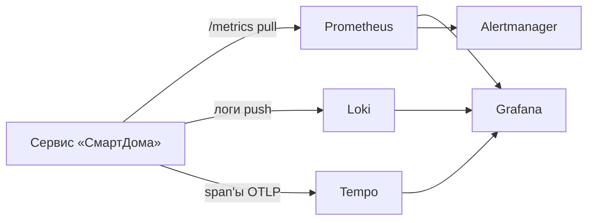

# Лекция 24. Наблюдаемость: метрики, логи, трейсы и SLO

> **Дисциплина:** Распределённые системы и облачные технологии (РСиОТ)
> **Занятие:** лекция 24 из 28 · **Время:** 1 пара (80 мин)
> **Зачем это:** прошлая пара закончилась выводом «серверов не видно —
> метрики и трейсы становятся единственными глазами». Сегодня строим эти
> глаза: три сигнала телеметрии, стандарт OpenTelemetry, SLO и алерты,
> которые будят инженера только по делу. Всё это вы примените руками в
> лабораторной № 8. Конспект 2025 года («Лекция 13») — в `archive_2025/`.

---

## Крючок: день, когда ослепли глаза индустрии

> 🖥 **Слайд 2.** Крючок: сбой Datadog 08.03.2023

Ночь на 8 марта 2023 года. Datadog — сервис, через который десятки тысяч
компаний смотрят на свои системы, — переживает **первый глобальный сбой**:
все регионы, все облачные провайдеры одновременно. Дашборды открываются,
но они пусты: ни метрик, ни логов, ни трейсов, ни алертов.

Причина унизительно будничная: ночное **автоматическое обновление
systemd** на Ubuntu 22.04. При рестарте systemd-networkd удалил сетевые
маршруты, которыми управлял CNI-плагин Cilium, — и узлы Kubernetes-парка
Datadog потеряли связность. Тысячи компаний ослепли разом; их инженеры
не знали, работают ли их собственные системы. А инженеры Datadog чинили
платформу наблюдаемости, **не имея наблюдаемости**: их инструменты — это
и была сломанная система. Восстановление — почти сутки, ущерб — порядка
5 млн долларов.

Вопрос залу: **если падает система, через которую вы смотрите на мир, —
как вы вообще узнаете, что у вас всё в порядке?**

Помните этот день весь семестр: наблюдаемость — не «прикрутим потом»,
а несущая конструкция, у которой есть собственные отказы.

*(Источник кейса: `sources/Веб-находки_Лекция_24.md` — инженерные разборы
Datadog и Pragmatic Engineer; дата доступа 09.08.2026.)*

---

## Квиз-извлечение (по лекции 23: serverless и edge)

> 🖥 **Слайд 3.** Разминка

Ответьте не подглядывая; ответы — в конце лекции.

1. Что такое холодный старт и почему он бьёт по p99, а не по среднему?
2. Из каких двух составляющих складывается цена вызова FaaS?
3. Почему правило «дым → сирена» в «СмартДоме» должно исполняться на Hub,
   а не в облачной функции?
4. Edge-функция выполняется за 5 мс в Бресте, но пользователь не заметил
   ускорения. Какова самая вероятная причина?

---

## Результаты обучения

> 🖥 **Слайд 4.** Чему научимся

После этой пары вы сможете:

1. Различать мониторинг и наблюдаемость; объяснять, какие вопросы
   закрывает каждый из трёх сигналов: метрики, логи, трейсы.
2. Выбирать тип метрики (counter / gauge / histogram) и не устраивать
   взрыв кардинальности метками.
3. Читать путь запроса по распределённому трейсу и связывать логи с
   трейсами через traceId.
4. Объяснить роль OpenTelemetry как единого стандарта телеметрии.
5. Сформулировать SLI/SLO для сервиса, посчитать бюджет ошибок и написать
   алерт по burn rate, который не будит по пустякам.

## Пререквизиты

- Метрики SLI/SLO/SLA, p95/p99, MTTR (лекция 1) — сегодня доводим до
  практики.
- Kubernetes и Helm (лекции 18–19), отказоустойчивость (лекция 9).
- Serverless (лекция 23) — для квиза-разминки.

---

## Картина мира: приборная панель, чёрный ящик и три вопроса

> 🖥 **Слайд 5.** Дорожная карта пары

Автомобиль без приборной панели едет — пока не кончится бензин посреди
трассы. Сервис без телеметрии тоже работает — пока вы не узнаёте о сбое
из чата «у вас всё лежит!!!». Наблюдаемость — это приборная панель,
но с важным отличием от автомобильной: хорошая телеметрия позволяет
отвечать и на вопросы, которых вы **не задавали при проектировании**.

Классическое различие. **Мониторинг** отвечает на известные вопросы:
«CPU выше 80 %?», «сервис отвечает?» — это known unknowns, датчики на
заранее известные болезни. **Наблюдаемость** — свойство системы, по
внешней телеметрии которой можно диагностировать **новые, незнакомые
болезни** (unknown unknowns): «почему тревоги из квартир с камерами
Xiaomi приходят на 4 секунды позже — и только по вторникам?» Такой
вопрос не предусмотришь заранее; на него отвечают, копаясь в богатой
телеметрии. Нужны оба: мониторинг ловит известное быстро, наблюдаемость
объясняет неизвестное.

Маршрут пары: мониторинг против наблюдаемости → три сигнала и их стек →
метрики глубоко → логи → трейсы → OpenTelemetry → SLO и бюджет ошибок →
живой сеанс: алерт по burn rate для «СмартДома» → мост к лабе 8, где вы
всё это соберёте руками.

---

## Основные понятия

**Определения** (пополним глоссарий в конце):

- **Телеметрия** — данные, которые система излучает о самой себе:
  метрики, логи, трейсы (и профили — четвёртый, молодой сигнал).
- **Метрика** — числовой временной ряд: запросов в секунду, байт в
  очереди. Дёшево хранить, быстро агрегировать.
- **Лог** — запись о событии с меткой времени: «в 12:03:41 запрос r-42
  завершился ошибкой 503». Дорого хранить, бесценно при разборе.
- **Трейс** — путь одного запроса через все сервисы: дерево отрезков
  (span'ов) с длительностями. Отвечает «где именно медленно».
- **SLI / SLO** — измеряемый показатель качества / целевое значение
  (лекция 1); сегодня добавим **бюджет ошибок** и **burn rate**.
- **Alert fatigue** — усталость от шумных алертов: когда пейджер звенит
  сотни раз в день, перестают реагировать и на настоящие инциденты.

---

## Ядро пары

### 1. Три сигнала и стек наблюдаемости

> 🖥 **Слайд 6.** Мониторинг vs наблюдаемость · **Слайд 7.** Три сигнала и стек

Три сигнала отвечают на три разных вопроса:

| Сигнал | Вопрос | Пример «СмартДома» |
| --- | --- | --- |
| Метрики | **Что** происходит? Насколько плохо? | доля тревог, доставленных за 5 с, упала до 97 % |
| Трейсы | **Где** в цепочке проблема? | span'ы показывают: 3,8 с съедает вызов push-провайдера |
| Логи | **Почему** именно? | `{"level":"error","msg":"push quota exceeded","traceId":"a1f4…"}` |

Типовой открытый стек, который вы соберёте в лабе 8: приложение отдаёт
метрики на HTTP-эндпоинте `/metrics`, **Prometheus** периодически их
забирает (pull-модель), **Grafana** рисует дашборды и ведёт алерты; логи
собирает **Loki**, трейсы — **Tempo** или **Jaeger**.



**Пояснение к примеру.** Стрелка «pull» у Prometheus — не мелочь:
Prometheus сам ходит по списку целей и забирает метрики. Упавший сервис
не может «забыть прислать» метрики — Prometheus заметит недоступность
цели (метрика `up == 0`). Логи и трейсы, наоборот, отправляет
приложение (push).

**Проверка.** Мысленно уроните сервис: какой сигнал первым покажет
проблему? (`up == 0` в Prometheus и алерт.) А если сервис жив, но каждый
десятый запрос медленный? (Гистограмма задержек — метрики; виновный
участок — трейсы.)

Типичные ошибки: собирать только логи («у нас же всё пишется!») — по ним
трудно строить быстрые агрегаты и алерты; собирать метрики без меток —
нельзя отличить 500-е ошибки от 200-х.

### 2. Метрики: три типа и одна ловушка

> 🖥 **Слайд 8.** Типы метрик · **Слайд 9.** Кардинальность

Prometheus знает три главных типа метрик:

- **Counter** — только растёт: число принятых показаний, число ошибок.
  Смотреть на сырое значение бессмысленно (оно растёт всегда) — смотрят
  на **скорость роста**: `rate(smarthome_readings_total[5m])`.
- **Gauge** — растёт и падает: текущее число открытых соединений Hub'ов,
  температура с датчика, длина очереди.
- **Histogram** — распределение по «корзинам» (bucket): длительности
  запросов, размеры сообщений. Из гистограммы получают перцентили —
  p95, p99, — которые среднее прячет (лекция 1 это уже доказала).

Именование в экосистеме Prometheus — `snake_case` с суффиксом единицы:
`smarthome_alert_delivery_seconds`, `smarthome_readings_total`. Метки
(labels) дают разрезы: `{method="POST", status="503", route="/readings"}`.

**Ловушка кардинальности.** Каждая уникальная комбинация меток — это
**отдельный временной ряд** в памяти Prometheus. Метки `status` (5–10
значений) и `route` (десятки) — нормально. Метка `device_id` при миллионе
устройств «СмартДома» — миллион временных рядов на одну метрику,
Prometheus захлёбывается. Правило: в метках — только **ограниченные
словари** значений; уникальные идентификаторы живут в логах и трейсах,
не в метриках.

**Проверка.** Какой тип выбрать: «время с последнего успешного бэкапа»?
(Gauge.) «Сколько раз сработал circuit breaker»? (Counter.) «Сколько
миллисекунд занимает правило Rule engine»? (Histogram.)

Типичные ошибки: сравнение сырых counter'ов вместо `rate()`; метка с
userId/deviceId; отдельная метрика на каждый статус
(`errors_500_total`, `errors_503_total`…) вместо одной с меткой.

### 3. Логи: пишите для машин, а не для себя

> 🖥 **Слайд 10.** Структурированные логи

Лог «Ошибка! Что-то пошло не так :(» бесполезен уже через час после
написания. Современный лог — **структурированная запись** (JSON), которую
машина умеет фильтровать и агрегировать:

```json
{
  "ts": "2026-08-09T12:03:41.207Z",
  "level": "error",
  "service": "alert-dispatcher",
  "env": "prod",
  "msg": "push provider quota exceeded",
  "homeId": "h-982",
  "traceId": "a1f4c02e77",
  "spanId": "0b3d"
}
```

**Пояснение к примеру.** Обязательный минимум полей: время, уровень
(`debug`/`info`/`warn`/`error`), имя сервиса, окружение и — ключ ко всей
паре — **traceId**. Именно traceId склеивает лог с трейсом: нашли
медленный span → по traceId вытащили все логи этого запроса из всех
сервисов. Без корреляции логи — стог сена без магнита.

**Проверка.** По какому полю вы найдёте все записи одного запроса,
прошедшего через четыре сервиса? (traceId.) Что случится, если писать
`debug` в проде под нагрузкой? (Терабайты шума и счёт за хранение.)

Типичные ошибки: логировать секреты и персональные данные без
маскировки; писать многострочные «простыни» вместо одного JSON-события;
не настроить ротацию и срок хранения.

### 4. Трейсы: рентген одного запроса

> 🖥 **Слайд 11.** Анатомия трейса

Тревога «дым» прошла путь Hub → Cloud API → Rule engine → уведомитель →
push-провайдер и добралась до жильца за 4,2 секунды вместо одной. Какой
из пяти участков виноват? Метрики скажут «в среднем всё неплохо», логи —
разбросаны по пяти сервисам. Отвечает **трейс**: дерево span'ов, где
каждый span — отрезок работы с началом, длительностью и атрибутами:

```text
trace a1f4c02e77 — POST /readings → Alert (4,21 с)
├─ hub→cloud: POST /readings            180 мс
├─ rule-engine: evaluate rules           95 мс
├─ alert-dispatcher: send                3,82 с   ← вот он
│  └─ push-provider: HTTP POST           3,79 с   (ретраи из-за квоты)
└─ history: write reading                 60 мс
```

Контекст трейса (traceId + spanId) передаётся между сервисами в
заголовках запросов — это делает за вас SDK. Важное решение —
**семплирование**: писать трейс каждого запроса дорого; обычно пишут
долю (1–10 %) плюс все ошибочные и медленные запросы. На собеседовании
любят спрашивать: «зачем семплирование?» — затем, что телеметрия сама
потребляет ресурсы, и 100 % трейсов при большом потоке стоят дороже
пользы (вспомните экономику из лекции 27 — скоро).

Типичные ошибки: span на каждую мелкую функцию (шум и накладные
расходы); разные имена одной операции в разных сервисах; потеря
контекста на границе очереди (producer и consumer — один трейс, если
передать traceId в сообщении).

### 5. OpenTelemetry: один стандарт вместо зоопарка

> 🖥 **Слайд 12.** OpenTelemetry · **Слайд 13.** Пауза

Ещё недавно у каждого вендора был свой агент и свой формат: сменить
систему наблюдаемости значило переинструментировать весь код.
**OpenTelemetry (OTel)** закрыл эту дыру: единые SDK для всех основных
языков, единый протокол **OTLP** и **Collector** — конвейер, который
принимает телеметрию, обрабатывает (фильтрует, семплирует, добавляет
атрибуты) и экспортирует в любой бэкенд: Prometheus, Tempo, Jaeger,
коммерческие платформы.

Статус на 2026 год: OTel — выпускник CNCF (второй проект по числу
контрибьюторов после Kubernetes), трейсы, метрики и логи — стабильны
(GA) во всех основных SDK, четвёртый сигнал — **профили** (какая функция
жжёт CPU) — в публичной альфе. Почти половина индустрии уже пишет
телеметрию через OTel. Практический вывод для вас: **инструментируйте
код один раз через OTel** — и меняйте бэкенды без переписывания кода.
Это лекарство от vendor lock-in из прошлой пары.

Минимальная инструментация сервиса «СмартДома» (Node.js) — две строки
конфигурации до старта приложения:

```js
// tracing.js — подключается ДО кода приложения
import { NodeSDK } from "@opentelemetry/sdk-node";
import { getNodeAutoInstrumentations } from "@opentelemetry/auto-instrumentations-node";
import { OTLPTraceExporter } from "@opentelemetry/exporter-trace-otlp-http";

const sdk = new NodeSDK({
  serviceName: "alert-dispatcher",
  traceExporter: new OTLPTraceExporter({ url: "http://otel-collector:4318/v1/traces" }),
  instrumentations: [getNodeAutoInstrumentations()],
});
sdk.start();
```

**Пояснение к примеру.** Автоинструментация сама создаёт span'ы для
входящих HTTP-запросов, обращений к БД и исходящих вызовов — нулевая
правка бизнес-кода. **Проверка:** сделайте запрос к сервису и найдите
трейс в Grafana/Tempo по `service.name = alert-dispatcher`. Типичные
ошибки: SDK стартует после импорта приложения (автоинструментация не
успевает подменить библиотеки); неверный URL коллектора; забыли задать
`serviceName` — все сервисы называются `unknown_service`.

### 6. SLO, бюджет ошибок и алерты, которые не врут

> 🖥 **Слайд 14.** SLI → SLO → бюджет ошибок

Соберём всё в главную эксплуатационную конструкцию. Из лекции 1: SLI —
что меряем, SLO — какую цель держим. Новое — **бюджет ошибок** (error
budget): разрешённая доля плохого. SLO 99,9 % успешных тревог за 30 дней
означает бюджет 0,1 % — при миллионе тревог в месяц можно «испортить»
1000, или ~43 минуты полного простоя. Бюджет — не позор, а **валюта**:
пока он есть, команда катит рискованные релизы; бюджет кончился —
морозим фичи и чиним надёжность. Это превращает вечный спор «фичи против
стабильности» в арифметику.

Как алертить по SLO? Наивные варианты плохи с двух сторон:

- алерт на **каждую ошибку** или мгновенный всплеск p99 — будит ночью
  из-за одного чиха сети; через месяц команда игнорирует пейджер
  (alert fatigue — главный убийца дежурств);
- алерт «доступность за месяц < 99,9 %» — молчит, пока бюджет не
  **уже** сожжён: узнаете о пожаре по остывшему пепелищу.

Индустрия сходится на **burn rate** — скорости сжигания бюджета:
во сколько раз текущая доля ошибок выше допустимой. Burn rate = 1 —
бюджет сгорит ровно за 30 дней (норма); burn rate = 14,4 — бюджет
месяца сгорит за двое суток: буди немедленно. Алертят парой правил:
быстрый пожар (высокий burn rate на коротком окне — пейджер сейчас) и
медленное тление (умеренный burn rate на длинном окне — тикет на утро).

#### Peer-instruction-вопрос № 1

> 🖥 **Слайды 15–19.** Голосование PI-1 → четыре разбора

Голосуем, обсуждаем с соседом 90 секунд, голосуем снова.

> SLO «СмартДома»: 99,9 % тревог доставлены быстрее 5 с за 30 дней.
> Какой алерт разбудит дежурного вовремя и не приучит игнорировать
> пейджер?
>
> A. Пейджер на каждую тревогу, доставленную дольше 5 с, — ни одной не
> пропустим.
> B. Пейджер, если p99 задержки превысил 5 с в любую минуту.
> C. Пейджер, когда бюджет ошибок сжигается в ~14 раз быстрее нормы на
> окнах 1 час и 5 минут одновременно.
> D. Пейджер, когда доступность за 30 дней опустилась ниже 99,9 %.

Разбор — в конце лекции. Подсказка: два варианта будят слишком часто,
один — слишком поздно.

### 7. Живой сеанс: алерт по burn rate для «СмартДома»

> 🖥 **Слайд 20.** Живой сеанс

Строим вместе, на глазах, по шагам (7–10 минут). Задача: от SLO — к
работающему правилу Prometheus.

Шаг 1 — **SLI как дробь**. «Доля тревог, доставленных быстрее 5 с».
В приложении — histogram `smarthome_alert_delivery_seconds` с корзиной
`le="5"`. Хорошие события / все события:

```promql
sum(rate(smarthome_alert_delivery_seconds_bucket{le="5"}[5m]))
/
sum(rate(smarthome_alert_delivery_seconds_count[5m]))
```

Шаг 2 — **доля ошибок и burn rate**. Ошибка = 1 − SLI. Допустимая доля
ошибок из SLO = 0,001. Burn rate — во сколько раз реальность хуже плана:

```promql
(1 - sli:alert_delivery:ratio_rate1h) / 0.001
```

(здесь `sli:…:ratio_rate1h` — recording rule: та же дробь шага 1, но на
окне 1 час — предвычисляется, чтобы алерт был дёшев).

Шаг 3 — **правило с двумя окнами**. Почему 14,4? Такой burn rate
сжигает 2 % месячного бюджета за час — за выходные не останется ничего.
Короткое окно (5 мин) требует, чтобы пожар шёл **прямо сейчас**, а не
час назад:

```yaml
- alert: AlertDeliveryFastBurn
  expr: >
    (1 - sli:alert_delivery:ratio_rate1h) / 0.001 > 14.4
    and
    (1 - sli:alert_delivery:ratio_rate5m) / 0.001 > 14.4
  for: 2m
  labels: { severity: page }
  annotations:
    summary: "Бюджет ошибок доставки тревог сгорает в 14 раз быстрее нормы"
```

Проговорим, что мы сделали: не «алерт на ошибку», а алерт на **скорость
потери обещания пользователю**. Один случайный таймаут не разбудит
никого; систематическая деградация разбудит через минуты. Заметьте: то
же правило поймает и «тихую» болезнь — рост задержек без единого 5xx,
потому что SLI считает медленную доставку недоставленной.

**Проверка.** Ночью 0,05 % тревог опаздывают (норма 0,1 %): burn rate
= 0,5 — тишина. Утром релиз сломал push: 30 % тревог опаздывают, burn
rate = 300 — пейджер через 2 минуты. Типичные ошибки: одно короткое
окно без длинного (дребезг); отсутствие `for:`; алерт на p99 напрямую
вместо доли событий в SLO.

### 8. Когда алерт всё же разбудил: инцидент и постмортем

> 🖥 **Слайд 21.** Типичные ошибки (+ культура постмортемов — устно)

Замкнём контур из лекции 1. Алерт → дежурный (on-call) → инцидент →
восстановление → **постмортем**: хронология, причины, уроки, задачи.
Главное слово — **blameless**: разбираем систему, а не ищем виноватого.
Инженер, удаливший маршруты «не тем апдейтом», — не причина, а симптом:
причина — система, в которой ночное автообновление могло снести сеть
всего парка разом. Datadog после 08.03.2023 опубликовал серию честных
разборов — по ним эта лекция и написана; культура постмортемов и есть
то, что отличает зрелую эксплуатацию от героизма.

---

## Типичные ошибки (запомните до того, как совершите)

1. **Метка с бесконечным словарём** (`device_id`, `user_id`) — взрыв
   кардинальности; идентификаторы живут в логах и трейсах.
2. **Сырые counter'ы вместо `rate()`** — «у нас 8 миллионов ошибок!»
   (с 2019 года).
3. **Алерт на каждый чих** — alert fatigue: пейджер, который звенит
   всегда, не звенит никогда. Burn rate + два окна + `for:`.
4. **Логи-простыни без структуры и traceId** — стог сена без магнита.
5. **100 % семплирование трейсов под нагрузкой** — телеметрия дороже
   самой системы; Datadog-подобный счёт в конце месяца.
6. **Наблюдаемость «прикрутим потом»** — потом будет 8 марта 2023.

---

## Квиз-закрепление (по этой паре)

> 🖥 **Слайд 22.** Закрепление

Ответьте не подглядывая; ответы — в конце лекции.

1. Какой сигнал отвечает на «что происходит», какой — на «где», какой —
   на «почему»?
2. Почему метка `device_id` в метрике — авария, а в логе — норма?
3. SLO 99,9 % за 30 дней. Что такое бюджет ошибок в минутах простоя и
   что команда делает, когда он кончился?
4. Чем алерт по burn rate лучше алерта «p99 > 5 с» и алерта
   «доступность месяца < SLO»?

---

## Вопросы для самопроверки

1. Сформулируйте разницу мониторинга и наблюдаемости через known/unknown
   unknowns. Приведите по одному вопросу каждого типа для «СмартДома».
2. Почему Prometheus забирает метрики pull'ом и что это даёт при падении
   цели?
3. Выберите тип метрики: длина очереди Hub'а; суммарное число ретраев;
   распределение времени оценки правила. Обоснуйте.
4. Что такое кардинальность и как её взрывают? Придумайте «плохую» метку
   для «СмартДома» и замену ей.
5. Перечислите обязательные поля структурированного лога. Зачем traceId?
6. Что такое span и как связаны span'ы одного трейса? Как контекст
   пересекает границу HTTP-вызова? Очереди сообщений?
7. Зачем семплирование трейсов и какие запросы стоит писать всегда?
8. Какую проблему решает OpenTelemetry Collector? Что даёт OTel против
   vendor lock-in?
9. Посчитайте бюджет ошибок для SLO 99,5 % за 30 дней в минутах.
10. Burn rate = 6 на окне 1 час. За сколько дней сгорит месячный бюджет,
    если ничего не менять?
11. Почему у алерта два окна (1 ч и 5 мин), а не одно?
12. Что означает blameless в постмортеме и почему «наказать виновного»
    ухудшает надёжность?
13. Дашборды каких трёх-четырёх панелей вы сделаете для сервиса приёма
    показаний в лабе 8?

---

## Мост к лабораторной № 8

> 🖥 **Слайд 23.** Мост к лабе

Лабораторная № 8 (`tasks/task_08`) — прямое продолжение пары: вы
развернёте kube-prometheus-stack (Prometheus + Grafana + Alertmanager),
добавите в свой сервис из прошлых лаб эндпоинт `/metrics` со счётчиком
запросов и **гистограммой задержек**, научите Prometheus находить сервис
через ServiceMonitor, включите OpenTelemetry-трейсинг (код
инициализации — из § 5), соберёте дашборды доступности / p95–p99 /
ошибок и напишете PrometheusRule-алерт по своему SLO — тот самый
механизм из живого сеанса, только руками и в своём кластере. Плюс
упакуете всё в Helm-чарт; расширенный OTel и burn-rate-правила —
бонусами.

**Задание на 1 предложение** (письменно, в конспект): закончите фразу
«Умение отличать шумный алерт от алерта по бюджету ошибок пригодится
лично мне, потому что…». На следующей паре спрошу троих добровольцев.

---

## Глоссарий

> 🖥 **Слайд 24 (финал).** Вопросы + литература

| Термин | Определение |
| --- | --- |
| Наблюдаемость | Свойство системы: по внешней телеметрии можно диагностировать новые, незапланированные проблемы |
| Мониторинг | Проверка заранее известных условий (known unknowns) с оповещением |
| Counter / Gauge / Histogram | Типы метрик: растущий счётчик / текущее значение / распределение по корзинам |
| Кардинальность | Число уникальных комбинаций меток = число временных рядов |
| rate() | Скорость роста counter'а за окно; основа почти всех запросов PromQL |
| Структурированный лог | JSON-событие с ts, level, service, traceId |
| Trace / Span | Путь запроса через сервисы / один отрезок этого пути |
| Семплирование | Запись доли трейсов вместо всех: 1–10 % + ошибки и медленные |
| OpenTelemetry (OTel) | Единый стандарт SDK/протокола телеметрии; CNCF graduated |
| Collector (OTel) | Конвейер: принять → обработать → экспортировать в любой бэкенд |
| Бюджет ошибок | 1 − SLO: разрешённая доля плохих событий за период |
| Burn rate | Во сколько раз бюджет ошибок сгорает быстрее нормы |
| Alert fatigue | Привыкание к шумным алертам; лечится burn rate и дисциплиной порогов |
| Blameless постмортем | Разбор инцидента без поиска виноватых: чинится система, а не человек |

## Список литературы

1. Основная литература
   - [1] Beyer B. и др. — «Site Reliability Engineering». O'Reilly.
     Главы 4 (SLO), 6 (мониторинг); «The Site Reliability Workbook» —
     глава 5 (alerting on SLOs, burn rate).
   - [2] Клеппман М. — «Высоконагруженные приложения». Питер. Глава 1
     (метрики и перцентили).
2. Интернет-ресурсы
   - [3] Инженерные разборы сбоя Datadog 08.03.2023 и статус
     OpenTelemetry 2026 — подборка с URL в
     `sources/Веб-находки_Лекция_24.md` (дата обращения: 09.08.2026).
   - [4] Документация: [Prometheus](https://prometheus.io/docs/),
     [Grafana](https://grafana.com/docs/),
     [OpenTelemetry](https://opentelemetry.io/docs/).

---

## Ответы

### Ответы: квиз-извлечение (лекция 23)

1. Холодный старт — задержка первого вызова на создание и инициализацию
   окружения функции. Он бьёт по хвосту: большинство вызовов тёплые, но
   всплески нагрузки создают новые окружения — страдают именно пиковые
   запросы, т. е. p99, а среднее почти не меняется.
2. Плата за вызовы (примерно 0,2 $ за миллион) + ресурс-время: память,
   выделенная функции, умноженная на время работы (ГБ-секунды).
3. Тревога критична по времени и обязана работать при обрыве интернета:
   локальное правило на Hub не зависит ни от Wi-Fi, ни от холодного
   старта функции — облако остаётся для истории и push-уведомлений.
4. Данные не на краю: функция исполняется рядом с пользователем, но
   ходит за данными в базу одного региона — задержка осталась в запросе
   к данным.

### Ответы: peer instruction № 1

Правильный ответ — **C**: burn rate с двумя окнами (1 ч и 5 мин) будит,
когда бюджет ошибок сгорает в ~14 раз быстрее нормы, — это и быстро
(минуты при настоящем пожаре), и устойчиво к случайным чихам.

- A — пейджер на каждое событие: при миллионе тревог в месяц даже норма
  0,1 % — это ~33 опоздания в сутки, 33 побудки. Через неделю дежурный
  отключит звук — и проспит настоящий инцидент. Классический alert
  fatigue.
- B — мгновенный p99 ловит любой сетевой чих: одна медленная минута из
  1440 не угрожает месячному SLO, а пейджер уже звенел. Плюс p99 не
  видит «медленная = недоставленная» логику SLI.
- D — математически верно, но безнадёжно поздно: алерт молчит, пока
  бюджет не сожжён; предупреждать надо о **скорости** сгорания, а не о
  свершившемся факте.

### Ответы: квиз-закрепление

1. Метрики — «что происходит / насколько плохо»; трейсы — «где в цепочке»;
   логи — «почему именно».
2. В метриках каждая комбинация меток — отдельный временной ряд в памяти:
   миллион device_id = миллион рядов (взрыв кардинальности). Логи
   индексируются иначе и рассчитаны на уникальные значения полей.
3. Бюджет = 0,1 % от 30 дней ≈ 43 минуты простоя (или 0,1 % событий).
   Когда бюджет исчерпан — замораживаются рискованные релизы, приоритет
   отдаётся работам по надёжности (договорённость error budget policy).
4. Burn rate реагирует на скорость потери обещания: быстро при пожаре,
   молчит при случайном чихе. «p99 > 5 с» будит на каждый всплеск
   (fatigue), «доступность месяца < SLO» срабатывает, когда спасать уже
   нечего.
