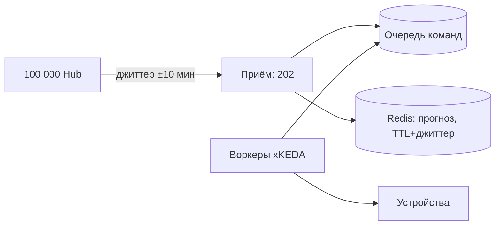

# Лекция 26. Производительность и масштабирование

> **Дисциплина:** Распределённые системы и облачные технологии (РСиОТ)
> **Занятие:** лекция 26 из 28 · **Время:** 1 пара (80 мин)
> **Зачем это:** у вас есть кластер, деплой и глаза (лаба 8). Осталось
> ответить на два вечных вопроса эксплуатации: «выдержим ли мы пик?» и
> «почему медленно, хотя серверов много?». Сегодня — законы
> масштабирования, нагрузочные тесты как гейт релиза, автоскейлинг и
> защита от перегрузки. Конспекты 2025 года («Лекции 24 и 25») — в
> `archive_2025/`.

---

## Крючок: 3,5 миллиарда запросов за билетами

> 🖥 **Слайд 2.** Крючок: Ticketmaster, 15.11.2022

15 ноября 2022 года Ticketmaster открывает предпродажу билетов на
Eras Tour Тейлор Свифт. За день сайт получает **3,5 миллиарда
запросов** — вчетверо больше прежнего исторического пика. На 2,4 млн
билетов претендуют около 14 миллионов покупателей — плюс боты
перекупщиков, которых, по показаниям президента Live Nation в Сенате
США, пришло втрое больше, чем когда-либо; боты атаковали даже серверы
кодов «Verified Fan», созданной специально для отсечения ботов.
Продажи замедляли, приостанавливали; очереди зависали на часы;
публичную продажу отменили вовсе. Хэштег #TicketmasterFail,
слушания в Сенате, иски.

Вопрос залу: **у Ticketmaster были деньги на любое железо. Почему
«просто добавить серверов» не спасло — и что бы вы делали на их месте?**

Держите ответ до конца пары: к финалу у вас будет и диагноз (законы
масштабирования), и рецепты (очереди, load shedding, автоскейлинг) — и
вы увидите, что «зал ожидания» Ticketmaster — это знакомый вам
backpressure, только для людей.

*(Источник кейса: `sources/Веб-находки_Лекция_26.md` — system-design
разборы и материалы слушаний; дата доступа 09.08.2026.)*

---

## Квиз-извлечение (по лекции 25: безопасность)

> 🖥 **Слайд 3.** Разминка

Ответьте не подглядывая; ответы — в конце лекции.

1. Три кита zero trust?
2. Почему base64 в Kubernetes Secret — не защита и какие слои её дают?
3. Что такое supply chain атака? Через какую «дверь» вошёл Shai-Hulud?
4. Какие три вопроса закрывают SBOM, SLSA-провенанс и подпись cosign?

---

## Результаты обучения

> 🖥 **Слайд 4.** Чему научимся

После этой пары вы сможете:

1. Читать связку метрик производительности: задержка (p95/p99),
   пропускная способность, утилизация, насыщение — и кривую «хоккейной
   клюшки».
2. Объяснить пределы масштабирования законами Амдала и USL: почему
   10 серверов почти никогда не дают 10-кратного ускорения.
3. Выбрать вид нагрузочного теста (smoke/load/stress/soak/spike) и
   встроить k6-пороги как SLO-гейт в CI.
4. Настроить горизонтальный автоскейлинг (HPA/KEDA) и не наступить на
   его классические грабли.
5. Защитить систему от перегрузки: rate limiting, backpressure,
   load shedding, кэш — и знать, чем опасен cache stampede.

## Пререквизиты

- p95/p99, закон Литтла (лекция 1); histogram и дашборды (лекция 24,
  лаба 8).
- Kubernetes: Deployment, requests/limits (лекции 18–19); очереди
  (лекция 12); circuit breaker и backpressure-идея (лекция 9).
- Безопасность (лекция 25) — для квиза-разминки.

---

## Картина мира: магистраль, а не спидометр

> 🖥 **Слайд 5.** Дорожная карта пары

Производительность — это не одно число, а **система ограничений**:
где-то упираемся в CPU, где-то в диск, чаще всего — в базу данных или
в чужой API. Аналогия пары — автомагистраль. **Пропускная способность**
(throughput) — сколько машин проезжает в минуту. **Задержка** (latency)
— сколько едет одна машина. **Утилизация** — насколько заняты полосы.
И главный неинтуитивный факт, который дорожники знают, а инженеры
забывают: при заполнении дороги на 90 % движение не «чуть замедляется»
— оно **встаёт**. Очереди нелинейны: время ожидания взлетает по
хоккейной клюшке именно у края пропускной способности. Поэтому
здоровые системы живут при утилизации 60–75 %, а не 95 %.

Второй закон пары — **масштабирование не лечит плохую архитектуру**:
добавление полос не поможет, если все машины съезжают на один
однополосный мост (ваша база данных). Работать будем по циклу
**измерить → найти узкое место → улучшить → подтвердить тестом** — и
никогда в другом порядке.

Маршрут: метрики и клюшка → законы Амдала и USL → нагрузочное
тестирование и SLO-гейт → вертикально/горизонтально и автоскейлинг →
защита от перегрузки → кэш → живой сеанс: волна 03:00 в «СмартДоме» →
GPU-нагрузки как новый спецслучай.

---

## Основные понятия

**Определения** (пополним глоссарий в конце):

- **Throughput (пропускная способность)** — обработанных запросов в
  секунду (RPS).
- **Насыщение (saturation)** — степень заполнения самого узкого
  ресурса; после ~80 % задержка растёт нелинейно.
- **Узкое место (bottleneck)** — ресурс, ограничивающий всю систему;
  в каждый момент он ровно один.
- **Нагрузочный тест** — контролируемая подача трафика для измерения
  поведения системы; виды — от smoke до spike.
- **Автоскейлинг** — автоматическое изменение числа реплик (HPA,
  KEDA) или размера пода (VPA) по метрикам.
- **Load shedding** — намеренный отказ части запросов при перегрузке,
  чтобы обслужить остальные в срок.

---

## Ядро пары

### 1. Четыре метрики и хоккейная клюшка

> 🖥 **Слайд 6.** Метрики и клюшка

Связка, которую вы уже собираете в лабе 8, читается вместе:
**задержка** (гистограмма, p95/p99 — среднее врёт, это вы уже знаете),
**throughput** (rate счётчика запросов), **утилизация** ресурсов
(CPU/память/соединения БД) и **насыщение** — длина очереди перед
ресурсом. Закон Литтла из лекции 1 их связывает: $L = \lambda W$ —
запросов в системе = поток × время обработки. Пока система далека от
насыщения, рост потока почти не меняет задержку. У края — каждая
капля потока драматически удлиняет очередь: $W$ взлетает, клюшка.

**Проверка.** Датчики шлют 500 показаний/с, обработка 20 мс: в системе
$L = 10$ запросов — свободно. Обработка деградировала до 200 мс:
$L = 100$ — пул соединений (обычно ~50) исчерпан, очередь, каскад.
Одна и та же нагрузка — два разных мира, разница только в $W$.

Практический вывод: алерты и автоскейл цепляйте не только к CPU, но и
к **насыщению** (очередь, p95) — CPU часто «зелёный», когда система
уже стоит в очереди к базе.

### 2. Почему 10 серверов ≠ 10×: Амдал и USL

> 🖥 **Слайд 7.** Законы масштабирования

Интуиция «удвоим серверы — удвоим мощность» разбивается о два закона.

**Закон Амдала.** Если доля работы $p$ распараллеливается, а $(1-p)$ —
нет (общая запись в базу, глобальная блокировка, один координатор), то
ускорение на $N$ узлах:

$$ S(N) = \frac{1}{(1-p) + p/N} $$

При $p = 95\,\%$ даже бесконечное число узлов даст максимум ×20:
потолок определяет **последовательная часть**, и она есть всегда.

**USL (Universal Scalability Law, Гюнтер)** добавляет второй штраф —
**когерентность**: узлы не просто делят общий ресурс (contention), они
ещё и **согласуются друг с другом** (репликация, инвалидация кэшей,
консенсус — вся лекция 7). Затраты согласования растут ~квадратично от
числа узлов, поэтому кривая масштабирования не просто выходит на плато
— после некоторой точки она **загибается вниз**: 50 узлов работают
медленнее тридцати. Если на паре про Raft вы спрашивали «почему бы не
собрать кластер консенсуса из 99 узлов» — вот ответ формулой.

Мораль обоих законов одна: прежде чем умножать узлы — **уменьшайте
последовательную долю и координацию** (шардирование без глобальных
блокировок — лекция 8, асинхронность через очереди — лекция 12,
итоговая консистентность вместо строгой там, где можно — лекция 5).

#### Peer-instruction-вопрос № 1

> 🖥 **Слайды 8–12.** Голосование PI-1 → четыре разбора

Голосуем, обсуждаем с соседом 90 секунд, голосуем снова.

> p95 приёма показаний «СмартДома» вырос с 80 мс до 900 мс. CPU подов
> — 35 %, память в норме. Ваш первый шаг?
>
> A. Удвоить реплики: нагрузка выросла — надо масштабироваться.
> B. Поднять CPU-лимиты подов: пусть дышат свободнее.
> C. Найти узкое место: трейсы, насыщение зависимостей, очереди — CPU
> тут явно ни при чём.
> D. Добавить кэш перед базой — база всегда виновата.

Разбор — в конце лекции. Подсказка: цикл пары начинается со слова
«измерить», и одна из метрик уже кричит, что боттлнек не в подах.

### 3. Нагрузочное тестирование: SLO-гейт вместо гадания

> 🖥 **Слайд 13.** Виды тестов · **Слайд 14.** k6 как SLO-гейт · **Слайд 15.** Пауза

«Выдержим ли пик?» — вопрос не для дискуссии, а для эксперимента.
Виды нагрузочных тестов — под разные вопросы:

| Вид | Вопрос | Профиль |
| --- | --- | --- |
| Smoke | скрипт и стенд вообще живы? | минимальная нагрузка, минуты |
| Load | держим ли **ожидаемый** трафик в SLO? | рабочий уровень, 10–30 мин |
| Stress | где потолок и как ломаемся? | рост до отказа |
| Soak | не течём ли со временем? | рабочий уровень, часы |
| Spike | переживём ли мгновенный всплеск? | резкий скачок (Эрас-тур!) |

Рабочая лошадка 2026 — **Grafana k6** (v1.0 вышла в 2025): сценарий на
JavaScript, а главное — **thresholds**: SLO, закодированное прямо в
тесте. Нарушен порог — k6 выходит с ненулевым кодом — CI блокирует
релиз. Тот же error budget из лекции 24, только **до** продакшена:

```js
// slt.js — SLO-гейт для приёма показаний «СмартДома»
import http from "k6/http";

export const options = {
  vus: 50,
  duration: "3m",
  thresholds: {
    http_req_duration: ["p(95)<300"],   // SLO по хвосту, не по среднему
    http_req_failed: ["rate<0.01"],     // < 1 % ошибок
  },
};

export default function () {
  http.post("http://localhost:8080/readings",
    JSON.stringify({ deviceId: "d-1", type: "temperature", value: 22.5 }),
    { headers: { "Content-Type": "application/json" } });
}
```

**Пояснение к примеру.** 50 виртуальных пользователей, 3 минуты; тест
падает, если p95 ≥ 300 мс или ошибок ≥ 1 %. **Проверка:** запустите
`k6 run slt.js` против примера из лабы 8 — сперва без нагрузки, потом
включив имитацию деградации (`FAULT=1`): гейт должен покраснеть.

Типичные ошибки: тест с ноутбука с «шумными соседями» — база сравнения
плавает; сравнение средних вместо p95 (улучшение на 8 % — скорее шум);
тест без прогрева кэшей и JIT; стенд, не похожий на прод, — числа
красивые и бесполезные.

### 4. Масштабирование: вертикально, горизонтально, автоматически

> 🖥 **Слайд 16.** Вертикально vs горизонтально · **Слайд 17.** HPA и KEDA

**Вертикально** (больше CPU/памяти одному узлу) — просто, без
изменений архитектуры, но упирается в потолок железа и в единственную
точку отказа. **Горизонтально** (больше реплик) — потенциально
безгранично, но требует **stateless**-сервисов (состояние — во внешних
хранилищах, лекции 18–19) и оплачивается координацией (USL уже
предупредил).

В Kubernetes горизонтальным скейлом рулит **HPA**: держит целевую
метрику, добавляя/убирая реплики:

```yaml
apiVersion: autoscaling/v2
kind: HorizontalPodAutoscaler
metadata:
  name: ingest-hpa
spec:
  scaleTargetRef: { apiVersion: apps/v1, kind: Deployment, name: smarthome-ingest }
  minReplicas: 2
  maxReplicas: 10
  behavior:
    scaleDown: { stabilizationWindowSeconds: 120 }
  metrics:
    - type: Resource
      resource: { name: cpu, target: { type: Utilization, averageUtilization: 70 } }
```

**Пояснение к примеру.** Цель — средняя утилизация CPU 70 % (запас до
клюшки!); окно стабилизации гасит «дрожание» реплик при колеблющейся
нагрузке. **Проверка:** подайте нагрузку k6 и наблюдайте
`kubectl get hpa -w`: реплики растут до потолка и плавно возвращаются.

Грабли HPA: без `resources.requests` утилизация не считается — HPA
слеп; CPU — не всегда правильная метрика (наш PI-кейс!): для
IO-нагрузок скейлят по **насыщению** — длине очереди, p95 — через
custom metrics. Для событийных нагрузок есть **KEDA**: скейл по длине
очереди сообщений вплоть до нуля — мостик к serverless из лекции 23.
И помните вторую половину урока: **автоскейл приложения не
масштабирует базу за ним** — реплики упрутся в неё быстрее, чем HPA
дойдёт до maxReplicas.

### 5. Защита от перегрузки: отдать меньше, чтобы выжить

> 🖥 **Слайд 18.** Rate limit, backpressure, shedding

Пик всегда может превысить любой автоскейл (Эрас-тур: ×4 к
историческому пику за час). Зрелая система умеет **терять нагрузку
управляемо**:

- **Rate limiting** — потолок для каждого клиента (token bucket: ведро
  токенов пополняется с фиксированной скоростью). Отвечаем `429 Too
  Many Requests` — и обязательно централизованно (Redis), а не в
  памяти каждой реплики: десять реплик с локальными лимитами = лимит
  ×10.
- **Backpressure** — «не могу быстрее — тормозите на входе»: очередь
  между приёмом и обработкой, приём отвечает `202 Accepted` и ставит
  в очередь (лекция 12), воркеры разбирают со своей скоростью. Зал
  ожидания Ticketmaster — ровно это, только для людей.
- **Load shedding** — при насыщении жертвуем некритичным: «СмартДом»
  под пиком продолжает принимать тревоги дыма, но отбрасывает
  телеметрию температуры (доедет со следующим батчем). Деградировать —
  по заранее составленному списку приоритетов, а не «как получится».
- **Circuit breaker** (лекция 9) защищает вас от чужой перегрузки —
  эти четверо работают в команде.

### 6. Кэш: самый быстрый запрос — тот, которого не было

> 🖥 **Слайд 19.** Кэш и stampede

Кэш срезает работу на всех уровнях: CDN/edge для статики и публичных
ответов (лекция 23), Redis для горячих данных («текущее показание
датчика» — идеальный кандидат: читается тысячи раз, меняется раз в
минуту), локальный кэш процесса для справочников. Три правила без
которых кэш опасен:

1. **TTL всегда** — «вечный» кэш превращается в источник лжи.
2. **Стратегия инвалидации до внедрения**, а не после инцидента:
   правило «температура обновилась → сбросить ключ» проектируется
   вместе с кэшем.
3. **Защита от cache stampede**: истёк горячий ключ — тысяча запросов
   одновременно ломится пересчитывать значение в базу (мини-версия
   thundering herd). Лечение: обновление ключа одним воркером
   (lock/single-flight) и рандомизированный TTL, чтобы ключи не
   истекали хором. Знакомый почерк? Это джиттер из лекции 1, у него
   тут вторая работа.

И антиправило: кэш не чинит медленный алгоритм и не заменяет
инвалидируемость — «добавим кэш» на непонятную проблему часто
добавляет вторую проблему.

### 7. Живой сеанс: волна 03:00 в «СмартДоме»

> 🖥 **Слайд 20.** Живой сеанс

Строим вместе, на глазах, по шагам (7–10 минут). Сценарий: похолодание,
и в 03:00 по расписанию **все 100 000 Hub'ов** жилого фонда
одновременно запрашивают прогноз и шлют команды отопления. Мини-Эрас-тур
каждую ночь. Проектируем от наивного к живучему:

Шаг 1 — наивно: все Hub'ы бьют в API в 03:00:00. Клюшка, таймауты,
ретраи без джиттера добивают (лекция 1 предупреждала).

Шаг 2 — **размазываем волну**: каждому Hub'у — случайный сдвиг
расписания в окне ±10 минут (джиттер, снова он). Пик падает на порядок
одним изменением конфигурации — самое дешёвое лекарство пары.

Шаг 3 — **кэшируем общее**: прогноз погоды один на район — Redis с
TTL 10 мин + single-flight; 100 000 запросов к внешнему API
превращаются в десятки.

Шаг 4 — **очередь для команд**: приём отвечает 202 и кладёт команды в
очередь; воркеры разбирают с постоянной скоростью; KEDA доращивает
воркеров по длине очереди — и убирает в ноль к 04:00.



Шаг 5 — **проверяем тестом**: k6-сценарий spike с профилем «03:00» и
порогами SLO — теперь это регресс-тест: любой релиз, ломающий ночную
волну, не доедет до продакшена.

Заметьте, что мы **не сделали**: не удвоили реплики API и не поднимали
лимиты — мы убрали саму причину пика. Масштабирование — последний
инструмент, а не первый.

### 8. Новый спецслучай: GPU и AI-нагрузки

> 🖥 **Слайд 21.** GPU-нагрузки

Всё чаще самый дорогой потребитель — инференс моделей: «СмартДом»
распознаёт на фото человека/кота (лекция 23). У GPU-нагрузок своя
физика: GPU дорог и **не делится так просто, как CPU**; одиночные
запросы утилизируют его на проценты — поэтому запросы **батчируют**
(копим 10–50 мс, прогоняем пачкой — жертвуем каплей задержки ради
кратной пропускной способности); модель грузится в память десятки
секунд — холодный старт, знакомый по лекции 23, только тяжелее, потому
scale-to-zero для GPU-пулов почти всегда выключен. Очередь перед
GPU-воркерами + батчинг + автоскейл по длине очереди — тот же конвейер
из живого сеанса. Сколько это стоит и почему GPU-счёт стал главной
строкой облачных бюджетов — следующая пара (FinOps).

---

## Типичные ошибки (запомните до того, как совершите)

> 🖥 **Слайд 22.** Типичные ошибки

1. **Оптимизация без измерений** — «кажется, дело в базе» на
   магистрали стоит миллионы; сначала трейс и метрики насыщения.
2. **Скейлим приложение при боттлнеке в базе** — реплики лишь сильнее
   давят на узкое место.
3. **Утилизация 95 % как цель** — вы стоите на пороге клюшки; здоровые
   системы живут на 60–75 %.
4. **HPA без requests / по одной лишь CPU** — слепой или смотрящий не
   туда автоскейл.
5. **Локальный rate limiter в кластере** — лимит умножается на число
   реплик.
6. **Кэш без TTL и стратегии инвалидации**; горячий ключ без защиты от
   stampede.
7. **Сравнение средних до/после** — p95/p99 или ничего; улучшение < 10 %
   без статистики — шум.

---

## Квиз-закрепление (по этой паре)

> 🖥 **Слайд 23.** Закрепление

Ответьте не подглядывая; ответы — в конце лекции.

1. Почему при утилизации 90 % задержка растёт нелинейно? Как это
   связано с законом Литтла?
2. Чем USL «хуже» закона Амдала — какой второй штраф он добавляет и к
   чему это ведёт на графике?
3. Какой вид нагрузочного теста проверяет утечки памяти? А готовность
   к Эрас-туру?
4. Назовите четыре инструмента управляемой потери нагрузки и роль
   каждого.

---

## Вопросы для самопроверки

1. Постройте связку: как из гистограммы задержек лабы 8 увидеть
   приближение к насыщению раньше, чем закричит CPU?
2. Посчитайте по Амдалу: $p = 90\,\%$, $N = 10$ — какое ускорение?
   А потолок при $N \to \infty$?
3. Объясните своими словами contention и coherency в USL. Приведите
   пример каждого из «СмартДома».
4. Спроектируйте k6-гейт для SLO «99 % показаний принимаются быстрее
   200 мс»: thresholds?
5. Чем smoke отличается от load, а stress от spike? Когда нужен soak?
6. Почему HPA обязан видеть resource requests? Что будет без них?
7. Когда скейлить по длине очереди (KEDA) правильнее, чем по CPU?
8. Почему локальный token bucket в каждой реплике — баг? Как чинить?
9. Чем backpressure отличается от load shedding? Придумайте порядок
   деградации для «СмартДома» под пиком.
10. Что такое cache stampede и какие два лекарства вы знаете?
11. Зачем батчинг GPU-инференсу и чем платим за него?
12. Вернитесь к крючку: перечислите три механизма из пары, которые
    использовал (или должен был использовать) Ticketmaster.

---

## Мост к лабораторной № 8 и дальше

> 🖥 **Слайд 24.** Мост

Ваша лаба 8 уже собирает всё нужное для этой пары: гистограмма
задержек — это датчик клюшки, дашборд p95/p99 — прибор для сравнений
до/после. Два необязательных, но полезных шага прямо в лабе: подайте
нагрузку k6-скриптом из этой лекции и посмотрите на свои дашборды под
давлением; включите `FAULT=1` и убедитесь, что алерт по SLO ловит
деградацию, которую вы устроили руками. На защите будет вопрос «какие
признаки скажут, что вашему сервису пора масштабироваться?» — теперь
у вас есть словарь для ответа.

**Задание на 1 предложение** (письменно, в конспект): закончите фразу
«Умение находить узкое место до покупки серверов пригодится лично мне,
потому что…». На следующей паре спрошу троих добровольцев.

---

## Глоссарий

> 🖥 **Слайд 25 (финал).** Вопросы + литература

| Термин | Определение |
| --- | --- |
| Throughput / RPS | Обработанных запросов в секунду |
| Насыщение (saturation) | Заполненность узкого ресурса; после ~80 % задержка нелинейна |
| Хоккейная клюшка | Форма кривой «задержка от утилизации» у края пропускной способности |
| Закон Амдала | Потолок ускорения задаёт последовательная доля работы |
| USL | Амдал + штраф когерентности: кривая масштабирования загибается вниз |
| Smoke / Load / Stress / Soak / Spike | Виды нагрузочных тестов: живо ли / держим ли норму / где потолок / не течём ли / переживём ли всплеск |
| k6 thresholds | SLO, закодированные в тесте; ненулевой код выхода = гейт CI |
| HPA / VPA / KEDA | Автоскейл реплик по метрикам / ресурсов пода / по событиям и очередям |
| Stabilization window | Окно сглаживания HPA против «дрожания» реплик |
| Token bucket | Алгоритм rate limiting: ведро токенов с фиксированным пополнением |
| Backpressure | Тормозим на входе: очередь + 202 вместо падения под нагрузкой |
| Load shedding | Управляемый сброс некритичной нагрузки по списку приоритетов |
| Cache stampede | Толпа пересчитывает истёкший горячий ключ; лечится single-flight и джиттером TTL |
| Батчинг (GPU) | Группировка запросов к модели: капля задержки за кратный throughput |

## Список литературы

1. Основная литература
   - [1] Клеппман М. — «Высоконагруженные приложения». Питер. Глава 1
     (нагрузка и производительность).
   - [2] Beyer B. и др. — «Site Reliability Engineering». O'Reilly.
     Главы о перегрузке и каскадных отказах (21–22).
2. Интернет-ресурсы
   - [3] Разборы инцидента Ticketmaster, k6 и материалы USL — подборка
     с URL в `sources/Веб-находки_Лекция_26.md` (дата обращения:
     09.08.2026).
   - [4] Документация: [Grafana k6](https://grafana.com/docs/k6/latest/),
     [Kubernetes HPA](https://kubernetes.io/docs/tasks/run-application/horizontal-pod-autoscale/),
     [KEDA](https://keda.sh/docs/).

---

## Ответы

### Ответы: квиз-извлечение (лекция 25)

1. Проверяй каждого (идентичность вместо адреса), минимальные права,
   оборона в глубину.
2. base64 — обратимое кодирование, etcd по умолчанию хранит открытым
   текстом. Слои: encryption at rest (KMS), жёсткий RBAC на
   `get secrets`, внешний менеджер секретов/SOPS для git.
3. Атака через то, из чего собирается ваш софт: зависимости, сборку,
   реестры. Shai-Hulud вошёл через `npm install` — заражённые версии
   пакетов с postinstall-скриптом, с правами установившего.
4. SBOM — «что внутри», SLSA-провенанс — «как и из чего собрано»,
   подпись — «не подменили после сборки».

### Ответы: peer instruction № 1

Правильный ответ — **C**: p95 вырос в 11 раз при CPU 35 % — узкое
место не в вычислениях подов. Смотрим трейсы (где время? — лекция 24),
насыщение зависимостей: пул соединений БД, очередь, внешний API.
Только с диагнозом выбираем лекарство.

- A — реплики при холодном CPU лечат не ту болезнь: если боттлнек в
  базе или внешнем API, новые реплики лишь усилят давление на него
  (и USL пришлёт привет за координацию).
- B — поднять лимиты CPU, который и так на 35 %, — буквально ничего
  не изменит: ресурс не исчерпан.
- D — кэш — сильное лекарство, но выписанное без диагноза: если время
  уходит в push-провайдера или в блокировки, кэш перед базой не
  поможет, а инвалидацию вы уже должны кому-то.

### Ответы: квиз-закрепление

1. Очереди нелинейны: по Литтлу $L = \lambda W$, а у края пропускной
   способности время ожидания в очереди (компонента $W$) взлетает —
   малейший рост потока резко удлиняет очередь: хоккейная клюшка.
2. USL добавляет к contention (общий ресурс, Амдал) штраф
   **когерентности** — затраты на согласование узлов, растущие
   ~квадратично. На графике кривая не выходит на плато, а после пика
   **снижается**: больше узлов — меньше суммарной мощности.
3. Утечки — **soak** (часы под рабочей нагрузкой); Эрас-тур — **spike**
   (мгновенный всплеск кратно выше нормы).
4. Rate limiting — потолок каждому клиенту (429); backpressure —
   очередь и 202, обработка со своей скоростью; load shedding — сброс
   некритичного по списку приоритетов; circuit breaker — перестать
   дёргать больную зависимость (лекция 9).
