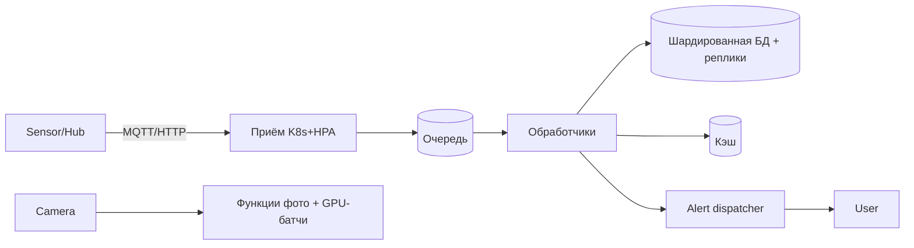

# Лекция 28. DR, мульти-регион и сквозной кейс высокодоступного сервиса

> **Дисциплина:** Распределённые системы и облачные технологии (РСиОТ)
> **Занятие:** лекция 28 из 28 — финал курса · **Время:** 1 пара (80 мин)
> **Зачем это:** последняя пара отвечает на последний вопрос инженера:
> «а что, если исчезнет целый регион — или целый аккаунт?» Сегодня —
> RPO/RTO, лестница DR-стратегий, мульти-регион — и финальный кейс, в
> котором нити всех 28 лекций сплетаются в одну систему: «СмартДом» от
> SLO до плана восстановления. Конспекты 2025 года («Лекции 27 и 28») —
> в `archive_2025/`.

---

## Крючок: день, когда исчез целый аккаунт

> 🖥 **Слайд 2.** Крючок: UniSuper, май 2024

2 мая 2024 года. UniSuper — австралийский пенсионный фонд с сотнями
миллиардов долларов под управлением и 647 000 клиентов — уходит в
офлайн. Не «упал сервис» и не «лёг регион»: при рутинном провижининге
инженер Google неверно настроил внутренний инструмент, и по цепочке
**была отменена подписка фонда и удалено всё его облачное окружение**:
сотни приложений, базы, виртуальные машины. Вместе с облачными
бэкапами.

Деталь, ради которой этот кейс открывает лекцию: у UniSuper была
**гео-редундантность** — данные дублировались в двух географиях. Не
помогло: удаление подписки снесло **обе географии одновременно**.
Клиенты фонда две недели не видели свои пенсионные счета; полное
восстановление — 15 мая. Спасло одно: **резервная копия у другого
провайдера**, вне зоны поражения.

Вопрос залу: **у них было две географии — почему этого оказалось
мало? И от чего именно защищает «второй регион»?**

Сегодня разберём это по инженерному: зона поражения, RPO/RTO, лестница
стратегий — и почему непроверенный план восстановления называют
«оптимистичной презентацией».

*(Источник кейса: `sources/Веб-находки_Лекция_28.md`; дата доступа
10.08.2026.)*

---

## Квиз-извлечение (по лекции 27: FinOps)

> 🖥 **Слайд 3.** Разминка

Ответьте не подглядывая; ответы — в конце лекции.

1. Четыре статьи облачного счёта; какая — «сюрприз № 1»?
2. Что входит в честный TCO собственного железа?
3. Когда резервации, когда spot? Что резервируют — базу или пик?
4. Почему 80–90 % AI-затрат — инференс, а не обучение?

---

## Результаты обучения

> 🖥 **Слайд 4.** Чему научимся

После этой пары вы сможете:

1. Формулировать RPO и RTO для сервиса и отличать их от фактического
   RTA, измеренного учениями.
2. Выбирать ступень лестницы DR — backup/restore, pilot light, warm
   standby, active-active — под класс критичности и бюджет.
3. Проектировать бэкапы, которые восстанавливаются: правило 3-2-1,
   тест восстановления, зона поражения.
4. Объяснять компромиссы мульти-региона: синхронная и асинхронная
   репликация, failover через DNS/GSLB, split-brain.
5. Собрать сквозной кейс: провести сервис от SLO до DR-плана, применяя
   материал всех 28 лекций.

## Пререквизиты

Вся дисциплина — сегодня она работает целиком. Особенно: репликация и
кворумы (л. 6), консенсус (л. 7), консистентность (л. 5), K8s и
состояние (л. 18–19), наблюдаемость (л. 24), стоимость (л. 27).

---

## Картина мира: страховка, которую покупают до пожара

> 🖥 **Слайд 5.** Дорожная карта пары

Весь курс мы защищались от **частичных** отказов: упал под — рестарт,
упал узел — реплики, упал сервис — circuit breaker. Disaster recovery —
про отказы другого масштаба: наводнение в дата-центре, недоступный
регион, ransomware, удалённый аккаунт, роковая миграция БД. Их
объединяет понятие **зоны поражения** (blast radius): какой перечень
вещей умирает **вместе**? Под и его локальный кэш — одна зона. Регион
и все его AZ — одна зона при региональном сбое. А кейс UniSuper учит
самому неприятному: **аккаунт облака — тоже единая зона поражения**,
и обе «независимые» географии внутри него умирают одной командой.

DR — это страховка: платишь постоянно (дублирование, репликация,
учения), получаешь выплату редко (в катастрофу). Как любую страховку,
её подбирают по цене риска: **сколько стоит час простоя** и **сколько
стоит потерянный час данных** — против цены полиса. Лекция 27 дала нам
язык для этого разговора; сегодня им пользуемся.

Маршрут: RPO/RTO → лестница стратегий → бэкапы, которые
восстанавливаются → мульти-регион и failover → учения → финальный
кейс: «СмартДом» целиком, от SLO до DR-плана, — и карта курса.

---

## Основные понятия

**Определения** (пополним глоссарий в конце):

- **DR (disaster recovery)** — восстановление систем, данных, доступов
  и процессов после катастрофы; не синоним бэкапа.
- **RPO** (recovery point objective) — сколько данных (по времени)
  допустимо потерять: «не более 5 минут показаний».
- **RTO** (recovery time objective) — за какое время сервис обязан
  восстановиться: «не более 1 часа простоя».
- **RTA** (recovery time actual) — фактическое время восстановления,
  измеренное на учениях; RTO без RTA — догадка.
- **Зона поражения (blast radius)** — совокупность того, что отказывает
  одним событием: узел, AZ, регион, аккаунт, провайдер.
- **Failover** — переключение трафика/ролей на резерв: ручное или
  автоматическое.

---

## Ядро пары

### 1. RPO и RTO: два вопроса, которые задают до катастрофы

> 🖥 **Слайд 6.** RPO / RTO / RTA

Два числа определяют весь DR-дизайн. **RPO** — взгляд назад: на сколько
минут/часов назад откатится мир после восстановления; его диктует
частота и способ репликации/бэкапа. **RTO** — взгляд вперёд: сколько
времени займёт восстановление; его диктует степень готовности резерва.
Они независимы: биллинг «СмартДома» может требовать RPO ≈ 0 (ни одной
потерянной транзакции), но терпеть RTO в час; доставка тревог —
наоборот: RTO в секунды (сирена должна работать), а потеря пары минут
телеметрии переживаема.

Третье число индустрия выучила на горьком опыте: **RTA** — сколько
восстановление занимает **на самом деле**, измеренное учениями. По
обзорам, ~60 % организаций на первом полноценном тесте обнаруживают,
что их фактическое время хуже заявленного RTO. RTO — обещание; RTA —
факт; расстояние между ними — ваш нераспознанный риск.

И дисциплина классификации: не бывает «RPO/RTO системы» — бывают
RPO/RTO **каждого класса сервисов**. Раскладывать по классам будем в
финальном кейсе.

### 2. Лестница DR-стратегий: чем короче простой, тем дороже полис

> 🖥 **Слайд 7.** Лестница стратегий

Четыре ступени, каждая следующая на порядок дороже и на порядок
быстрее:

| Стратегия | Что держим в резерве | RTO | RPO | Цена |
| --- | --- | --- | --- | --- |
| Backup & restore | только копии данных | часы–дни | часы | $ |
| Pilot light | данные реплицируются, минимальное ядро «тлеет» | десятки минут–часы | минуты | $$ |
| Warm standby | уменьшенная, но работающая копия системы | минуты | секунды–минуты | $$$ |
| Active-active | все регионы обслуживают трафик | ~0 (переток) | ~0 | $$$$ |

Ступень выбирают **по цене простоя**, а не по престижу. Active-active
звучит гордо, но означает: межрегиональная репликация с её
консистентностью (лекция 5 — CAP в полный рост), разрешение конфликтов
записи (лекция 6 — мульти-лидерность), двойной compute и egress-счёт
(лекция 27). Если час простоя отчётного сервиса стоит меньше месячной
цены его warm standby — этот сервис живёт на ступени backup & restore,
и это **правильное** инженерное решение.

#### Peer-instruction-вопрос № 1

> 🖥 **Слайды 8–12.** Голосование PI-1 → четыре разбора

Голосуем, обсуждаем с соседом 90 секунд, голосуем снова.

> Бэкапы «СмартДома» автоматически реплицируются в два региона одного
> облачного аккаунта. От какого сценария эта схема НЕ защищает?
>
> A. Пожар в дата-центре основного региона.
> B. Удаление аккаунта, ransomware, логическая порча данных.
> C. Отказ дисков в хранилище основного региона.
> D. Долгий сетевой сбой основного региона.

Разбор — в конце лекции. Подсказка: перечитайте крючок и спросите себя,
что входит в одну зону поражения с обоими регионами.

### 3. Бэкапы, которые восстанавливаются

> 🖥 **Слайд 13.** Пауза · **Слайд 14.** Бэкапы: 3-2-1 и зона поражения

Три правила отделяют бэкап от иллюзии бэкапа.

**Правило 3-2-1**: минимум **3** копии данных, на **2** разных типах
носителей/систем, **1** — вне зоны поражения основной площадки. Кейс
UniSuper — гимн последней единице: их спасла именно копия **у другого
провайдера**. Современное дополнение — иммутабельность: копия, которую
нельзя изменить или удалить (в т. ч. вашими же скомпрометированными
учётками — привет, лекция 25).

**Репликация — не бэкап.** Реплика добросовестно скопирует и
`DROP TABLE readings`, и шифрование ransomware'ом — через секунды во
всех регионах. Бэкап — это **точка во времени**, к которой можно
вернуться; репликация — это доступность, защита от отказа железа, но
не от ошибки и не от злодея.

**Непроверенный бэкап — не бэкап.** RPO определяется не расписанием
бэкапов, а фактической восстановимостью: битая копия, забытый ключ
шифрования (KMS из лекции 25 — восстановление невозможно без ключа!),
копия в той же зоне поражения. Тест восстановления — регулярный, по
таймеру, с измерением времени: «план, который никогда не тестировали,
— это оптимистичная презентация».

### 4. Мульти-регион: репликация, failover и старый знакомый split-brain

> 🖥 **Слайд 15.** Репликация между регионами · **Слайд 16.** Failover

Когда сервис обязан пережить смерть региона, начинается мульти-регион —
и возвращаются темы первой половины курса.

**Данные.** Внутри региона (между AZ) — **синхронная** репликация:
задержки в миллисекунды позволяют подтверждать запись в двух местах,
RPO ≈ 0. Между регионами — почти всегда **асинхронная**: свет и
маршруты (лекция 23: ≥ 85 мс RTT через океан) делают синхрон
неприемлемо медленным; платим **лагом репликации** = ненулевым RPO при
внезапной смерти региона. Это не выбор технологии, это физика +
CAP (лекция 5).

**Трафик.** Переключение — через DNS с health-check'ами (лекция 17:
TTL определяет скорость переключения, а кэши резолверов её саботируют)
или глобальные балансировщики/anycast — быстрее и без капризов TTL.

**Мозг.** Кто решает, что регион «умер», и назначает нового лидера?
Здравствуйте, лекции 6–7: кворум и консенсус. Автоматический failover
без кворума — фабрика **split-brain**: сеть между регионами порвалась,
оба считают себя главными, оба принимают записи — и после
восстановления у вас два несовместимых мира (лекция 6 обещала, что
split-brain вернётся, — вот он). Поэтому арбитр выносится в третью
локацию, а failover для stateful-систем часто оставляют
полуавтоматическим: система готовит всё, человек нажимает кнопку.

**Регуляторика и деньги.** Data residency (персональные данные жильцов
могут не иметь права покидать страну — лекция 25 про комплаенс) и
egress-счёт за межрегиональную репликацию (лекция 27) — два
непрошенных участника любого мульти-регионального дизайна.

### 5. Учения: катастрофу репетируют

> 🖥 **Слайд 17.** Runbook и учения

По данным Uptime Institute, около половины инцидентов в дата-центрах
связаны с несоблюдением процедур людьми. Вывод: DR — это процессы не
меньше, чем архитектура.

- **Runbook** — пошаговый сценарий восстановления для каждого класса
  катастроф: потеря региона, порча БД, компрометация аккаунта. Написан
  так, чтобы его выполнил дежурный в 3 часа ночи, а не автор в
  спокойный вторник.
- **Учения (DR drills, game days)** — регулярный прогон runbook'ов:
  от настольных («проговариваем сценарий») до боевых (гасим регион в
  тестовой среде; вспомните chaos engineering из лекции 9 — DR-учение
  и есть его старший брат). Каждое учение измеряет RTA и заканчивается
  blameless-разбором (лекция 24).
- **Автоматизация шагов**: promotion реплики, переключение DNS,
  прогрев кэшей — всё, что скриптуется, скриптуется; людям остаются
  решения.

### 6. Живой сеанс — финальный кейс: «СмартДом» целиком

> 🖥 **Слайд 18.** Кейс: архитектура · **Слайд 19.** Кейс: DR-план и цена

Строим вместе, на глазах (10 минут) — финальный кейс курса: собираем
«СмартДом» от требований до DR-плана, и по дороге каждая лекция курса
встаёт на своё место.

**Шаг 1. Требования (лекции 1, 24).** SLO: 99,9 % тревог доставлены
< 5 с; 99,5 % показаний приняты; бюджет ошибок → правила релизов.
Профиль нагрузки: ровная телеметрия + рваные события (лекция 26).

**Шаг 2. Архитектура (лекции 2–23).** Приём телеметрии — stateless-поды
в K8s с HPA (л. 18, 26); события фото — функции (л. 23); критичное
правило «дым → сирена» — на Hub (л. 23); поток — через очередь (л. 12);
история — шардированная БД с репликами (л. 6, 8, 10); горячие
показания — кэш (л. 26); межсервисно — mTLS от меша, секреты в
менеджере (л. 20, 25); доставка — GitOps с canary (л. 22);
телеметрия/алерты по burn rate (л. 24); теги и юнит-метрика «цена
дома» (л. 27).

**Шаг 3. Классы сервисов и DR-лестница (сегодня).** Не «DR системы»,
а DR по классам:

| Класс | Сервис | RTO / RPO | Ступень |
| --- | --- | --- | --- |
| Критичный | тревоги, доставка Alert | секунды / минуты | active-active в 2 регионах |
| Важный | приём телеметрии, правила | 30 мин / 5 мин | warm standby |
| Обычный | история, дашборды жильца | 4 ч / 1 ч | pilot light |
| Фоновый | отчёты, аналитика | 24 ч / 24 ч | backup & restore |

Локальное правило на Hub (л. 23) — тайное оружие DR: сирена работает
даже при смерти **всего облака**; это лучший «нулевой регион» кейса.

**Шаг 4. Бэкапы и зона поражения (сегодня + л. 25, 27).** 3-2-1:
реплики в двух регионах + иммутабельная копия **у другого провайдера**
(урок UniSuper); ключи KMS — с планом восстановления; lifecycle для
цены (л. 27).

**Шаг 5. Проверка (л. 9, 26, сегодня).** k6-профили нагрузки как гейт;
chaos-эксперименты на подах; ежеквартальное DR-учение «регион умер» с
измерением RTA; runbook на каждый класс.

Заметьте: в кейсе не появилось **ни одной новой технологии** — только
решения, принятые в правильном порядке: SLO → архитектура → классы →
страховки → проверка. Это и есть профессия.

### 7. Карта курса: 28 лекций — одна система

> 🖥 **Слайд 20.** Карта курса

Оглянитесь: блок A (л. 1–11) дал физику распределённого мира — отказы,
время, консистентность, репликацию, консенсус; блок B (л. 12–15) —
данные в движении: очереди, события, потоки, микросервисы; блок C
(л. 16–23) — платформу: облака, сети, Kubernetes, IaC, GitOps,
serverless; блок D (л. 24–28) — эксплуатацию: наблюдаемость,
безопасность, производительность, деньги и — сегодня — выживание в
катастрофе. Финальный кейс показал главное: это не 28 тем, а один
связный способ думать о системах.

---

## Типичные ошибки (запомните до того, как совершите)

> 🖥 **Слайд 21.** Типичные ошибки

1. **«У нас есть бэкапы» без теста восстановления** — оптимистичная
   презентация; RPO определяет восстановимость, не расписание.
2. **Репликация вместо бэкапа** — `DROP TABLE` реплицируется быстрее,
   чем вы успеете сказать «split-brain».
3. **Все копии в одной зоне поражения** — включая «два региона одного
   аккаунта» (UniSuper) и бэкапы, шифруемые тем же ransomware.
4. **Active-active «для солидности»** — без готовности к конфликтам
   записи и двойному счёту; ступень выбирают по цене простоя.
5. **Автофейловер без кворума/арбитра** — фабрика split-brain.
6. **DNS-failover с TTL в сутки** — переключение «мгновенно… завтра».
7. **Runbook в голове одного человека** — который в отпуске именно в
   день катастрофы (48 % инцидентов — процедуры и люди).

---

## Квиз-закрепление (по этой паре)

> 🖥 **Слайд 22.** Закрепление

Ответьте не подглядывая; ответы — в конце лекции.

1. RPO, RTO, RTA — что есть что и почему RTO без RTA — догадка?
2. Назовите четыре ступени DR-лестницы и принцип выбора ступени.
3. Почему гео-редундантность UniSuper не спасла и что спасло?
4. Почему межрегиональная репликация почти всегда асинхронная и чем
   это оплачивается?

---

## Вопросы для самопроверки

1. Сформулируйте RPO/RTO для четырёх классов сервисов «СмартДома» и
   обоснуйте различия.
2. Чем pilot light отличается от warm standby по деньгам и по RTO?
3. Составьте правило 3-2-1 для истории показаний; где живёт «1»?
4. Почему иммутабельность бэкапа важна при ransomware-сценарии?
5. Объясните через зону поражения: от чего защищает вторая AZ? Второй
   регион? Второй провайдер?
6. Почему синхронная репликация через океан — плохая идея? (Свяжите с
   лекциями 5 и 23.)
7. Как кворум и третья локация-арбитр предотвращают split-brain при
   автофейловере?
8. Какие шаги failover'а стоит автоматизировать, а какие оставить
   человеку — и почему?
9. Спроектируйте ежеквартальное DR-учение для «СмартДома»: сценарий,
   метрики, критерий успеха.
10. Что в финальном кейсе делает Hub «нулевым регионом» и какие классы
    отказов он закрывает?
11. Посчитайте грубо: во сколько раз active-active дороже warm standby
    для сервиса тревог? Какие статьи растут? (Лекция 27 в помощь.)
12. Пройдитесь по карте курса: назовите по одной идее из каждого блока
    A–D, которая сработала в финальном кейсе.

---

## Мост к аттестации

> 🖥 **Слайд 23.** Мост к зачёту

Курс прочитан — впереди защиты лабораторных (допуск — все 8 лаб) и
зачёт: список вопросов по всем 28 лекциям лежит в `exams/`. Готовьтесь
по связям, а не по билетам: возьмите финальный кейс этой пары и
пройдите его от SLO до DR-плана своими словами — в нём есть почти
каждый вопрос списка. На защите лабы 8 будьте готовы к финальному
вопросу курса: «что произойдёт с вашим сервисом, если удалить
namespace — и как быстро вы это заметите и вернёте?»

**Задание на 1 предложение** (письменно, в конспект, последнее в
курсе): закончите фразу «Главное, что я забираю из этого курса в свою
практику, — …». Хочу услышать троих на зачёте.

---

## Глоссарий

> 🖥 **Слайд 24 (финал).** Вопросы + литература + прощание

| Термин | Определение |
| --- | --- |
| DR | Восстановление систем, данных и процессов после катастрофы |
| RPO / RTO / RTA | Допустимая потеря данных / целевое время восстановления / фактическое время на учениях |
| Зона поражения | Всё, что отказывает одним событием: узел, AZ, регион, аккаунт, провайдер |
| Backup & restore | Только копии данных; RTO в часы-дни, дёшево |
| Pilot light | Данные реплицируются, минимальное ядро «тлеет» |
| Warm standby | Уменьшенная работающая копия; RTO в минуты |
| Active-active | Все регионы активны; RTO≈0, максимальная цена и сложность |
| Правило 3-2-1 | 3 копии, 2 типа систем, 1 вне зоны поражения (+иммутабельность) |
| Лаг репликации | Отставание асинхронной реплики = ненулевой RPO |
| Failover / failback | Переключение на резерв / возврат на основную площадку |
| Split-brain | Два «главных» после разрыва; лечится кворумом и арбитром |
| GSLB / anycast | Глобальная балансировка трафика между регионами |
| Data residency | Законодательные ограничения на география хранения данных |
| Runbook | Пошаговый сценарий восстановления для дежурного |
| DR drill / game day | Учение с измерением RTA и blameless-разбором |

## Список литературы

1. Основная литература
   - [1] Клеппман М. — «Высоконагруженные приложения». Питер. Главы 5
     (репликация), 12 (итоги — «будущее данных»).
   - [2] Beyer B. и др. — «Site Reliability Engineering». O'Reilly
     (управление инцидентами, учения).
2. Интернет-ресурсы
   - [3] Кейс UniSuper и материалы по RTO/RPO/учениям — подборка с URL
     в `sources/Веб-находки_Лекция_28.md` (дата обращения: 10.08.2026).
   - [4] DR-паттерны провайдеров:
     [AWS Well-Architected, Reliability](https://aws.amazon.com/architecture/well-architected/),
     [Google Cloud DR patterns](https://cloud.google.com/solutions/disaster-recovery).

---

## Ответы

### Ответы: квиз-извлечение (лекция 27)

1. Compute, storage, network, managed services; сюрприз № 1 — network:
   egress и межрегиональный трафик.
2. Серверы + люди (эксплуатация) + ДЦ/колокация + замена железа +
   простои + упущенная эластичность.
3. Резервации — под ровную **базовую** нагрузку (скидка за
   обязательство); spot — под прерываемое (батчи, переобучение);
   пик докупается on-demand.
4. Обучение — разовая (капитальная) трата; инференс растёт с каждым
   пользователем и запросом — операционный расход, «счёт за
   электричество».

### Ответы: peer instruction № 1

Правильный ответ — **B**: удаление аккаунта, ransomware и логическая
порча бьют **через** репликацию — оба региона входят в одну зону
поражения аккаунта/учёток/логики. Именно так у UniSuper исчезли обе
географии разом; спасла копия у другого провайдера, вне этой зоны.

- A — пожар в одном ДЦ второй регион переживает штатно: это ровно тот
  сценарий, под который гео-репликация и строилась.
- C — отказ дисков локален; реплика в другом регионе цела, данные
  восстановимы.
- D — при сетевом сбое основного региона второй продолжает хранить
  (и при failover — обслуживать) данные; это тоже целевой сценарий
  схемы.

### Ответы: квиз-закрепление

1. RPO — допустимая потеря данных (взгляд назад), RTO — целевое время
   восстановления (взгляд вперёд), RTA — фактическое время, измеренное
   учениями. Обещание без измерения — догадка: ~60 % организаций на
   первом тесте узнают, что RTA > RTO.
2. Backup & restore → pilot light → warm standby → active-active;
   ступень выбирается сравнением цены простоя (и потери данных) с
   ценой полиса, по классам сервисов.
3. Обе географии жили внутри одного аккаунта — одной зоны поражения:
   отмена подписки удалила всё разом. Спасла независимая копия у
   другого провайдера (та самая «1» из правила 3-2-1).
4. Физика (свет через океан ≥ десятков мс) делает синхронное
   подтверждение каждой записи неприемлемо медленным (CAP/PACELC,
   л. 5). Платим лагом репликации — ненулевым RPO при внезапной смерти
   региона.
