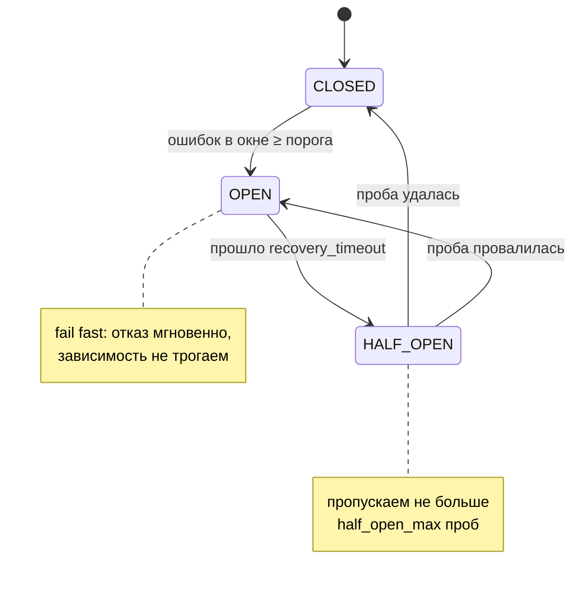

# Лабораторная работа 3. Методические материалы

Справочник-шпаргалка к [readme.md](./readme.md): конечный автомат breaker'а,
выбор порогов, семафоры, инструменты хаоса и отладка в PowerShell. Теория
целиком — в [лекции 09](../../curriculum/Лекция_09_Отказоустойчивость_и_chaos_engineering.md).

---

## 1. Каскадный отказ: почему «висит» хуже, чем «упал»

Когда callee завис, каждый вызов caller'а честно ждёт таймауты и ретраи —
секунды. Всё это время заняты соединение, слот обработчика и память. Новые
запросы приходят быстрее, чем освобождаются старые → очередь растёт → caller
сам перестаёт отвечать → его вызывающие тоже виснут. Авария ползёт **вверх**
по цепочке, хотя сломался один сервис — это и есть каскад. Отсюда два
лекарства лабы: **fail fast** (breaker: отказать за миллисекунды, а не
ждать секунды) и **backpressure** (не брать больше работы, чем можем).

## 2. Конечный автомат circuit breaker



Контракт из трёх методов (образец ~80 строк — `examples/devices/app/breaker.py`):

* `allow()` — можно ли звонить прямо сейчас; вызывается **перед каждым** вызовом. В OPEN возвращает `False`, пока не истёк `recovery_timeout`; в HALF_OPEN пропускает не больше `half_open_max` проб.
* `record_success()` / `record_failure()` — исход **каждого разрешённого** вызова. Забыть записать исход пробы — классическая ошибка: breaker навсегда застревает в HALF_OPEN.
* Ошибка = сетевая ошибка, таймаут или 5xx **после всех ретраев попытки**; 4xx ошибкой зависимости не является (запрос сломан — чините запрос, лаба 2).

Один breaker — одна зависимость. Если caller зовёт два сервиса, у каждого
свой breaker: болезнь одного не должна закрывать дверь ко второму.

## 3. Выбор порогов и окон

Готовой формулы нет — есть рассуждение, которое вы и должны показать в отчёте:

| Параметр | Слишком мало | Слишком много | Ориентир для лабы |
| --- | --- | --- | --- |
| Порог ошибок | 1: breaker хлопает от единичного таймаута (false positive) | окно не набирается — breaker не откроется никогда | 3–5 |
| Окно вызовов | 1–2: решение по шуму | сотни: старые успехи маскируют свежие ошибки, открытие запаздывает | 10–20 последних вызовов |
| `recovery_timeout` | доли секунды: пробы долбят лежащий сервис почти как без breaker'а | минуты: сервис давно ожил, а вы всё отказываете | 5–15 с |
| Проб в HALF_OPEN | — | «все сразу»: толпа проб добивает едва ожившую зависимость | 1–2 |

Проверка честности: при вашем пороге и таймаутах клиента посчитайте, сколько
секунд длится «набор статистики» до OPEN (порог × длительность неудачного
вызова). Если получились десятки секунд — каскад успеет разрастись.

## 4. Breaker и ретраи: зачем оба

| | Ретраи (лаба 2) | Circuit breaker (лаба 3) |
| --- | --- | --- |
| Лечит | короткий сбой: моргнула сеть, один потерянный пакет | длинный сбой: зависимость лежит секунды-минуты |
| Решение | повторить **этот** вызов | не делать **следующие** вызовы вообще |
| Память | нет — каждый вызов сам по себе | есть — статистика исходов между вызовами |
| Опасность без второго | при лежачей зависимости умножают нагрузку и держат caller | без ретраев единичный чих сети превращается в ошибку |

Правильная сборка: **ретраи внутри, breaker снаружи.** Breaker учитывает
итоговый исход вызова (после всех его попыток). Обратный порядок — ретраи
поверх breaker'а — бессмыслен: повторять мгновенный отказ OPEN значит
`half_open_max` раз в секунду дёргать `allow()` без пользы. И держите ретраи
короткими (1–2 попытки): длинная лестница backoff'ов лишь оттягивает момент,
когда breaker узнает правду.

## 5. Backpressure: семафор и честный 503

Python/asyncio (FastAPI):

```python
import asyncio

slots = asyncio.Semaphore(MAX_CONCURRENT)

@app.post("/readings")
async def add_reading(...):
    if slots.locked():          # все слоты заняты — отказ СРАЗУ
        return JSONResponse(
            status_code=503,
            content={"detail": "too many in flight, retry later"},
            headers={"Retry-After": str(RETRY_AFTER)},
        )
    async with slots:           # заняли слот — работаем
        ...
```

`locked()` возвращает `True`, когда счётчик семафора на нуле. Тонкость:
между проверкой и `async with` другой корутине теоретически можно вклиниться —
для лабы это не страшно (лишний запрос подождёт освобождения слота), но
знать об этом зазоре надо: спросят на защите.

Node.js 22 (fetch-сервер/Express): семафора в стандартной библиотеке нет —
достаточно счётчика `inFlight`: `if (inFlight >= MAX) return res.status(503)
.set("Retry-After", RETRY_AFTER).json(...)`, `inFlight++` до работы и
`inFlight--` в `finally`.

Почему 503, а не очередь «подождите»: буфер без потребителя — это та же
очередь в каскаде из § 1, только внутри вашего процесса. Клиент с
`Retry-After` знает, когда вернуться (backpressure дошёл до клиента —
лекция 09), а ваш сервис остаётся быстрым для тех, кто уже внутри.

## 6. Fallback-очередь и догон

* **Файл (jsonl):** по строке JSON на запись; источник истины — список в памяти, файл переписывается при каждом изменении (образец — `examples/devices/app/fallback.py`). Честно опишите ограничение: при пересоздании контейнера файл в /tmp теряется.
* **Redis (список):** `RPUSH queue item` при отказе, `LRANGE`/`LPOP` при догоне; Redis у вас уже есть из ЛР2. Плюс: очередь переживает пересоздание caller'а.
* **Ключ идемпотентности кладётся в очередь вместе с записью** — тот же ключ, что был у живых попыток. Если callee успел обработать запрос, а ответ потерялся (лаба 2!), догон получит replay, а не дубль.
* **Лимит очереди обязателен:** переполнение → 503. Бесконечная очередь — это «буфер побольше» из лекции 09: отказ не исчезает, а копится.
* **Догон** — фоновая задача (`asyncio.create_task` в lifespan FastAPI / `setInterval` в Node): раз в 1–2 секунды пробует доставить голову очереди; неудача — ждём следующего тика, голову не теряем. При включённом breaker'е догон и есть естественный «пробник» HALF_OPEN.

## 7. Инструменты хаоса: что чем ломать

| Инструмент | Что имитирует | Что видит клиент | Команда |
| --- | --- | --- | --- |
| `docker compose stop <svc>` | сервис умер (деплой, OOM-kill) | ошибка **соединения** (connect-таймаут/refused, в сети compose — около connect-таймаута): запрос ТОЧНО не обработан, повтор безопасен | `docker compose stop alerts` |
| `docker compose pause <svc>` | сервис завис (GC-пауза, дедлок, перегрузка CPU) | соединение открывается, ответа нет → **read-таймаут**: исход «неизвестно» из лабы 2 — запрос МОГ быть обработан | `docker compose pause alerts` |
| Окно задержки в приложении | медленная зависимость / деградация | успешные, но медленные ответы; при задержке > read-таймаута — неотличимо от pause | `POST /slow?seconds=20&delay=2` (образец в examples) |
| Окно 5xx в приложении | перегрузка/долгая недоступность | мгновенные 503 | `POST /outage?seconds=20` (у вас уже есть из ЛР2) |

**Честно про `tc netem`** (сетевые задержки/потери из живого сеанса
лекции 09): внутри контейнеров лабы он вам недоступен без дополнительных
прав — нужен `cap_add: [NET_ADMIN]` в compose, пакет `iproute2` в образе и
root-пользователь (наши образы работают под non-root — и это правильно).
Поэтому задержки в лабе впрыскиваются на уровне приложения (`/slow`) —
для клиента результат тот же: ответ не приходит вовремя. Настоящие сетевые
сбои вы увидите в лабах 5–6, где поды убивает Kubernetes, а на проде это
делают Chaos Mesh / LitmusChaos / Gremlin (обзор — в лекции 09).

Важное различие для отчёта: **stop даёт ошибку соединения** (запрос точно
не дошёл — повтор безопасен и без ключа), **pause — read-таймаут** (исход
«неизвестно»: запрос мог быть обработан — без ключа идемпотентности повтор
опасен), slow — вообще не ошибка, пока вы не считаете время. Ещё одно
наблюдение для stop: после рестарта контейнер callee теряет всё, что
держал в памяти (тревоги, ключи идемпотентности) — антипаттерн курса
«состояние внутри контейнера» вы увидите своими глазами. Поэтому
«жив/мёртв» — ложная дихотомия, а breaker обязан считать таймауты
(и в бонусе — медленные ответы) ошибками.

## 8. Методика chaos-эксперимента (канон лекции 09)

1. **Steady state** — измеримый показатель нормальной работы (p95 задержки, доля успешных запросов, «записи не теряются»). Измерьте ДО впрыска — без базовой линии нечего сравнивать.
2. **Гипотеза** — письменно, до эксперимента: «при сбое X система сохранит показатель Y в пределах Z». Гипотеза после эксперимента — это не гипотеза, а подгонка.
3. **Blast radius** — минимальный: один контейнер на вашем ноутбуке, не «выключу-ка я Redis у всей группы».
4. **Впрыск с планом отката** — знаете заранее, как вернуть всё назад (`unpause`/`start`; окна `/slow` и `/outage` истекают сами — тоже форма отката).
5. **Наблюдение** — таблица «запрос → задержка → исход → состояние breaker'а», а не «вроде работало».
6. **Вывод и починка** — гипотеза подтверждена/опровергнута; что меняете (параметры breaker'а, лимиты) и почему. Опровергнутая гипотеза — это **успех** эксперимента: вы нашли слабость до того, как её нашла реальная авария.

Образец всей последовательности — `examples/chaos_demo.ps1`.

## 9. Типичные ошибки

1. **Не записан исход пробы HALF_OPEN.** Проба ушла, `record_*` не вызван — breaker застрял в HALF_OPEN навсегда. Симптом: после восстановления callee всё ещё «degraded».
2. **Порог = 1.** Единичный таймаут (у сети бывает!) отключает здоровую зависимость. Смотрите таблицу § 3.
3. **Ретраи поверх breaker'а** вместо «ретраи внутри, breaker снаружи» (§ 4).
4. **Очередь fallback без лимита.** Полчаса лежащего callee — и у вас в памяти/файле сотни тысяч записей, а после восстановления вы сами себе устраиваете retry storm догоном. Лимит + честный 503.
5. **Догон новым ключом идемпотентности.** Ключ генерируется до первой живой попытки и едет в очередь вместе с записью; новый ключ при догоне = дубль, если callee успел обработать оригинал.
6. **Проверка `if slots.locked()` после тяжёлой работы.** Лимит проверяется до того, как запрос что-то занял, иначе backpressure не защищает.
7. **Общий breaker на все зависимости.** Болезнь одной закрывает дверь ко всем. Один breaker — одна зависимость.
8. **Забытый `unpause`.** Контейнер стоит замороженным, «у меня всё сломалось». `docker compose ps` показывает `(Paused)`.

## 10. Отладка в PowerShell (Windows)

Команды рассчитаны на Windows PowerShell 5.1 (без `&&`, без
`-SkipHttpErrorCheck`; `curl` без `.exe` — алиас, всегда пишите `curl.exe`).

```powershell
# Замерить задержку запроса (таблицы «до»/«после»):
Measure-Command { Invoke-RestMethod -Method Post -Uri http://localhost:8080/readings -ContentType "application/json" -Body '{"device_id":"d1","sensor":"t","value":75}' } | Select-Object TotalMilliseconds

# Invoke-RestMethod на 503 кидает исключение; статус и Retry-After достаём так:
try { Invoke-RestMethod -Method Post -Uri http://localhost:8080/readings -ContentType "application/json" -Body '{"device_id":"d1","sensor":"t","value":75}' } catch { $_.Exception.Response.StatusCode.value__; $_.Exception.Response.Headers["Retry-After"] }

# Состояние breaker'а и очереди (обновляйте после каждого шага эксперимента):
Invoke-RestMethod http://localhost:8080/health | ConvertTo-Json -Depth 5

# Переходы breaker'а в логах:
docker compose logs devices | Select-String "breaker"

# Впрыск и откат:
docker compose pause alerts
docker compose unpause alerts
docker compose stop alerts
docker compose start alerts

# Вывод эксперимента в файл для отчёта:
powershell -ExecutionPolicy Bypass -File .\chaos_demo.ps1 | Tee-Object -FilePath logs\chaos_before.txt
```

⚠️ Если пишете свой `.ps1` с русскими строками — сохраняйте файл в **UTF-8
с BOM**, иначе Windows PowerShell 5.1 прочитает его в системной кодировке и
сломается на первой же кириллической кавычке.

## 11. Куда смотреть дальше

* [CircuitBreaker — Martin Fowler](https://martinfowler.com/bliki/CircuitBreaker.html)
* [Principles of Chaos Engineering](https://principlesofchaos.org/)
* [Google SRE Book: Handling Overload](https://sre.google/sre-book/handling-overload/) · [Addressing Cascading Failures](https://sre.google/sre-book/addressing-cascading-failures/)
* Библиотеки, если решите не писать свой breaker: [pybreaker](https://github.com/danielfm/pybreaker) (Python), [opossum](https://github.com/nodeshift/opossum) (Node.js) — параметры всё равно объясняете вы
* Лекция 24 (впереди): метрики и SLO — как счётчики breaker'а превращаются в алерты
